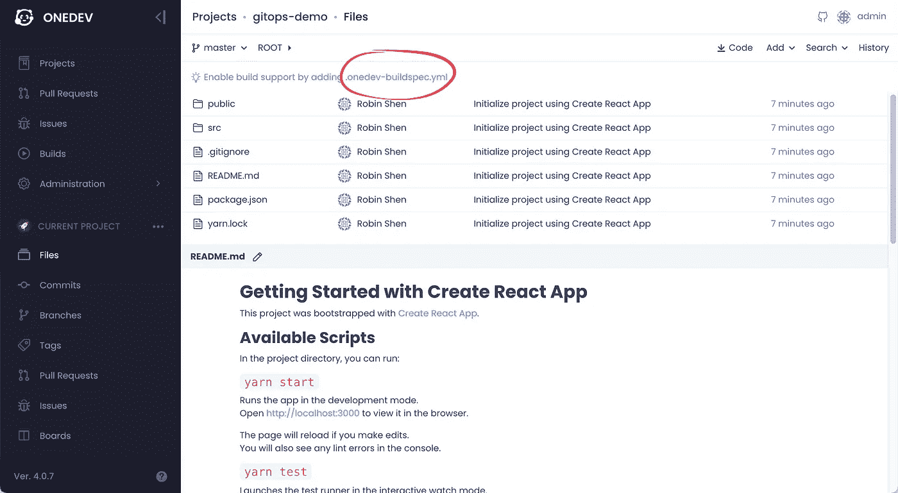
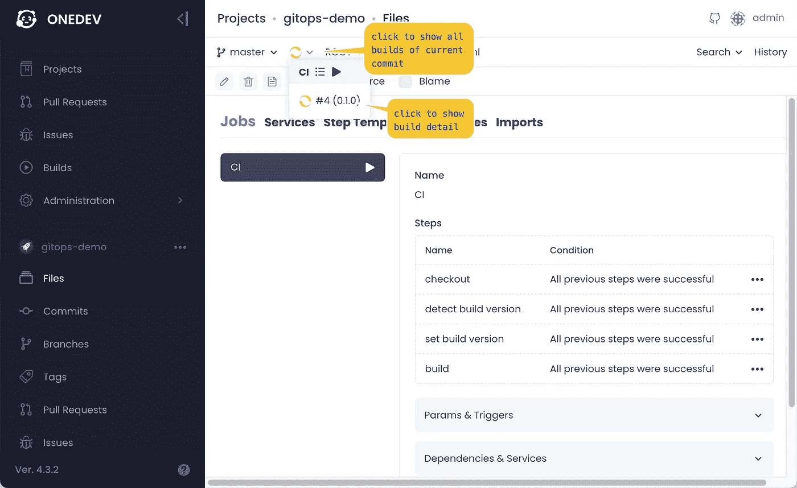
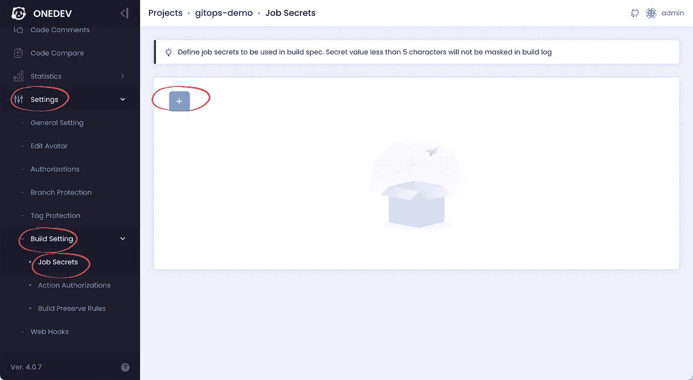
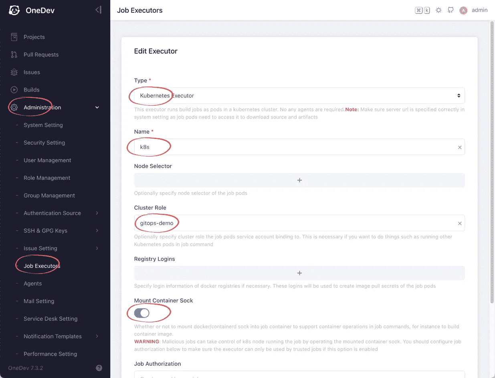
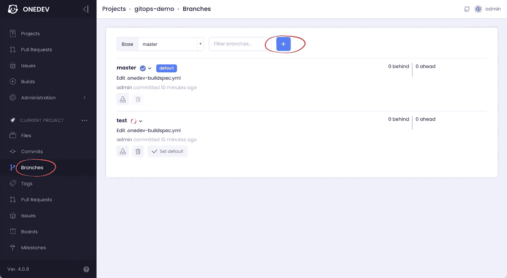
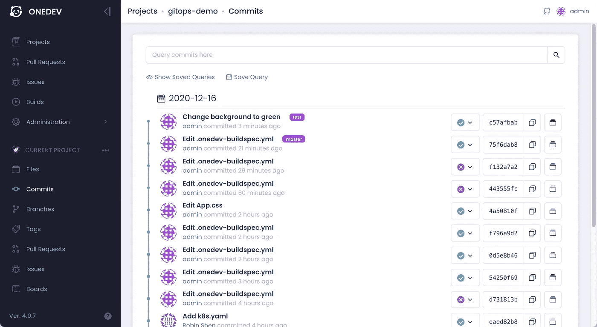

# OneDev 和 Kubernetes 的 GitOps 实践

> 原文：<https://medium.com/nerd-for-tech/hands-on-gitops-with-onedev-f05bd278f07c?source=collection_archive---------1----------------------->

# 介绍

GitOps 是一种 DevOps 方法，将基于 Kubernetes 的基础设施作为 git 中的代码进行维护，并使用 git 工具(如 push、revert、pull request)对其进行操作。

one dev([https://github.com/theonedev/onedev](https://github.com/theonedev/onedev))是一个开源的 git 存储库服务器，内置 CI/CD 集成。

本教程解释了如何在 Kubernetes 中设置 OneDev 来执行 GitOps。

# 建立 Kubernetes 集群

首先，我们需要一个 Kubernetes 集群。你可以使用一个现有的，或者建立一个新的。对于本教程，我们选择使用 GKE(谷歌 Kubernetes 引擎)。

只需按照[快速启动](https://cloud.google.com/kubernetes-engine/docs/quickstart)来创建集群。为了节省您的资金，只有一个节点的默认池足以满足我们的测试。对于节点映像类型，使用默认的容器优化操作系统；对于机器类型，请选择至少 8G 内存的机器。创建集群后，按照本指南[中的](https://cloud.google.com/kubernetes-engine/docs/how-to/cluster-access-for-kubectl)继续配置 kubectl 以连接到集群。

要验证工作是否正常，请在终端中运行以下命令以确保成功:

```
$ kubectl cluster-info
```

# 将 OneDev 安装到 Kubernetes 集群中

现在我们有了一个工作集群。让我们将 OneDev 部署到集群中来管理我们的演示项目的代码

1.  确保安装了 helm3。运行以下命令将 OneDev 图表部署到您的群集中:

```
$ helm install onedev onedev --repo https://dl.cloudsmith.io/public/onedev/onedev/helm/charts --namespace onedev --create-namespace
```

2.部署后，运行以下命令以显示 OneDev 服务的外部 ip(可能需要等待一段时间以分配外部 ip):

```
$ kubectl get service onedev -n onedev
```

3.用浏览器打开 url `http://<OneDev external ip>`以设置 OneDev(使用默认设置，创建管理员帐户除外)。如果 OneDev 未准备好，请稍等片刻，然后重试

# 将演示项目添加到 OneDev

OneDev 应该已经启动并运行。现在让我们建立一个演示项目:

1.  从 OneDev 项目页面，添加一个名为 *gitops-demo* 的项目
2.  从终端创建一个 react 项目，通过运行下面的命令推送到 OneDev(需要有 node.js 环境。如果您不熟悉，请参考 [react 文档](https://reactjs.org/docs/create-a-new-react-app.html)):

```
$ npx create-react-app gitops-demo $ cd gitops-demo$ git remote add origin http://<OneDev external ip>/gitops-demo$ git push --set-upstream origin master 
*(use OneDev admin account created previously for authentication)*
```

3.在 OneDev 中刷新演示项目的文件页面，并单击添加构建规范链接，如下所示:



4.从构建规范编辑页面，切换到*编辑源*选项卡**而不添加任何作业**，并用以下内容替换源(不要担心语法。在大多数情况下，您只需要使用 GUI 编辑器):

```
version: 6
jobs:
- name: CI
  steps:
  - !CheckoutStep
    name: checkout
    cloneCredential: !DefaultCredential {}
    condition: ALL_PREVIOUS_STEPS_WERE_SUCCESSFUL
  - !CommandStep
    name: detect build version
    image: node:15.4-alpine
    commands:
    - set -e
    - ''
    - apk add --update jq
    - echo `jq -r '.version' package.json` > buildVersion
    condition: ALL_PREVIOUS_STEPS_WERE_SUCCESSFUL
  - !SetBuildVersionStep
    name: 'set build version'
    buildVersion: '[@file](http://twitter.com/file):buildVersion@'
    condition: ALL_PREVIOUS_STEPS_WERE_SUCCESSFUL
  - !CommandStep
    name: build
    image: node:15.4-alpine
    commands:
    - set -e
    - ''
    - yarn install
    - ''
    - export CI=true
    - yarn test
    condition: ALL_PREVIOUS_STEPS_WERE_SUCCESSFUL
  triggers:
  - !BranchUpdateTrigger {}
  retryCondition: never
  maxRetries: 3
  retryDelay: 30
  cpuRequirement: 250m
  memoryRequirement: 128m
  caches:
  - key: npm-cache
    path: /root/.npm
  timeout: 3600
```

5.保存并提交更改。我们的 CI 构建现在应该正在运行，如下所示:



# 为演示项目设置 GitOps

我们现在有一个具有 CI 能力的演示项目。让我们改进它，使其能够部署到 Kubernetes:

1.  为了部署到 Kubernetes，我们需要构建并发布演示项目的 docker 映像。我们将在这里使用官方的 docker hub 注册表。请访问[https://hub.docker.com/](https://hub.docker.com/)，使用您的帐户登录，并创建一个**公共**存储库，比如说 *gitops-demo* (OneDev 也支持私有存储库，为了简单起见，我们在这里创建公共存储库)
2.  为了能够将 docker 映像发布到您的存储库，OneDev 需要知道您的 docker hub 帐户的凭据。为此，在演示项目中添加一个作业密码，给它一个名称，例如 *dockerhub-password* ，并输入 docker hub password 作为密码的值



3.要将演示项目的 docker 映像部署到 Kubernetes 中，我们需要给 OneDev 构建额外的权限。为此，在您的终端中创建一个包含以下内容的文件，比如 *gitops-demo-role.yaml* :

```
kind: ClusterRole
apiVersion: rbac.authorization.k8s.io/v1
metadata:
  name: gitops-demo
rules:
- apiGroups: [""]
  resources: ["services"]
  verbs: ["get", "create"]
- apiGroups: ["apps"]
  resources: ["deployments"]
  verbs: ["get", "patch", "create"]
```

然后运行以下命令将角色添加到 Kubernetes 中:

```
$ kubectl apply -f gitops-demo-role.yaml
```

完成上述操作后，切换到 OneDev 中的 job executors 页面，添加一个 Kubernetes executor，给它一个名称，并将属性 *Cluster Role* 指定为 *gitops-demo* ，保留所有其他字段不变并保存该 executor



4.因为我们需要构建演示项目的 docker 映像，所以让我们在项目的根目录下添加一个 *Dockerfile* ，内容如下:

```
FROM nginx:1.19.5
COPY build /usr/share/nginx/html
EXPOSE 80
```

5.我们通过 Kubernetes 资源部署演示项目，因此继续在项目的根目录中添加一个文件 *k8s.yaml* ，其内容如下，并且**将所有出现的*<your-dockerhub-account>*替换为您的 docker hub 帐户名称**:

```
apiVersion: apps/v1
kind: Deployment
metadata:
  name: gitops-demo
  labels:
    tier: gitops-demo
spec:
  selector:
    matchLabels:
      tier: gitops-demo
  strategy:
    type: Recreate
  template:
    metadata:
      name: gitops-demo
      labels:
        tier: gitops-demo
    spec:
      containers:
      - name: gitops-demo
        image: **<your-dockerhub-account>**/gitops-demo:imageTag
        ports:
        - containerPort: 80
---
apiVersion: v1
kind: Service
metadata:
  name: gitops-demo
  labels:
    tier: gitops-demo
spec:
  type: LoadBalancer
  ports:
  - name: http
    port: 80
    targetPort: 80
    protocol: TCP
  selector:
    tier: gitops-demo
```

6.在 OneDev 中编辑构建规范(点击文件*)。onedev-buildspec.yaml* 然后编辑它)，将构建步骤的映像设置为 *docker:19.03.5* ，并使用以下命令，将**所有出现的*<your-docker hub-account>*替换为 docker hub account** 的名称。

```
set -eapk add --update npm curlnpm install -g yarn
yarn install
export CI=true
yarn test
yarn builddocker build -t **<your-dockerhub-account>**/gitops-demo:@commit_hash@ .docker login -u **<your-dockerhub-account>** -p [@secrets](http://twitter.com/secrets):dockerhub-password@
docker push **<your-dockerhub-account>**/gitops-demo:@commit_hash@curl -o /usr/local/bin/kubectl -LO "[https://storage.googleapis.com/kubernetes-release/release/$(curl](https://storage.googleapis.com/kubernetes-release/release/$(curl) -s [https://storage.googleapis.com/kubernetes-release/release/stable.txt)/bin/linux/amd64/kubectl](https://storage.googleapis.com/kubernetes-release/release/stable.txt)/bin/linux/amd64/kubectl)"
chmod +x /usr/local/bin/kubectlsed -i "s/imageTag/@commit_hash@/g" k8s.yaml
kubectl apply -f k8s.yaml -n default
```

7.保存并提交更改。OneDev 将开始构建和部署演示项目。构建成功后，运行以下命令以显示发布的演示服务的外部 ip 地址:

```
$ kubectl get service gitops-demo
```

用浏览器打开网址*http://<gitops-demo-external-IP-address>*显示部署好的演示 app。

8.恭喜你。您已经成功地为演示项目设置了 GitOps。每当有新的提交推送到主分支时，就会触发 CI 作业来测试、构建和重新部署项目。如果您想恢复到以前的部署，只需运行`git revert master`并推送更改。

# 多种部署环境

在上面的设置中，我们将演示项目直接部署到默认的名称空间中，这并不好。在现实世界中，我们可能需要创建多个名称空间来满足多种环境的部署。让我们创建两个名称空间，一个用于测试，一个用于生产:

```
$ kubectl create namespace test$ kubectl create namespace production
```

我们还将在 OneDev 中创建相应的分支，以跟踪这些环境中的部署。在此之前，让我们编辑我们的构建规范以更改构建步骤的最后一行命令，如下所示:

```
if [ "[@branch](http://twitter.com/branch)@" = "master" ]; then 
    kubectl apply -f k8s.yaml -n production
else
    kubectl apply -f k8s.yaml -n [@branch](http://twitter.com/branch)@ 
fi;
```

这告诉 OneDev，如果针对主分支进行构建，则将我们的演示项目部署到生产命名空间中，否则部署到由分支名称标识的命名空间中。提交变更后，OneDev 应该将演示项目部署到生产命名空间中。

现在让我们创建测试分支来跟踪测试环境的部署。创建分支后，OneDev 将开始将演示项目部署到测试命名空间中。



要让 Kubernetes 在指定的名称空间中打印已部署演示服务的外部 ip 地址，请运行以下命令:

```
kubectl get service -n <namespace>
```

现在，从提交页面，我们可以清楚地看到不同环境中的部署状态，并且我们可以通过推送/合并到相应的分支来控制不同环境中的部署。



感谢阅读！