# 阿帕奇卡夫卡入门

> 原文：<https://medium.com/nerd-for-tech/hands-on-introducing-to-apache-kafka-d93e836e781c?source=collection_archive---------5----------------------->

> 寻找的人找不到，不寻找的人会被找到。
> 
> 福兰兹·卡夫卡

这是一个完全不相关的引用，来自一个德国作家，他的名字也是卡夫卡

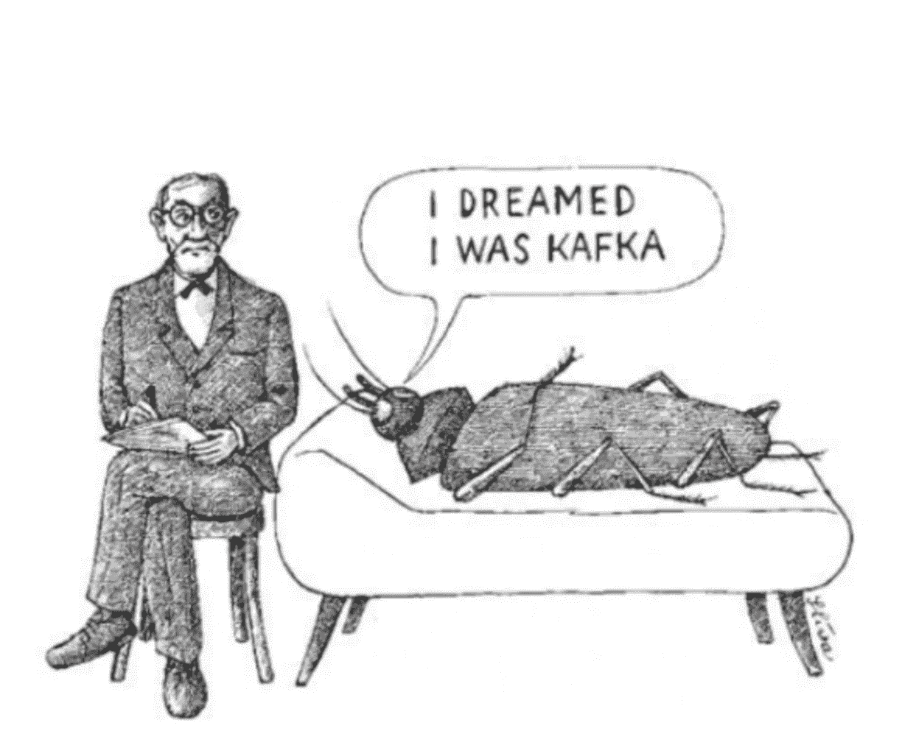

在我们开始学习卡夫卡之前，我们首先要理解为什么我们需要一个信息系统

## 为什么我们需要一个信息系统？

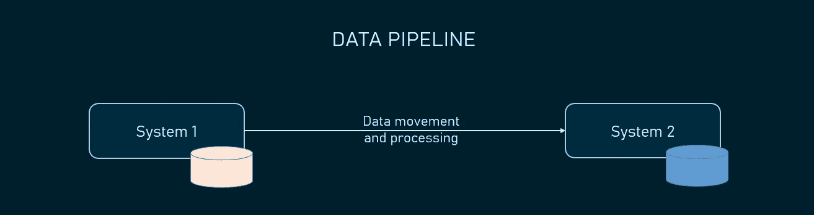

让我们考虑上面的图像，其中系统 1 和系统 2 是使用数据管道相互通信的两个服务器，我们只希望真实世界的应用程序具有如上的简单设计。

实际上，大多数真实世界的应用程序都有

*   多个系统相互通信，需要复杂的数据管道
*   每个数据管道都有自己的规范和要求
*   添加/删除数据管道可能会变得复杂

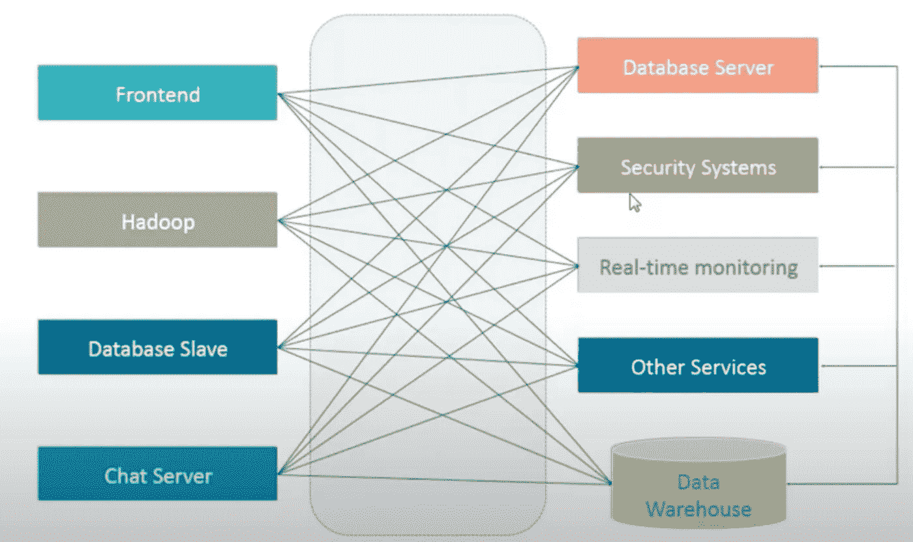

## 消息系统:

*   它降低了数据管道的复杂性
*   使系统之间的通信更易于管理

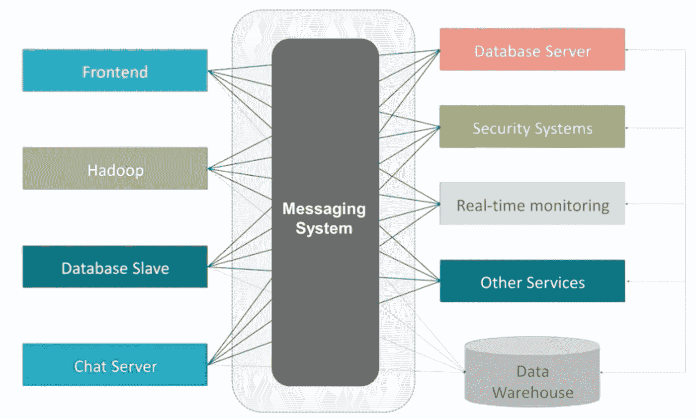

*   它可以提供独立于平台/语言的通信
*   它提供了一个通用的范例
*   可以建立异步通信

我希望我能够说服你为什么我们需要一个信息系统

接下来，我们将看到卡夫卡的基础知识和它的简单实现


## 卡夫卡是什么？

Kafka 是一个分布式发布-订阅消息系统。在发布-订阅系统中，消息保存在主题中。消息生产者称为发布者，消息消费者称为订阅者。消费者可以订阅一个或多个主题，并使用该主题中的所有消息

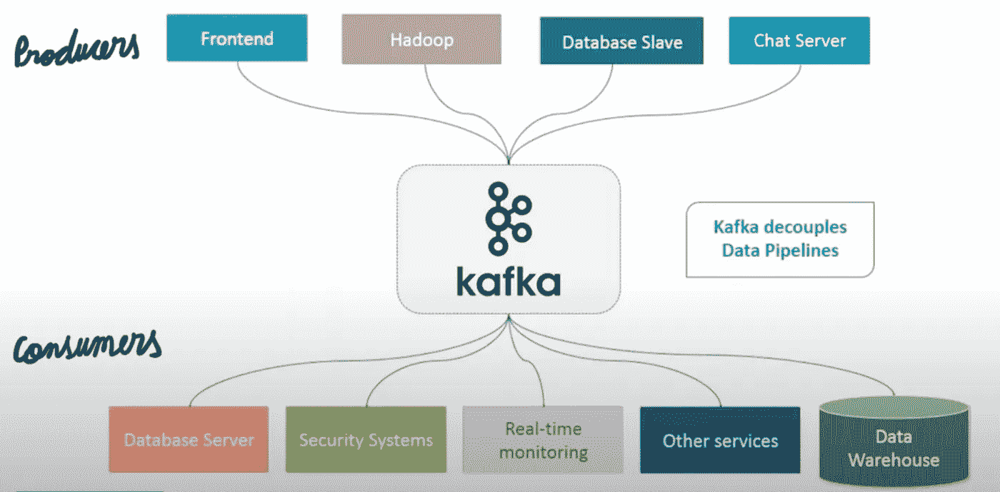

## 卡夫卡的特征:

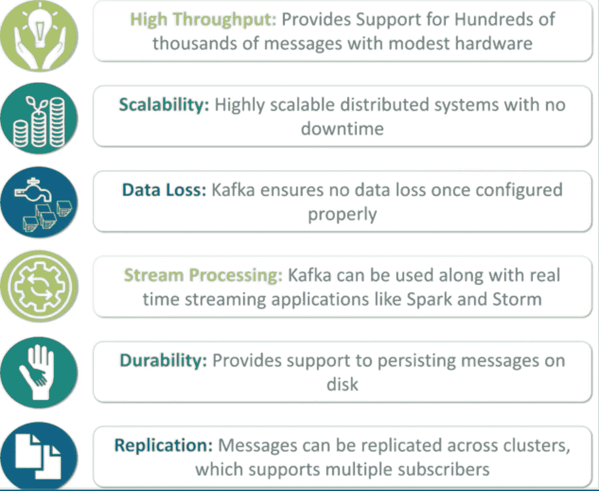

# 卡夫卡基础

Apache.org 表示:

*   Kafka 作为一个集群在一个或多个服务器上运行。
*   Kafka 集群按称为主题的类别存储记录流。
*   每个记录由一个键、一个值和一个时间戳组成。

# 主题和日志

主题是记录发布到的提要名称或类别。Kafka 中的主题总是多订户的——也就是说，一个主题可以有零个、一个或多个消费者来订阅写入其中的数据。对于每个主题，Kafka 集群维护一个如下所示的分区日志:


# 划分

一个主题可能有许多分区，因此它可以处理任意数量的数据。在上图中，主题被配置为三个分区(分区{0，1，2})。分区 0 有 13 个偏移量，分区 1 有 10 个偏移量，分区 2 有 13 个偏移量。

# 分区偏移

每个分区消息都有一个唯一的序列 ID，称为偏移量。例如，在 Partition1 中，偏移量标记为从 0 到 9。

# 复制品

副本只不过是分区的备份。如果上述主题的复制因子设置为 4，那么 Kafka 将为每个分区创建四个相同的副本，并将它们放在集群中，以使它们可用于其所有操作。副本从不用于读取或写入数据。它们用于防止数据丢失。

# 经纪人

代理是负责维护发布数据的简单系统。Kafka 代理是无状态的，所以它们使用 ZooKeeper 来维护它们的集群状态。每个代理对于每个主题可以有零个或多个分区。例如，如果一个主题有 10 个分区和 10 个代理，那么每个代理将有一个分区。但是，如果有 10 个分区和 15 个代理，那么开始的 10 个代理将各有一个分区，剩下的 5 个代理将没有该特定主题的任何分区。但是，如果分区是 15 个，而代理是 10 个，那么代理将在它们之间共享一个或多个分区，导致代理之间的负载分布不均衡。尽量避免这种情况。

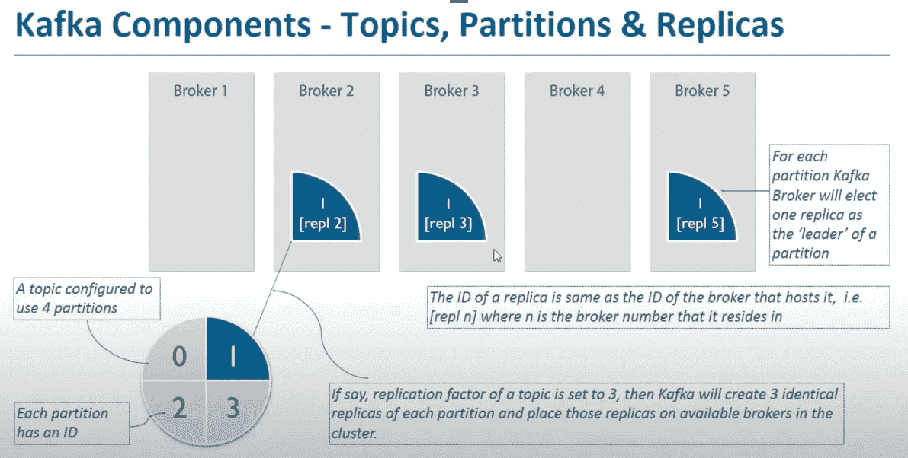

# 动物园管理员

ZooKeeper 用于管理和协调 Kafka 经纪人。ZooKeeper 主要用于通知生产者和消费者 Kafka 系统中任何新代理的存在或 Kafka 系统中任何代理的失败。ZooKeeper 通知生产者和消费者某个代理的存在或失败，生产者和消费者根据这个代理做出决定，并开始与其他代理协调他们的任务。

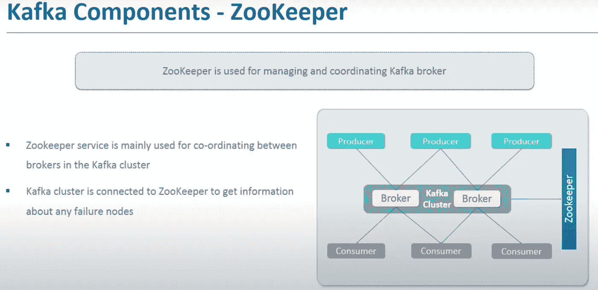

# 串

当 Kafka 有一个以上的经纪人时，它被称为 Kafka 集群。Kafka 集群可以在不停机的情况下进行扩展。这些集群用于管理消息数据的持久性和复制。

Kafka 有四个核心 API:

1.  **Producer API** 允许应用程序向一个或多个 Kafka 主题发布记录流。
2.  **消费者 API** 允许应用程序订阅一个或多个主题，并处理产生给它们的记录流。
3.  **流 API** 允许应用程序充当流处理器，从一个或多个主题消费输入流，并产生一个或多个输出主题的输出流，有效地将输入流转换为输出流。
4.  **连接器 API** 允许构建和运行可重用的生产者或消费者，将 Kafka 主题连接到现有的应用程序或数据系统。例如，关系数据库的连接器可能捕获表的每一次更改。

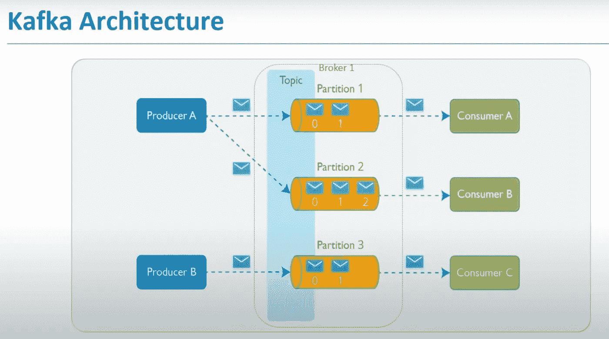

## 卡夫卡集群的类型:

*   单节点—单代理集群

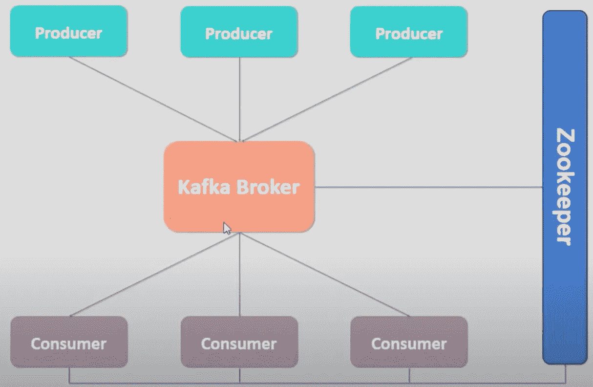

*   单节点—多代理集群

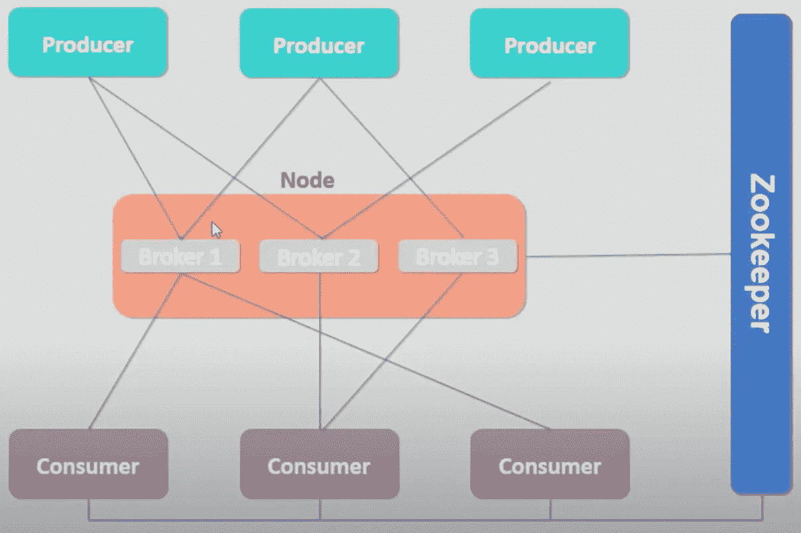

*   多节点—多代理集群

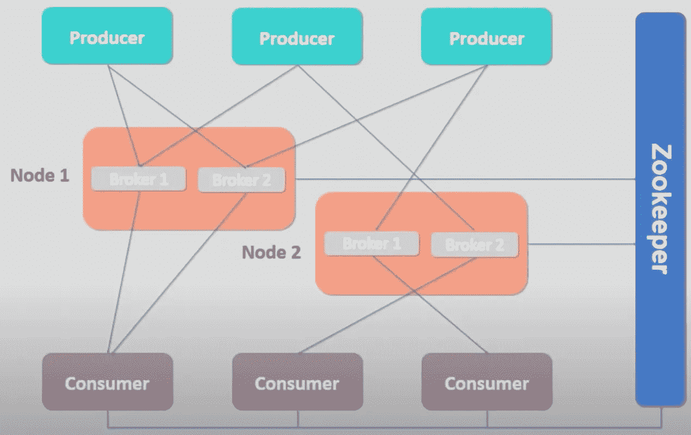

到目前为止，我们已经讨论了理论概念来熟悉卡夫卡。现在，我们将在设置单个代理集群时使用其中的一些概念。

*   下载并安装 Kafka

```
Download:

```shell
$ wget https://mirrors.estointernet.in/apache/kafka/2.8.0/kafka_2.13-2.8.0.tgz
```Install:

```
$ tar -xzf kafka_2.13-2.8.0.tgz
$ cd kafka_2.13-2.8.0
```
```

*   启动动物园管理员

```
QuickStart:

```bash
# Start the ZooKeeper service
# Note: Soon, ZooKeeper will no longer be required by Apache Kafka.
$ bin/zookeeper-server-start.sh config/zookeeper.properties
``````shell
# Start the Kafka broker service
$ bin/kafka-server-start.sh config/server.properties
```Create topics:

```bash
$ bin/kafka-topics.sh --create --topic events --bootstrap-server localhost:9092
```

```shell
$ bin/kafka-topics.sh --describe --topic events --bootstrap-server localhost:9092
```Ingest Events:

```shell
$ bin/kafka-console-producer.sh --topic events --bootstrap-server localhost:9092
My first event
My second event
```

Read Events:

```shell
$ bin/kafka-console-consumer.sh --topic events --from-beginning --bootstrap-server localhost:9092
```

Server Props:

```java
export KAFKA_HEAP_OPTS="-Xmx256M -Xms128M"
```

Get offsets:

```shell
$ bin/kafka-run-class.sh kafka.tools.GetOffsetShell --broker-list localhost:9092 --topic events --time -1
``` Consumer groups:

```shell
# List consumers
$ bin/kafka-consumer-groups.sh --list --bootstrap-server localhost:9092
```

Read Events with Consumer Group:

```shell
# With config
$ bin/kafka-console-consumer.sh --bootstrap-server localhost:9092 --topic events --from-beginning --consumer.config config/consumer.properties
# With group.id
$ bin/kafka-console-consumer.sh --bootstrap-server localhost:9092 --topic events --from-beginning --group my-cg
```

Describe Topic:

```shell
$ bin/kafka-consumer-groups.sh --bootstrap-server localhost:9092 --group my-cg --describe
```

Inflate Partitions:

```shell
$ bin/kafka-topics.sh --topic events --alter --partitions 4 --zookeeper localhost:2181
```

Describe Consumers:

```shell
$ bin/kafka-consumer-groups.sh --bootstrap-server localhost:9092 --describe --group myconsumer --offsets
```
```

**这就是所有的人，如果你一直读到这里，那么…..**

