# Python 中的实践时间序列预测

> 原文：<https://medium.com/nerd-for-tech/hands-on-time-series-forecasting-in-python-33356389865d?source=collection_archive---------4----------------------->

## “预测的目标不是预测未来，而是告诉你你需要知道什么，以便在现在采取有意义的行动”~保罗·萨福


图片由[克里斯·利维拉尼](https://unsplash.com/@chrisliverani)在 Unsplash 上拍摄

时间序列预测是统计学和数据科学中的一个重要概念。在这篇文章中，我将涉及时间序列分析的深入实践。

在开始 Python 代码之前，让我们讨论一些非常基本的时间序列分析要点。对于那些不熟悉它的人，我在参考资料中附加了一些链接，以获得时间序列分析的完整概述。

众所周知，统计数据有三种类型:

1.  **时间序列数据:**一个变量在不同时间取值的一组观测值。
2.  **横截面数据:**在同一时间点收集的一个或多个变量的数据。
3.  **汇集数据:**时间序列数据和横截面数据的组合。

因此，在一段时间内对一个变量的研究被称为时间序列分析。

时间序列分析的目标是理解产生序列的过程，并预测所研究变量的未来值。

时间序列有 **4 个组成部分**:

1.  趋势(T):这是数据随时间增加或减少的一般长期趋势。
2.  季节性:它是非随机成分，定期重复出现。
3.  周期性[C]:周期超过一年的振荡运动是周期性变化。
4.  Random (R):时间序列的任何变动，如果不能用上述三个部分来解释，都被认为是随机变化。这些是无法预料的事件，饥荒等。

我们总是将时间序列分解成不同的部分，因为我们可能对某个特定的部分感兴趣。

## **时间序列的数学模型**

1.  加法:由->T+S+C+R 给出
2.  乘法:它由->T*S*C*R 给出

要了解这些型号的更多信息，请点击[此处](https://www.toppr.com/guides/fundamentals-of-business-mathematics-and-statistics/time-series-analysis/models-of-time-series-analysis/)

一次，我们分解一个时间序列，基于数学模型的类型，我们可以分离各种成分。在本文的后面，我将展示如何使用 Python 来实现这一点。

ARIMA 和 ARMA 是时间序列数据分析和预测中常用的两种模型。

# **ARMA**

自回归移动平均线。它用 ARMA(p，q)表示。

在 AR 模型中，当前值被表示为有限个先前值和随机冲击的线性函数。

在 MA 模型中，当前值被表示为当前和有限数量的先前冲击的线性函数。

因此，ARMA 是这两者的结合。

为了得到 p(滞后阶数)的值，我们使用 PACF(部分自相关函数)，对于 q(移动平均阶数)，我们使用 ACF(自相关函数)。

# **ARIMA**

自回归综合移动平均。它由 ARIMA(p，d，q)表示。

这个模型有 AR 和 MA，以及“I”部分。在这里,“整合”意味着差异。它的阶用 d 表示，称为“差分阶”。求差是为了使数列平稳。

要阅读关于这些模型的更多内容，请转到本文的“参考资料”部分，并打开第二个链接。

# 现在，让我们开始编码。

**数据集信息:**该数据集由 Cheenta 为他们的课程数据科学项目免费提供。他们正在建立一个数据科学社区，供每个人免费成长和学习。如果你想加入这个社区，[点击这里](https://www.cheenta.com/data-science-projects-made-easy/)。

(附:这是**不是**一个推广帖或者评论。任何人都可以免费加入这个社区，与成员互动，做这些项目。所以，如果你想做项目并向他人学习，那就试试吧！)

```
Description of dataset:This dataset shows traffic to and from the Airport as a Percentage of the Traffic volume during the baseline period. The baseline period used for computing this metric is from 1st Feb to 15th March 2020.
```

**导入必要的库**

```
import pandas as pd
import numpy as np
import seaborn as sns
import matplotlib.pyplot as plt
import warnings
warnings.filterwarnings("ignore")
```

**获取数据**

```
data = pd.read_excel('F:\Cheenta\Project1\covid_impact_on_airport_traffic.xlsx')
data.head(2)
```

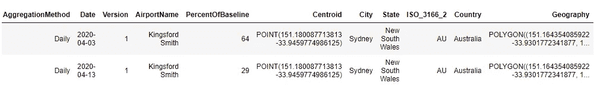

**了解数据**

```
data.tail(2)
```

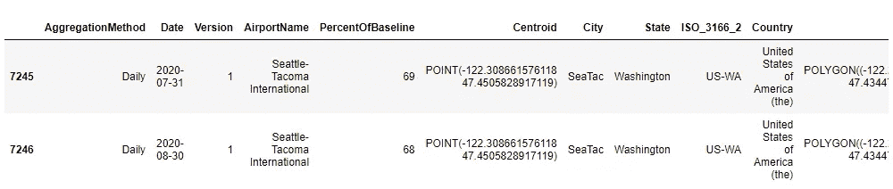

```
data.describe(include='all')
```

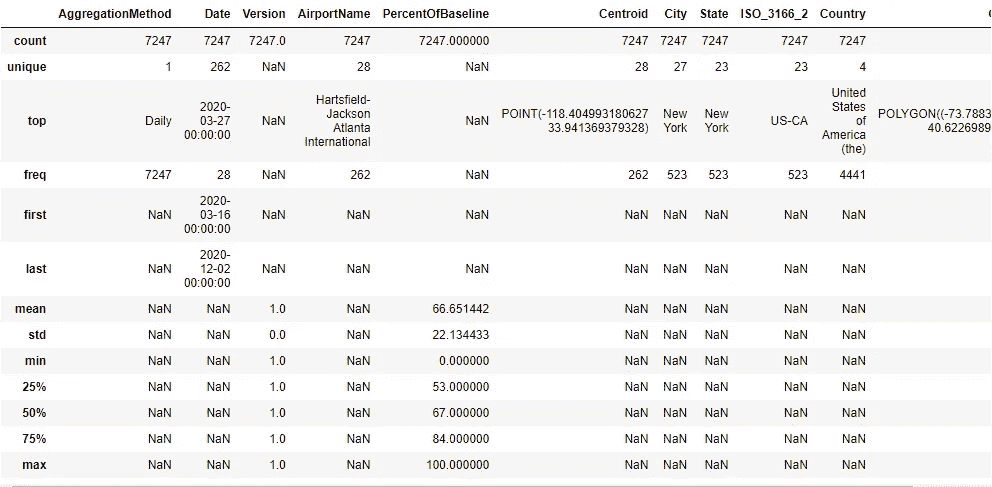

数据集中有 4 个国家、23 个州、27 个城市和 28 个机场。从 2010 年 3 月 16 日到 2010 年 2 月 12 日，共收集了 262 天的数据。

质心和国家是点和多边形结构，告诉我们它们是地理位置。

此外，从计数中，我们可以看到，所有功能都没有丢失值。

## 删除不重要的功能

“地理”是一个多边形特征，这意味着它类似于形状。因此，我们可以得出结论，地理告诉我们一个机场的形状。因为我们的分析不需要它。我们会放弃的。

同样的推理也适用于“质心”。质心可能告诉我们机场中心的纬度和经度。因为我们不需要那个。我们也会放弃。

ISO_3166_2 是每个状态的唯一值。我们不需要它来进行时间序列分析。

AggregationMethod 始终是“每日”，因此，它不提供任何信息。我们可以移除它。

没有提供关于版本的信息。因此，我们将把它从我们的分析中剔除。

```
data.head()
```


**单变量分析**

```
plt.figure(figsize=(20,6))
fig1 = sns.countplot(x = 'AirportName', data = data , palette='rainbow_r')
fig1.set_xticklabels(fig1.get_xticklabels(), rotation=90)
fig1.set_title("Count for various Airports")
plt.show()
```

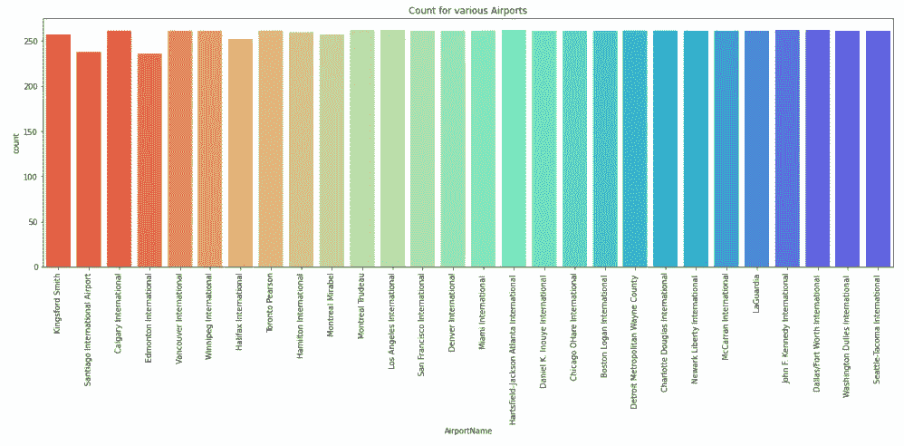

这表明除圣地亚哥国际机场和埃德蒙顿国际机场外，每个机场大约有 250 个数据点。

```
plt.figure(figsize=(20,6))
fig2 = sns.countplot(x = 'City', data = data , palette='viridis')
fig2.set_xticklabels(fig2.get_xticklabels(), rotation=90)
fig2.set_title("Count for various City")
plt.show()
```

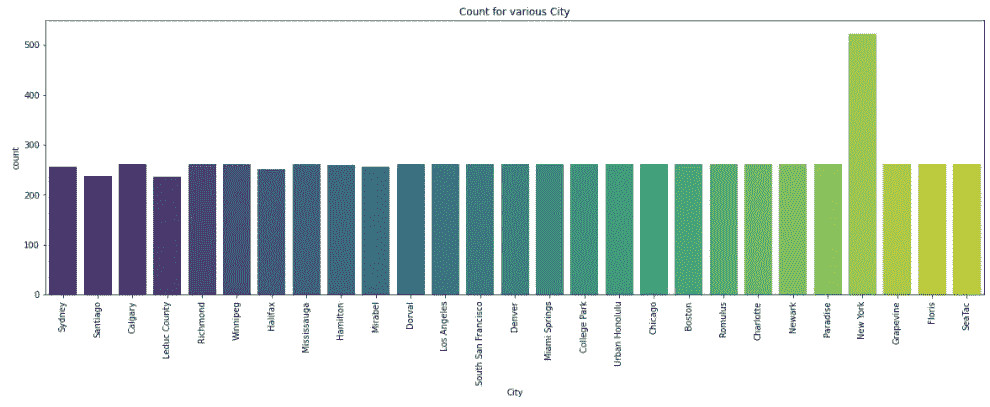

这表明除了纽约以外，所有城市在数据中的计数都或多或少相等。最有可能的原因是它有更多的机场。

```
plt.figure(figsize=(20,6))
fig3 = sns.countplot(x = 'State', data = data , palette='cividis')
fig3.set_xticklabels(fig3.get_xticklabels(), rotation=90)
fig3.set_title("Count for various State")
plt.show()
```

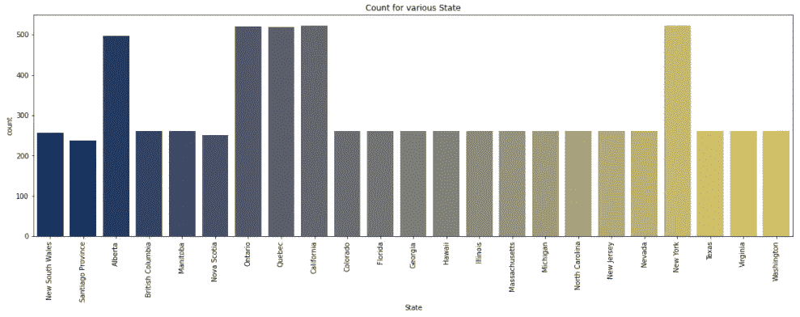

在这里，除了阿尔伯塔省、魁北克省、加利福尼亚州和纽约州，所有州的数据都相等。最有可能的原因还是机场的数量。我们将在对各国的深入分析中再次谈到这一点。

```
plt.figure(figsize=(8,4))
fig4 = sns.countplot(x = 'Country', data = data , palette='summer')
fig4.set_xticklabels(fig4.get_xticklabels())
fig4.set_title("Count for various Country")
plt.show()
```


最大数据点是美国，其次是加拿大。这是因为美国和加拿大的机场数量可能比澳大利亚和智利多。

**检查我们对单变量图的推断**

```
data.groupby("Country")['State','City','AirportName'].nunique()
```

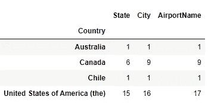

查看某个国家机场的表格

## 双变量分析

```
fig5 = sns.pairplot(data,hue='Country',height=5,palette='husl',aspect=1)
fig5._legend.remove()
plt.title("Distribution of Percent of Baseline for different countries")
plt.legend(loc = 'upper right',bbox_to_anchor=(1.2, 0., 0.5, 0.5))
plt.show()
```

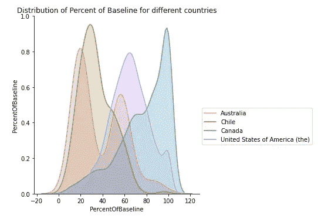

# 智利分析

```
# Data on Chile is based on only one state which has one city with one airport named Santiago International airport.data_chile **=** data_chile.sort_values(by**=**"Date")data_chile.set_index('Date',inplace**=True**)
data_chile = data_chile.drop(columns=['AirportName','City','State','Country'])data_chile.head()
```

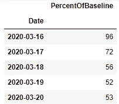

```
plt.figure(figsize=(20,10))
plt.plot(data_chile['PercentOfBaseline'])
plt.title("Plot for PercentOfBaseline Vs Time for Chile")
plt.show()
```

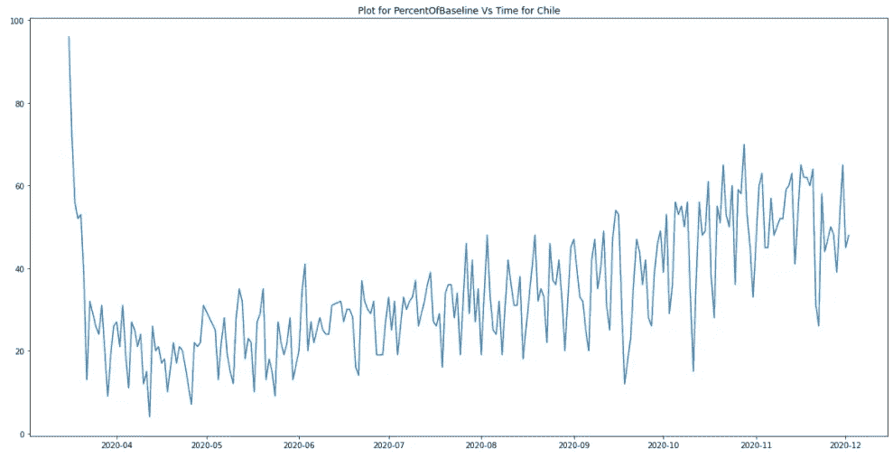

```
from statsmodels.tsa.stattools import adfuller
print('Results of Dickey-Fuller Test:')
dftest = adfuller(data_chile['PercentOfBaseline'], autolag='AIC')
dfoutput = pd.Series(dftest[0:4], index=['Test Statistic','p-value','#Lags Used','Number of Observations Used'])
for key,value in dftest[4].items():
    dfoutput['Critical Value (%s)'%key] = value
print(dfoutput)
```

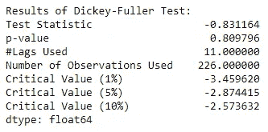

Dickey-Fuller 检验:这是检验平稳性的统计检验之一。这里的零假设是 TS 是非平稳的。如果“检验统计量”小于“临界值”，我们可以拒绝零假设，说序列是平稳的。

我们可以得出结论，我们的数据不是平稳的，因此，我们需要使它平稳，因为所有的时间序列模型都是平稳的。

```
#define function for kpss test
from statsmodels.tsa.stattools import kpss
#define KPSS
print ('Results of KPSS Test:')
kpsstest = kpss(data_chile['PercentOfBaseline'], regression='c')
kpss_output = pd.Series(kpsstest[0:3], index=['Test Statistic','p-value','Lags Used'])
for key,value in kpsstest[3].items():
    kpss_output['Critical Value (%s)'%key] = value
print (kpss_output)
```

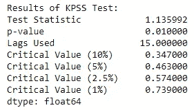

KPSS 测试的作者定义了零假设，因为过程是趋势文具，到一个单位根序列的替代假设。KPSS 检验也表明我们的序列不是平稳的。

有关更多信息，请参考本文的参考文献 4。

```
data_chile['diff'] = data_chile['PercentOfBaseline'] - data_chile['PercentOfBaseline'].shift(1)
plt.figure(figsize=(20,10))
plt.plot(data_chile['diff'])
plt.title("Plot for lagged PercentOfBaseline Vs Time for Chile")
plt.show()
```

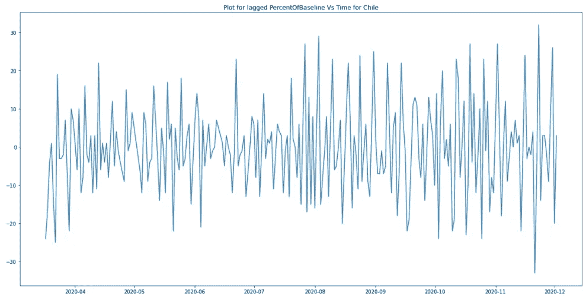

```
from statsmodels.tsa.seasonal import seasonal_decompose
decomposition = seasonal_decompose(x=data_chile['PercentOfBaseline'].dropna(),model='multiplicative',freq=9)
trend = decomposition.trend
seasonal = decomposition.seasonal
residual = decomposition.resid
plt.figure(figsize=(10,10))
plt.subplot(411)
plt.plot(data_chile['PercentOfBaseline'], label='Original')
plt.legend(loc='best')
plt.subplot(412)
plt.plot(trend, label='Trend')
plt.legend(loc='best')
plt.subplot(413)
plt.plot(seasonal,label='Seasonality')
plt.legend(loc='best')
plt.subplot(414)
plt.plot(residual, label='Residuals')
plt.legend(loc='best')
plt.tight_layout()
```

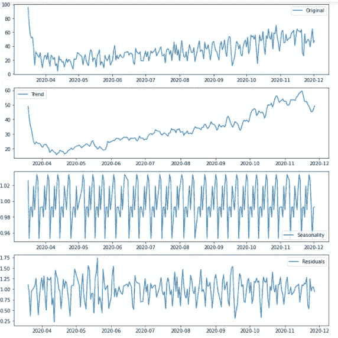

```
from statsmodels.graphics.tsaplots import plot_acf,plot_pacf
plot_acf(data_chile['diff'].dropna(),zero=False)
plt.xlim(0,20)
plt.xticks(np.arange(0,20,1))
plt.show() #q=1 or q=0
```

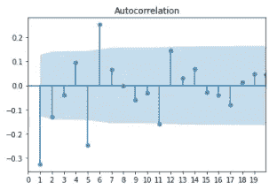

q 值由第一个显著滞后确定，在此之后，acf 值落在限值内(蓝色阴影)或变得不重要。这里 q=1。

```
plot_pacf(data_chile['diff'].dropna(),zero=False,lags=40,method='ols',alpha=0.05)
plt.xticks(np.arange(0,40,2))
plt.show() # p=3,5
```

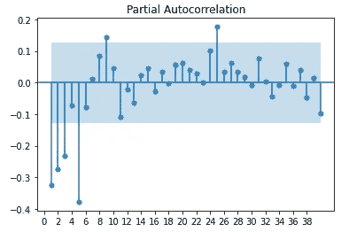

同样，p 的值是 3。

```
df = pd.DataFrame(data_chile['diff'])
df.dropna(inplace=True)
from statsmodels.tsa.arima_model import ARMA
# Create Training and Test
train = df.iloc[:212]
test = df.iloc[212:]
# Build Model
model = ARMA(train, order=(6,0))  
fitted = model.fit()  
print(fitted.summary())# Forecast
fc, se, conf = fitted.forecast(25, alpha=0.05)  # 95% conf# Make as pandas series
fc_series = pd.Series(fc, index=test.index)
lower_series = pd.Series(conf[:, 0], index=test.index)
upper_series = pd.Series(conf[:, 1], index=test.index)# Plot
plt.figure(figsize=(12,5), dpi=100)
plt.plot(train, label='training')
plt.plot(test, label='actual',color='r')
plt.plot(fc_series, label='forecast',color='g')
plt.fill_between(lower_series.index, lower_series, upper_series,color='g', alpha=.05)
plt.title('Forecast vs Actuals')
plt.legend(loc='best', fontsize=8)
plt.show()
```

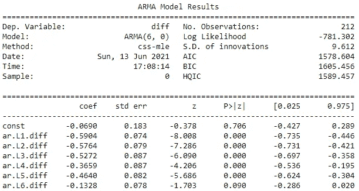

p 和 q 的值给了我们一个概念。我们必须运行接近这些值的各种模型，并选择最佳模型。最佳模型是具有最低 AIC、最高对数似然的模型，并且模型的系数必须是显著的。

提示:你可以在智利的基线百分比上使用 ARIMA(6，1，0)得到相同的模型。因为我之前已经区分了这个系列，所以在这里我没有使用 ARIMA。

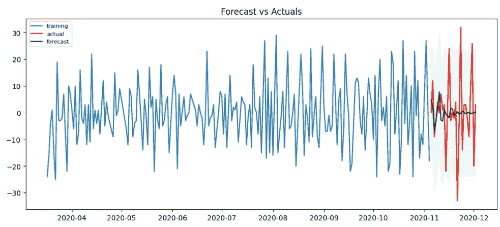

# 针对美国的分析

```
data_US = data[data['Country']=='United States of America (the)']
df1 = pd.DataFrame(data_US.groupby('Date',as_index=True)['PercentOfBaseline'].mean())
df1.head()
```

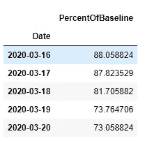

在这里，我们将意味着所有，因为在美国，我们有 16 个机场。因此，我们将取所有值的平均值，并对数据进行建模。

```
plt.figure(figsize=(20,10))
plt.plot(df1)
plt.title("Plot of USA's average PercentOfBaseline Vs Time")
plt.show()
```

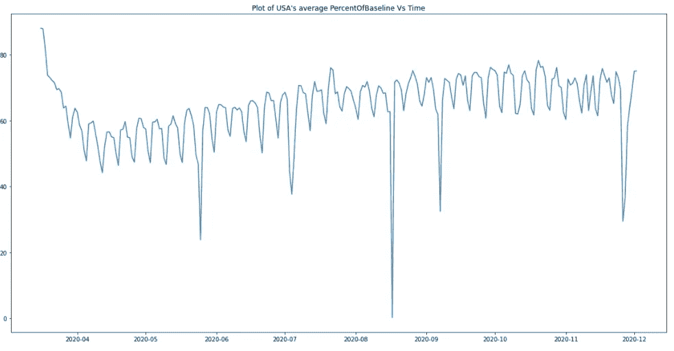

根据 ADF 测试，该序列随时间是平稳的。所以，我们直接建模，不需要差分。

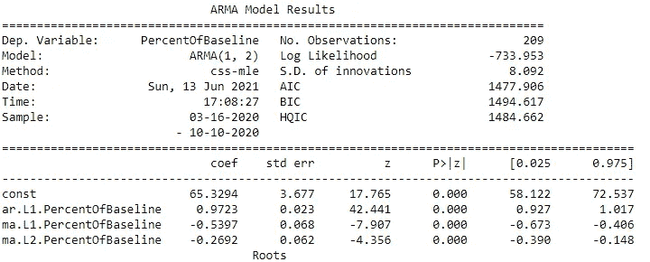

该模型最好用 ARMA(1，2)来表示。

图表看起来像这样:

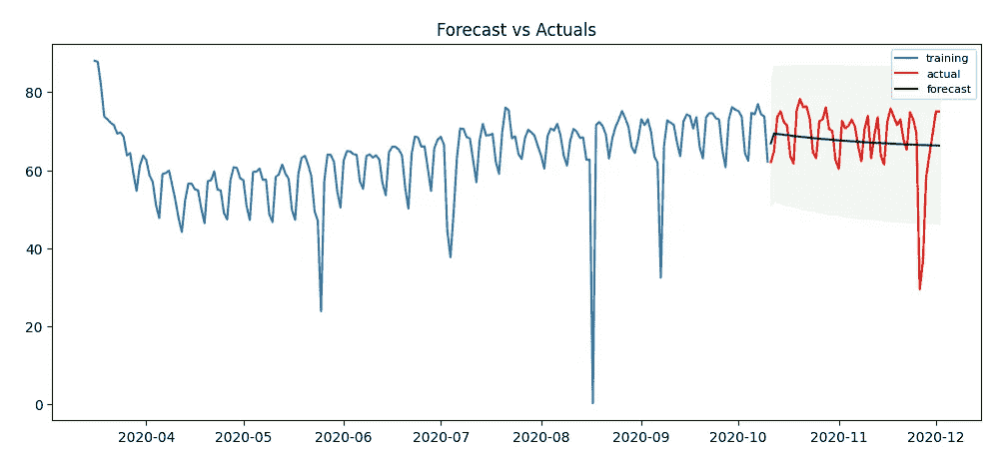

我已经按顺序展示了分析中的主要步骤。要查看分析的所有步骤，请点击[链接](https://github.com/Anjali001/Cheenta_DS_Projects/blob/c1e2a98d3e9b0b8271925d950798433c28be8db3/Project%201-%20Time%20Series%20Analysis%20for%20COVID%20Flights/code.ipynb)查看我的知识库。

此外，作为练习，您可以对澳大利亚和加拿大进行类似的分析。

希望你喜欢这篇文章。欢迎发表评论。

更多关于数据科学的文章，请关注我的媒体。

# 参考资料:

1.  [https://www . statistics solutions . com/free-resources/directory-of-statistical-analyses/time-series-analysis/](https://www.statisticssolutions.com/free-resources/directory-of-statistical-analyses/time-series-analysis/)
2.  [https://towards data science . com/time-series-models-d 9266 f 8 AC 7 b 0](https://towardsdatascience.com/time-series-models-d9266f8ac7b0)
3.  [https://www . toppr . com/guides/fundamentals-of-business-mathematics-and-statistics/time-series-analysis/models-of-time-series-analysis/](https://www.toppr.com/guides/fundamentals-of-business-mathematics-and-statistics/time-series-analysis/models-of-time-series-analysis/)
4.  [https://www . analyticsvidhya . com/blog/2018/09/non-stationary-time-series-python/](https://www.analyticsvidhya.com/blog/2018/09/non-stationary-time-series-python/)