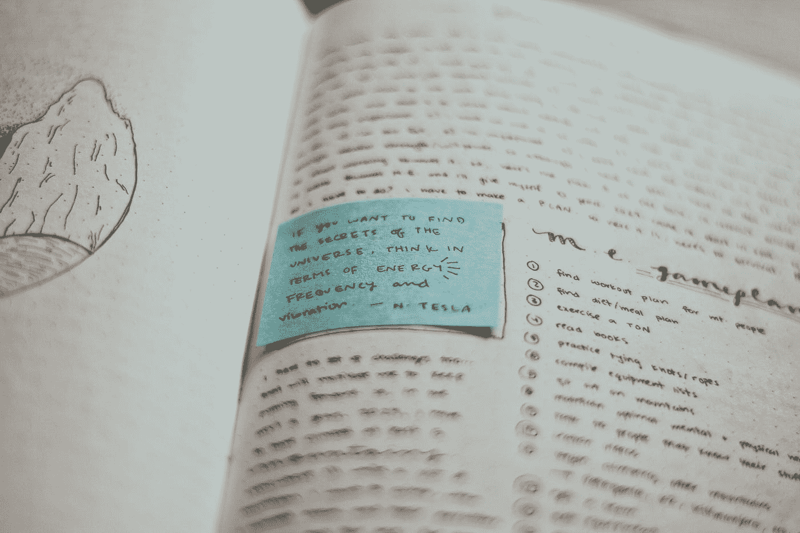
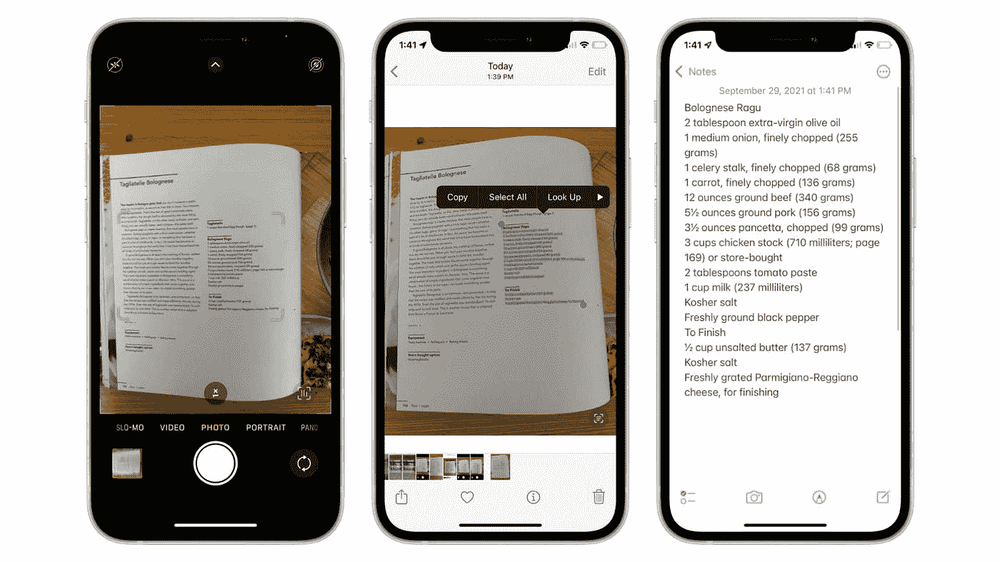
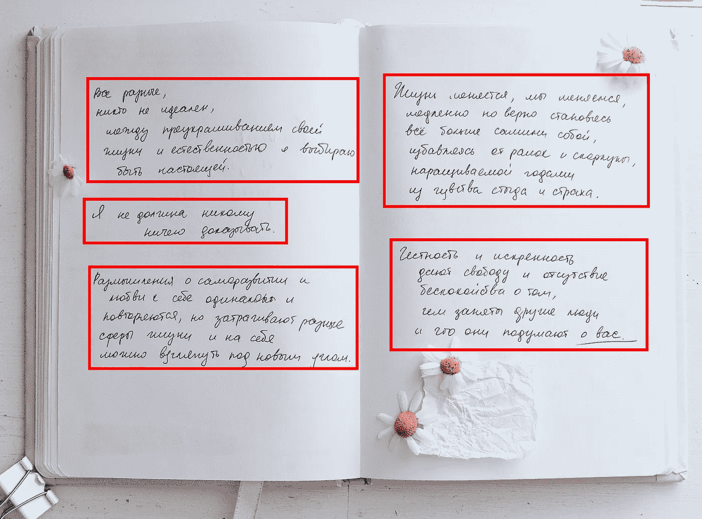
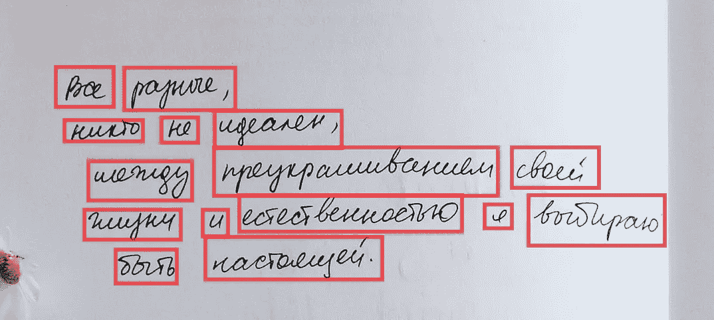
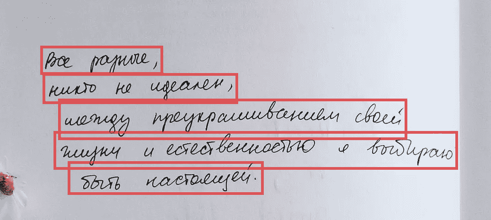
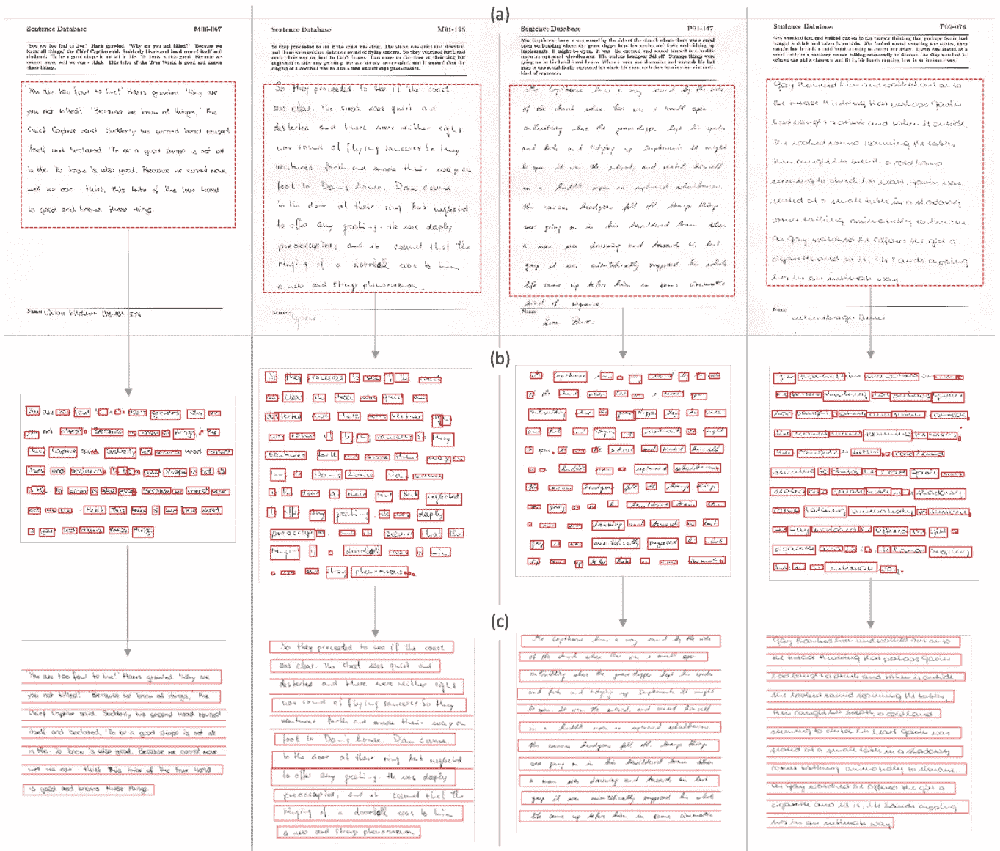
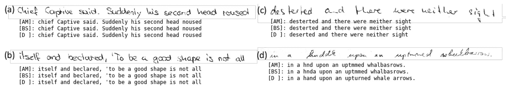
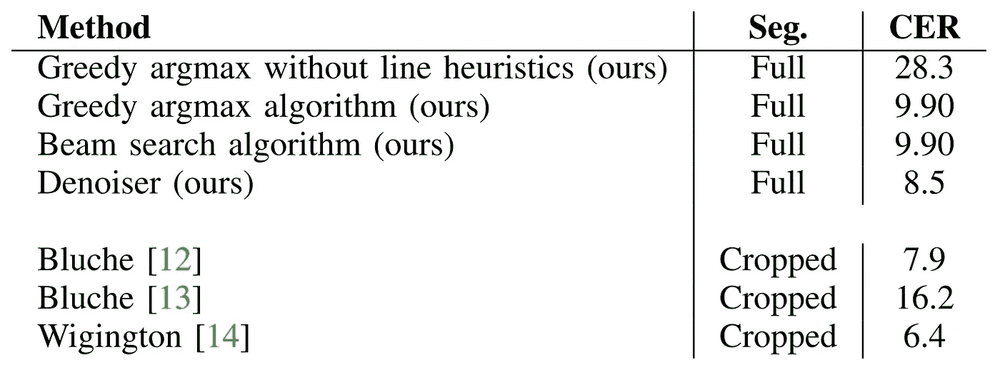
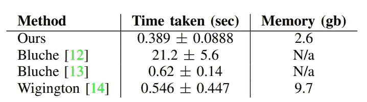

# 手写识别:不仅仅是 MNIST

> 原文：<https://medium.com/nerd-for-tech/handwriting-recognition-more-than-just-mnist-36e68832de73?source=collection_archive---------2----------------------->

## 一种计算高效的整页脱机手写文本识别流水线方法

诺埃米·马卡韦-卡特茨在 [Unsplash](https://unsplash.com?utm_source=medium&utm_medium=referral) 上拍摄的照片

于是我就在那里，看着苹果正式发布 IOS 15。然后，突然之间，他们展示了一个让我印象深刻的功能。IOS 现在可以**从图像中复制文本**。这听起来可能不那么令人印象深刻，但这几乎让我大吃一惊。一段时间以来，光学字符识别(OCR)技术已经能够在印刷文本上执行文本识别，甚至基本的手写文本。然而，它总是要么计算量非常大，要么对输入的照片非常敏感。就我所见，IOS 的实现没有受到这些缺陷的影响。不用说:我很感兴趣。

照片由[美国消费者新闻与商业频道](https://www.cnbc.com/2021/09/29/ios-15-live-text-how-to-copy-and-paste-text-from-a-photo.html)拍摄

经过一番搜索，我看到了 Jonathan Chung 和 Thomas Delteil 的一篇论文。本文详细介绍了一个**离线整页笔迹检测流水线**。仔细观察，这条管道有两个特性，可以让它非常类似于苹果的实时文本。首先，离线时，该算法处理手写文本的照片。其次，这种方法适用于整页整页的手写内容，而不仅仅是单个单词或行。这意味着它将能够，比如说，将一张购物清单的照片数字化。

本文总结了他们论文中使用的技术，以及我打算在实现该算法时使用的一些附加技术。

# 概观

尽管 OCR 是新的 ML 科学家完成的第一个项目，但它在现实环境中仍然是一项具有挑战性的任务。这是因为需要三个相对复杂的步骤才能产生有用的结果。算法需要**在图像中定位文本**，**将其分割成**可管理的块，并执行**手写识别**以确定块中有哪些字符。

## 通道识别

带段落边框的手写笔记本示例—照片由 [pure julia](https://unsplash.com/@purejulia?utm_source=medium&utm_medium=referral) 在 [Unsplash](https://unsplash.com?utm_source=medium&utm_medium=referral) 上拍摄

段落检测是整页 OCR 的第一步，包括对图像中包含文本的部分进行分类。这包括在每个文本块周围绘制一个边界框。对于简单的环境，比如本文中使用的环境，可以假设只存在一个文本块。这意味着一个卷积模型，比如 **ResNet** ，可以用来定位它。该模型输出对应于边界框的 **x、y、宽度和高度**的四个值。

对于包含多个文本块的更复杂的图像，这是行不通的。诸如 **YOLO** 或**固态硬盘**之类的算法可以用来检测图像的哪些部分包含文本。这将允许算法检测单个图像中的多个文本框。

## 线分割

一旦找到图像中包含文本的部分，下一步就是将段落分割成单独的行。本文选择首先检测单个单词的**包围盒，然后使用聚类算法组合这些包围盒。这样做是为了尽量减少遗漏整行的机会。**

通过使用**单发检测器(SSD)** 模型来生成单词边界框。SSD 架构可以实时生成多个边界框。他们首先使用像 **ResNet34** 这样的图像处理器提取特征图。固态硬盘然后在提取的特征周围绘制边界框。想了解更多信息，我推荐看看乔纳森·许的这篇文章。

为了提高精度，**后处理**步骤也在边界框上执行。高度大于宽度的单词框将被丢弃。重叠的框也被丢弃。

带有文字边框的手写笔记示例——照片由 [pure julia](https://unsplash.com/@purejulia?utm_source=medium&utm_medium=referral) 在 [Unsplash](https://unsplash.com?utm_source=medium&utm_medium=referral) 上拍摄

一旦检测到所有的单词边界框，就可以基于它们的 y 分量将它们聚类成行。由于文本行通常是从左向右直线书写的，因此边界框的 y 分量可用于确定两个单词是否在同一行上。如果两个边界框明显重叠，那么它们被聚集到同一条线上。

带有线条边框的手写笔记示例——照片由 [pure julia](https://unsplash.com/@purejulia?utm_source=medium&utm_medium=referral) 在 [Unsplash](https://unsplash.com?utm_source=medium&utm_medium=referral) 上拍摄

为了提高精度，在预测线上执行以下**后处理**步骤。

1.  小于某个最小值的行被丢弃
2.  超出输入图像边界的行将被丢弃
3.  大大短于中线长度的线被丢弃
4.  明显高于中间高度的线被分成两条线(占双线)
5.  与其他行重叠的行将被丢弃

通过这些试探法的所有行都用于手写识别步骤。

## 手写识别

使用**卷积双向 LSTM 网络** (CNN-biLSTM)进行手写识别。CNN-bilstm 是用于提取与输入空间对齐的特征的模型架构。这意味着输出要素(字母)的顺序应该与输入要素的顺序相同。本文使用 **ResNet34** 从输入图像中提取特征。然后，它使用两个 biLSTMs 将特征编码转换成一个 N x M 数组，其中 N 是最大序列长度，M 是唯一字符分类的数量。

CNN-biLSTM 网络的示例架构

## 语言模型 denoiser

语言模型去标器是将手写识别器的 N×M 结果转换成输出字符串的程序。这个问题最常用的方法叫做**贪婪搜索**。贪婪搜索通过为每 N 个片段选择具有**最大概率**的字符类来工作。这是一种解决问题的直观方法，但它往往会导致低准确性。为了提高精度，可以使用像**光束搜索**或**这样的系统，预先训练语言模型**。这些方法提高了准确性，因为它们考虑了**字符序列**的概率，而不是单独查看分类的概率。我不能给出一个完整的解释，但是要获得更多的信息，我推荐你看一下[杰森·布朗利](https://machinelearningmastery.com/author/jasonb/)写的[这篇](https://machinelearningmastery.com/beam-search-decoder-natural-language-processing/)文章。

本文比较了七种**语言去噪方法**的结果，其中包括一种定制的方法。他们的定制语言模型在一个序列对序列的数据集上进行了预训练，在这个数据集上，输入的字符被随机地**添加、删除或替换为相似的字符**。这样做是为了教会语言模型如何修复与错误分类字符相关的错误。N×M 阵列被馈入该降噪器以产生预测输出。

# 估价

使用 [**IAM**](https://fki.tic.heia-fr.ch/databases/iam-handwriting-database) **数据集**来评估该系统。该数据集包含约 1500 页扫描的手写和带标签的文档。数据集被分成一个训练集和一个测试集。根据报告的**损失和准确度**以及通过系统运行验证数据产生的**定性视觉样本**对系统进行评估。

# 培训详情

本文选择使用 **Apache 的 MXNet 深度学习框架**来开发其网络。每个网络都是单独训练的，都使用了 Adam 优化器。以下损失用于每个网络:

*   **通道检测:**均方误差
*   **单词检测:**分类交叉熵
*   **手写识别:** CTC 丢失
*   **语言符号:**自定义试探法

由于数据集的性质，许多常见的数据扩充方法不可用。但是，使用了以下内容:

*   翻译
*   剪羊毛
*   咬合
*   随机单词/行的消隐

# 结果

基于定性的观察，我们可以看到，总的来说，所有的步骤都准确地运行。段落检测在定位每个图像的边界框方面做得很好，除了第三列没有找到最后一行。单词检测再次倾向于为行识别器定位足够的单词来包含整个行。然而，许多较短的单词被遗漏了。

图 3 —整页 OCR 示例。输入图像->段落检测->单词检测->线条包围盒

一旦检测到，手写识别器和自定义 denoiser 在将行转换为文本方面表现出色。与 argmax [AM]和 beam search [BS]方法相比，**自定义降噪器[D]的性能明显优于**。当笔迹变得**不清晰**时，这一点尤为突出，例如在样本(d)中。有趣的是，custom denoiser 的语言建模能力使其**遗漏了一些来自奇数单词的字母**，例如 sample 中“desterted”的第一个“t”。

图 4

分析每种去噪方法的报告字符错误率(CER)清楚地表明，自定义去噪器比任何其他算法都精确得多。然而，它不能比输入图像被裁剪(*)的其他方法更准确，即，与该方法中概述的整页相比，馈入仅包含手写部分的图像。*)

表 1 —文本去噪方法与 CER 的比较

这种方法的内存和时间需求也明显低于其他方法。本文的方法花费的时间比目前最快的可比方法少约 1.5 倍，内存比 Wigington 的方法少约 3.5 倍。

表 2 —文本去噪方法与内存使用和时间的比较

所以，回到我最初的观点，这项技术是惊人的。我能想到它至少有 20 种用途。我真的很期待在未来与它更多地合作，实现一个成熟的 OCR 系统。

# 参考

*   原文:【https://arxiv.org/pdf/1910.00663.pdf 
*   IAM 数据集:[https://fki . TIC . heia-fr . ch/databases/IAM-手写-数据库](https://fki.tic.heia-fr.ch/databases/iam-handwriting-database)
*   手写识别的基础知识:[https://nano nets . com/blog/手写字符识别/](https://nanonets.com/blog/handwritten-character-recognition/)

> *感谢阅读我的文章！请随时查看我的* [*作品集*](https://tks.life/profile/robert.macwha#portfolio) *，在*[*LinkedIn*](https://www.linkedin.com/in/robert-macwha-0555141b6/)*上给我留言，如果你有什么要说的，或者在 Medium 上关注我，当我发布另一篇文章时，你会收到通知。*