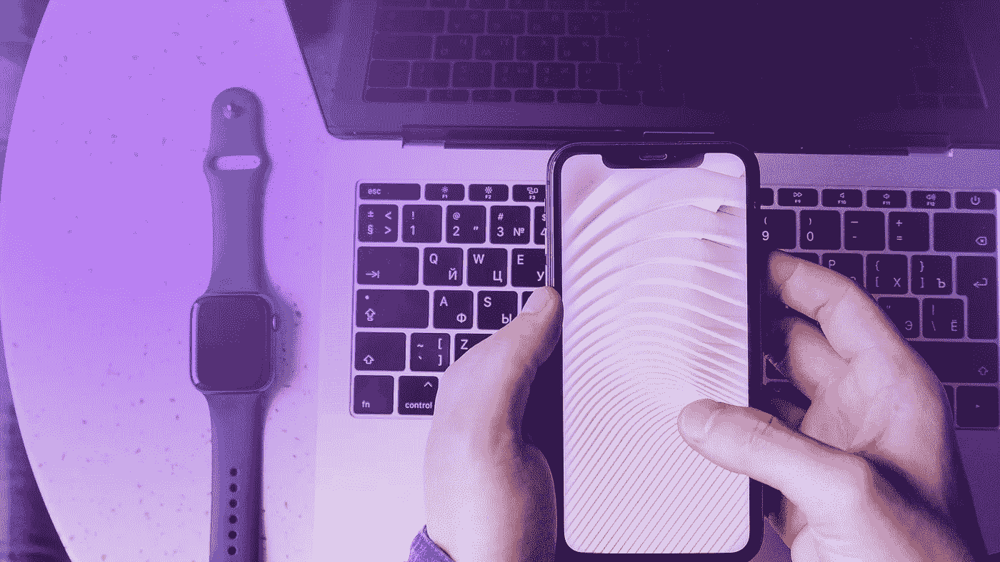
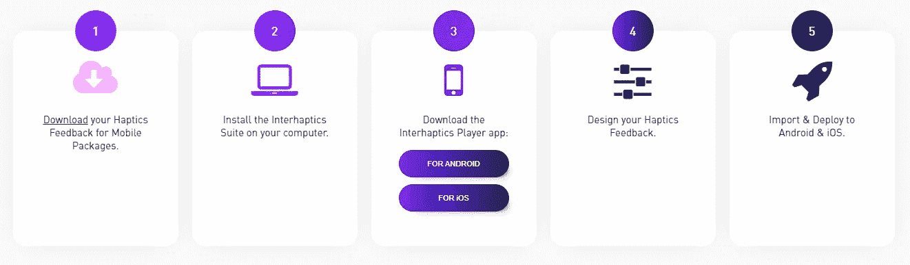
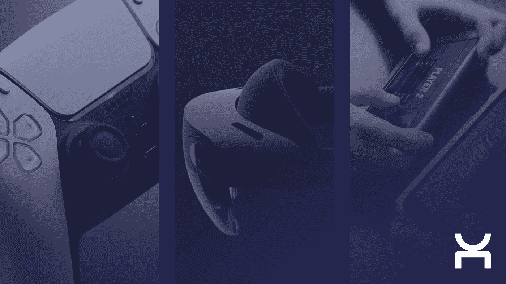

# 移动触觉:Android 和 iOS 的最佳实践

> 原文：<https://medium.com/nerd-for-tech/haptics-for-mobile-the-best-practices-for-android-and-ios-d2aa72409bdd?source=collection_archive---------11----------------------->

触觉市场发展非常迅速，是新技术中最有前途的领域之一。然而，用户体验还没有得到应有的研究。

在我们每天使用的设备中，我们的智能手机可能是我们花费更多时间的设备。它在任何情况下都会跟着我们，从早上的打盹到晚上在床上查看最新消息。

从开发人员的角度来看，您与应用程序交互和接收反馈的方式极其重要，因为它会影响整个用户体验，无论您是否意识到这一点。不管是有意识的还是无意识的，如果用户体验流畅且设计良好，你会更喜欢使用一个应用。

例如，我们已经研究并详述了[触觉反馈对于移动游戏世界](https://www.interhaptics.com/blog/2021/04/01/mobile-gaming-ux-how-haptic-feedback-can-change-the-game/)中用户体验的重要性。但对于所有移动应用程序和任何移动环境(例如，通知)也是如此。

## 移动触觉的最佳实践

为了充分利用您的移动触觉并增强您的用户体验，您应该遵循以下指南。

**首先**，分析用户行为，确定你的触觉技术在用户体验方面可以满足哪些需求。

**第二**，你需要知道用户完成目标任务需要采取的确切步骤。

**第三**，决定什么类型的触觉反馈最有效，以及何时添加。你正在设计的触觉模式必须适合这种情况，才能给用户带来真正的价值和正确的信息。它需要匹配用户收到的任何其他反馈(视觉和听觉)，以建立一个有凝聚力的体验。

**第四**，您已经准备好运行 A/B 测试来决定哪种设计模式最适合您的用例。

## 如何设计移动触觉？

**设计、迭代、播放**

[Interhaptics](https://www.interhaptics.com/products/haptics-for-mobile-and-ar) 不仅仅是一堆工具。这也是触觉开发者的一个社区。通过理论和实践教程、文档或讨论线索，您可以找到关于设计触觉的有用文档，以及它可以为特定用例带来的价值。

说到设计，Interhaptics 给你的是[触觉合成器](https://www.interhaptics.com/tools/haptic-composer)。这是最先进的触觉资产创建应用程序。你可以根据已知的振动和纹理感知精确地创建或修改你的触觉材料。

在移动设备上工作时，设计迭代可能会很麻烦，因为您每次都不得不将内容推送到您的设备上。为了解决这个问题， [Interhaptics](https://www.interhaptics.com/products/haptics-for-mobile-and-ar) 为 Android 和 iOS 提供了一个移动应用程序，你可以在手机上直接尝试你的触觉材料，允许快速测试迭代。

您也可以使用标准管道来构建您的项目。如果您使用 Haptic Composer 编辑项目中的素材，而无需重新链接任何内容，这些素材将会自动更新。

## **哪些互动带给你更多**

你可能已经注意到，在触觉设计和集成过程中，我们没有提到 Android 或 iOS 的特性。原因很简单，由于 Interhaptics 架构，不存在任何问题。

无论目标平台是什么，您都可以在 [Haptic Composer](https://www.interhaptics.com/tools/haptic-composer) 上设计您的模式，在 [Unity](https://unity.com/) 中创建您的内容，而无需关注特定的移动设备，并且您可以在播放内容的设备上获得最大化的体验。一些 Android 手机的性能会比其他手机好，但如果你愿意，你可以专门过滤哪个设备可以支持你的内容。

我们从 [XR 体验](https://www.interhaptics.com/products/haptics-for-vr-and-mr)中带来的另一个特点是空间触觉。纹理在我们的日常生活中，我们首先为虚拟现实建立了技术，但它在我们手机的 2D 屏幕上有明显的潜力。现在，你可以根据屏幕上滑块的位移，甚至根据游戏中玩家在特定表面上的移动来设计和集成触觉。

## 设计移动触觉的挑战

在过去的几年里，[苹果](https://www.apple.com/)凭借非常高质量的触觉技术，让应用和游戏开发者能够创作出引人入胜的内容。 [Android 的](https://www.android.com/)多样化的生态系统使得开发者更难获得同等质量的体验。

[inter haptics for Mobile&AR](https://www.interhaptics.com/products/haptics-for-mobile-and-ar)通过让您为 iOS 和 Android 的智能手机应用程序设计触觉反馈，为您带来解决方案。只需最少的代码，使用触觉技术立即增强您的移动增强现实(AR)应用程序和移动游戏，让用户沉浸其中并保持参与。

你所要做的就是下载 [Interhaptics for Mobile 软件包](https://www.interhaptics.com/products/haptics-for-mobile-and-ar#pricing)，在你的电脑上安装 Interhaptics 套件，并将 Interhaptics 播放器应用程序下载到你的手机上。

Interhaptics 也推出了它的[触觉迷你游戏](https://www.interhaptics.com/experience/haptic-mobile-games-demonstrator)应用。演示者包括五个不同的迷你游戏示例，您可以使用 Interhaptics for Mobile 软件包将触觉添加到您的智能手机应用程序中，其中包括四个使用触觉反馈改善用户体验的不同案例。您可以测试它们，以了解您可以使用[inter haptics for Mobile and Augmented Reality(AR)](https://www.interhaptics.com/products/haptics-for-mobile-and-ar)做些什么。

## 什么是交互触觉？

[Interhaptics](https://www.interhaptics.com/products/haptics-for-mobile-and-ar) 是一家专门从事触觉的软件公司。 [Interhaptics](https://www.interhaptics.com/products/haptics-for-mobile-and-ar) 为虚拟现实(VR)、混合现实(MR)、移动、增强现实(AR)和控制台应用提供手部交互和触觉反馈开发和部署工具。Interhaptics 的使命是促进可扩展的 haptics 生态系统的发展。 [Interhaptics](https://www.interhaptics.com/products/haptics-for-mobile-and-ar) 致力于为 VR/MR/AR、移动和控制台开发人员社区提供一流的开发工具，以及支持 haptics 的内容在任何支持 haptics 的平台上的互操作性。

如果您有一个移动游戏项目，并且希望将触觉反馈集成到您的应用程序中以增强您的内容，请在此下载 Interhaptics for Mobile and AR [。如果你有兴趣与 Interhaptics 合作，你可以联系我们](https://www.interhaptics.com/products/haptics-for-mobile-and-ar)[这里](https://www.interhaptics.com/contact)。

> 资源:
> 
> [https://medium . muz . Li/haptic-UX-the-design-guide-for-building-touch-experiences-84639 aa 4a 1 b 8](https://medium.muz.li/haptic-ux-the-design-guide-for-building-touch-experiences-84639aa4a1b8)
> 
> [https://medium . com/lofelt/the-keys-to-delivering-better-haptics-on-Android-f 502403 c 22e 7](/lofelt/the-keys-to-delivering-better-haptics-on-android-f502403c22e7)