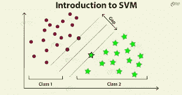
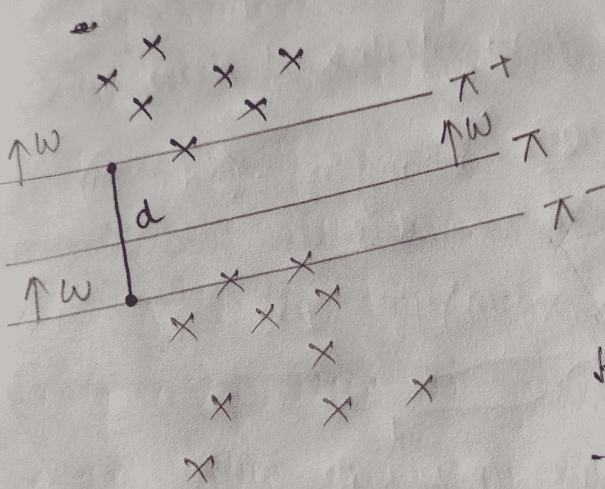
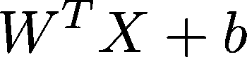
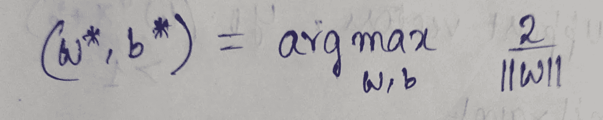
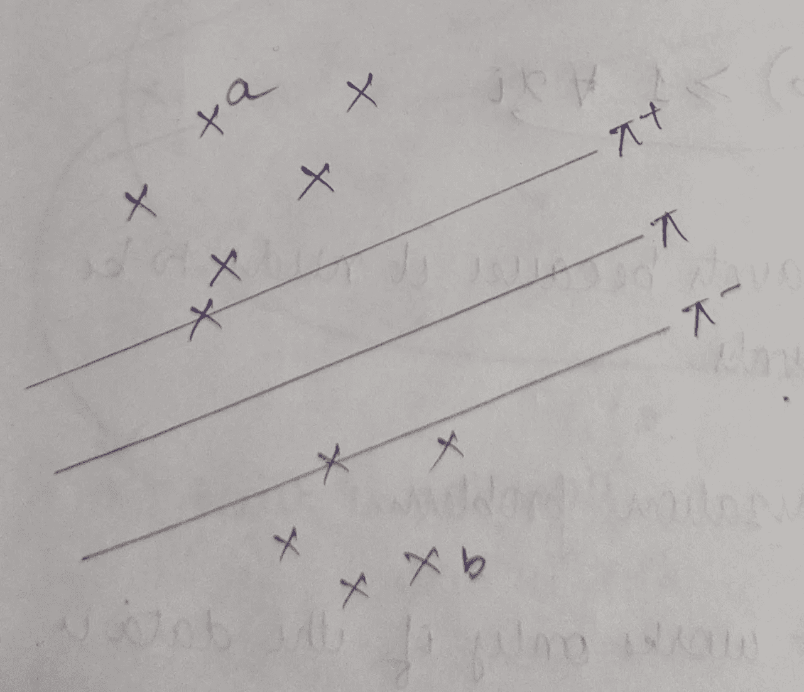
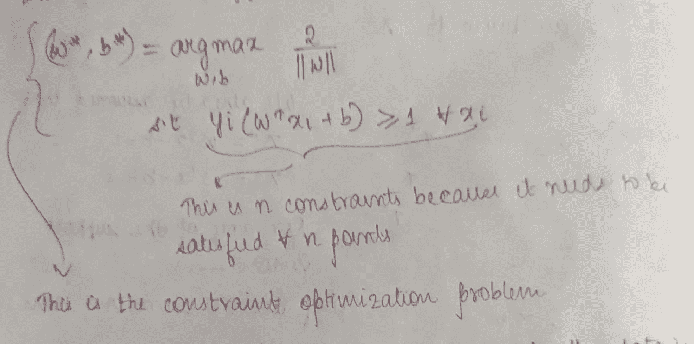

# 硬边界 SVM:数学公式

> 原文：<https://medium.com/nerd-for-tech/hard-margin-svm-mathematical-formulation-485ae12fefa9?source=collection_archive---------1----------------------->

到现在为止，我们已经知道了 SVM 是如何进行几何运算的，如果你还不知道，你可以看看这里。一旦我们理解了 SVM 的几何解释，就很容易理解 SVM 的工作，但是为什么要用数学公式呢？如果我们不仅很好地掌握了 SVM 的内部数学，而且掌握了任何 ML 模型的内部数学，那么我们将能够按照我们的要求改变模型。所以让我们详细了解一下 SVM 的数学

设我们有一些点，它们是进一步线性可分的。我们有一个超平面π将这两类分开，同时我们还有另外两个超平面π+和π-，正如我们在理解几何解释时所讨论的。π+和π-之间的距离 d 称为裕度。

超平面π的方程:

w^t = > w 的转置

这里 W 不一定是单位向量，它可以是任何向量

设π+ : (W^T)X + b =+1

π-: (W^T )X + b = -1

这里我们很多人可能会问，为什么取+1 或-1 的值，但实际上这不是我们应该关心的事情，因为这个值可以是任何值，不一定是+1 或-1。我们稍后将详细研究它。

现在我们需要计算上图中的边距值或 d 值

我们知道从一个点到一个平面或直线的距离由下式给出:

‖(w^t)p‖/w

所以从+ve 超平面到π的距离是:

‖(W^T)X + b ‖ / ‖W‖ = 1 / ‖W‖

这是从+ve 超平面到π的距离，所以我们还需要加上从-ve 超平面到π的距离

因此，margin (d) = 2 / ‖W‖

现在我们需要最大化这个裕量，并找到 w*和 b*(最大化裕量的 w 和 b 的值)，假设所有+ve 点在一侧，所有-ve 点在另一侧。

从数学上来说，我们可以把这个陈述写成:

除了这个等式，我们还要记住约束条件，即所有+ve 点都在一边，所有-ve 点都在另一边。

我们已经假设:

π+ : (W^T)X + b =+1

π-: (W^T )X + b = -1

从以上两个方程得出一些结论:

a)如果支持向量在π+上，那么对于那些点

i) y_i= +ve

二)(W^T)X + b = +ve

所以 y_i[(W^T)X +b] = +ve

b)如果支持向量在π上，那么对于那些点

我)y_i= -ve

二)(W^T)X + b = -ve

所以 y_i[(W^T)X +b] = +ve

对于两个支持向量，一个在π+上，另一个在π-上，y_i[(W^T)X + b]的值是+ve

如果我们取任何一点，假设 a。点‘a’肯定具有 y_i=+1，因为它是 a +ve 点，并且当它在+ve 超平面之上时,( W^T)X + b)的值将大于+1。所以对于点‘a’，y_i[(W^T)X + b]的值将大于+1

如果我们取任何一点，假设 b。点‘b’肯定具有 y_i=-1，因为它是一个-ve 点，并且由于它在-ve 超平面的更下方,( W^T)X + b)的值将小于-1。所以对于点‘b’，y_i[(W^T)X + b]的值将大于+1

因此，对于除支持向量之外的所有点，如果我们上面提到的约束得到满足，y_i[(W^T)X + b]将大于+1。因此，SVM 的约束优化问题可以定义为

这个公式的局限性是，当且仅当数据是线性可分时，它才有效。如果数据几乎是线性可分的，那么这个公式就不成立。这个公式被称为**硬边界 SVM** ，因为我们非常关心数据点的位置。

为了克服这个限制，我们有另一个公式叫做**软边际 SVM** ，即使数据不是完全线性可分的，这个公式仍然有效。