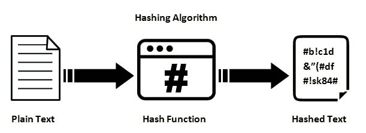
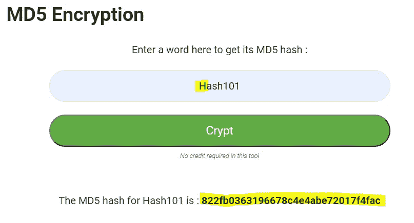
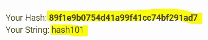
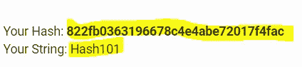
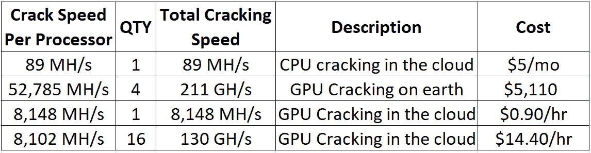

# 使用 GPU 101 的哈希破解

> 原文：<https://medium.com/nerd-for-tech/hash-cracking-using-gpu-101-70531bc0fbca?source=collection_archive---------2----------------------->


如果你正在阅读这篇文章，那么你一定知道 GPU 破解的热潮，那么什么是真正的 GPU 破解，为什么它比 CPU 破解更好？为什么比特币矿工都在用 GPU 破解那背后的原因是什么？以及为什么您应该学习 GPU 破解来帮助自己增长在道德黑客领域的知识。所有这些问题都将在本文中得到解答。

## 涵盖的主题:

*   **CPU 与 GPU 在计算上的对比**
*   **哈希是如何被破解的？**
*   **最佳工具**
*   **最便宜的 GPU 哈希破解方式**
*   **最佳词汇列表**

在潜入[破解](https://resources.infosecinstitute.com/topic/password-cracking-evolution/)之前，首先我们需要知道 CPU 破解和 GPU 破解的区别你需要知道它们是什么？

CPU 和 GPU 的主要区别在于，CPU 用于更快地执行广泛的任务，但仅限于可以运行的任务实例，而 GPU 则用于执行复杂的数学运算。GPU 可以同时运行数千个实例。

## 计算领域的 CPU 与 GPU

CPU 通常有 4 -8 个内核虽然 CPU 内核比 GPU 内核快得多，但 GPU 可以对多组数据执行并行指令，因为 GPU 有数百个内核。


[src](https://wiki.cdot.senecacollege.ca/wiki/DPS921/OpenACC_vs_OpenMP_Comparison)

GPU 可以比 CPU 更快地处理数据，因为它们是由数千个处理器内核同时运行而设计的，GPU 支持大规模并行，每个内核都专注于进行高效的计算。

GPU 运行在 1450 MHz，每秒可以破解大约 1 . 6 亿次 SHA-1 哈希(计算)。科学研究委员会

而 CPU(四核 2.4 GHz 英特尔酷睿 2)每秒可以实现大约**4800 万**次 SHA-1 散列。

所以我希望现在你知道为什么 GPU 破解优先于 CPU 破解了。

## **哈希是如何破解的？**

所以在学习破解散列之前，我们需要知道什么是散列，以及散列是如何产生的。

**什么是哈希？**



[src](https://networkencyclopedia.com/hashing-algorithm/)

散列函数是可用于将任意大小的数据映射到固定大小的值的任何函数，该固定大小的值可被称为散列。 [*维基百科*](https://g.co/kgs/5mjV1h)

散列是将字符串转换成通常较短的固定长度值或代表原始字符串的关键字。但是哈希**不能被恢复**到它们的原始形式，因为它发生在解密中(两者是完全不同的事情)。

哈希使其成为存储密码的更安全的方式。这种“明文”存储密码的不好的一面是，在攻击模型的情况下，它会引发一个漏洞，攻击者可以获得对服务器数据的*只读*访问。

如果网站易受 SQL 注入攻击，您的密码可能会以明文形式显示给攻击者。现在你知道为什么散列是重要的了。

**哈希破解**

哈希算法，如微软 LM 哈希、MD4、MD5、SHA、MySQL、Cisco PIX 等。对明文密码进行一系列数学运算(将其转换为整数格式),并生成固定长度的任意大小的数据，称为哈希。

有趣的是，如果你输入相同的值到哈希算法，它会产生相同的哈希，但即使你对你的值做了很小的改变，哈希也会完全不同。让我们看看它的实际效果。


请注意，当我将小写的“H”改为大写的“H”时，哈希值之间的差异。



密码就是这样被散列的，但是使用了不同的和更强的算法。所以不要用弱哈希算法！

好了，这里有一个问题，如果我们复制哈希值，并在 md5 解密器中解密，它将返回原始值。



因此，哈希算法所做的是，用字典中的不同组合对每个单词进行哈希运算，并将这些哈希与我们给定的哈希进行比较，直到两个哈希都匹配，然后向我们显示输出(这是我们的原始哈希)。

基本上，它是蛮力散列，直到它找到匹配我们给定散列的原始散列，因此解密它。请记住，要解密一个散列，单词列表应该包含您试图解密的值，或者应该使用每种可能的组合来解密该散列。

这就是为什么为了更快地破解哈希，你需要更多的计算能力，这是由 GPU 提供的，因为 GPU 的每个核心都专注于进行高效的计算。

您可以使用该工具以有趣的方式了解哈希破解， [CyberChef](https://gchq.github.io/CyberChef)

所以现在你知道哈希是如何破解的，为什么 GPU 更擅长破解密码。

## **最佳工具**

你们中的一些人可能已经猜到了什么是最好的工具，很明显，它是 [**Hashcat**](https://hashcat.net/hashcat/) **。**

Hashcat 是世界上最快和最先进的密码恢复工具，支持超过 300 种高度优化的哈希算法的五种独特的攻击模式。 [*哈希卡特*](https://github.com/hashcat/hashcat)

hashcat 最大的优点是它可以利用 GPU 进行更有效的哈希破解。你可以在这里找到 hashcat [的用法。你应该考虑学习这个工具，从长远来看它能帮助你。](https://hashcat.net/hashcat/)

## GPU 哈希破解最便宜的方法

现在最重要的一点来了，如果你没有 GPU，你可以从哪里以最便宜的方式获得它呢？

最好的方法是获得一个 GPU，但如果你没有预算，你可以从出售云计算的服务中购买，如 [AWS 云服务](https://aws.amazon.com/marketplace/pp/B07CQ33QKV?ref=recommended&m=model_BI)。



但是，如果你短期使用云计算，你可以从中受益。如果你长期使用云计算，你不会想把所有的钱都花在云上。如果长期是你的主要目标，那就把自己变成一个破解站吧。

请记住，我不赞成你用这里给出的信息做任何非法活动，也不支持这种行为。

## 最佳词汇列表

现在，对于你的破解之旅，你需要一个好的单词表，将来你可能会有自己的单词表，但这只是个开始。

你可以从一个专门研究密码解密的网站下载一些 Hashcat 的最佳词汇表。

[Crackstations 单词表](https://crackstation.net/crackstation-wordlist-password-cracking-dictionary.htm)是 Linkedin 和其他网站的历史密码哈希泄露的结果。我最喜欢的来自 Crackstation 的单词表是 real human-small 我喜欢这个单词表，因为它包含了一个已经在网上泄露的真实人类密码的列表。

你可以在这个路径下找到 kali Linux 中的单词表

```
cd /usr/share/wordlists
```

你可以用这些单词表来破解哈希表。

所以你有它使用 GPU 101 哈希破解我希望这里给出的信息很容易消化，如果它是这样一个有趣的信息，请确保你跟随我。