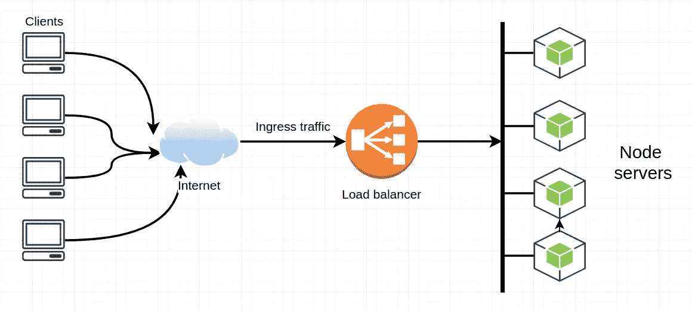

# 负载平衡上下文中的哈希

> 原文：<https://medium.com/nerd-for-tech/hashing-in-context-of-load-balancing-392b317fe40e?source=collection_archive---------4----------------------->

需要理解的一个稍微棘手的概念是负载平衡上下文中的散列。

为了理解这一点，请查看一下 [**哈希在概念层面上如何工作**](https://www.cs.cmu.edu/~guna/15-123S11/Lectures/Lecture17.pdf) 。**TL；DR** 是哈希将输入转换成固定大小的值，通常是整数值(哈希)。

一个好的哈希算法的关键原则之一是函数必须是 [**确定性的**](https://en.wikipedia.org/wiki/Hash_function#Deterministic) ，这是一种很好的说法，即相同的输入在传递给函数时会产生相同的输出。因此，确定性意味着—如果我传入字符串“Hello”(区分大小写)，并且函数生成 11002 的散列，那么每次我传入“Hello”时，它都必须生成整数“11002”。如果我传入“hello ”,它将生成一个不同的数字(始终如一)。

您可能想知道如何处理散列函数为多个输入生成相同散列的情况——这并不是世界末日，有很多方法可以处理它。事实上，唯一输入的范围越大，可能性就越大。但是当一个以上的输入确定性地产生相同的输出时，这被称为**冲突**。

处理冲突的几种方法有**链接、重新散列、线性探测、二次探测。在继续之前，请随意阅读它们**

这里我们将只讨论使用散列法的**服务器选择，尽管还有其他方法..**

# 基于 IP 哈希的服务器选择

您可以配置您的负载平衡器来[散列](https://www.cs.cmu.edu/~adamchik/15-121/lectures/Hashing/hashing.html)传入请求的 IP 地址，并使用散列值来确定将请求定向到哪个服务器。如果我有 5 个可用的服务器，那么散列函数将被设计为返回 5 个散列值中的一个，因此其中一个服务器肯定会被指定来处理请求。

当您希望来自某个国家或地区的请求从最适合满足该地区需求的服务器获取数据时，或者当您的服务器缓存请求以便快速处理请求时，基于 IP 哈希的路由非常有用。

在后一种情况下，您希望确保请求发送到之前缓存了相同请求的服务器，因为这将提高处理和响应该请求的速度和性能。

如果您的每台服务器都维护独立的缓存，并且您的负载平衡器没有一致地向同一台服务器发送相同的请求，那么您最终将会发现服务器重复了之前向另一台服务器发送请求时已经完成的工作，并且您会失去缓存数据的优化。

在我们继续之前，我想指出，使用散列法选择服务器只是所讨论的方法之一，还有其他一些方法，如**循环法、加权循环法、基于负载的服务器选择、基于路径或服务的选择、混合包等……**

## LB 中路由的散列法:

牢记以上知识，让我们将它应用于路由和定向请求到服务器。假设您有 4 台服务器来分配负载。一个容易理解的方法是散列传入的请求(可能是通过 IP 地址，或者一些客户端细节)，然后为每个请求生成散列。然后对这个散列应用模操作符，其中右边的操作数是服务器的数量。



```
request#1 => hashes to 34
request#2 => hashes to 23
request#3 => hashes to 30
request#4 => hashes to 14

// You have 4 servers => [Server A, Server B ,Server C ,Server D]

// so modulo 4for each request...

request#1 => hashes to 34 => 34 % 4= 3=> send this request to servers[4] => Server D

request#2 => hashes to 23 => 23 % 4= 2=> send this request to servers[2] => Server B

request#3 => hashes to 30 => 30 % 4= 4=> send this request to  servers[4] => Server D

request#4 => hashes to 14 => 14 % 4= 3=> send this request to servers[3] => Server C
```

如您所见，哈希函数生成了一系列可能的值，当应用模运算符时，它会产生一个较小范围的映射到服务器号的数字。

您肯定会得到映射到同一个服务器的不同请求，这很好，只要在所有服务器的整体分配中存在“[一致性](https://en.wikipedia.org/wiki/Hash_function#Uniformity)”。

# 添加服务器和处理故障服务器

那么，如果我们向其发送流量的服务器中有一台死机了，会发生什么呢？哈希函数(参考上面的伪代码片段)仍然认为有 5 台服务器，mod 操作符生成一个 0–4 的范围。但我们现在只有 4 台服务器，其中一台出现故障，我们仍在向它发送流量。哎呀。

相反，我们可以添加第六个服务器，但这将*永远不会*获得任何流量，因为我们的 mod 操作符是 5，它永远不会产生一个包括新添加的第六个服务器的数字。双重哎呀。

```
/ Let's add a 5th server
servers => [Server A, Server B ,Server C ,Server D ,Server E]

// let's change the modulo operand to 5
request#1 => hashes to 34 => 34 % 5= 3=> send this request to servers[3] => Server D

request#2 => hashes to 23 => 23 % 5= 4=> send this request to servers[4] => Server E

request#3 => hashes to 30 => 30 % 5= 0 => send this request to  servers[0] => Server A

request#4 => hashes to 14 => 14 % 5= 1=> send this request to servers[1] => Server B
```

我们注意到在应用 mod 之后服务器号发生了变化(尽管，在这个例子中，

实际上，结果是请求现在被一起路由到新的服务器，我们失去了之前在服务器上缓存数据的**优势。**

例如，让我们假设请求#4 过去发送到服务器 E，但现在发送到服务器 c。由于请求现在发送到服务器 c，所以服务器 E 上与请求#4 相关的所有缓存数据都没有用。您可以计算一个类似的问题，如果您的一个服务器停止运行，但 mod 函数继续向它发送请求。

在这个微小的系统中，这听起来微不足道。但是在非常大规模的系统中，这是一个很差的结果。#系统设计失败。

很明显，一个简单的散列分配系统不能很好地伸缩或处理故障。

# 一种流行的解决方案——一致散列法


不幸的是，这是我觉得文字描述还不够的部分。一致散列最好用视觉来理解。

正如我们所讨论的，简单散列的关键问题是

(A)服务器发生故障，流量仍然被路由到该服务器，

和

(B)您添加了一个新的服务器，分配可能会发生很大的变化，从而失去了以前缓存的优势。

在深入研究一致性哈希时，有两件非常重要的事情需要记住:

1.  一致散列法*不能消除问题*，尤其是 b。但是它确实减少了很多问题。起初，您可能想知道一致性哈希有什么大不了的，因为潜在的缺点仍然存在——是的，但程度要小得多，这本身就是对超大规模系统的一个有价值的改进。
2.  一致散列将散列函数应用于传入的请求*和服务器*。因此，结果输出落在设定的值范围(连续体)内。这个细节很重要。

当你观看下面推荐的解释一致散列的视频时，请记住这些，否则它的好处可能不明显。

我强烈推荐这个视频，因为它嵌入了这些原则，而不会给你带来太多的细节负担。

## 这是一篇比平常稍长的帖子，但是如果你已经读到这里，那么你应该得到它🍪

**一如既往…**

