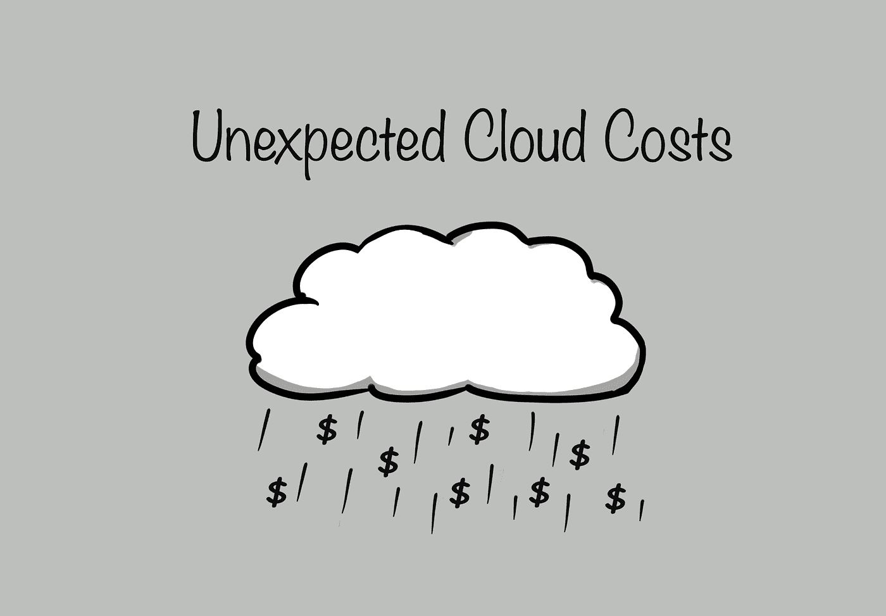
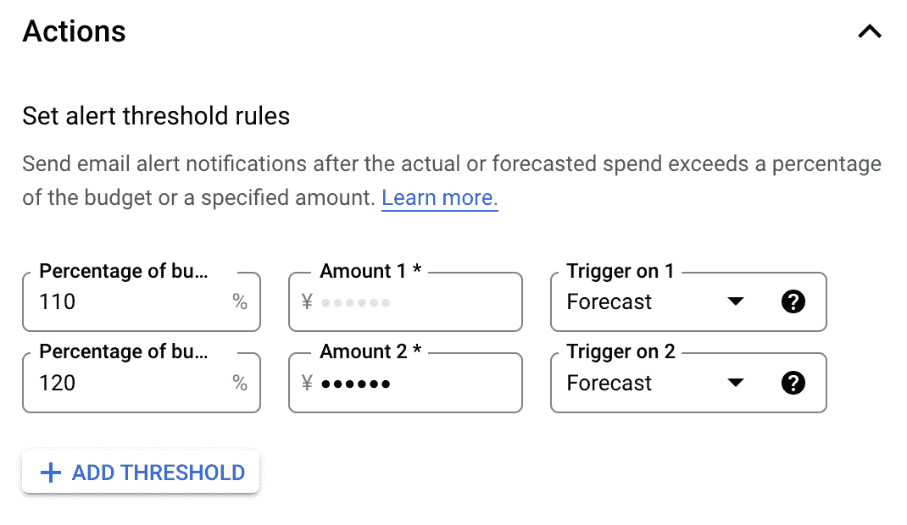
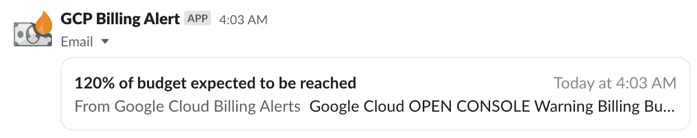
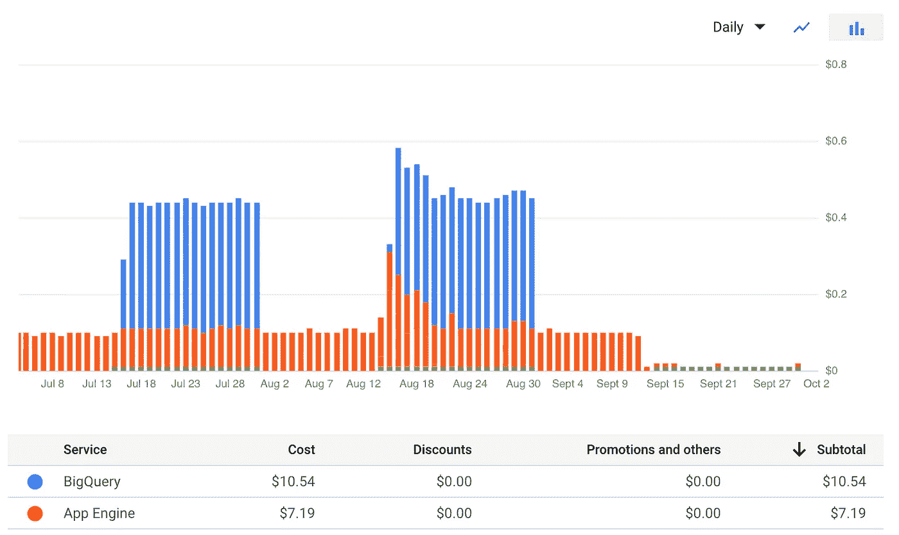
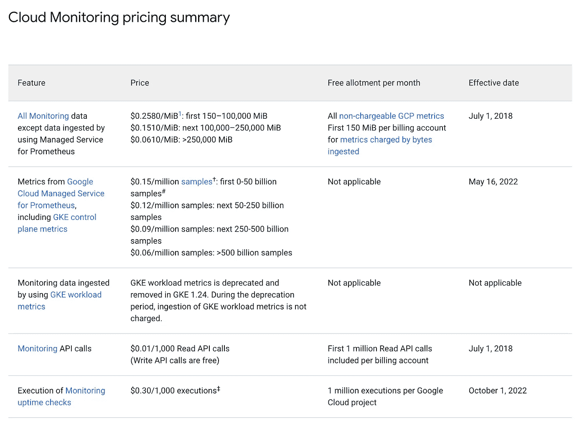

# 您是否已经为您的云项目设定了预算？它每天为我们节省了 40 美元

> 原文：<https://medium.com/nerd-for-tech/have-you-set-a-budget-for-your-cloud-project-yet-it-saved-us-40-a-day-a5a9899a7946?source=collection_archive---------1----------------------->

自己维护服务器工作量很大。云服务通常在成本和工作量方面更胜一筹，除非你运气不好，没有安全控制措施。

我最近参与的一个云项目的成本突然毫无预警地一天增加了 40 美元。幸运的是，我们有一个预算，得到了警报，并可以立即解决问题。

# 立即添加预算

如果你还没有为你的项目设定预算，现在停止阅读，去添加它。我会等的。

完成了吗？干得好！

让我感到惊讶的是，在创建一个新的云项目时，设置预算并不是一个必须的步骤。成本可能会如此迅速地上升，我不认为任何人会从中受益(我确信无意的使用和成本也会伤害云提供商)。

举个例子，我知道有一个项目违反了凭证。攻击者使用该帐户做了一些事情(可能是挖掘密码或刮擦),并且花费极高。

# 预算应该花费的费用

预算通常是你能花多少钱。但是当我们为云项目设定预算时，它应该被设定为我们需要花费多少的警报。

如果没有必要，我们不应该用那笔钱；只要有可能，我们应该尽量减少它。

设定预算的最简单方法是查看一天的基础设施运行情况。乘以一个月的天数。这是您的系统继续运行所需的预算。

很有可能，你很快意识到你负担不起，你可以优化一些部件来降低成本。如果你能负担得起，而且对你来说也不意外，你的团队已经做得很好了！

如果超出了预算，你会想马上知道。因为如果是这样，你可能会亏本经营。如果不是为了你自己，你越早做出反应，你的雇主肯定会感激你的。

# 为您的预算配置警报

只有当你冒险超出预算时，你得到通知，预算才有帮助。

在我参与的这个项目中，我增加了 40 美元，这要感谢一个警报，当每月预期成本超过上个月预算的 110%时就会触发该警报。

这种设置允许随着用户和使用量的增加，预算逐月缓慢增加。然而，如果增长太快，你会马上得到警告。

Google Cloud 中设置的警报示例(金额被有意掩盖)

谷歌云平台允许通过发布/订阅以及电子邮件通知进行高级计费通知。使用它，你可以编写自己的通知或触发器，但是，以我的经验，一封简单的电子邮件就足够了。与 [Slack 电子邮件应用](https://styler.slack.com/apps/A0F81496D-email?tab=more_info)一起，这些电子邮件通知也可以在 Slack 中发出。

使用 slack 电子邮件应用程序和 Gmail 转发给 Slack 的计费提醒电子邮件示例

# 什么会导致成本飙升？

如上例所示，最糟糕的成本高峰来自非法或恶意使用。例如，如果有人抓取您的内容或执行拒绝服务(DOS)攻击。

但是，出现峰值还有更普遍、更不明显的原因。根据我最近的经验，由于使用和价格的变化。

# 因使用而涨价

虽然这是最不令人担忧的峰值，因为它意味着人们正在使用你的产品，但这是一个必须管理的成本。

我在我的任何项目中都使用 Firebase 免费层。它很好，但很快就用完了，你最终要付钱。

下图显示了 BigQuery 的成本，一旦空闲层用完，big query 会在月中突然启动。

免费层用完之后，BigQuery 成本开始堆积的一个例子

# 由于价格变化而增加

虽然我们希望您能及时得到通知并做好准备，但是很容易错过定价的变化。即使你被告知，也很难知道它是否以及如何影响你。

由于价格变化，我写了这篇文章。我仍然没有找到任何价格变化的通知，但从 10 月 1 日起，GCP 正常运行时间检查价格发生了变化。

一旦使用了免费层，这导致我们的项目每天额外花费 40 美元。

从[堆栈驱动程序定价页面](https://cloud.google.com/stackdriver/pricing)

仔细监控云提供商的价格更新有助于避免意外，但有些东西最终会溜走。当他们这样做的时候，你会想要有一个预算，这样你就可以很快抓住它并做出反应。

# 不要没有预算就去

我希望这篇文章有助于强调为什么有一个预算是重要的。只需要几分钟就可以设置好，而且可以节省很多钱。

感谢您的阅读。我希望它有帮助。稍后我会添加一些额外的帖子，介绍如何降低成本以及在出现峰值时进行故障排除。

如果您有任何问题，请随时联系我们。