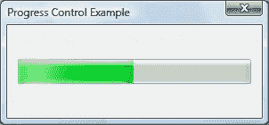
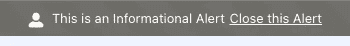
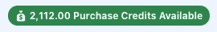
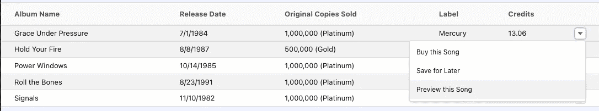
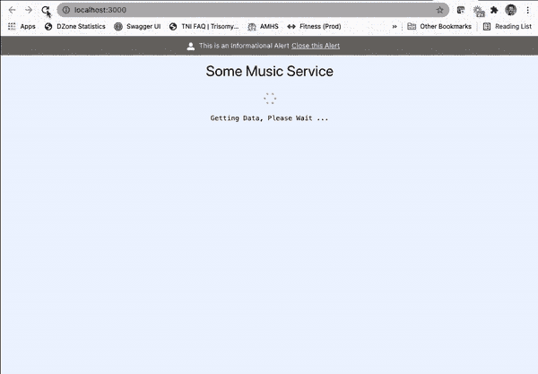

# 享受 React 的闪电设计系统

> 原文：<https://medium.com/nerd-for-tech/having-fun-with-the-lightning-design-system-for-react-d62f2f45c973?source=collection_archive---------4----------------------->


我记得我第一次在我构建的应用程序中利用一个组件。那是 20 世纪 90 年代，我正在为一家大型保险公司开发基于 Windows 的应用程序。与客户一起提供有价值的东西的经历让我内心激动不已，这让我确信自己做出了正确的职业选择。

我毫不费力地引入了一个进度条，以便在长时间运行的任务处理数据时提供愉快的用户体验。下面是同一时间段的进度条控件示例:



虽然进度条现在可能看起来不那么令人印象深刻，但与我在早期版本中使用的基于文本的进度方法相比，这种变化是一个巨大的改进。我发现仅仅在屏幕上显示`*** 50% complete ***`并不那么令人兴奋。

尽管从那时起，应用程序开发过程的很大一部分已经发生了变化，但我仍然发现自己在应用程序中利用组件和框架来提供更好的用户体验。事实上，从 2021 年开始，我就一直努力按照以下的使命宣言生活:

> “将您的时间集中在提供扩展您知识产权价值的特性/功能上。将框架、产品和服务用于其他一切。”
> 
> J.韦斯特

在本文中，我将展示 [Lightning 设计系统](https://www.lightningdesignsystem.com/) (LDS)如何允许开发人员使用由 [Salesforce 工程](https://engineering.salesforce.com/)免费提供的一系列生产就绪组件。

从用户界面/UX 的角度来看，LDS 提供了以下特性:

*   无障碍(AA 级 WCAG 标准)
*   响应范围广泛的设备
*   附带大量图标和图形资源。
*   使用 CSS 属性可自定义/主题化

通过利用这些组件，在 [React](https://reactjs.org/) 中开发应用程序的特性团队可以专注于满足他们的产品所有者所要求的业务需求。

# React 的闪电设计框架

React 的 [Lightning 设计框架](https://react.lightningdesignsystem.com/)(React 的 LDS)允许使用 React 框架的开发人员将在 Salesforce 中流行的相同组件包含到他们的应用程序中。这些组件是为快速构建新想法原型而设计的。因为它们经过了 Salesforce 平台的大量测试和验证，所以这些组件是生产就绪的。

事实上，React 的 LDS 吸收了 LDS 的优点(如上所述),并将所有东西方便地包装到 React 层中，以提供随时可用的动态组件。Salesforce 去掉了样板代码，因此您不必手动实施 LDS 蓝图并为您负责测试。

# 创建新的 React 应用程序

阅读关于 Lightning 设计框架的内容让我很兴奋，我想看看在 Salesforce 之外使用这些组件有多简单。请记住，我主要是一名服务层开发人员。*因此，无论如何想象，我在 JavaScript 客户端框架方面的技能都不被认为是“专家级”的。*

使用我的 MacBook Pro，我通过使用以下命令执行 [Create React App](https://create-react-app.dev/) CLI 的 v2，开始了创建名为`having-fun-with-the-lightning-design-system`的新 React 应用程序的过程:

`npx create-react-app having-fun-with-the-lightning-design-system`

我的例子的上下文是一个音乐服务，用户可以使用积分购买他们喜欢的艺术家的专辑。我选择了加拿大乐队 [Rush](https://en.wikipedia.org/wiki/Rush_(band)) 的几张专辑作为样本数据。

接下来，我导航到以下 URL，它解释了如何更新 webpack 配置以便将 Lightning 设计框架安装到应用程序中:

[https://github . com/sales force/design-system-react/blob/master/docs/create-react-app-2x . MD](https://github.com/salesforce/design-system-react/blob/master/docs/create-react-app-2x.md)

这些指令也包含在我的个人 GitLab 库的 README.md 中，包括以下步骤:

1.  在 React 应用程序中安装并配置`react-app-rewired`依赖项
2.  将`design-system`和`design-system-react` Salesforce 依赖项安装到 React 应用程序中。
3.  将一系列元素复制到 React 应用程序的`./public`文件夹中。
4.  更新 React 应用程序的`index.html`以包含`salesforce-lightning-design-system.min.css`样式表文件。
5.  更新 React 应用程序的`index.js`，将`<App />`元素包装在< `Icon Settings>`元素中。

完成这些步骤后，我执行了`npm ci`命令，以确保所有必需的依赖项都已安装并准备好。

# 添加 Lightning 设计框架组件

React 核心应用程序就绪后，我想使用以下 Lightning 设计框架组件:

*   [警报](https://react.lightningdesignsystem.com/components/alerts/)
*   [旋转器](https://react.lightningdesignsystem.com/components/spinners/)
*   [徽章](https://react.lightningdesignsystem.com/components/badges/)
*   [数据表](https://react.lightningdesignsystem.com/components/data-tables/)
*   [审判栏](https://react.lightningdesignsystem.com/components/trial-bars/)

为了简单起见，我决定将这个应用程序的数据作为一个静态数组包含在 JavaScript 中。我还计划使用一个`setTimeOut()`计时器来让 spinner 表现得好像从远程服务加载了什么东西。为了简单起见，我在 Create React App CLI 已经创建的`App.js`文件中修改了所有代码

## 添加警报

警报提供了在应用程序顶部向最终用户显示信息的能力。我可以使用下面的代码在`render()`函数中创建一个警报:

```
{this.state.showAlert &&
<div>
  <AlertContainer>
    <Alert
      icon={<Icon category="utility" name="user"></Alert>}
      labels={{
        heading: 'This is an Informational Alert',
        headingLink: 'Close this Alert',
      }}
      onClickHeadingLink={() => this.closeAlert()}
    />
  </AlertContainer>
</div>
}
```



呈现代码依赖于 showAlert 布尔属性的值，该值在应用程序启动时被初始化为 true:

```
state = {
  showAlert: true,
  ...
```

单击“关闭该警报”链接会触发`App.js`文件 JavaScript 部分的`closeAlert()`函数，使警报不再显示:

```
closeAlert() {
  this.setState({showAlert: false});
}
```

## 模拟旋转器

我在`App.js`文件中添加了一个名为`showSpinner`的简单布尔值，并包含以下计时器代码来模拟等待服务请求完成:

```
state = {
  ...
  showSpinner: true,
  ...componentDidMount() {
  this.timer = setTimeout(
    () => {
      this.setState({showSpinner: false});
    },
    3000,
  );
  }
```

三秒钟后，我们将`showSpinner`属性的值设置为`false`，这将导致微调器不再显示。将微调器添加到应用程序非常简单:

```
{this.state.showSpinner &&
<div style={{marginTop: 10, position: 'relative', height: '5rem'}}>
  <Spinner
    size="small"
    variant="base"
    assistiveText={{label: 'Getting Data, Please Wait ...'}}
  ></Spinner>
</div>
}
```


对于剩余的组件，我采用了这样的规则，即只有当`showSpinner`布尔值被设置为`false`时，它们才会显示。这将模拟在检索数据时显示微调器的典型功能。检索之后，微调器消失，应用程序内容——使用徽章、数据表和试用栏呈现——变得可用。

## 添加徽章

我添加了徽章组件来提供用户剩余可用积分的摘要。下面列出的几行代码提供了一个徽章(其中也包含一个钱袋图标),告知最终用户有 2，112.00 个信用点可用于购买音乐:

```
<div style={{marginTop: 10}}>
  <Badge
    id="badge-base-example-success"
    color="success"
    content="2,112.00 Purchase Credits Available"
    icon={
      <Icon
        category="utility"
        name="moneybag"
        size="xx-small"
        colorVariant="base"
      ></Badge>
    }
   />
</div>
```



## 包括一个数据表

使用静态数据数组，我创建了一个风格优美的数据表，它不仅显示了每张专辑的信息，还包括购买、保存和预览艺术家发行的专辑的操作链接。



`App.js`中的`render()`函数包含如下所示的数据表代码:

```
<div style={{marginTop: 25, overflow: 'auto'}}>
  <DataTable
    items={this.state.items}
    id="DataTableExample-music"
    striped
  >
    <DataTableColumn key="album" label="Album Name" property="albumName"></DataTableColumn>
    <DataTableColumn key="release-date" label="Release Date" property="releaseDate"></DataTableColumn>
    <DataTableColumn key="sales" label="Original Copies Sold" property="sales"></DataTableColumn>
    <DataTableColumn key="label" label="Label" property="label"></DataTableColumn>
    <DataTableColumn key="credits" label="Credits" property="credits" right="right"></DataTableColumn>
      <DataTableRowActions
        options={[
          {
            id: 0,
            label: 'Buy this Song',
            value: '1',
          },
          {
            id: 1,
            label: 'Save for Later',
            value: '2',
          },
          {
            id: 2,
            label: 'Preview this Song',
            value: '3',
          }
        ]}
      onAction={this.handleRowAction}
      dropdown={<Dropdown length="3"></DataTableRowActions>}
    />
  </DataTable>
</div>
```

这段代码利用了一个 items 数组，该数组遵循下面提到的设计:

```
[
  {
    id: '0',
    albumName: 'Grace Under Pressure',
    releaseDate: '7/1/1984',
    sales: '1,000,000 (Platinum)',
    label: 'Mercury',
    credits: 13.06
  },
  ...
```

选择其中一个操作项后，当前代码仅将操作和项数据记录到 JavaScript 控制台:

```
handleRowAction = (item, action) => {
  console.log(item, action);
};
```

## 显示试用栏

最后，我使用下面的代码将试用栏添加到了`render()`函数中:

```
<div style={{marginTop: 25}}>
  <TrialBar
    labels={{timeLeft: '15', timeLeftUnit: 'days'}}
    onRenderActions={() => (
      <Button variant="success" label="Subscribe Now"></Button>
    )}
  >
  <div style={{marginTop: 15}}>Never miss another deal again, press the <strong>Subscribe Now</strong> button to get started today.
  </div>
  </TrialBar>
</div>
```


# 运行 React 应用

组件就绪后，我的 IntelliJ IDEA 客户机没有提供任何错误或警告，我用下面的命令启动了 React 应用程序:

`npm start`

编译完代码后，我可以用指向 [http://localhost:3000](http://localhost:3000/) 的浏览器查看应用程序。它看起来是这样的:



当应用程序加载时，将显示 alert 组件以及微调器。几秒钟后，微调器被隐藏，而徽章、数据表和试用栏组件出现。

我能够消除警报组件，它提供了应用程序标题文本的一瞥。我在不到一个小时的时间内完成了所有这些工作，我相信对于专注于构建 React 应用程序的特性开发人员来说，这要快得多。

# 结论

在这篇文章的引言中，我提到了能够为我的客户提供有价值的东西的激动。一晃 30 年过去了，当有机会用我的技能和专业知识帮助解决商业问题时，我仍然会感到兴奋。事实上，当我找到机会与那些准备开始(甚至改变)职业生涯的人交谈时，我总是提供指导，将“找到你的激情”放在标准的中心。如果你在你所做的事情中找到激情，工作质量和财务目标肯定会随之而来。

在之前的系列文章中，我重点介绍了如何通过 [Spring Boot 服务](/nerd-for-tech/leveraging-salesforce-without-using-salesforce-8ed8c2556926)和用[苗条](/nerd-for-tech/leveraging-salesforce-using-a-client-written-in-svelte-93b431a15bf4)、 [Vue.js](/nerd-for-tech/leveraging-salesforce-using-a-client-written-in-vue-js-e94dc0e19057) 、[反应本地](/nerd-for-tech/leveraging-salesforce-using-mobile-applications-written-once-in-react-native-8f646a82774)和[角度](/nerd-for-tech/leveraging-salesforce-using-a-client-written-in-angular-36fe949ef69b)编写的客户端应用程序来使用 Salesforce 平台。该系列的每篇文章都提供了与 Salesforce 生态系统交互的不同体验。

在本文中，我采用了不同的方法来使用 Salesforce 提供的丰富组件，用于可能与 Salesforce 服务没有任何联系的 React 应用程序。我很快就能够包含提供惊人用户体验的组件。这也帮助我与我的 2021 年使命宣言保持一致，利用高质量的组件集合，以便专注于满足业务需求。

我的下一篇文章将更进一步，介绍一个基于 React 的 Lightning 设计框架的定制组件。一旦准备好，我将展示如何轻松地将这个组件添加到 React 应用程序中。

如果您对本文的源代码感兴趣，只需导航到 GitLab 上的以下资源库:

[https://git lab . com/johnj vester/having-fun-with-the-lightning-design-system](https://gitlab.com/johnjvester/lightning-design-system)

祝你今天过得愉快！