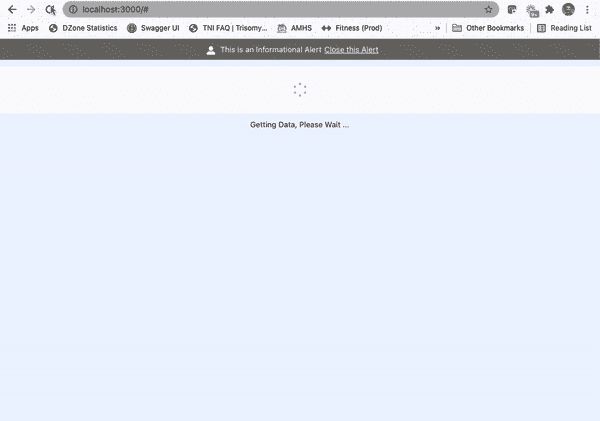

# 使用 Lightning Design System for React 创建组件的乐趣(更多)

> 原文：<https://medium.com/nerd-for-tech/having-more-fun-creating-components-with-the-lightning-design-system-for-react-d49933428d82?source=collection_archive---------1----------------------->


在“[享受 React](/nerd-for-tech/having-fun-with-the-lightning-design-system-for-react-d62f2f45c973) 的 Lightning 设计系统”中，我使用 React 的 [Lightning 设计框架创建了一个 React 应用程序，快速添加了几个组件，以便提供令人印象深刻的用户体验。](https://react.lightningdesignsystem.com/)

下图展示了在一个下雨的周日下午，我在不到一个小时的时间里创作的作品:



在本文中，我将改进我在等待从我的虚构服务中检索数据时使用的方法。

# 旋转棒极了，但是…

React 的 Lightning 设计框架提供了几种方式来告知用户某些操作仍在处理中。我一直很喜欢 spinner 的外观和感觉，并且很高兴看到 Salesforce 工程团队提供了它。

在我的例子中，我喜欢向用户提供额外的信息来传达“为什么”微调器是活动的。我的意思是，因为系统仍在检索数据，所以旋转器是活动的吗？还是发生了意想不到的事情，现在事情处于卡住状态？

没有在旋转器旁边提供上下文，客户很难知道旋转器应该旋转多长时间……嗯，你知道……旋转。

在上图中，您可以看到微调器下方的“正在获取数据，请稍候…”文本。在我的例子中，我们期望 spinner 只旋转足够长的时间来检索数据。

因为开箱即用的微调器不包括显示文本的选项，所以我最终使用了以下原始设计的代码:

```
{this.state.showSpinner &&
<div style={{marginTop: 10, position: 'relative', height: '5rem'}}>
  <Spinner
    size="small"
    variant="base"
    assistiveText={{label: 'Getting Data, Please Wait ...'}}
  />
</div>
}{this.state.showSpinner &&
<div style={{marginTop: 10}}>Getting Data, Please Wait ... </div>
}
```

上面的结果代码包括当 this.state.showSpinner 属性为真时显示 spinner，但还需要显示另一个

来包含我想要传达给用户的文本消息。

这是可行的，但是每次微调器需要包含文本时，需要使用两个单独的元素。

我知道一定有更好的方法。

# 钻研蓝图

Salesforce 工程团队不仅为 React 提供了 Lightning 设计框架，还公开了驱动这些组件设计的[组件蓝图](https://www.lightningdesignsystem.com/components/overview/)。组件蓝图是框架无关的、可访问的 HTML 和 CSS——用于结合实现指南创建组件。

例如，使用 spinner 组件，[蓝图](https://www.lightningdesignsystem.com/components/spinners/)提供了使用基本 HTML 和 CSS 创建 spinner 所需的一切:

```
<div class="demo-only demo-only_viewport" style="height:6rem;position:relative">
  <div role="status" class="slds-spinner slds-spinner_medium">
    <span class="slds-assistive-text">Loading</span>
    <div class="slds-spinner__dot-a"></div>
    <div class="slds-spinner__dot-b"></div>
  </div>
</div>
```

现在，我可以使用这些信息从核心蓝图文档中创建一个定制组件。

# 创建自定义组件

对于我的用例，我想在激活时在微调器下面包含一条文本消息，以便交流与微调器相关的信息。

在上一节中，我找到了我打算使用的 spinner blueprint 代码，并决定创建一个 React 组件来将对象分组在一起。

在 IntelliJ 中，我创建了一个名为`SpinnerWithDescription.js`的新文件，其中包含以下信息:

```
function SpinnerWithDescription(props) {
    return (
        <div className="slds-m-top_medium">
            <div className="slds-align_absolute-center slds-p-top_medium">
                <Spinner size="small"
                         variant="base"
                         assistiveText={{ label: props.description }}
                         isInline={true}
                         hasContainer={false} />
            </div>
            <div>
                <p className="slds-text-font_monospace">{props.description}</p>
            </div>
        </div>
    );
}export default SpinnerWithDescription;
```

使用我的方法，来自原始微调器组件的代码成为 React 组件的一部分，还有一段简单的文本——提供我希望显示在微调器下面的信息。现在，要在 React 应用程序中的任何地方使用这个新组件，我只需要包含一行代码:

```
<SpinnerWithDescription description=”some message goes here”/>
```

我还可以从存储在当前状态中的另一个值传递描述:

```
<SpinnerWithDescription description={this.state.loadingMessage}/>
```

使用这种方法，任何对`SpinnerWithDescription`组件的更新都可以一次完成，而不会影响使用共享逻辑的组件。

# 一路上，我发现了风格

在查看蓝图时，我注意到了关注样式的类的存在，其中包括“slds”前缀。就像 20 世纪 80 年代的零售商[棋王](https://en.wikipedia.org/wiki/Chess_King)如何帮助我将个人风格从牛仔裤和 t 恤转变为花哨的裤子和紧身领带一样，“slds”风格课程迅速将我的用户体验转变为更有品位的东西。

而不是使用像…

```
style={{marginTop: 10}}
```

…我使用了[边距样式文档](https://www.lightningdesignsystem.com/utilities/margin/)来使用现成可用的 Salesforce 样式类:

```
slds-m-top_small
```

现在，我可以避免为我的边距找到正确的像素数量的繁琐工作，并在我的应用程序中获得一致的用户体验，但利用带有“slds-m”前缀的类，这些类专注于设置边距。

## 停止隐藏应用程序标题

在我最初的设计中，警告组件会出现在应用程序标题的上方，这不是一个理想的用户体验。使用“slds”样式类，title 被重构，如下所示:

```
<div className="slds-text-heading_large slds-p-top_xx-large">
    Some Music Service
</div>
```

“slds-p”前缀侧重于填充，而“top_xx-large”后缀提供了理想的间距，以便在显示警报组件时不再隐藏应用程序标题的任何部分。

## 更改微调器字体

我还决定通过包含以下类，对微调器文本使用单倍行距字体，这也是框架的一部分:

```
slds-text-font_monospace
```

# 我的新设计

有了新的组件和样式，这就是我更新后的 React 应用程序的实际效果:


虽然变化是细微的，但在使用微调器时不再有任何特殊的交流规则。

这种新的定制组件甚至可以成为 React 的 Lightning 设计系统中的正式组件，只需遵循此处概述的[步骤。](https://github.com/salesforce/design-system-react/blob/master/CONTRIBUTING.md)

# 结论

从 2021 年开始，我一直努力按照以下使命宣言生活，我觉得这可以适用于任何 IT 专业人士:

> *“将您的时间集中在提供能够扩展您知识产权价值的特性/功能上。将框架、产品和服务用于其他一切。”*
> 
> *——j·维斯特*

在本文中，我不仅利用了 React 现有的 Lightning 设计系统，还引入了简单的 HTML 代码来创建一个新的组件，该组件避免了维护始终包含微调器文本的知识。当然，当一个特性开发人员忘记了这条规则或者是一个项目的新开发人员时，这将减少修改代码的工作量。

Salesforce 工程团队不仅提供了开箱即用的优秀组件，而且该团队还包括蓝图文档，该文档允许功能开发人员扩展，甚至有可能为[设计-系统-反应](https://github.com/salesforce/design-system-react)存储库做出贡献。

所有这些努力都符合我个人的使命宣言。

如果您对本文的源代码感兴趣，只需导航到 GitLab 上的以下资源库:

[https://git lab . com/johnj vester/having-fun-with-the-lightning-design-system](https://gitlab.com/johnjvester/lightning-design-system)

祝你今天过得愉快！