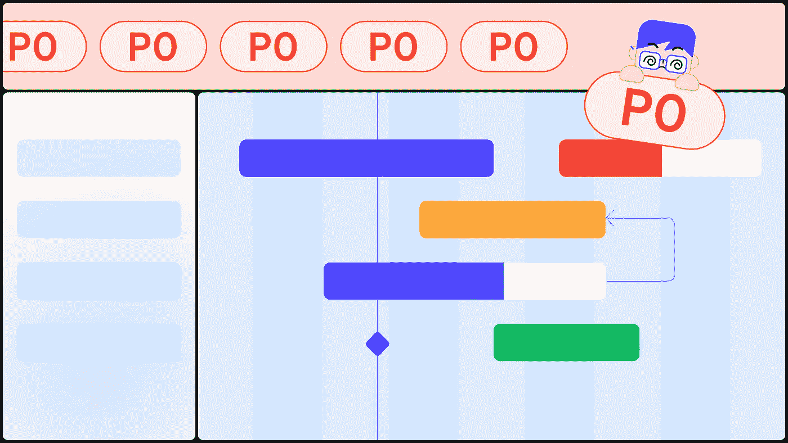
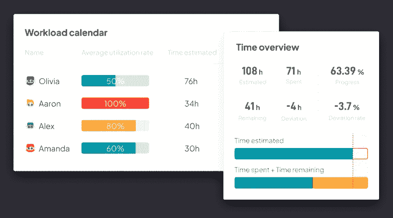
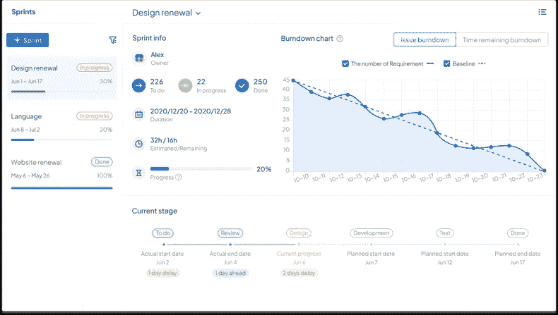

# 在并行项目上有困难？看这个！

> 原文：<https://medium.com/nerd-for-tech/having-trouble-with-concurrent-projects-read-this-55beaded7c4f?source=collection_archive---------16----------------------->

**并行项目管理**经常充满项目进度不一致、工作效率低、项目持续时间长等问题。在这里，我们提供了 4 个技巧来有效地管理它们。

# 1.将所有项目放在一个地方

当项目计划分散在不同的文档、电子表格或工具中时，项目管理可能会非常耗时。这可能会导致团队成员丢失重要信息或重复工作。使用 [**ONES 项目**](https://ones.com/products/project) ，您可以在一个地方计划和管理多个项目，并更轻松地跟踪项目进度。

# 2.检查和测量工作负载

在项目管理中，各种因素是相互联系的，因此，如果有限的资源得不到有效的整合和分配，项目进度就会受到影响。在整个团队中分配和管理工作时，要确保任务分配得当，没有人超负荷工作。这最大限度地提高了成员的绩效，让每个人都保持专注和满意，并提高了成员的效率。这个过程可以通过[ONES.com 这样的项目管理工具](https://ones.com/)来实现，帮助团队有效地评估成员的利用率。

# 3.跟踪项目进度

始终有必要跟踪项目进展，以便尽早发现和解决新的问题和风险，并确保项目处于良好状态。甘特图对于监控项目进度很有用。但是在多项目管理中，很难在不同的甘特图中整体把握它们的进度。

# 4.设置优先级

优先级是并行项目管理的关键。一般来说，应该根据项目对公司目标的影响来确定项目的优先级。这保证了团队的首要任务与目标一致，并有助于完成任务。时间和资源的分配，以及风险控制，都应该基于确定的优先级来完成。

*原载于 2022 年 11 月 14 日 https://blog.ones.com***。**