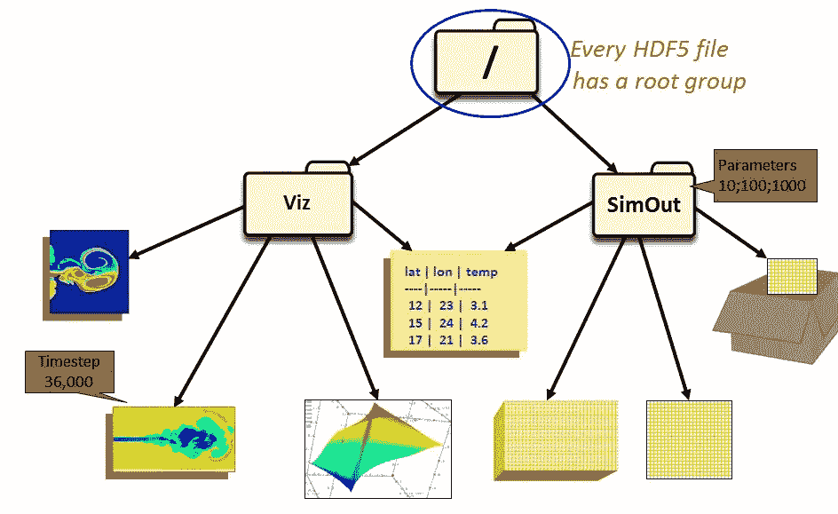

# 熊猫 HDF5 文件格式

> 原文：<https://medium.com/nerd-for-tech/hdf5-file-format-with-pandas-4a1cff1b5001?source=collection_archive---------16----------------------->


HDF5 是一种数据格式，能够以更少的磁盘空间和更快的检索速度存储和管理大型复杂数据。

在读取和处理大型数据集时，由于使用了大量内存，我们经常会遇到内存不足的错误。存储数据的另一种格式是快速访问和较小的大小，是这个问题的解决方案之一。一种这样的文件格式是 HDF5。

HDF 代表**层次数据格式**。最常用的版本是**版本 5** 。HDF 文件可以存储任何种类的异构数据对象，如图像、数组、表格、图形、文档等。它以分层的方式组织数据。每个 HDF 文件都以包含其他组和/或数据对象的根组(“/”)开始。



图像 hdf 组

HDF 文件存储关于存储在其中的数据的元数据，因此任何应用程序都可以解释文件的内容和结构。

Pandas 实现了 HDFStore 接口来读取、写入、添加、选择 HDF 文件。

**用熊猫创建 HDF 文件**

我们可以使用熊猫提供的 ***HDFStore*** 类创建一个 HDF5 文件。

**语法** *:* *HDFStore(路径，模式)*

**哪里**

*   **路径**是文件路径。
*   **模式**是打开文件的模式。它可以是“a”(追加)、“w”(写入)、“r+”(读取但文件已经存在)。默认为追加模式，如果文件不存在，它会创建文件并以写模式打开。

**示例** *:* 下面的代码以追加模式(默认)创建并打开一个 HDF 文件(' hdf_file.h5 ')。

```
import pandas as pd 
from pandas import HDFStore 
hdf = HDFStore(‘hdf_file.h5’)
```

**将数据存储在 HDF 文件中**

数据以键、数据对(类似于字典)的形式存储在 HDF 文件中。HDFStore 提供了在 HDF 文件中存储数据的方法。

**语法:****hdf store . put****(****key****，****value****，****format = None****，****index = True****，*** *nan _ rep = None****，****data _ columns = None****，****encoding = None****，****errors = ' strict '****，****

***其中***

*   ***Key** 是数据对象的标识符*
*   ***值**是数据帧或系列。*
*   ***格式**是用来存储数据对象的格式。值可以是“固定”(默认)或“表格”。*
*   ***追加**将输入数据追加到现有的。它强制表格格式。*
*   ***data_columns** 是用作索引列的列列表。若要使用所有列，请指定为 True。*
*   ***编码**为字符串提供编码。*
*   ***track_times 控制与对象关联的时间 ass** 的记录。如果设置为 True，则记录时间数据。*
*   ***Dropna** 指定是否删除空数据值。*

***示例:**以下代码读取 iris.csv 文件，并将其存储在之前使用 key 作为“key1”创建的 HDF 文件中。*

```
*df = pd.read_csv(“../input/iris/Iris.csv”)  # read Iris file
hdf.put('key1', df, format='table', data_columns=True) #put data in hdf file*
```

*这里 key1 表示用于访问 HDF 文件中的数据帧的密钥。这个键很有用，因为 HDF 文件可以在同一个文件中存储许多数据对象。每个数据对象都可以使用密钥来访问。*

***在同一文件中创建组和数据对象***

*我们可以在同一个文件中添加更多的数据对象或组。*

***示例:**以下代码在我们创建的同一个文件中添加了数据帧 df2，还添加了一个名为 group1 的组，数据帧 df3。*

```
*Import numpy as np
df2 = pd.DataFrame(np.random.rand(5,3) #dataframe df2
hdf.put(‘key2’,df2) # to add a dataframe to the hdf file
df3= pd.DataFrame(np.random.rand(10,2)
hdf.put(‘/group1/key3’,df3) # to add a group with df3 in the hdf file*
```

*现在可以用“/key2”(这里“/”代表根组)访问 df2，用“/group1/key3”访问 df3。(这里“/group1”代表一个组)*

***例** : 获取存储在 hdf 文件中的 df3 的形状:*

```
*hdf[‘/group1/key3’].shape()*
```

***将数据写入 HDF 文件***

*除了使用 HDFStore 类将数据写入 HDF 文件之外，Pandas 还使用一个方法 to_hdf 将数据写入文件。*

***语法:***data frame . to _ hdf****(****path _ or _ buf****，****key****，****mode = ' a '****，****comp level = None**nan _ rep = None****，****dropna = None****，****data _ columns = None****，****errors = ' strict '****，****

***哪里***

*   ***Path_or_buf** 是**或**文件路径或 HDFStore 对象。*
*   ***键**是商店中组的标识符。*
*   ***模式**是打开文件的模式。它可以是“a”(追加)、“w”(写入)、“r+”(读取但文件已经存在)。*
*   ***Complevel** 指定数据的压缩级别。*
*   ***追加**将输入数据追加到现有的。它仅适用于表格格式的数据。*
*   ***格式**是用来存储数据对象的格式。值可以是“固定”(默认)或“表格”。*
*   ***错误**指定如何处理编码和解码错误。*
*   ***编码**为字符串提供编码。*
*   ***Min_itemsize** 将列名映射到列的最小字符串大小。*
*   ***Nan_rep** 指定如何将空值表示为 str。*
*   ***Dropna** 指定是否删除空数据值。*
*   ***data_columns** 是用作索引列的列列表。若要使用所有列，请指定为 True。*

***示例:**将随机生成的数据帧写入文件，密钥为“key”*

```
*write_data = pd.DataFrame(np.random.rand(5,3))
write_data.to_hdf(‘hdf_file.h5’,’key’,mode=’w’)#writes data to hdf file*
```

***向 HDF 文件追加数据***

*HDF5 不要求一次写入所有数据。数据集可以在任何需要的时候扩展。但是节点必须已经存在并且是表格式。*

***语法:** *HDFStore.append(key，value，format=None，axes=None，index=True，append=True，complib=None，complevel=None，columns=None，min_itemsize=None，nan_rep=None，chunksize=None，expectedrows=None，dropna=None，data_columns=None，encoding=None，errors='strict')**

***其中***

*   ***Key** 是数据对象的标识符。*
*   ***格式**是用来存储数据对象的格式。值'表'。*
*   ***追加**将输入数据追加到现有的。*
*   ***data_columns** 是用作索引列的列列表。若要使用所有列，请指定为 True。*
*   ***Min_itemsize** 将列名映射到列的最小字符串大小。*
*   ***Nan_rep** 指定如何将空值表示为 str。*
*   ***Chunksizesize** 指定文字块的大小。*
*   ***Expectedrows** 是该表的预期总行大小。*
*   ***编码**为字符串提供编码。*
*   ***dropna** 指定是否删除空数据值。*

***例如:***

*以下代码将随机数的数据帧追加到先前创建的文件中的表中，该文件的关键字为“key2”。*

```
*hdf.append('/key2',pd.DataFrame(np.random.rand(5,3))*
```

# *阅读 HDF 文件*

*HDFStore 类中的 get 方法可用于读取文件。必须指定 Mode='r '才能以读取模式打开文件。*

***语法:**hdf store . get**(***key***)***

***在哪里***

*   ***键**是数据对象的标识符*

*它**返回与文件中存储的对象类型相同的**对象*

***示例:**以下代码读取先前在读取模式下创建的 hdf 文件*

```
*hdf =HDFStore(‘hdf_file.h5', mode=’r’)
data = hdf.get(‘/key1’)*
```

*在本例中，返回的数据将是 pandas dataframe 类型，因为我们在创建文件时将 pandas‘Iris’data frame 存储在 key1 中。*

*Pandas 实现了另一种方法来读取文件。是 read_hdf。使用这种方法是因为它可以在读取时查询数据。*

***语法:****pandas . read _ hdf****(****path _ or _ buf****，****key = None****，****mode = ' r '****，****errors = ' strict '**iterator = False****，****chunksize = None****，***** * kwargs****)*****

****哪里****

*   ****Path_or_buf** 是文件路径或 HDFStore 对象。**
*   ****键**是数据对象的标识符。**
*   ****模式**是打开文件的模式。它可以是“a”(追加)、“r”(读取)、“r+”(读取但文件已经存在)。**
*   ****错误**指定如何处理编码和解码错误。**
*   ****其中**是定期(或可兑换)对象的列表。**
*   ****开始**是开始选择的行号。**
*   ****停止**是停止选择的行号。**
*   ****列**是要返回的列名列表。**
*   **迭代器返回一个迭代器对象。**
*   **使用迭代器时，指定迭代中包含的行数。**
*   ******kwargs** 是传递给 HDFStore 的附加关键字参数。**

**它**返回与文件中存储的对象类型相同的**对象**

****示例:**以下代码返回 ID 大于 10 时的物种数据**

```
**read_data = pd.read_hdf('hdf_file.h5','/key1',where=['Id>10'], columns=[‘Species’])**
```

**由于从 hdf_file 返回的数据(read_data)是 pandas 数据帧(与存储的对象类型相同)，它可以像普通数据帧一样用于数据分析。**

****示例:**下面的代码读取文件头，查找形状，描述数据集**

```
**read_data.head()   #read head of file
read_data.shape    #fetching shape of the file
read_data.describe  #describe the dataset**
```

# **关闭 HDF 文件**

**文件在使用后必须关闭。下面是关闭我们创建的 HDF 文件的代码。**

```
**hdf.close()**
```

****总结****

**HDF5 专为快速 I/O 处理和存储而打造。为了访问这种文件格式的数据，Pandas 实现了本博客中讨论的接口。**

****参考文献:****

**[pandas.read_hdf — pandas 1.2.3 文档(pydata.org)](https://pandas.pydata.org/pandas-docs/stable/reference/api/pandas.read_hdf.html)**

**https://www.hdfgroup.org/**

***原载于 2021 年 3 月 16 日 https://www.numpyninja.com*[](https://www.numpyninja.com/post/hdf5-file-format-with-pandas)**。****