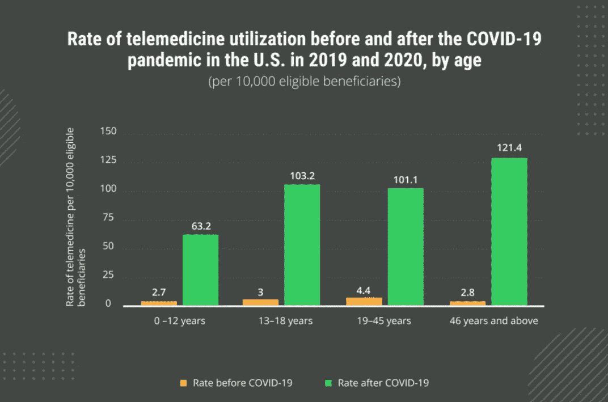

# 医疗改革:什么技术推动了以消费者为中心的方法？

> 原文：<https://medium.com/nerd-for-tech/healthcare-transformation-what-technologies-drive-a-consumer-centric-approach-bcc87a7d9bda?source=collection_archive---------5----------------------->

数字化转型已成为 2021 年的潮流，医疗保健是转型不仅仅是一个时髦词的行业之一。新冠肺炎疫情迫使医疗保健提供商重新思考他们的商业模式，以跟上不断发展的变化。除了通过转型实现商业价值，还有一种以人为中心的方法旨在改善医疗保健。让我们来看看医疗保健行业数字化转型的背后是什么，以及哪些创新是医疗保健市场数字化转型的最大贡献者。

# 使用数字技术转变医疗保健服务

在过去的十年中，对资助数字医疗保健项目的兴趣显著增加。[报告](https://www.statista.com/statistics/1092869/global-digital-health-market-size-forecast/)显示，2020 年，超过 210 亿美元投资于该行业，这几乎是 2010 年的 20 倍。

没有技术创新，医疗保健行业的转型就不可能实现。虽然医疗保健对数字工具的需求甚至在新冠肺炎疫情之前就已经出现，但它加速了行业数字化的采用。 [2020 年消费者采用调查](https://www.beckershospitalreview.com/healthcare-information-technology/digital-health-adoption-in-2020-5-tools-consumers-increased-or-stopped-using.html)报告称，数字健康跟踪工具的采用率已从 2019 年的 42%上升至 2020 年的 54%。因此，在医疗保健组织中实施新技术需要更多的精力、时间和资金。根据德勤的调查，60%接受调查的医疗保健机构将自己评为旅程中途。那么，为什么医疗保健提供商继续推进医疗保健的数字化转型是合理的呢？

疫情迫使医疗保健服务的消费者改变习惯，优先考虑便利性和获得医疗保健的机会。因此，数字化转型的驱动力是通过改变商业模式和运营变得对消费者更加友好。医疗保健提供商转向数字化转型的首要原因是实现更好的患者体验( [92%](https://www2.deloitte.com/us/en/insights/industry/health-care/digital-transformation-in-healthcare.html) )。消费者不再仅仅使用传统的护理服务选择——根据普华永道的数据，使用虚拟访问的美国人的份额达到了 97%的增长。

# 医疗保健技术的趋势和挑战

如上所述，人们对医疗机构的筹款数字化转型越来越感兴趣。以下是由新冠肺炎疫情推动的主要医疗保健数字化转型趋势。

## 远距离医学

尽管在线医疗服务远在新冠肺炎之前，但全球疫情促进了其采用并增加了患者的信任。下面的统计数据表明，在美国，所有年龄段的人在 2020 年疫情期间都使用了远程医疗服务。[关于远程医疗的研究](https://bmcpublichealth.biomedcentral.com/articles/10.1186/s12889-020-09301-4)发现它有助于防止身体接触，提供持续的医疗保健，并降低新冠肺炎疫情中的发病率和死亡率。在大流行后时期，医疗保健提供者可以扩展应用远程医疗技术的领域，包括远程监护、远程手术、远程教育等。

## 人工智能

人工智能在医疗保健中用于疾病的早期检测。斯坦福医学院推出的最新创新之一是智能手表，它可以跟踪脱水、贫血和疾病的早期迹象，包括流感或感冒。

在医疗保健领域采用人工智能的最大挑战是增加患者和医学研究人员对技术应用的信任。因此，人工智能在医疗诊断中的成功实施依赖于行业中开发和应用的优质解决方案。

## 物联网医疗保健

近年来，医疗保健物联网的交付和使用一直在快速增长。医疗机构和患者如何从物联网创新中受益的用例不胜枚举，但大多数都是围绕核心流程构建的— [患者状态跟踪](https://emerline.com/blog/remote-patient-monitoring-statistics)。这些解决方案可以作为创建具有复杂自动化和以人为中心的服务的智能医院的基础。此外，跟踪解决方案产生的数据可能会带来更多获得有价值的行业见解的机会。

## 互联医疗生态系统

数字化医疗转型的核心技术旨在创建一个集中化的 IT 基础设施，以增强患者护理服务和数据管理。现代医疗设备变得更加互联，因此对可靠的电子病历和 EHR 解决方案的需求也在增加。互联性超越了传统的界限:43%的医疗保健专业人员表示，医疗保健和其他行业之间的界限正在变得模糊。

**下面是 Emerline 如何帮助其一家客户使用单一平台** **将医疗服务提供者和患者联系起来。**

医疗保健数字化转型仍面临哪些挑战？尽管医疗保健行业的数字化转型正在加速，但最大的挑战仍然是寻找资金和高昂的实施成本。另一个严峻的挑战与转型过程的漫长旅程有关。德勤报告称，接受调查的受访者承认，“随着数字化转型的机会和定义的扩大，转型之旅比他们最初预期的要长。''

**最后，医疗保健组织需要坚实的技术支持来将数字化转型理念付诸实践。与拥有相关行业知识的技术专家合作，迎接医疗保健转型挑战将变得更加容易。** [**如果您的组织正在经历转型变革，请联系我们**](https://emerline.com/contact-us) **。**

最初发表于[https://emerline.com](https://emerline.com/)。