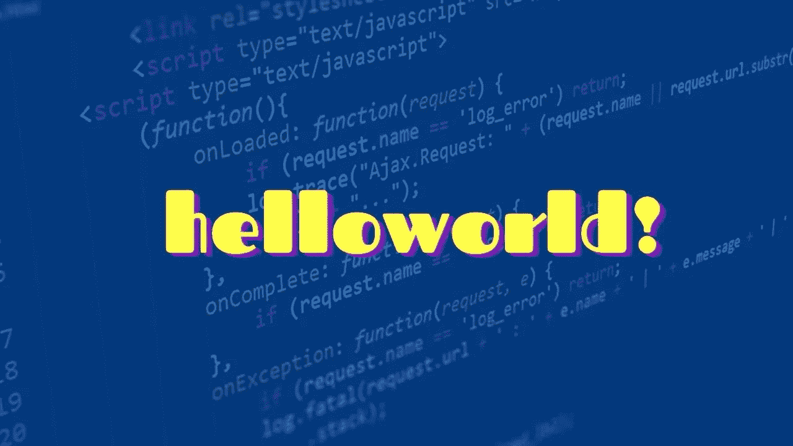
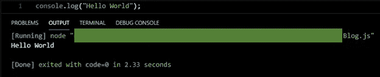
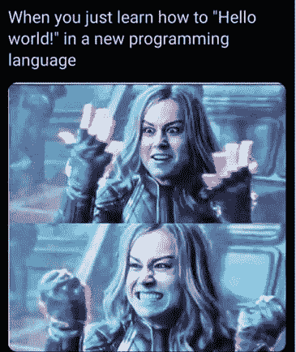
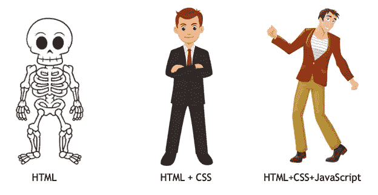
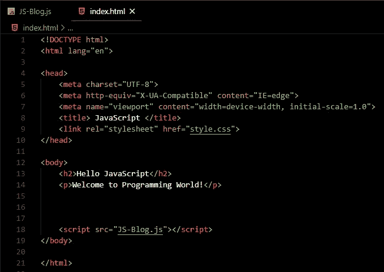
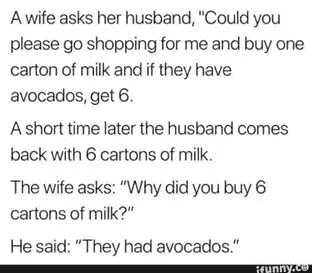

# JavaScript 你好！

> 原文：<https://medium.com/nerd-for-tech/hello-to-javascript-74f510204b4a?source=collection_archive---------14----------------------->

**你好世界**

…

从最近几周开始，我开始学习 JavaScript。成功运行第一个***【Hello World】***等几个简单的语法，让我以为它会是一个像 HTML 一样简单的语言。但是你猜怎么着？JS 让我意识到，在我开始学习它之前，我的生活相当容易。我已经把压力放在了无关紧要的生活琐事上。生活中的 bug 比 JavaScript 中的 bug 容易处理得多。

## JavaScript 实际上是什么？

JavaScript 基本上是 HTML 和 CSS 的功能。它是连接前端和后端的网关，因此服务于两端。如果你更深入地了解它，那么 JS 基本上是唯一可以在前端使用的编程语言。

## 我们怎么把 JS 和 HTML 连接起来？

JS 连接

JS 文件需要在我们的 body 标签的末尾提到，也就是在结束的 body 标签之前。但是为什么我们不像 CSS 文件一样在 head 标签中链接它呢？这尤其是因为所有的 body 标签在开始运行之前都应该在页面上处于活动状态。因此，如果我们在顶部输入 JS 文件，文件将在没有激活内容的情况下执行。这可能会导致标签功能出错。为了不再给这些小错误可乘之机，我们必须把 JS 文件链接放在我们身体的底部。

## 鳄梨还是牛奶盒？JavaScript 中的条件

鳄梨还是牛奶盒？

你们中的一些人可能已经看过这个老笑话了。你们大多数人可能会说，妻子要求买 6 个鳄梨。但是如果你仔细看妻子的话，他们实际上是模糊的。嗯，*这就是妻子通常对丈夫说的话，呵！*。让我们用 javascript 执行这个丈夫理解的例子。

所以妻子要求丈夫买一盒牛奶，因此:

**var milk cartos = 1；**

然后她说，如果他们有牛油果，就买六个。但是她没有表明要买 6 个鳄梨或者 6 盒。丈夫把这句话理解为:“如果他们有鳄梨，那就买 6 盒牛奶。”

在 Javascript 中，它被称为条件语句，由 **if-else** 表示。

**如果**(条件=真){

console.log("向前移动")；

}

**其他** {

console.log("向后移动")；

}

//其中 **console.log** 是 javascript 中的一个函数，用来打印变量。

我们得到的结果和丈夫买的一样。 *Taa Daa！在 JavaScript 中，我们有 6 盒牛奶。*

# ***结论:***

一旦你开始理解 javascript，你就可以经常使用它。但是一旦它开始扰乱你，它会让你拔毛。所以确保你完全理解并练习它的基础和核心。