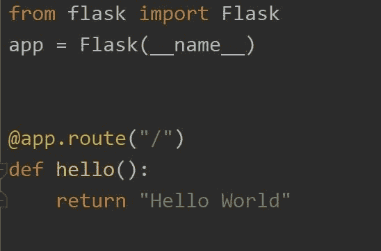
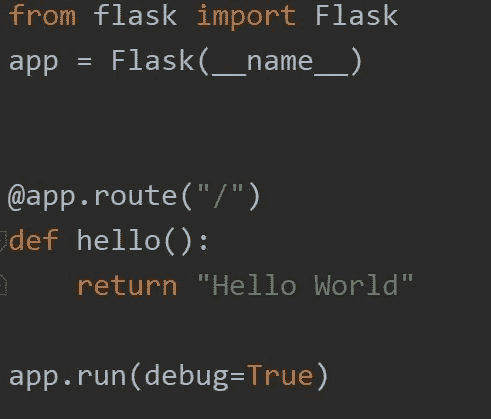
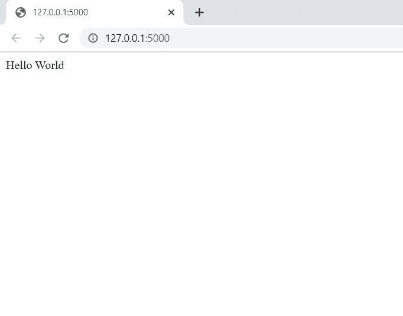

# 你好世界！瓶

> 原文：<https://medium.com/nerd-for-tech/hello-world-flask-296e206c43db?source=collection_archive---------11----------------------->

潜入烧瓶……

[https://flask.palletsprojects.com](https://flask.palletsprojects.com/en/1.1.x/)

在本文中，我将重点介绍 flask 以及如何开始使用它。如果你刚开始 web 开发，并且想用一种简单的方法将你的网站连接到后端，Flask 是一个很好的框架。

Flask 是一个微框架，如果你熟悉 flask，它的源代码很容易理解。做一个微框架并不意味着比其他框架用处小。事实上，微型对开发者来说是一种优势，因为开发者可以通过使用他们选择的不同扩展来轻松扩展他们的应用程序。

使用 flask 的唯一先决条件是您应该知道 python，并且应该安装 python 和 pip，可以通过在命令提示符下运行以下命令来简单地安装 flask，

pip 安装烧瓶

为了使用 flask，我们应该首先导入 flask 模块，然后创建 flask 应用程序的一个实例。web 服务器将收到的所有请求传递给我们创建的这个对象的实例。

实例创建如下，

导入烧瓶模块并创建实例

传递给 flask 类构造函数的 __name__ 参数用于确定应用程序的位置，然后允许它定位应用程序使用的其他文件，如静态文件或模板文件。

一个简单的应用程序被创建如下，它在我们的网站上显示“Hello World”。

最简单的烧瓶程序

客户端(web 浏览器)向 web 服务器发送请求，然后 web 服务器向作为对象的 flask 应用程序实例发送请求。因此，flask 应用程序实例应该知道为每个请求的 URL 执行哪个代码，这样它就可以不断地将 URL 映射到程序中编写的函数。

URL 和处理它的功能之间的关联称为路由。

通过使用 decorator app.route 来定义路由

装饰器是 python 的重要特性之一，主要用于将函数注册为在特定事件发生时调用的处理函数。

在我们的示例中，hello()函数被注册为应用程序根 URL 的处理函数。处理 URL 的函数称为视图函数，这里 hello()是将 Hello World 返回到网页的视图函数。

为了将应用程序部署到本地主机，我们必须使用如下所示的 app.run()命令，

部署 Flask 应用程序

Flask 应用程序带有调试器的选项，当我们设置 debug = True 时，它允许我们检查源代码，如果它出错或在 web 浏览器本身中发生了任何错误。

一旦我们运行该文件，我们将得到在 localhost 5000 中显示“Hello World”的简单网页，如下所示，

显示 Hello World 的网页

因此，我们可以很容易地使用 flask 来构建网页。虽然这是我们构建的最简单的网页，但是我们可以使用 HTML 模板来将其呈现到我们的网页中，我将在下一篇文章中尝试解释这一点。