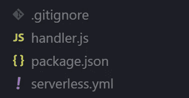
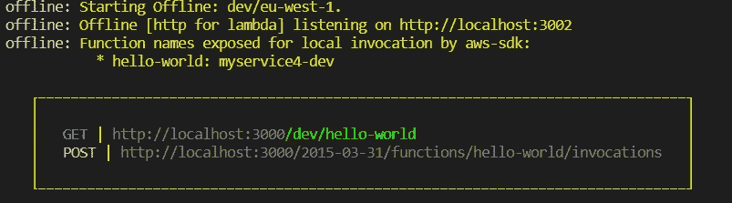
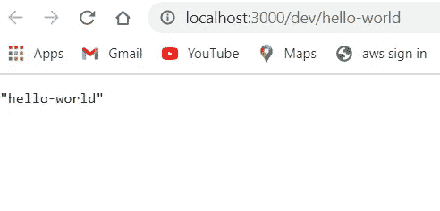

# 你好-世界项目在无服务器离线！

> 原文：<https://medium.com/nerd-for-tech/hello-world-project-in-serverless-offline-4abe45099d3a?source=collection_archive---------4----------------------->

## **AWS +无服务器+ Nodejs**


***什么是无服务器？***

无服务器计算是一种建立在云服务基础上的方法，提供后端服务，只对您使用的内容收费！

**先决条件:**

*   *需要在您的 pc 上安装 [NodeJs](https://nodejs.org/en/) 。
*   *任何代码编辑器(最好是 [VS 工作室代码](https://code.visualstudio.com/))。

## **安装无服务器的步骤:**

> 打开终端，键入以下命令安装 serverless，并检查是否已安装。

```
npm install -g serverlessserverless
```

> 创建无服务器模板(这里我使用 AWS 和 nodejs)

```
sls create --template aws-nodejs --path firstProject
```

**注意**这里的< `firstProject>`是项目的名称。(您可以键入任何内容)

> 运行以上命令后，您的项目将被构建



项目结构

## **离线安装无服务器的步骤**

> 现在，转到您的服务名目录(这里/firstProject)并运行下面的命令。

```
npm install -D serverless-offline
```

> 转到 serverless.yml 文件并添加 serverless 离线插件。

```
plugins:
  - serverless-offline
```

**注意**:注意 serverless.yml 文件中的缩进！

> 在同一目录中安装项目依赖项

```
npm install -S [slspress](https://www.npmjs.com/package/slspress)
```

> 让我们编辑 handler.js 文件，如下所示。

```
const { create, jsonMiddleware } = require('slspress');

const handler = create();

handler.on('helloWorld')
    .middleware(jsonMiddleware)
    .get('/hello-world', (req, res) => {
        return res.ok('Hello-World!');
    });

module.exports = handler.export();
```

> 让我们编辑 serverless.yml 文件如下。

```
service: firstProject

provider:
  name: aws
  runtime: nodejs8.10
  region: us-west-2
  profile: default
  memorySize: 256 # optional, in MB, default is 1024
  stage: dev

**plugins:
  - serverless-offline**

functions:
  hello-world:
    handler: handler.helloWorld# required, handler set in AWS Lambda
    description: "slspress offline example"
    events:
      - http:
          path: hello-world
          method: get
          cors: **true**
```

> 现在，是时候使用下面的命令在本地运行无服务器功能了！

```
sls offline start
```

> 在运行离线命令时，您将得到如下内容



ctrl+点击获取|[http://localhost:3000/dev/hello-world](http://localhost:3000/dev/hello-world)



回应截图

## *Tadaaaaa！我们刚刚完成了 Hello world 项目！*

参考 https://www.serverless.com/在其他平台和语言上的更多令人敬畏的项目！

希望你喜欢它！

# 谢谢你！