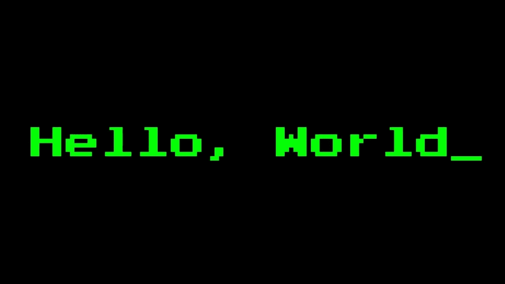
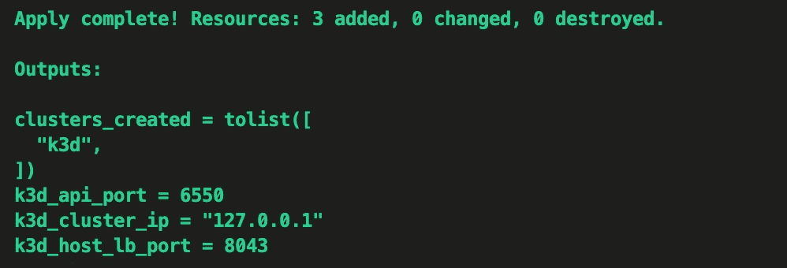
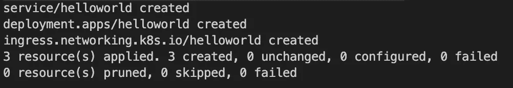
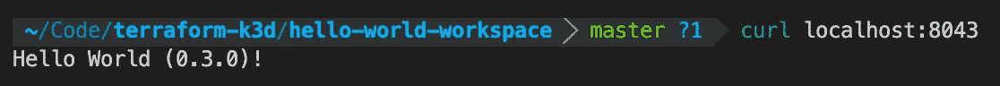

# 带 Terraform、k3d 和 kpt 的 Kubernetes hello-world

> 原文：<https://medium.com/nerd-for-tech/hello-world-with-terraform-k3d-and-kpt-860e8a414669?source=collection_archive---------4----------------------->



简短的高级教程，使用 Terraform 和 k3d 在本地设置 Kubernetes 集群，然后使用 kpt 部署一个简单的 hello-world 应用程序。

## 要求:

*   地形 0.13+:[https://www.terraform.io/downloads.html](https://www.terraform.io/downloads.html)
*   k3d:[https://github.com/rancher/k3d](https://github.com/rancher/k3d)
*   https://googlecontainertools.github.io/kpt/installation/
*   kubectl 1.15+:[https://kubernetes.io/docs/tasks/tools/install-kubectl/](https://kubernetes.io/docs/tasks/tools/install-kubectl/)
*   https://docs.docker.com/install/
*   https://git-scm.com/downloads

## **使用地形创建 k3d 集群:**

克隆源 repo 并导航到它，初始化 terraform，然后应用配置:

```
git clone https://gitlab.com/bengordonfraser/terraform-k3d.git ; cd terraform-k3dcp terraform.tfvars.example terraform.tfvarsterraform initterraform apply
```

出现提示时输入"是"，接受`terraform apply`

请注意输出`k3d_cluster_ip`和`k3d_host_lb_port`，因为稍后将使用它们来访问集群。



## **使用 kpt 下载 hello-world 包并部署到 k3d 集群:**

```
mkdir hello-world-workspace; cd $_export SRC_REPO=https://gitlab.com/bengordonfraser/hello-world-kpt.gitkpt pkg get $SRC_REPO@v0.1.0 helloworld kpt live apply helloworld
```



## 卷起来！

使用 Terraform 输出的 ip 和端口(在本例中为 127.0.0.1，即 localhost 和端口 8043):

`curl localhost:8043`



注意——入口可能需要几秒钟才能实例化，所以如果 curl 首先返回一个空响应，请重试。

## 学习:

使用 kubectl 或 kubernetes 管理工具(如 [k9s](https://k9scli.io/) )探索集群和 helloworld 部署。一些 kubectl 命令示例:

```
kubectl get nodeskubectl get podskubectl get svckubectl get ingress
```

尝试使用 kpt 来更改部署配置:

```
kpt cfg tree helloworldkpt cfg list-setters helloworldkpt cfg set helloworld replicas 5kpt cfg tree helloworld  --replicaskpt live apply helloworld
```

探索 [terraform-k3d repo](https://gitlab.com/bengordonfraser/terraform-k3d/) 以了解如何使用输入变量和本地执行供应器将简单的基础架构配置组合在一起。

## 清理:

使用以下命令删除 helloworld 部署:

`kpt live destroy helloworld`

`cd ..`返回到 terraform-k3d 目录，然后使用以下命令删除 k3d 集群:

`terraform destroy`

## 阅读更多信息:

[https://gitlab.com/bengordonfraser/hello-world-kpt](https://gitlab.com/bengordonfraser/hello-world-kpt/)/

https://gitlab.com/bengordonfraser/terraform-k3d/

【https://googlecontainertools.github.io/kpt/ 

[](https://learn.hashicorp.com/tutorials/terraform/associate-study) [## 学习指南- Terraform 助理认证

### 如果您准备参加来自…的 Terraform 助理认证考试，本指南列出了您应该学习的资源

learn.hashicorp.com](https://learn.hashicorp.com/tutorials/terraform/associate-study) [](https://github.com/rancher/k3d) [## 牧场主/k3d

### 请注意:main 现在是 v4.0.0，v3.x 的代码可以在 main-v3 分支中找到！k3s 是轻量级的…

github.com](https://github.com/rancher/k3d)