# Helm 快速入门—Kubernetes(K8S)的软件包管理器

> 原文：<https://medium.com/nerd-for-tech/helm-quick-start-the-package-manager-for-kubernetes-k8s-242a03ea959f?source=collection_archive---------2----------------------->

让我们从 Kubernetes 的快速介绍开始:

Kubernetes (K8S)是一个开源的容器编排工具，它通过自动化部署、扩展和管理容器化的应用程序来减少手动流程。

Kubernetes 的基本组件:

> - **控制平面** —控制 K8S 节点并分配任务。
> - **节点**-执行请求任务的实际机器。
> -**Pod**-K8S 的最小单元，其中一个或多个容器部署到一个 K8S 节点。
> - **命名空间**-它就像是一个虚拟集群，我们可以在其中创建 K8S 对象。
> - **服务**-它是集群中的 pod 的逻辑集合，定义了一种负载平衡的抽象方式，并公开部署在 pod 上的应用程序。
> - **复制集**-表示要在 K8S 集群中运行的 pod 的副本数量。
> - **部署**-它运行应用程序的一个或多个副本，并自动替换失败的实例。
> -**Kubectl**-K8S 的命令行工具。
> -**Minikube**-运行本地 K8S 集群。


照片由 [Loik Marras](https://unsplash.com/@loik_marras?utm_source=medium&utm_medium=referral) 在 [Unsplash](https://unsplash.com?utm_source=medium&utm_medium=referral) 上拍摄

Helm 是 Kubernetes 的一个包管理器，它自动化了创建 Kubernetes 清单的大部分重复性工作。

用赫尔姆的话来说，图表不过是 K8s 包。Helm 帮助我们创建新的图表，并将其打包到一个档案中，或者利用图表库中的现有图表(如下所述)。

**Helm-2 客户端-服务器架构**

> Helm 客户端(CLI 工具)
> -Tiller-服务器组件

我们使用上述两个组件在 K8S 集群上部署和管理应用程序包。

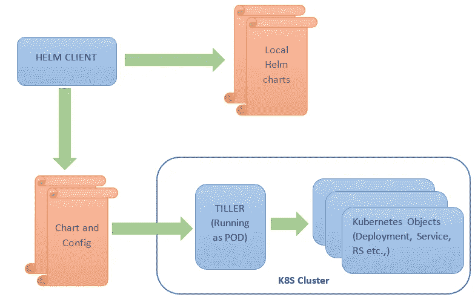

Helm Client 将帮助我们部署和管理与 Tiller server 通信的版本——将图表和配置合并到一个版本中，该版本通过维护其发布状态在 Kubernetes 集群上创建所有 K8S 资源。Tiller 还在同一个名称空间的配置映射中维护所有发布信息，这在升级过程中有助于 Helm。

**Helm-3 架构(仅客户端架构)**

Helm-3 的主要变化是，出于安全原因，Tiller(服务器组件)从版本 3 中删除

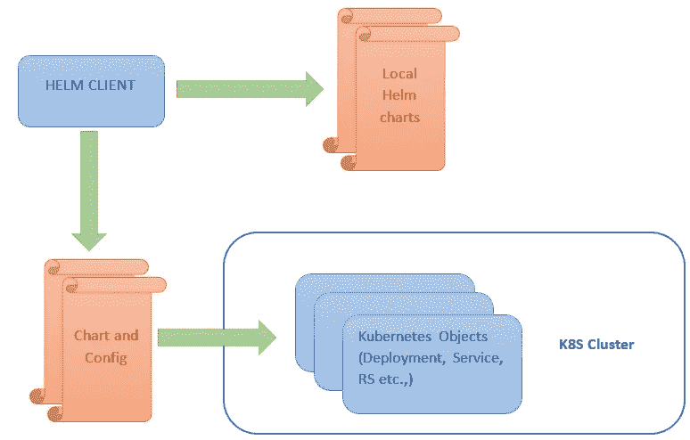

Helm 应用程序包被称为图表—与包含配置信息的 config 结合，并合并到图表中以创建版本(应用程序的运行实例)。

我们也可以根据需要创建自己的图表并保存在本地磁盘上，或者我们可以利用 github 上已有的图表——由@[https://github.com/helm/charts/tree/master/stable](https://github.com/helm/charts/tree/master/stable)社区维护

***分两步为 windows 上的 Kubernetes 添加头盔包(假设 Minikube 已经安装*** ):

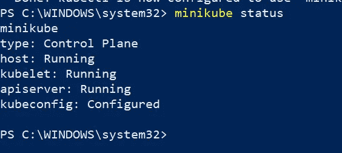

*   安装 Chocolatey 软件包管理器

```
Set-ExecutionPolicy Bypass -Scope Process -Force; [System.Net.ServicePointManager]::SecurityProtocol = [System.Net.ServicePointManager]::SecurityProtocol -bor 3072; iex ((New-Object System.Net.WebClient).DownloadString('https://chocolatey.org/install.ps1'))
```

我们可以验证 Chocolatey 安装:“choco -v”

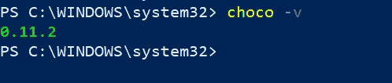

用巧克力检查过期的包装:“巧克力过期”

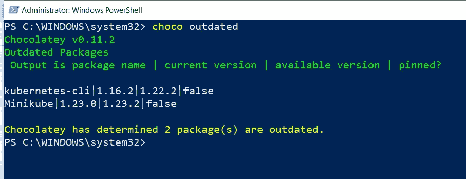

要使用 choco 命令升级 Minikube 和 Kubernetes-cli 过时的软件包:

```
**choco upgrade minikube
choco upgrade kubernetes-cli**
```

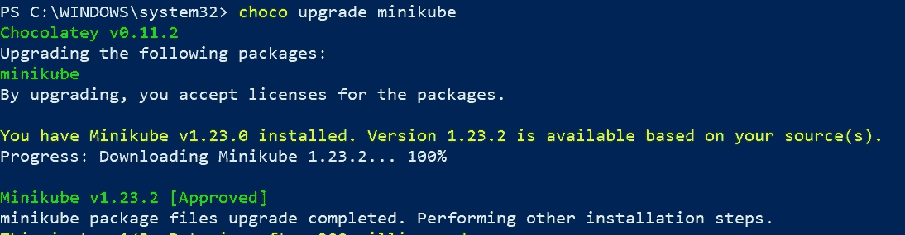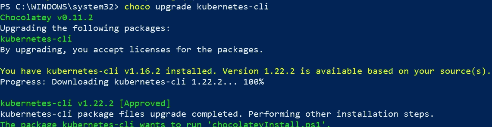

*   安装带巧克力的头盔

让我们在以管理员模式打开的 powershell 上运行 choco 命令。

```
**choco install kubernetes-helm**
```

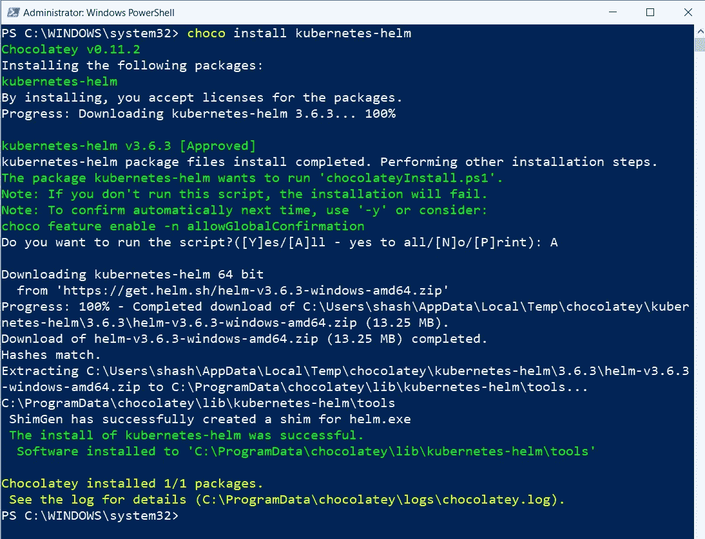

*验证舵版本:*

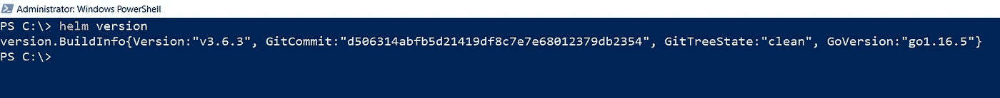

让我们举一个在 K8S 集群中运行 MySQL 数据库的例子，这里我们可以从现有的 Helm 图表列表中搜索，而不是从头开始编写 Kubernetes 清单文件。我们只需要在本地机器上克隆 Git repo (charts)并运行以下命令。

Git 图表:[https://github.com/helm/charts/](https://github.com/helm/charts/tree/master)

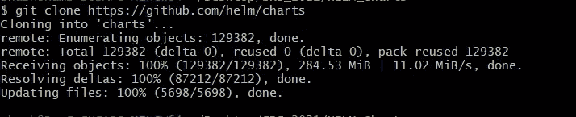

下载后，我们可以从源目录运行命令: "..\图表\稳定"

```
**helm install shashir-db mysql**
```

Helm 将负责创建正确运行 MySQL 实例所需的 Kubernetes 对象(部署、复制集、服务、Pod)。

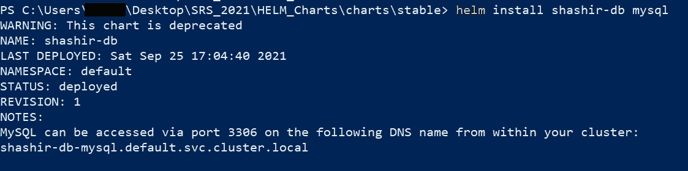

让我们运行 kubectl 命令来获取所有 K8S 对象，并验证所有 Kubernetes 对象都是用'***helm install shashir-db MySQL*'**命令自动创建的。

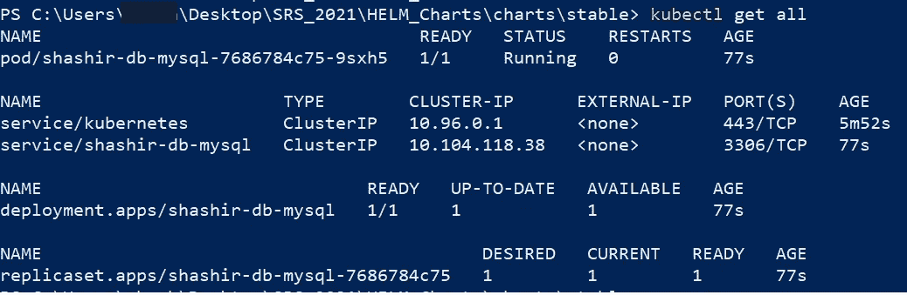

要连接 MySQL 实例，我们可以使用以下步骤:

```
PS C:\Users\srs\Desktop\SRS_2021\HELM_Charts\charts\stable> **helm install shashir-db mysql**
WARNING: This chart **is** deprecated
NAME: shashir-db
LAST DEPLOYED: Sat Sep 25 17:48:09 2021
NAMESPACE: default
STATUS: deployed
REVISION: 1
NOTES:
MySQL can be accessed via port 3306 on the following DNS name from within your cluster:
shashir-db-mysql.default.svc.cluster.local

To get your root password run:

MYSQL_ROOT_PASSWORD=$(kubectl get secret --namespace default shashir-db-mysql -o jsonpath=**"{.data.mysql-root-password}"** | base64 --decode; echo)

To connect to your database:

1\. Run an Ubuntu pod that you can use **as** a client:

***kubectl run -i --tty ubuntu --image=ubuntu:16.04 --restart=Never -- bash -il***

2\. Install the mysql client:

***$ apt-get update && apt-get install mysql-client -y***

3\. Connect using the mysql cli, then provide your password:
***$ mysql -h shashir-db-mysql -p***

To connect to your database directly from outside the K8s cluster:
MYSQL_HOST=127.0.0.1
MYSQL_PORT=3306

# Execute the following command to route the connection:
***kubectl port-forward svc/shashir-db-mysql 3306

mysql -h ${MYSQL_HOST} -P${MYSQL_PORT} -u root -p${MYSQL_ROOT_PASSWORD}***
```

验证部署—“ku bectl get deployment”

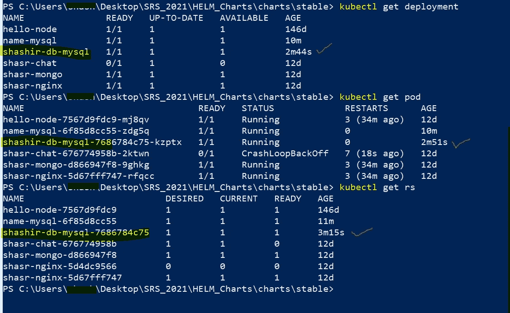

```
**helm get all shashir-db**
```

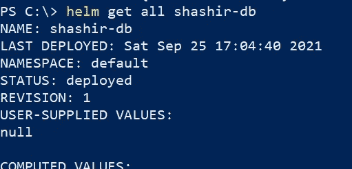

我希望你已经发现这篇文章对开始掌舵有帮助。在这里，我们开始使用 Chocolatey 和 HELM 组件安装 HELM——如何使用它来部署现有的 HELM 图表——例如，在我们的例子中是 MySQL。

参考资料:

[https://kubernetes.io/](https://kubernetes.io/)
https://helm.sh/