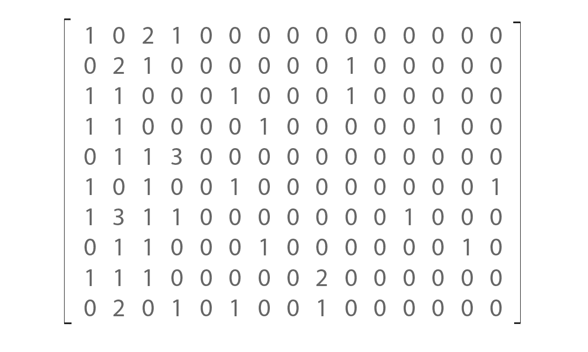
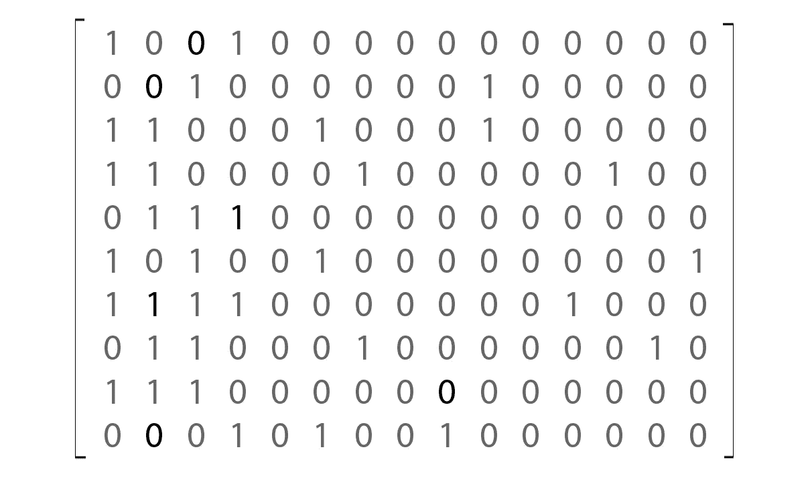
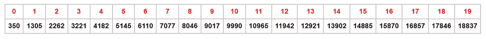
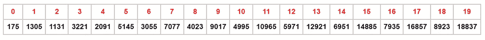
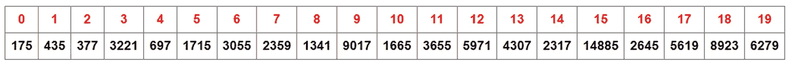
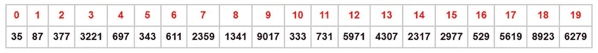
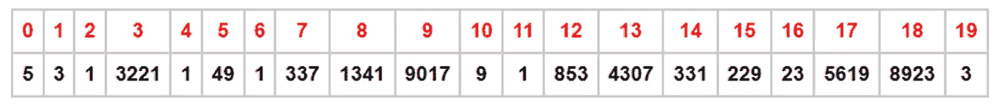
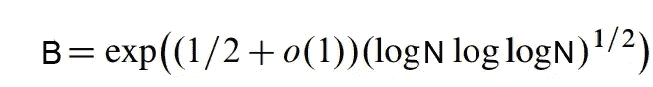

# 以下是二次筛分解的工作原理

> 原文：<https://medium.com/nerd-for-tech/heres-how-quadratic-sieve-factorization-works-1c878bc94f81?source=collection_archive---------0----------------------->

尼克·希利尔在 [Unsplash](https://unsplash.com/photos/3UbsiRcrFV4?utm_source=unsplash&utm_medium=referral&utm_content=creditCopyText) 上的照片

寻找两个或更多数字的乘积是一个简单的数学运算，但是将一个数字分解成它的因子的逆运算却不是在公园里散步。因式分解的困难是 [RSA 密码系统](https://en.wikipedia.org/wiki/RSA_(cryptosystem))的基础。

因式分解一直是人们非常感兴趣的，随着现代密码学的兴起，这种兴趣更加浓厚。

给定一个数 **N** ，一个正整数，我们可以对 N 进行哪些计算操作来获得它的因子？基本的，甚至是粗糙的方法是试除法；用较小的数(从 2 到 N 的平方根)除 N，看看哪些数没有余数。

另一种初等的方法是费马因式分解法，这种方法基于两个平方的*差*恒等式: **x - y = (x-y)(x+ y)** 。
为了使用这种方法分解 **N** ，我们必须寻找两个整数 **x** 和 **y** 使得 **x -y = N** 或者，同样的事情，x **-N** **= y** 。那么 **N** 的因子根据所述恒等式将为( **x-y** )和( **x+y** )。在算法上，我们为 **x** 选择一个初始值，并以 1 为步长递增，每一步计算 x **-N** ，当它(x **-N** )是一个完美的平方( **y** )时停止。 **x** 的初始值将是使 x **-N > 0** 的最小正整数，即 **x > N** 。因此， **x** 的起始值将是大于 **N** 的平方根的最小正整数，假设 N 不是完美的平方。注意，这种方法仅产生两个可能不全是质数的因数，如果我们对质数感兴趣，我们可能需要测试输出的质数或再次对它们进行因式分解，除非我们事先知道 **N** 仅由两个质数组成，就像 RSA 模数的情况一样。

二次筛法因式分解算法和更高级的数域筛法算法都是基于费马因式分解方法的基本思想，所以，我们举个例子来看看它是如何工作的。
**例**:因式分解**N**= 125513。
125513 的平方根是 354.2781…
我们取我们的初始值为 **x** = 355。
现在，依次计算 x **- N** ，检查是否是正方:

355 - 125，513 = 126，025 - 125，513 =512(不是完美的正方形)。
356**-125513 = 126737-125513 = 1223(不是正方)。
357**-125513 = 127449-125513 = 1936 = 44**(一个正方)。******

******我们在第三步得到了一个完美的正方形；357 - 125，513 =44 ，所以
125，513 = 357-44 =(357–44)(357+44)=**127 * 181**。******

****这个例子特意选择了几个步骤，相比之下，这样因式分解 80，723 将需要 214 个步骤才能得到一个完美的正方形。****

## ****走向二次筛因子分解****

****简介中描述的两种因式分解方法对于分解小数字(比如说，小于 20 位的数字)很有用。对于更大的数字，如在密码学中使用的数字，需要更有效的算法。****

****二次筛法的基础是比利时数学家莫里斯·克赖奇克提出的费马方法的一种改进。这里求满足同余式**x**≦**y**(mod N)的整数 **x** 和 **y** ，或者是什么一回事，表达式**x**-**y**=**kN**，其中 **k** 是某个正整数(不等于 1，否则成为费马方法)。如果按照我们将要描述的方式，这可能是实现我们分解 N 的目标的更快的方法。背后的理论是:如果
**x**-**y**=**kN**，那么 **x - y** 和 **N** ， **gcd** ( **x - y** ， **N** )的最大公约数是 **N** 的一个适当因子，所以****

****据此，求 **N** 的因子，搜索满足同余**x**≦**y**(mod**N**)的整数 **x** 和 **y** 。然后计算 **gcd** ( **x - y** ， **N** )和 **gcd** ( **x + y** ， **N** )。 **gcd** 可以用[欧几里德算法](https://en.wikipedia.org/wiki/Euclidean_algorithm)高效计算。让我们举一个玩具的例子来看看它是如何工作的。****

******例**:因式分解 227179。
我们要搜索满足**x**≦**y**(mod 227179)的整数 **x** 和 **y** ，或者是什么一回事， **x** mod 227179 = **y** 。和费马方法的情况一样，我们从 **x** 等于 227179 的平方根的上限开始，依次计算 **x mod** **227179** 得到一系列*关系*。
**x mod 227179** 与 **x - 227179** 在我们将要工作的范围(*筛分间隔*)内具有相同的值，因此我们改为计算。
227，179 的平方根是 476.6329…，我们从 477 开始。****

****477 - 227179 = **350** (非正方)= 2×5×7
478-227179**=**1305**(非正方)= 3×5×29
479-227179**=**2262**(非正方)= 2×3×100 = 3221
481-227179**=**4182**(非正方)= 2×3×17×41
482-227179**=**5145**(非正方)= 3×5×7
483-227179**= **= 3×7×337
485-227179**=**8046**(非正方)= 2×3×149
486-227179**=**9017**(非正方)= 71×127
487-227179**=** = 3×5×17×43
489-227179**=**11942**(非正方)= 2×7×853
490-227179**=**12921**(非正方)= 3×59×73
491-491 = 2×3×7×331
492-227179**=**14885**(非正方)= 5×13×229
493-227179**=**15870**(非正方)= 2 × 3 × 5 × 23
494 - 22 = 3×1873
495-227179**=**17846**(非正方)= 2×8923
496-227179**=**18837**(非正方)= 3 × 7 × 13 × 23********************************

**二十步之后，我们仍然没有得到一个完美的正方形。这个算法的想法并不是用这种方法得到一个完美的正方形，而是通过将上面的一些关系相乘得到一个完美的正方形。通过观察，我们发现我们可以将关系式 1、6 和 17 相乘，得到一个完美的平方:**

**477≡2×5×7(mod 227179)
482≡3×5×7(mod 227179)
493≡2×3×5×23(mod 227179)**

**我们将同余式对应边上的项相乘，得到我们想要的关系；**

**477×482×493≦(2×5×7)×(3×5×7)×(2×3×5×23)
(477×482×493)≦(2×3×5⁴×7⁴×23)(mod 227179)
(113，347，602)8801(2×3×5×7×23)(mod 227179)
所以，227179 的一个因子是 **gcd** (212460 - 169050，227179)
=**gcd**(43410，227179) = **1447** 。我们通过计算 **gcd** (212460 +169050，227179)或将 227179 除以 1447 得到另一个因子。**

**当我们有一大组关系时，手动检查哪些关系相乘得到一个完美的正方形显然是不切实际的，而且，需要*算法化*该过程，以便计算机程序可以处理它；计算机没有自己的思想。当检查时，我们寻找一组关系，其中右手边的每个质因数的指数加起来是偶数，我们可以用线性代数*算法化*这个“检查”；首先，我们在右边建立一个质因数的指数矩阵。集合中最大的质因数是 8923。从 2(集合中最小的)到 8923 的素数的指数矩阵对于我们试图分解的小数字来说太大了，所以我们为我们想要处理的素数选择一个(较小的)界限，称为*平滑界限*，B。例如，如果我们选择 B 为 50，我们可以忽略那些素数因子大于 50 的关系，只处理那些素数因子不超过 50 的关系，称为*平滑关系，*，或者更具体地说，上述关系 1、2、3、5、6、7、11、12、17 和 20 符合条件；**

**2×5×7
3×5×29
2×3×13×29
2×3×17×41
3×5×7
2×5×13×47
2×3×5×37
3×5×17×43
2×3×5×23
3×7×13×23**

**我们用上述质因数的指数构成一个矩阵。到 50 有十五个素数(2，3，5，7，11，13，17，19，23，29，31，37，41，43，47)，所以我们的矩阵将有十五列。放置 0 来表示 2 到 47 之间任何丢失的素数 p 的指数(有意义，因为 1 = P⁰).该矩阵如下:**

****

**黑客帝国**

**通过只记录条目的奇偶性，矩阵可以被简化以使计算更快；0 代表偶数，1 代表奇数:**

****

**母体复活**

**现在，对于这个矩阵，我们感兴趣的是加起来等于偶数的行，即[0 0 0 0 0 0 0 0 0 0 0 0 0]。这些可以通过使用标准线性代数程序计算矩阵的*左零空间*来找到，这些程序可以在计算机程序中编码。如果 **M** 表示上面的矩阵，而 **S** 表示上面的矩阵，那么，我们有:**

****S**×**M**=[0 0 0 0 0 0 0 0 0 0 0 0]**

**求解矩阵方程(通过高斯消去法，只处理条目的奇偶校验)得到**S**=[1 0 0 1 0 0 1 0 0 1 0]。 **S** 的第 1、第 5 和第 9 个条目的值为 1，这表明我们的指数矩阵 **M** 中的第 1、第 5 和第 9 行(对应于关系 1、第 6、第 17 行)是将加起来形成偶数的行，并且对应的关系将结合起来形成一个完美的正方形。**

****重要提示**:我们很幸运得到了一个只有十个光滑关系(十个矩阵行)的因式分解，通常，我们需要更多的行而不是列(比素因子更光滑的关系)来保证矩阵行的线性相关性，并且左边的空空间是非平凡的——当编写一个实现时，扩展筛选间隔以便有比素因子更光滑的关系，你不希望在一个算法中把事情留给偶然。**

## **二次筛分**

**我们还没有做任何筛选。这是算法的核心，是由 Carl Pomerance 引入的一个想法，目的是使我们到目前为止讨论的过程更加有效，但是在我们深入讨论这个之前，让我们引入*因子库*的概念。回想一下，在开始的时候，我们对 **x** 的各种值计算 **x - 227179** 得到一个数列；350，1305，2262，3221，…，17846，18837。
然后我们对这些数字进行因式分解，并使用*质因数*的指数来形成一个矩阵。利用 **227179** 或任何要被因式分解的数是这些素数中的每一个的*二次余数* mod 这一事实，可以预先确定这些*质因数**而无需因式分解序列中的数。一个数 *N* 是一个二次剩余模 *p* 如果它全等于一个平方，即存在一个整数 ***T*** 使得***T***≦*N*(模 *p* )。
现在，为了得到 *N* (本例中为 227179)是二次剩余的素数，我们使用[欧拉判据](https://en.wikipedia.org/wiki/Euler%27s_criterion)。***

***如果我们已经选择了光滑边界 B，下一个任务就是把欧拉准则应用到 B 以内的所有素数；通过测试的构成了所谓的*因子库*。这些素数将用于从筛选区间的数列中筛选出*非光滑*数。*非平滑*数是指质因数大于平滑度界限的数。我们希望只处理平滑的数字，这样我们就可以有一个可管理的指数矩阵，如前所述。***

***为了说明这些新观点，让我们再来看看 227179 的因式分解。我们选择 B 为 50。素数最多为 B， *B* = {2，3，5，7，11，13，17，19，23，29，31，37，41，43，47}。***

***将[欧拉判据](https://en.wikipedia.org/wiki/Euler%27s_criterion)应用于以 227179 为基数的 *B* 中的每个素数，我们发现 227179 是模以下{2，3，5，7，13，17，23，29，37，41，43，47}的二次剩余。每个整数都是以 2 为模的二次剩余，可能不需要用 2 来测试。
所以，我们的因子库是 **{2，3，5，7，13，17，23，29，37，41，43，47}** 。***

***现在，开始筛选。筛选的好处是，它有助于识别平滑的数字，而不必像我们一样先对它们进行因式分解，从而节省我们的时间和精力。***

***这是怎么做到的？再回忆一下，筛选区间的数字，即 350，1305，2262，3221，…，17846，18837 是通过计算得到的(477 + **n** ) **-** 227179 对于 **n** = 0，1，2，…)。***

***现在的挑战是，在这些数字中，我们如何在不进行因子分解的情况下，识别出那些完全超过因子基数的数字，这些数字将是平滑的数字。这就相当于问(477 + **n** ) **-** 227179 的什么值能被因子库中的素数整除，并且只能被因子库中的素数整除。如果能解出二次同余
(477+**n**)**-**227179≡0(mod**p**)其中 **p** 是因子基的成员，那么就有了我们的答案。幸运的是，有一个有效的算法来解决这样的同余；[托内利-桑克斯**T21【算法**](https://en.wikipedia.org/wiki/Tonelli%E2%80%93Shanks_algorithm)。
于是，我们从因子库中为每个 **p** 求解出(477+**n**)**-**227179≡0(mod**p**)，并将(477+**n**)**-**227179 对应的值除以 **p** 。***

***用 p = 2，求解(477+**n**)**-**227179≡0(mod 2)给出 **n ≡ 0 (mod 2)** ，或者
**n = 2k** ，对于 k = 0，1，2，3，…，所以 **n** = 0，2，4，6，…这就告诉我们
(477+【47***

***下面是在我们的筛选间隔中以表格形式计算的数字，顶行包含 **n** 值，底行包含相应的(477+**n**)**-**227179 值。***

******

***将底行中的条目除以 2，其中 **n** = 0，2，4，6，…，16，18 得出:***

******

***对于每个 p > 2，同余式将有两个解。p = 3 时，两个解分别是 **n ≡ 1(mod 3)** 或 **n =** **3k + 1** ， **n ≡ 2(mod 3)** 或 **n = 3k + 2** 。
所以， **n** = 1，4，7，10，…，而 **n** = 2，5，8，11，…。
将表中与 **n** 的这些值相对应的条目除以 3，我们得到:***

******

***p = 5 时，两个解分别是 **n ≡ 0(mod 5)** 或 **n =** 5 **k** ，和 **n ≡ 1(mod 5)** 或 **n = 5k + 1** 。所以， **n** = 0，5，10，15，…，而 **n** = 1，6，11，16，…。
将表中对应于 **n** 的这些值的条目除以 5，我们得到:***

******

***对因子库中的其余素数执行相同的过程，我们最终获得:***

******

***减少到 1 的条目是平滑的数字，我们已经在这个过程中获得了它们的因式分解，所以我们可以用它构建一个矩阵，然后像以前一样继续。***

***在该区间中，我们只能捕获四个平滑数，部分原因是我们没有考虑因子基素数的幂的除法，这不足以保证 n 的因子分解，为了获得更多的平滑数/平滑关系，我们要么增加平滑度界限，要么也筛选素数幂( **pᵐ** )。同余式(477+**n**)—227179≡0(mod**pᵐ**)，其中 **m** > 1 的解可以很容易地从用托内利-尚克斯算法得到的(477+**n**)—227179≡0(mod**p**的解中得到[。](https://en.wikipedia.org/w/index.php?title=Tonelli%E2%80%93Shanks_algorithm&oldid=1014170710#Tonelli%27s_algorithm_will_work_on_mod_p%5Ek)***

## ***选择光滑度界限***

***选择平滑度边界 B 是二次筛选算法中至关重要的第一步。一个非常小的界限可能不能产生足够的关系来组合成一个偶宇称，而一个非常大的界限将导致一个难以使用的矩阵。那么，我们如何为光滑度界限选择一个最佳值呢？有一个启发式公式可以作为指导:***

******

***光滑界的粗糙公式***

***其中 **N** 为被因式分解的数， **log** 为自然对数， **exp** (x)表示 **eˣ** ，e =自然对数的底数(约为 2.71828)。o(1)是一个接近 0 的值，你可以粗略地把它设置为 0。***

## ***总结/结尾注释***

***概括地说，算法中涉及到的步骤如下:***

***1.选择一个平滑度界限 b。***

***2.让所有的质数都达到 b。厄拉多塞算法的筛子能帮上忙。***

***3.使用欧拉准则确定 N 是否是步骤 2 中每个素数的二次剩余模。将通过测试的素数保存在因子基数组中。这一步可以和第二步结合起来，这样一切都在一个循环中完成；一旦检测到质数，就对它应用欧拉判据。***

***4.计算一个数列 Qₙ = (x +n) — N 对于 n = 0，1，2，3…，其中 x 是 n 的平方根的上限，这个数列应该有多长？我们至少需要一个比因数基数中的素数更光滑的关系。只有一小部分 Qₙ's 将是 B-smooth，所以我们可以相当宽容地允许 Qₙ's 至少是因子基数中素数数量的六倍。***

***5.使用 Tonelli-Shanks 算法求解因子库中每个 **p** 的同余式(x + **n** ) — N ≡ 0(mod **p** )中的 **n** 。根据同余式的解，通过执行除法 **Qₙ** / **p** 来筛选 **Qₙ** 的 b 平滑值，记下每个 Qₙ.的因子***

***6.用步骤 5 中得到的平滑 Qₙ's 的素因子的指数构成一个矩阵。找出矩阵的(左)零空间——用它来确定将组合起来给出偶奇偶性的一组关系。
对于大型矩阵，简单的高斯消元不适合计算零空间，通常使用更有效的算法，如*块 Lanczos* 或*块威德曼*算法。***

***7.在步骤 6 中组合关系将产生形式为
**a**≦**b**(mod**N**)的单个关系。由此我们通过使用欧几里德算法计算 **gcd** ( **a — b** ， **N** )和 **gcd** ( **a + b** ， **N** )得到了备受追捧的因子 **N** 。***

***这是二次筛分解的基本思想，有几个改进的算法变体。***