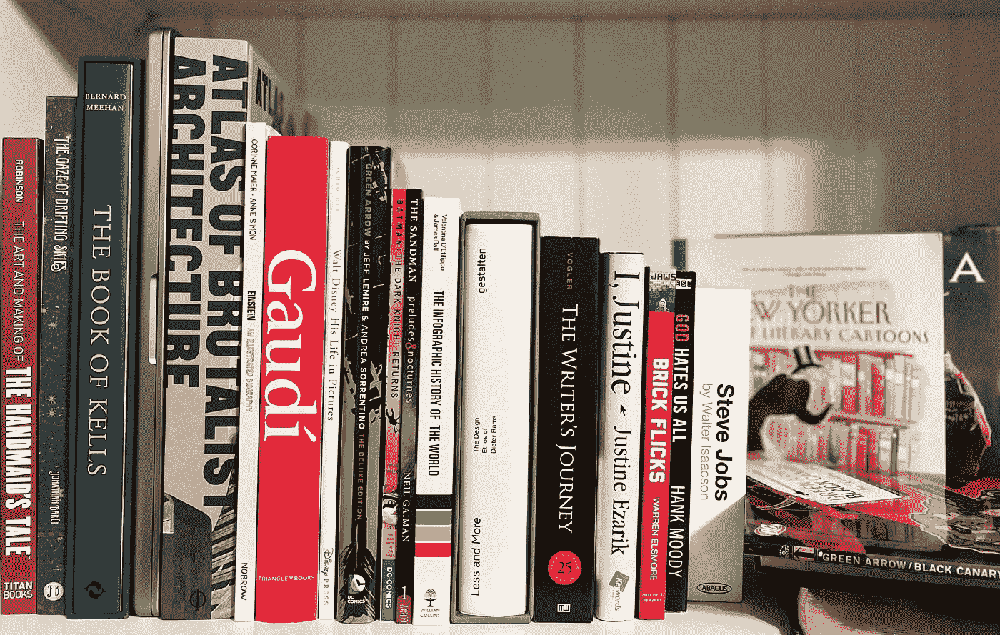

# 以下是我对 M1 专业版的看法

> 原文：<https://medium.com/nerd-for-tech/heres-what-i-would-change-about-the-m1-pro-3b4e1c681aa6?source=collection_archive---------3----------------------->

在真正的“寻找瓦尔多”风格中，找到 MacBook Pro 16”…照片由 [Attila Vágó](https://medium.com/u/2053aaf853f5?source=post_page-----3b4e1c681aa6--------------------------------) 提供

好的。所谓的“冷却期”已经结束。蜜月已经结束，我们度过了一些美好的日子，但说了一些话，没有一句是我后悔的，所以收拾你，把你送回你爸爸那里——很押韵，不是吗？好消息是，这就是它的全部功能。**不，我不会把我的 M1 Pro 寄回去。**这里没有买家后悔的意思，但就像生活中的所有事情一样，新鲜感会很快消失，而且…