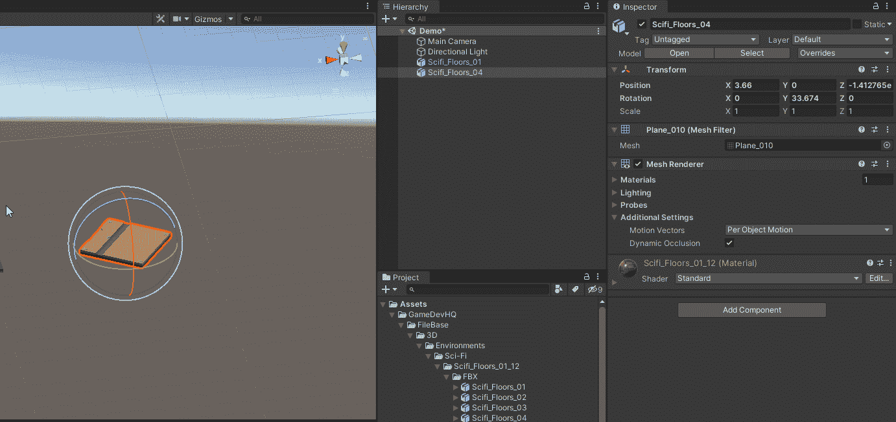
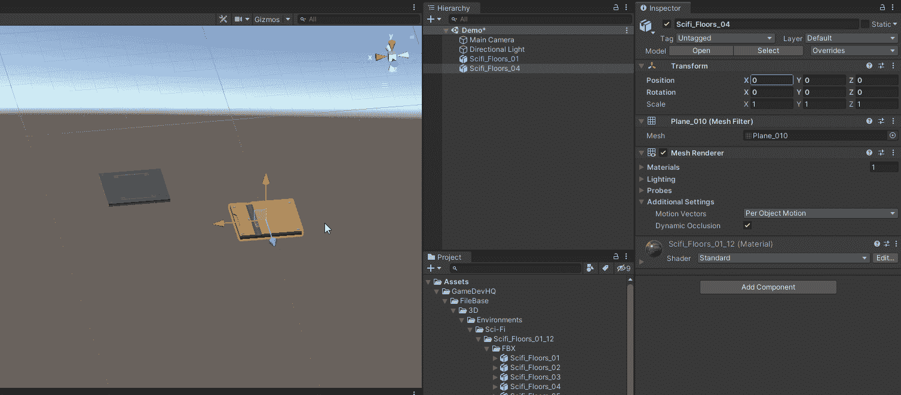
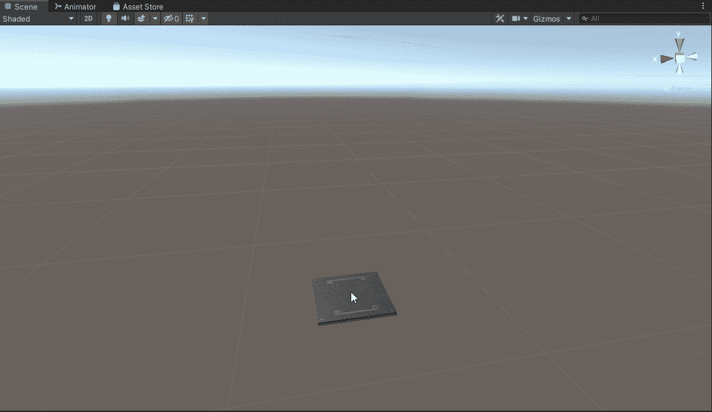
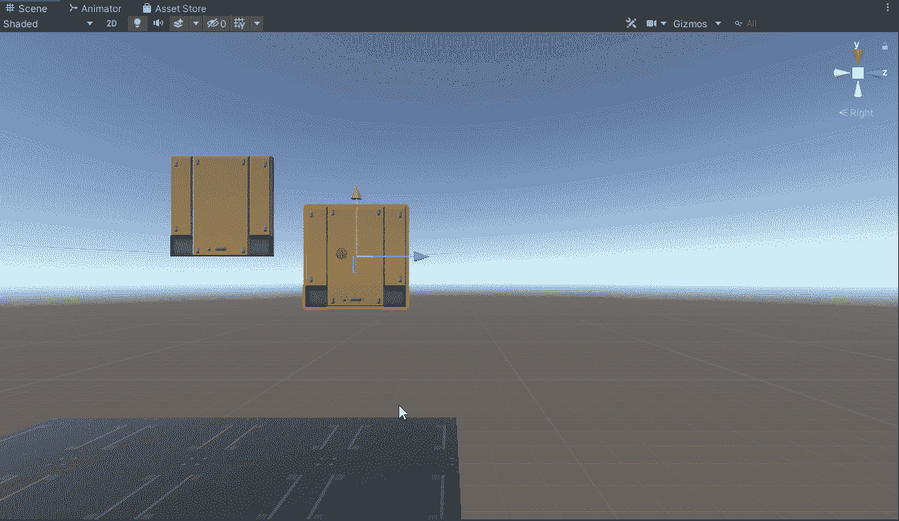

# 简化关卡设计的隐藏快捷方式

> 原文：<https://medium.com/nerd-for-tech/hidden-shortcuts-to-making-level-design-easier-b15df29f7e83?source=collection_archive---------10----------------------->

**目标:**使用快捷键来帮助简化关卡设计

在这篇文章中，我将与你分享三个快捷方式，你可以在创建环境时使用它们来帮助你更快更容易地创建环境。

1.  移动和旋转对象时使用 control 键。当您正常移动或旋转对象时，它们会以小增量移动，如下所示

移动物体

当您按住 Ctrl 键移动或旋转对象时，四分之一的增量将帮助您更加精确，尤其是当您试图对齐多个对象时。这将在下面演示。

移动对象时使用 Ctrl 键

2.使用 Ctrl 键和 D 键一次选择和复制多个对象。这方面的一个例子是创建具有多个标题的楼层。我将在下面演示。按住 Ctrl 键将允许您选择多个对象，然后在按住 Ctrl 键的同时按 D 键复制一个或多个对象。然后，在按住 Ctrl 键的同时，您可以将它们移动到位。

建造一层楼

3.使用捕捉到顶点功能，方法是按住 V 键并将鼠标指针移动到要使用的顶点，然后按住鼠标左键并拖动到要捕捉到的顶点。我将通过为我们的楼层建造一面墙来演示这一点。

使用顶点捕捉

希望这些快捷方式可以帮助你设计和建造新的关卡。

编码快乐！！！！！