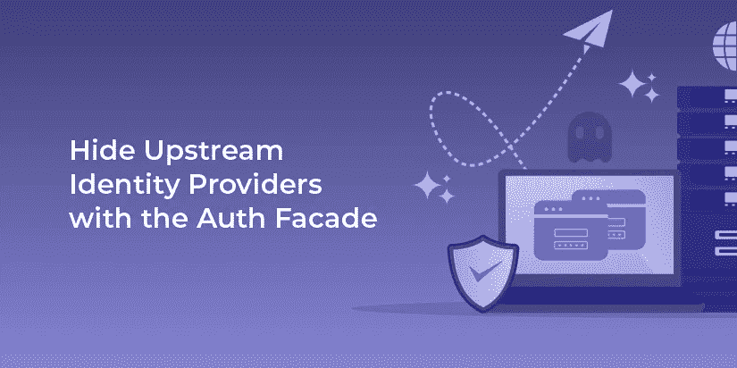
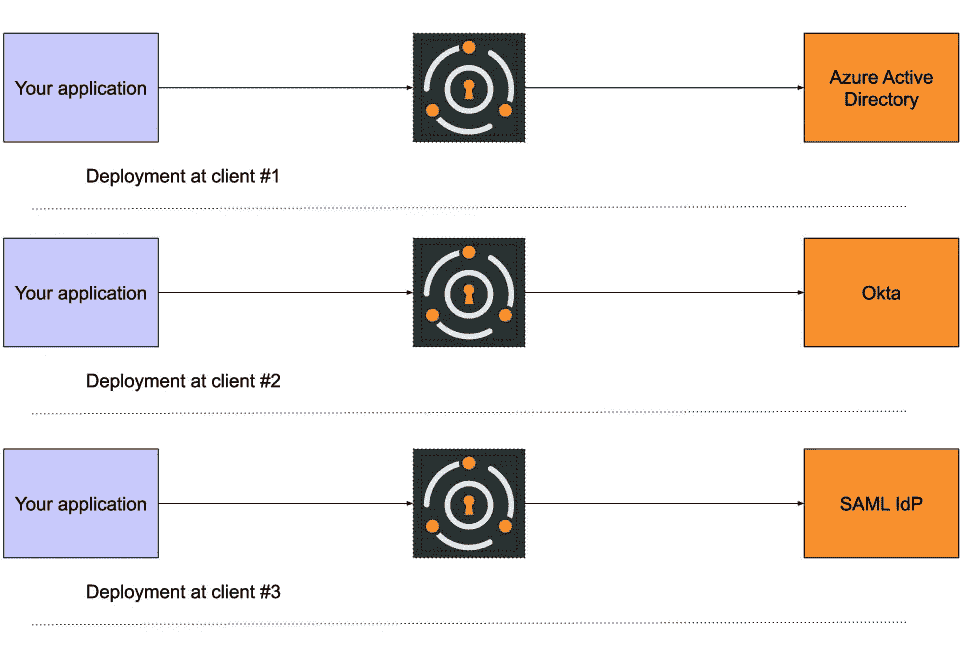

# 使用身份验证外观隐藏上游身份提供者

> 原文：<https://medium.com/nerd-for-tech/hide-upstream-identity-providers-with-the-auth-facade-bf70e4fdfaba?source=collection_archive---------21----------------------->

在与 FusionAuth 客户的交谈中，我看到了一种常见的部署模式，我称之为“Auth Facade”。在将软件部署到异构环境时，这种体系结构非常有用。您和您的团队正在构建一个将在现场部署的应用程序。这可能是数据中心、隔离网络或私有云。这些环境由您的客户运行，您对他们的配置了解有限。

出于各种原因，您可能会选择这种部署模型:

*   数据重力，当您的应用程序需要访问数据时，因为有太多的数据由于成本或性能原因而没有提供给您。
*   机密数据的安全性；客户需要将数据保留在手中。
*   由于部署位置的原因，与互联网的连接时断时续或有损耗。

所有这些都源于客户需求；你在顾客所在的地方会见他们。您的生产部署环境不受您的控制。这种情况在“软件即服务”兴起之前很常见，其复杂性导致了 SaaS 的泛滥。但是，对于这些环境，典型的 SaaS 解决方案，无论是监控、身份验证还是分析，都无法发挥作用。

同时，您的企业客户不希望再维护一个用户数据库。相反，利益相关者希望您的应用程序根据现有的数据存储对用户进行身份验证。这可能是 Azure Active Directory、Okta 或其他身份提供商。此身份提供商由您客户的员工运营，可能支持 OIDC 或 SAML。

但是，您希望确保您的开发人员专注于构建和扩展您的应用程序，而不是构建 auth 集成。您尤其希望避免在不受您控制的 prod 环境中调试身份验证。

最后，您的应用程序也需要用户数据。无论是基于角色的授权、审计访问还是显示“欢迎”消息，您的应用程序都需要访问和修改用户数据。

# 处理上游授权的选项

作为一名企业软件开发人员，您有几种选择来解决这个问题:

*   测试并记录如何配置您的应用程序以使用上游提供程序。这是一个自行解决方案，需要了解客户的部署环境。您需要为所有主要的提供者提供并测试配置选项。
*   代码符合 OIDC 和 SAML 规范，因为大多数企业提供商都支持这些规范。您将把您的用户数据需求限制在这些所能提供的范围内。这是纯联盟选项。
*   使用验证外观。

像任何[外观](https://en.wikipedia.org/wiki/Facade_pattern)一样，auth 外观隐藏了一个子系统。在这种情况下，子系统是您的客户端的身份提供者。当使用这种模式时，作为应用程序的一部分，您将拥有一个嵌入式授权和用户管理系统。所有授权功能都通过此进行路由；它被配置为与上游身份验证提供者通信。

# 身份验证门面与联盟

但是，auth facade 提供的不仅仅是身份验证和授权联邦。联合是一个好的开始，但是有时你需要比标准提供的更多的功能、支持和文档。

当您使用 auth facade 时，您会得到以下内容:

*   开发人员可以通过单一界面访问和管理用户数据
*   一个简单的，可部署的，紧凑的认证系统，可以在任何地方运行
*   一组丰富的 API 和数据模型
*   各种上游供应商的大量文档

让我们更详细地讨论一下其中的每一项。

# 开发者界面

您的开发人员需要某种认证系统，以便知道哪些用户可以访问应用程序，以及用户可以使用哪些特定的功能。通过使用 auth facade，您的开发人员可以学习如何只与一个系统集成，而不是与您的客户可能要求您使用的每个系统集成。这使得开发变得更加容易，并且也解放了对应用程序特性的工程关注。

此外，当身份验证系统中存在错误时，有两个常见位置:

*   在应用程序和外观之间
*   在身份验证门面系统和上游提供者之间

在前一种情况下，您拥有调试导致客户问题的原因所需的一切。在后一种情况下，您将利用 auth facade 系统维护人员的故障排除和 bug 修复专业知识。在任何一种情况下，分离关注点都可以更容易地跟踪问题。

当问题出现时，您需要在 auth facade 系统后面有一个响应团队。您不想让您的客户等待解决方案。

# 可部署授权系统

在评估 auth facade 解决方案时，确保您可以将提供 facade 的系统部署到各种客户环境中。这排除了任何典型的 SaaS 解决方案，除非 SaaS 提供商部署到他们的网络中。能够支持气隙或隔离网络对您的应用来说是一个很大的优势，尤其是在访问敏感数据时。

确保您的应用程序和 auth facade 系统可以使用相同的技术进行部署。这样做降低了安装的复杂性。根据客户的需求，您可能希望部署一个 unix 友好的包，如 RPM 或 DEB，一个通用的软件包，如 zip 文件，或者，对于使用 kubernetes 的尖端客户端，一个容器解决方案，如 Docker。

因为 auth 是应用程序的必要组成部分，但不是区分器，所以最好是一个隐藏在后台的 auth 系统。这应该发生在字面意义上，一个用户界面是不可识别的，与你的应用程序分离，和比喻意义上，你的工程师尽可能减少花费在担心或维护它的时间。

您还需要一个友好的许可证来将身份验证系统嵌入到您的代码中。我不是律师，但请确保您理解任何第三方应用程序或库的许可分支。一些开源项目提供双重许可，这可能是一个可行的选择。

# API 和数据模型

如果您能够使用认证和授权信息的最小公分母，严格遵循 OIDC 和 SAML 标准，您将会很高兴。

但是通常您正在构建的应用程序需要比这些标准所能提供的更多的用户信息。例如，您可能希望存储对您的应用程序有用的自定义域特定属性。

与标准相比，任何 auth facade 解决方案都必须提供更好的数据模型，这样才值得实现。如果没有，就使用标准与上游供应商接口。

# 证明文件

当我与客户交谈时，他们指出了文档的好处，这让我很惊讶。虽然文档通常很有用，但为什么它对 auth facade 如此重要呢？

文档允许您将 auth facade 和上游系统之间的连接配置卸载给了解和维护这些上游系统的人。你客户的这些员工不会熟悉你的应用程序。

事实上，他们可能会对应用程序安装要求他们做的额外工作感到不满。使 auth facade 的配置有良好的文档记录并尽可能简单，将使您的应用程序更容易在客户的环境中工作。

因此，您有两个选择:

*   自己维护这些文件
*   依靠 auth facade 提供者来创建和提供优秀的文档

猜猜哪个对你的工程团队来说更容易？

# 如何用 FusionAuth 实现 auth facade

FusionAuth 是 auth facade 的最佳选择。它可以在任何地方运行，与 SAML 和 OIDC 以及其他上游供应商集成，为您的开发人员提供单一、丰富的界面，并且有很好的文档记录。

要开始使用 FusionAuth 实现 auth facade，请查看 FusionAuth [身份提供者](https://fusionauth.io/docs/v1/tech/identity-providers/)和[连接器](https://fusionauth.io/docs/v1/tech/connectors/)文档，以确保您的客户端的身份提供者受到支持。[如果不是，请联系我们](https://fusionauth.io/contact/)；我们很想了解更多。你也可以阅读客户以这种方式使用 FusionAuth 的案例研究，比如这个来自 [Unsupervised](https://fusionauth.io/resources/unsupervised-case-study.pdf) (PDF)。

如果您认为 FusionAuth 符合您的需求，请[下载 FusionAuth](https://fusionauth.io/download/) ，尝试一下并构建一个概念验证。

如果您有兴趣将其打包为您的应用程序的一部分，请[联系我们](https://fusionauth.io/contact/)讨论经销商协议。

*最初发布于*[*https://fusion auth . io*](https://fusionauth.io/blog/2021/01/27/auth-facade-pattern/)*。*