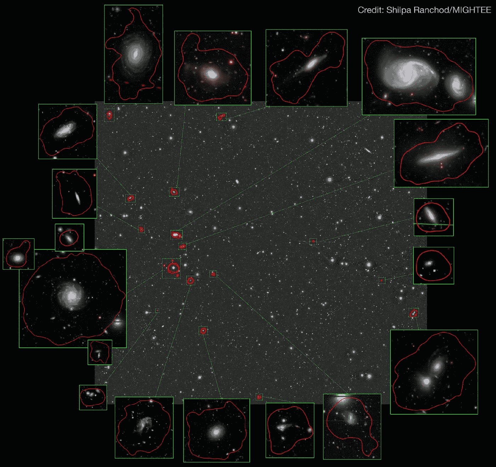

# 隐藏在众目睽睽之下——南非天文学家发现富含气体的星系群

> 原文：<https://medium.com/nerd-for-tech/hiding-in-plain-sight-south-african-astronomers-discover-a-gas-rich-galaxy-group-602601f4957f?source=collection_archive---------14----------------------->

# 猫鼬望远镜带给我们另一个有趣的新发现

鸣谢:希尔帕·拉乔德和米格蒂团队

对于南非天文学来说，这一年开始时，引人注目的是发现了两个用猫鼬望远镜观测到的巨大射电星系。现在仅仅六个月后，第一轮…