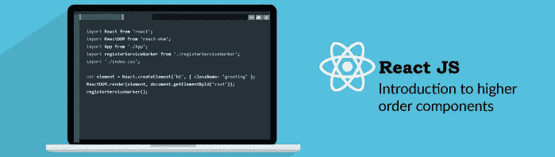

# 高阶组件

> 原文：<https://medium.com/nerd-for-tech/higher-order-components-906e58340d6?source=collection_archive---------0----------------------->



大家好，这次我又带来了另一篇关于 HOC 的文章，所以不浪费时间，让我们开始吧。

如果你是一名计算机科学的学生，我很肯定你听说过 D.R.Y .这个术语，即不要重复自己。它基本上表述为“每一项知识在一个系统中必须有一个单一的、明确的、权威的表示”。

D.R.Y 旨在减少软件模式的重复。当 DRY 原理成功应用时，系统中任何单个元素的修改都不需要改变其他逻辑上不相关的元素。

HOC 是一种在 React 代码库中完成 DRY 的模式。

例如:-假设我们想在 react 中创建几个组件，所有这些组件都有一些共同的**功能**。假设此功能为悬停，即每当组件悬停时，我们都会向用户显示一条消息。现在，我们可以通过在所有组件中重复悬停逻辑或使用 HOC 来实现这一点。

在我们开始讨论 HOC 本身之前，让我们先讨论一些编程概念，这些概念将使学习 HOC 变得更加容易。

> 回调和高阶函数

在 JavaScript 中，函数是“一级对象”。这意味着，就像对象/数组/字符串可以赋给变量，作为参数传递给函数，或者从函数返回一样，其他函数也可以。

回调:-回调函数是作为参数传递给另一个函数的函数，然后在外部函数中调用该函数来完成某种例程或操作。

高阶函数:-一个**高阶函数**是以函数为自变量或者返回函数的函数。

例如:-

```
function add (x, y) {
 return x + y
} 
function addFive (x, addReference) {
 return addReference(x, 10)
}
addFive(10, add) // 20
```

这里 addFive 是高阶函数，addReference 是回调函数。

因为我已经说过了。下面是相同的代码，其中的变量被重新命名，以匹配它们所演示的概念。

```
function add (x,y) {
   return x + y
}  
function higherOrderFunction (x, callback) {
   return callback(x, 5) 
}  
higherOrderFunction(10, add)
```

现在让我们回到我们的主要话题特设:-

高阶分量是:-

*   显然是一个组件
*   接受一个组件作为参数
*   返回一个新组件
*   它返回的组件可以呈现传入的原始组件。

例如:-

```
function higherOrderComponent (Component) { 
  return class extends React.Component { 
    render() { 
      return <Component />   
  }  
 } 
}
```

就这样，现在，我试图用非常简单的术语解释 HOC 的概念和它的基础。在我的下一篇文章中再见。