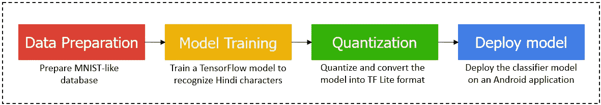
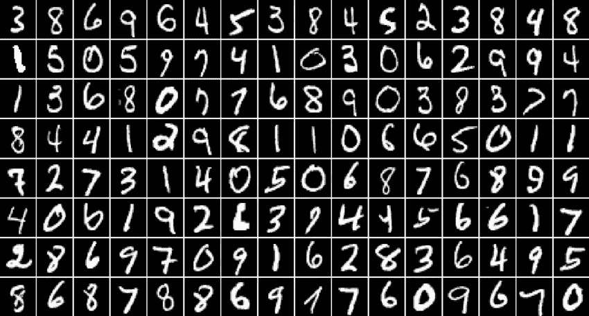
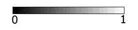
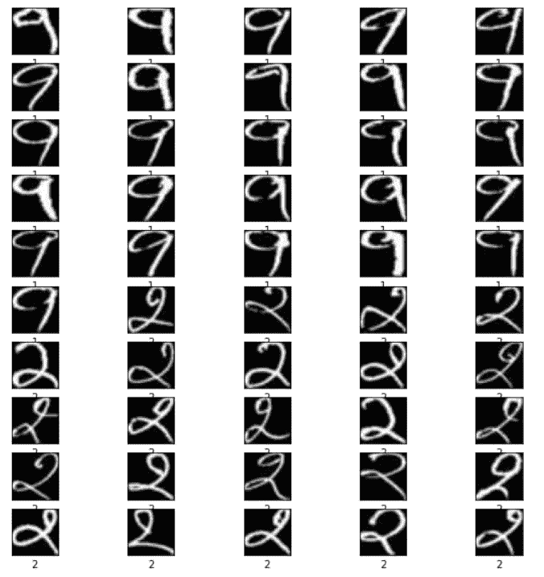
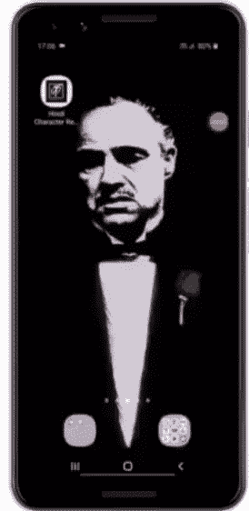

# 使用 TensorFlow Lite 在 Android 上识别印地语字符

> 原文：<https://medium.com/nerd-for-tech/hindi-character-recognition-on-android-using-tensorflow-lite-9948b428905c?source=collection_archive---------1----------------------->

如果您曾经想要构建一个用于文本识别的图像分类器，我假设您可能已经实现了 TensorFlow 官方示例中的经典 [**手写数字识别**](https://www.tensorflow.org/js/tutorials/training/handwritten_digit_cnn) 应用程序。

通常被称为计算机视觉的“Hello World ”,它是 ML 初学者构建分类器应用程序的一个很好的起点。构建自己的自定义分类器来识别任何字符不是很好吗？从今天开始，我们将构建一个印地语字符识别器，但是您可以随意选择一个数据集，或者简单地跟随我。听起来很刺激，对吧？

我们将建立一个能够识别印地语字符的机器学习模型，而且也是从头开始。我们不仅要构建一个 ML 模型，还要将它部署在 Android 移动应用程序上。因此，本文将作为一个端到端的教程，涵盖构建和部署 ML 应用程序所需的几乎所有内容。



端到端流

我会尽可能简单明了地解释一切。你兴奋吗？我非常。

## 数据准备

为了训练一个应该产生良好结果的机器学习模型，我们需要大量数据。你一定听说过 MNIST 数字数据库，对吗？让我们回忆一下。



MNIST 数字数据集

MNIST，因为它代表“修改的国家标准和技术研究所”，是一个流行的手写数字识别数据库，有超过 60，000 个数字 0-9 的图像。现在，了解 MNIST 数据库的外观和格式很重要，因为我们将合成一个“类似 MNIST”的印地语字符数据集。

MNIST 数据集中的每个数字都是 28 x 28 的二进制图像，颜色为白色，背景为黑色。


MNIST 数字的例子

好了，现在我们有了这个想法，让我们合成我们自己的印地语字符数据集。我已经将数据集保存在我的 [**GitHub 库**](https://github.com/NSTiwari/Hindi-Character-Recognition-on-Android-using-TensorFlow-Lite) 中。随意克隆存储库并下载数据集。

该数据集包含所有的印地语元音、辅音和数字。这些图像必须转换成 NumPy 数组(。npz)，以便进行模型训练。下面的脚本将帮助您进行转换。

**导入依赖关系** 我们从导入所需的依赖关系和库开始

```
import tensorflow as tf
from tensorflow import keras
from PIL import Image
import os

import numpy as np
import matplotlib.pyplot as plt
import random

!pip install -q kaggle
!pip install -q kaggle-cli
print(tf.__version__)os.environ['KAGGLE_USERNAME'] = "<your_kaggle_username>"
os.environ['KAGGLE_KEY'] = "<your_kaggle_key>"
!kaggle datasets download -d nstiwari/hindi-character-recognition --unzip
```

**将 JPG 图像转换成 NPZ (NumPy array)格式** 现在需要将训练图像转换成。npz 格式，以便作为输入传递。

```
**# Converts all the images inside HindiCharacterRecognition/raw_images/10 into NPZ format.**
path_to_files = "/content/HindiCharacterRecognition/raw_images/10/"
vectorized_images = []

for _, file in enumerate(os.listdir(path_to_files)):
   image = Image.open(path_to_files + file)
   image_array = np.array(image)
   vectorized_images.append(image_array)
np.savez("./10.npz", DataX=vectorized_images)
```

**加载训练图像 NumPy 数组** 将训练图像矢量化到 NumPy 数组中。换句话说，所有训练图像的像素在值[0，255]之间被矢量化成单个'。npz '文件。

```
path = "./HindiCharacterRecognition/vectorized_images/numeral_images.npz"
with np.load(path) as data:
    #load DataX as train_data
    train_images = data['DataX']
```

**Load the training labels NumPy array** 类似地，各个训练图像的标签也被矢量化并捆绑成单个的’。npz '文件。与 images 数组不同，labels 数组包含从 0 到 n-1 的离散值，其中 n =类的数量。

```
path = "./HindiCharacterRecognition/vectorized_labels/numeral_labels.npz"
with np.load(path) as data:
    #load DataX as train_data
    train_labels = data['DataX']
```

在此示例中，我为 5 个班级(३、अ、क、प和न.)训练模型该数据集涵盖了所有的元音、辅音和数字，因此您可以随意选择任何类别。

```
NO_OF_CLASSES = 5  **# Change the no. of classes according to your custom dataset**
```

**归一化输入图像** 这里，我们通过将每个像素除以 255 来归一化输入图像，使得每个像素保持在[0，1]之间的值。

值为 0 的像素是完全暗的(黑色)，而值为 1 的像素是白色的。0 到 1 之间的任何值都是灰色的，其强度取决于最接近的一端。



色阶在 0 和 1 之间

```
**# Normalize the input image so that each pixel value is between 0 to 1.**
train_images = train_images / 255.0
print('Pixels are normalized.')
```

**检查图像和标签阵列的形状**

*   图像数组的形状应该是(X，28，28 ),其中 X =图像的数量。
*   标签数组的形状应该是(X，)。

*注意:当然，图像的数量和标签的数量必须相等。*

```
train_images.shape
train_labels.shape
```

**可视化训练数据**

```
**# Show the first 50 images in the training dataset.**
j = 0
plt.figure(figsize = (10, 10))
for i in range(550, 600): # Try playing with difference ranges in interval of 50\. Example: range(250, 300)
   j = j + 1
   plt.subplot(10, 5, j)
   plt.xticks([])
   plt.yticks([])
   plt.grid(False)
   plt.imshow(train_images[i], cmap = plt.cm.gray)
   plt.xlabel(train_labels[i])
plt.show()
```



数据集预览

唷，那是一些工作。最后，我们完成了第一步。我们的数据集现在看起来很完美，可以开始训练了。

## 模特培训

好的，目前为止还不错。主游戏现在开始。先说模特培训。

在下面的单元格中，我们定义了模型的层，并设置了超参数，如优化器、损失函数、量化模型性能的指标、类的数量和时期。

```
**# Define the model architecture.**
model = keras.Sequential([
   keras.layers.InputLayer(input_shape=(28, 28)),
   keras.layers.Reshape(target_shape = (28, 28, 1)),
   keras.layers.Conv2D(filters=32, kernel_size = (3, 3), activation = tf.nn.relu),
   keras.layers.Conv2D(filters=64, kernel_size = (3, 3), activation = tf.nn.relu),
   keras.layers.MaxPooling2D(pool_size = (2, 2)),
   keras.layers.Dropout(0.25),
   keras.layers.Flatten(),
   keras.layers.Dense(NO_OF_CLASSES)
])

**# Define how to train the model**
model.compile(optimizer = 'adam',
              loss = tf.keras.losses.SparseCategoricalCrossentropy(from_logits = True),
              metrics = ['accuracy'])

**# Train the digit classification model**
model.fit(train_images, train_labels, epochs = 50)
model.summary()
```

我花了大约 30-45 分钟训练 5 个班的模型，每个班大约有 200 张图像。训练模型的时间将根据您为用例选择的类和图像/每个类的数量而变化。在模特训练的时候，去喝点咖啡。

## 量化

我们已经写了一半了。Keras 模型(. h5)准备就绪。然而，为了能够在移动应用程序上使用该模型，我们需要量化该模型，并将其转换为 TF Lite 格式，这是原始 TF 模型的简化版本。

量化允许在模型的准确性和大小之间进行适当的权衡。随着精度的微小降低，模型的大小可以显著减小，从而使其部署更容易。

**将 TF 模型转换成 TF Lite 模型** 将 Keras 模型转换成 TF Lite 格式需要几个步骤。首先，模型简单地转换成 TF Lite，而不执行量化。

```
**# Convert Keras model to TF Lite format.**
converter = tf.lite.TFLiteConverter.from_keras_model(model)
tflite_float_model = converter.convert()

with open('model.tflite', 'wb') as f:
   f.write(tflite_float_model)

**# Show model size in KBs.**
float_model_size = len(tflite_float_model) / 1024
print('Float model size = %dKBs.' % float_model_size)
```

现在，我们使用量化将模型重新转换为 TF Lite。这大大减小了模型的大小。

```
**# Re-convert the model to TF Lite using quantization.**
converter.optimizations = [tf.lite.Optimize.DEFAULT]
tflite_quantized_model = converter.convert()

**# Show model size in KBs.**
quantized_model_size = len(tflite_quantized_model) / 1024
print('Quantized model size = %dKBs,' % quantized_model_size)
print('which is about %d%% of the float model size.'\ % (quantized_model_size * 100 / float_model_size))
```

最终的 TF Lite 模型已经完成。现在，我们需要导出模型以便能够使用它。

```
**# Save the quantized model to file to the Downloads directory**
f = open('mnist.tflite', "wb")
f.write(tflite_quantized_model)
f.close()

**# Download the digit classification model**
from google.colab import files
files.download('mnist.tflite')

print('`mnist.tflite` has been downloaded')
```

快好了。我们现在有了 TF Lite 模型，可以部署在 Android 应用程序上。你可以在这里 找到整个 Colab 笔记本 [**。**](https://github.com/NSTiwari/Hindi-Character-Recognition-on-Android-using-TensorFlow-Lite/blob/main/Hindi_Character_Recognition.ipynb)

## 部署模型

我定制了 TensorFlow 开发的原[**数字分类器**](https://github.com/tensorflow/examples/tree/master/lite/examples/digit_classifier/android) 应用，改善其观感。在步骤 1 中，您可能已经克隆了存储库。在这种情况下，您应该可以找到 **Android_App** 目录。

将`mnist.tflite`模型文件复制到`Hindi-Character-Recognition-on-Android-using-TensorFlow-Lite/Android_App/app/src/main/assets`目录下。

接下来，在 Android Studio 中打开项目，让它自己构建一段时间。一旦项目构建完成，打开`DigitClassifier.kt`文件，编辑**行 333** ，将`<your_no_of_output_classes>`替换为模型中输出类的数量。

同样，在`DigitClassifier.kt`文件中，通过根据您的自定义数据集设置标签名称来编辑**第 118 行到第 132 行**。

最后，再次构建项目并将其安装在您的 Android 手机上，享受您自己定制的印地语字符识别应用程序。



最终应用

所以，这是这个博客的总结。简单总结一下:

*   我们从数据准备开始，为由元音、辅音和数字组成的印地语字符合成一个类似 MNIST 的数据集；对图像和标签进行矢量化，以输入神经网络。
*   接下来，我们通过添加 Keras 层来构建模型，然后配置超参数并开始模型训练。
*   在 TF 模型被训练之后，我们将其量化并转换为 TF Lite 格式，以准备部署。
*   最后，我们构建了一个 Android 应用程序(虽然不是从零开始，因为这超出了本博客的范围)，并在其上部署了我们的分类器模型。

我希望你像我喜欢写博客一样喜欢它。如果你想就此谈得更多，请随时通过 [**LinkedIn**](http://www.linkedin.com/in/tiwari-nitin) 与我联系。请继续关注更多关于机器学习的有趣话题，我将在这里讲述端到端的例子。

## 资源

*   [**手写数字识别**](https://www.tensorflow.org/js/tutorials/training/handwritten_digit_cnn)**:**tensor flow 关于训练手写数字识别器的教程。
*   [**数字分类器**](https://github.com/tensorflow/examples/tree/master/lite/examples/digit_classifier/android)**:**tensor flow 在 Android 上进行数字分类的官方示例。