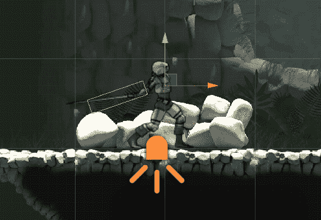
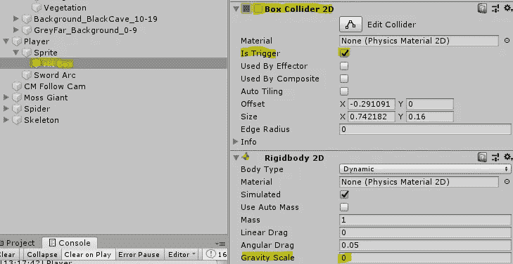
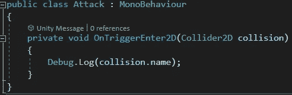
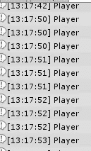
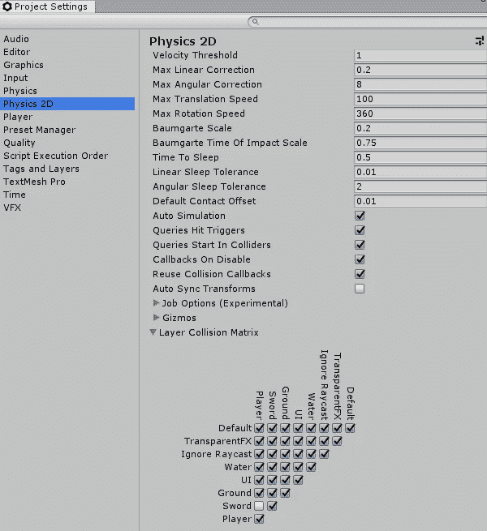
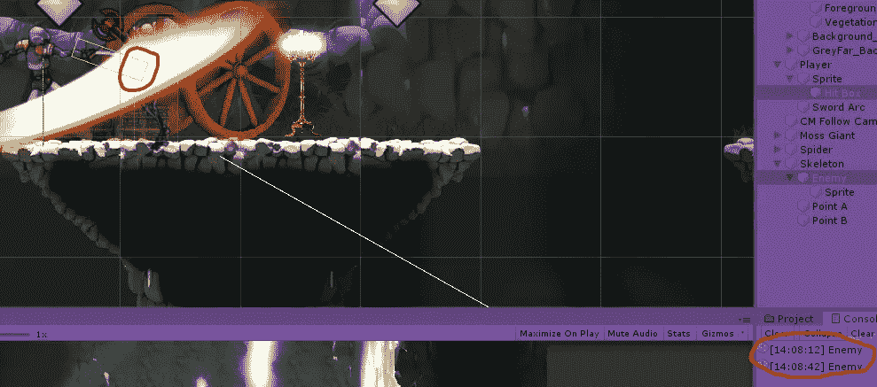

# Hitbox 动画

> 原文：<https://medium.com/nerd-for-tech/hitbox-animation-2943efd4a541?source=collection_archive---------10----------------------->

目标:创建一个随角色动画移动的点击框。

我们首先在玩家的精灵下创建一个名为*击中框*的空游戏对象。这个物体将会有一个*箱式碰撞器 2D* 设置为*被触发*和一个*刚体 2D* 与*重力比例*设置为 *0* 。我们将禁用*箱式碰撞器 2D* ，这样它就不会“击中”任何东西，除非玩家正在攻击。

现在我们将打开精灵的*攻击*动画并进入录制模式。我们将启用命中框的*框碰撞器 2D* ，设置它的位置，并调整碰撞器的大小以匹配剑。然后我们将移动到动画的下一帧，根据需要移动点击框并调整其大小。我们必须为动画的每一帧做这件事！

由于*箱子碰撞器 2D* 默认关闭，一旦玩家精灵离开攻击动画，*箱子碰撞器 2D* 将再次被禁用。

现在我们将把一个*攻击*脚本添加到 Hit 框中。现在，我们只是让它告诉我们它击中了什么。

啊哦，玩家每次挥剑都是在打自己！

让我们使用*层*来帮助我们解决这个问题。我们将添加一个*剑*层，并为其分配命中框。我们还将创建一个*玩家*层，并将其余的玩家对象分配给该层。接下来，我们将进入*编辑→项目设置*和*取消选中*剑*和*玩家*层相遇的方框。*

现在我们可以看到玩家击中了敌人！

