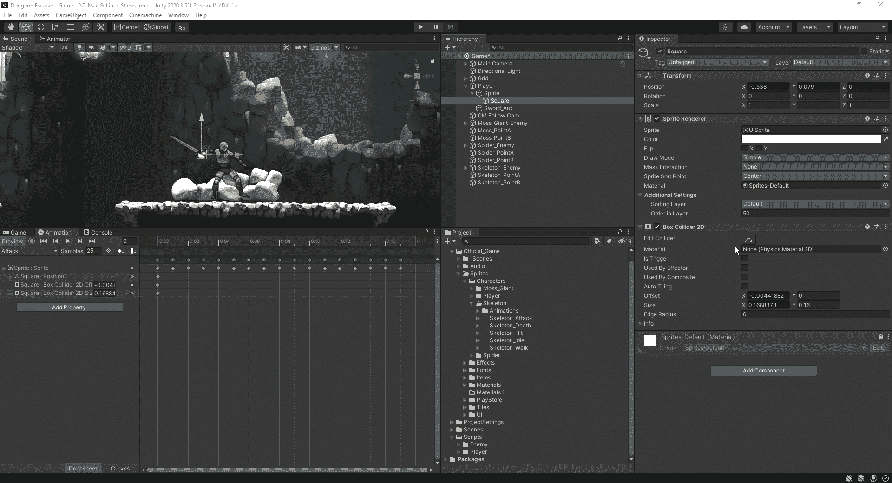
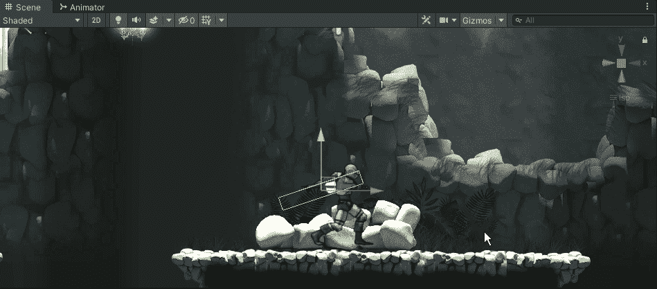
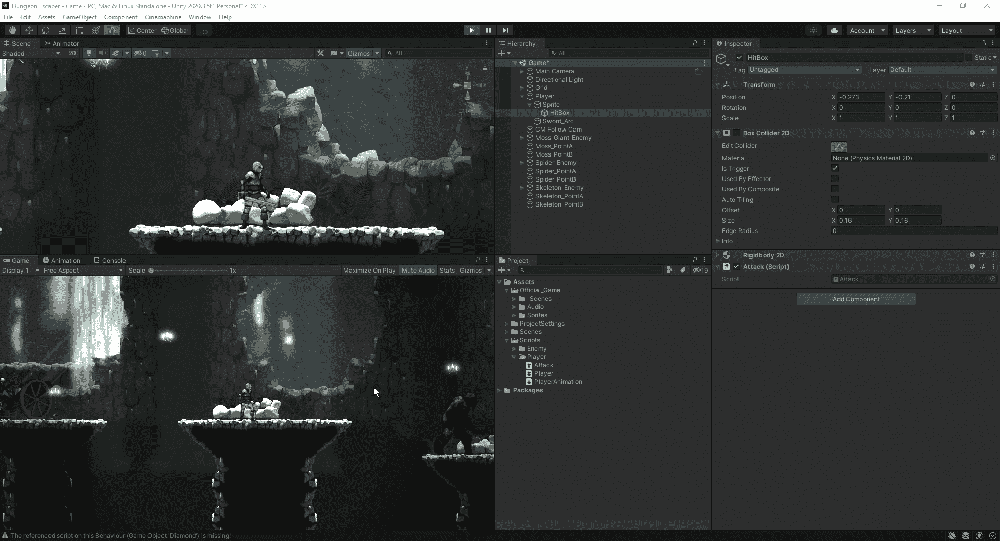
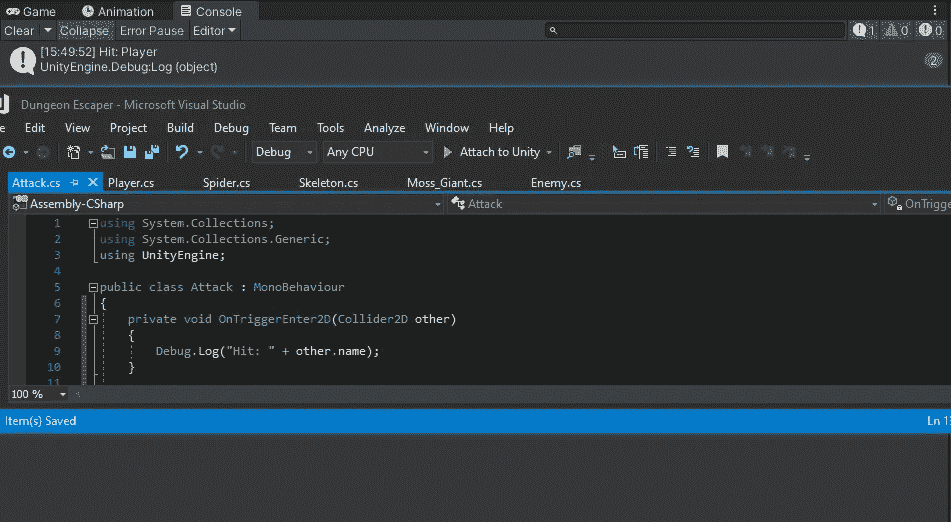
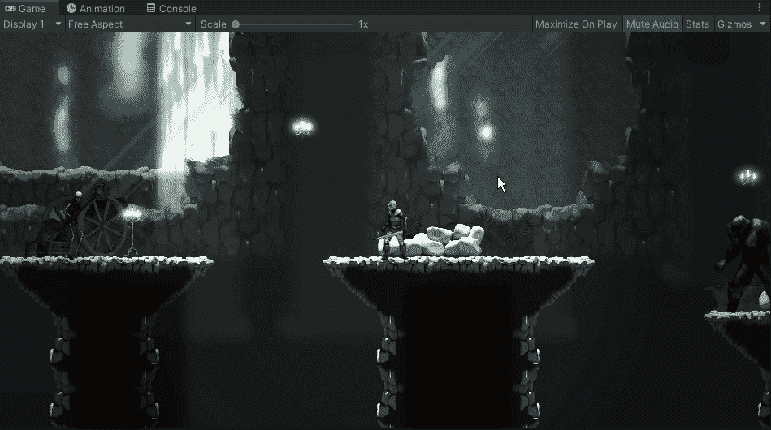

# Hitbox 攻击系统单元 2D

> 原文：<https://medium.com/nerd-for-tech/hitbox-attack-system-unity2d-3d3230a00b5b?source=collection_archive---------5----------------------->

现在我们的游戏中有敌人了，让我们开始让我们的剑有杀死敌人的能力。首先，我们需要看看如何用我们角色的攻击动画摆动来创建一个 hitbox。
首先，我们将创建一个新的 sprite 作为我们的 sprite 模型的子对象，并遍历动画帧，以便我们可以将剑的移动与我们为其创建的 hitbox 的移动配对:

一旦我们绘制出了动画的大部分，我们将有我们的盒子跟踪是这样的:

最后，我们将一直关闭我们的碰撞器，除了我们使用攻击的时候:

现在，让我们为我们的 hitbox 制作一个脚本，并检查它是否能击中玩家:

为了检查，我们只是运行一个快速 debug.log，让 unity 知道告诉我们我们击中的对象，正如我们所看到的，我们正在击中我们的球员。为了解决这个问题，我们将创建几个新的图层。我们将创建一个剑和一个玩家层，在这些层的设置中，我们将让它们彼此不交互:

现在我们已经设置好了，所以我们的剑不会与玩家互动，让我们确保它可以探测到我们的敌人:

好了，我们现在已经为我们的挥剑动画创建了一个击中框，它不会与我们的玩家互动，但会与我们的敌人单位接触，前提是我们在他们身上安装了碰撞器。接下来，我们将看看如何在我们的敌人单位上建立一个 Idamagable 接口。