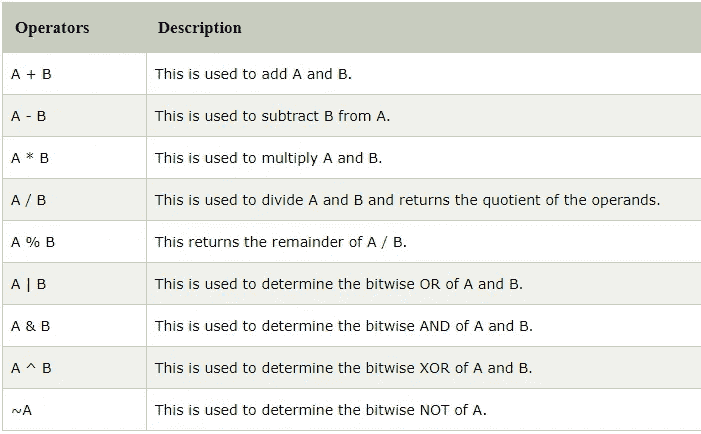
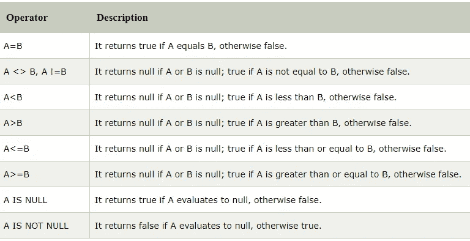
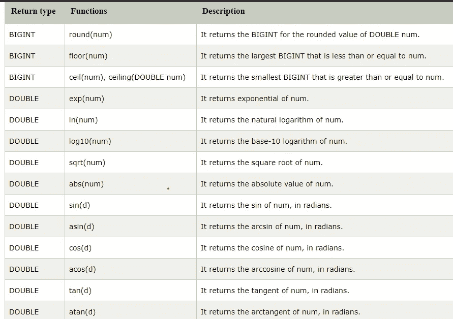
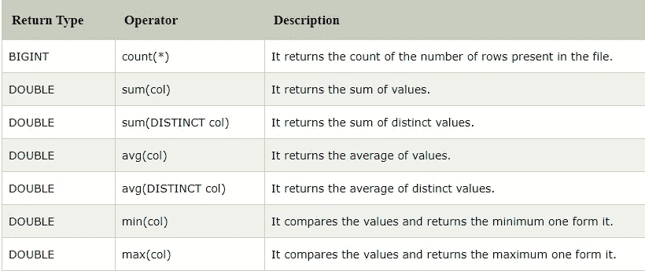
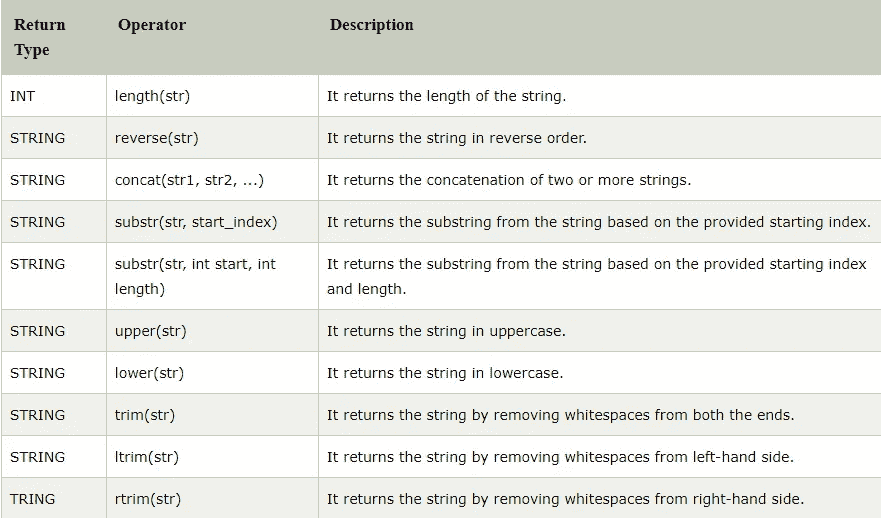

# 配置单元命令

> 原文：<https://medium.com/nerd-for-tech/hive-commands-b5b6957d8820?source=collection_archive---------8----------------------->


马库斯·斯皮斯克在 [Unsplash](https://unsplash.com?utm_source=medium&utm_medium=referral) 上的照片

关于 Hive 的基础知识阅读我的中篇文章，**[**Hadoop-Hive**](https://varchasaaggarwal.medium.com/hadoop-hive-734db0169afa)**。****

**[](https://varchasaaggarwal.medium.com/hadoop-hive-734db0169afa) [## Hadoop — Hive

### Hive 是一个用于分析结构化数据的数据仓库系统。它建立在 Hadoop 之上。那是…

varchasaaggarwal.medium.com](https://varchasaaggarwal.medium.com/hadoop-hive-734db0169afa) 

Hadoop 基础——Hive 文章包含下面列出的一些主题。

*   蜂巢建筑
*   蜂巢的功能
*   蜂巢的局限性
*   配置单元数据类型
*   字符串类型
*   复杂类型。** 

**并且，本文由 Hive 命令组成。**

# **创建数据库**

*   **该命令将创建一个数据库。**

```
hive> create database <database-name>;
For Ex - create database demo;
```

*   **该命令将显示存在的所有数据库。**

```
hive> show databases; 
```

*   **只有在数据库不存在的情况下，该命令才会创建数据库。**

```
hive> create database if not exists <database-name>;
For ex - create database if not exists demo;
```

*   **以键-值对的形式为数据库分配属性。**

```
hive> create the database demo
    > WITH DBPROPERTIES ('creator'='Varchasa Aggarwal', 'date'='18-04-2021');
```

*   **让我们检索与数据库相关的信息。**

```
hive> describe database extended demo;
```

# **删除数据库**

**删除已定义的数据库。**

*   **此命令将删除数据库。**

```
hive> drop database demo;
```

*   **检查数据库是否被删除。**

```
hive> show databases;
```

*   **当且仅当数据库存在时，删除数据库。**

```
hive> drop database if exists demo;
```

*   **在 Hive 中，不允许直接删除包含表的数据库。在这种情况下，我们可以通过先删除表或在命令中使用 Cascade 关键字来删除数据库。**
*   **让我们看看用于删除数据库的 cascade 命令:-**

```
hive> drop database if exists demo cascade. 
```

**该命令首先自动删除数据库中的表。**

# **配置单元—创建表格**

**在 hive 中，我们有两种类型的表—**

*   **内部表**
*   **外部表**

## **内部表**

*   **内部表也称为托管表，因为它们的数据生命周期是由配置单元控制的。**
*   **默认情况下，这些表存储在 hive.metastore.warehouse.dir 定义的目录下的子目录中(即/user/hive/warehouse)。**

```
hive> create table demo.employee(Id int, Name string, Salary float)
    > row format delimited
    > fields terminated by ',';
```

> **这里，该命令还包括数据由'，'分隔的信息。**

*   **让我们看看创建的表的元数据。**

```
hive> describe demo.employee
```

*   **如果表不存在，让我们创建一个表。**

```
hive> create table if not exists demo.employee(Id int, Name string, Salary float)
    > row format delimited
    > fields terminated by ','
```

*   **创建表格时，我们可以向列添加注释，还可以定义表格属性。**

```
hive> create table demo.new_employee(Id int comment 'Employee Id' Name string comment 'Employee Name', Salary float comment 'Employee Salary') comment 'Table Description' TBLProperties ('creator'='Varchasa Aggarwal','created at'='18-04-2021');
```

*   **让我们看看创建的表的元数据。**

```
hive> describe new_employee;
```

*   **Hive 允许通过使用现有表的模式来创建新表。**

> **模式是表示整个数据库的逻辑视图的框架结构。它定义了数据是如何组织的以及它们之间的关系是如何关联的。**

```
hive> create table if not exists demo.copy_employee like demo.employee;
```

**在这里，我们可以说新表是现有表的副本。**

# **配置单元—加载数据**

**一旦创建了内部表，下一步就是将数据加载到其中。**

*   **让我们使用以下命令将文件的数据加载到数据库中:-**

```
load data local inpath '/home/<username>/hive/emp_details'into table demo.employee;select * from.demo.employee;
```

# **配置单元-删除表**

**让我们从数据库中删除一个特定的表。**

```
hive> show databases;
hive> use demo; 
hive> show tables;
hive> drop table new_employee;
hive> show tables; 
```

# **配置单元—更改表格**

**在 Hive 中，我们可以在现有的表中执行修改，比如更改表名、列名、注释和表属性。**

*   **重命名表格**

```
hive> Alter table <old_table_name> rename to <new_table_name>
```

**让我们检查一下表名是否改变了。**

```
hive> show tables;
```

*   **添加一列—**

```
Alter table table_name add columns(columnName datatype);
```

*   **更改列—**

```
hive> Alter table_name change <old_column_name> <new_column_name> datatype;
```

*   **删除或替换列—**

```
alter table employee_data replace columns( id string, first_name string, age int);
```

# **蜂巢划分**

**hive 中的分区可以通过两种方式完成—**

*   **静态分区**
*   **动态分区**

## **静态分区**

**在静态或手动分区中，将数据装载到表中时，需要手动传递分区列的值。因此，数据文件不包含分区列。**

```
hive> use test;
hive> create table student (id int, name string, age int,  institute string)
    > partitioned by (course string)
    > row format delimited
    > fields terminated by ',';
```

*   **让我们检索信息。**

```
hive> describe student;
```

*   **使用以下命令将数据加载到表中，并传递分区列的值**

```
hive> load data local inpath '/home/<username>/hive/student_details1' into table student 
partition(course= "python");hive> load data local inpath '/home/<username>/hive/student_details1' into table student 
partition(course= "Hadoop");
```

*   **现在检索数据。**

```
hive> select * from student;
hive> select * from student where course = 'Hadoop';
```

## **动态分区**

**在动态分区中，分区列的值存在于表中。因此，不需要手动传递分区列的值。**

```
hive> use show;
```

*   **启用动态分区。**

```
hive> set hive.exec.dynamic.partition=true;
hive**>** set hive.exec.dynamic.partition.mode=nonstrict;
```

*   **创建虚拟表。**

```
hive> create table stud_demo(id int, name string, age int, institute string, course string)
row format delimited
fields terminated by ',';
```

*   **现在加载数据。**

```
hive> load data local inpath '/home/<username>/hive/student_details' into table stud_demo;
```

*   **创建一个分区表。**

```
hive> create table student_part (id int, name string, age int, institute string)
partitioned by (course string)
row format delimited
fields terminated by ',';
```

*   **在分区表中插入虚拟表的数据。**

```
hive> insert into student_part
partition(course)
select id, name age, institute, course
from stud_demo;
```

*   **现在，您可以在*选择*命令的帮助下查看表格数据。**

# **HiveQL —操作员**

**HiveQL 运算符有助于执行各种算术和关系运算。**

```
hive> use hql;
hive> create table employee (Id int, Name string , Salary float)
row format delimited
fields terminated by ',' ;
```

*   **现在加载数据。**

```
hive> load data local inpath '/home/<username>/hive/emp_data' into table employee;
```

*   **获取数据。**

```
select * from employee;
```

# **Hive 中的算术运算符**

****

*   **薪金栏增加 50。**

```
hive> select id, name, salary + 50 from employee;
```

*   **从薪水栏中减去 50 英镑。**

```
hive> select id, name, salary -50 from employee;
```

*   **找出每个员工的 10%工资。**

```
hive> select id, name, salary *10 from employee;
```

# **Hive 中的关系运算符**

****

*   **获取工资> =25000 的员工的详细信息。**

```
hive> select * from employee where salary>=25000;
```

*   **获取有工资的雇员的详细信息<25000.**

```
hive> select * from employee where salary **<** **25000**;
```

# **Functions in Hive**

```
hive> use hql;
hive> create table employee_data (Id int, Name string , Salary float)
row format delimited
fields terminated by ',' ;
```

*   **Now load the data.**

```
hive> load data local inpath '/home/<username>/hive/employee_data' into table employee;
```

*   **Fetch the data.**

```
select * from employee_data;
```

## **Mathematical Functions in Hive**

****

*   **Let’s see an example to fetch the square root of each employee’s salary.**

```
hive> select Id, Name, sqrt(Salary) from employee_data ;
```

## **Aggregate Functions**

****

*   **Let’s see an example to fetch the maximum/minimum salary of an employee.**

```
hive> select max(Salary) from employee_data;
hive> select min(Salary) from employee_data;
```

## **Other functions in Hive**

****

*   **Let’s see an example to fetch the name of each employee in uppercase.**

```
hive> select Id, upper(Name) from employee_data;
```

*   **Let’s see an example to fetch the name of each employee in lowercase.**

```
hive> select Id, lower(Name) from employee_data;
```

# **GROUP BY Clause**

**The **HQL Group By** 子句用于根据一个或多个列对来自多个记录的数据进行分组。它通常与聚合函数(如 SUM、COUNT、MIN、MAX 和 AVG)结合使用，对每个组执行聚合。**

```
hive> use hql;
hive> create table employee_data (Id int, Name string , Salary float)
row format delimited
fields terminated by ',' ;
```

*   **现在加载数据。**

```
hive> load data local inpath '/home/<username>/hive/employee_data' into table employee;
```

*   **获取数据。**

```
select department, sum(salary) from employee_data group by department;
```

# **HAVING 子句**

**HQL **HAVING 子句**通过子句与**组一起使用。其目的是对 GROUP BY 子句产生的数据组应用约束。因此，它总是返回条件为**真**的数据。****

*   **让我们使用以下命令，根据 sum >= 35000 的部门，获取雇员的工资总额:**

```
hive> select department, sum(salary) from emp group by department having sum(salary)**>**=35000;
```

# **HiveQL — ORDER BY 子句**

**在 HiveQL 中，ORDER BY 子句执行查询结果集的完整排序。因此，完整的数据通过单个缩减器传递。在执行大型数据集时，这可能需要很长时间。但是，我们可以使用 LIMIT 来最小化排序时间。**

```
hive> use hql;
hive> create table employee_data (Id int, Name string , Salary float)
row format delimited
fields terminated by ',' ;
```

*   **现在加载数据。**

```
hive> load data local inpath '/home/<username>/hive/employee_data' into table employee;
```

*   **获取数据。**

```
select * from emp order by salary desc;
```

# **HiveQL —排序依据子句**

**HiveQL SORT BY 子句是 ORDER BY 子句的替代。它对每个缩减器中的数据进行排序。因此，它执行局部排序，每个归约器的输出被单独排序。它也可能给出部分有序的结果。**

*   **让我们使用以下命令按降序获取数据:**

```
select * from emp sort by order by salary desc; 
```

> **这都是关于 HIVE 命令的。希望你从这里学到了一些东西。**

> **发现有用！请留下掌声。想在这个博客上添加一些东西，添加评论。**

**谢谢你。🙌**