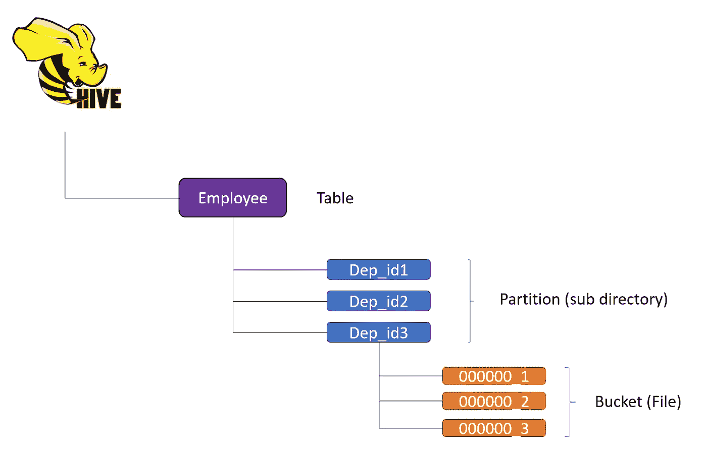

# Hive 数据组织—分区和聚类

> 原文：<https://medium.com/nerd-for-tech/hive-data-organization-partitioning-clustering-3e14ef6ab121?source=collection_archive---------0----------------------->

在 [Unsplash](https://unsplash.com/s/photos/book-shelf?utm_source=unsplash&utm_medium=referral&utm_content=creditCopyText) 上由 [Waldemar Brandt](https://unsplash.com/@waldemarbrandt67w?utm_source=unsplash&utm_medium=referral&utm_content=creditCopyText) 拍照

数据组织影响任何数据仓库系统的查询性能。Hive 也不例外。这个博客旨在讨论分区、集群(分桶)以及围绕它们的考虑。

上图描述了一个被分区和分桶的表的 Hive 所处理的文件的层次结构。表和分区是目录或子目录，而桶是实际的文件。如果我们不应用这些，我们将在员工目录下有一个单独的文件。如果我们应用分桶且不分区，那么我们将有 *N* 个文件，命名为 000000_1 …… 00000_N。如果进行分区，我们将拥有与数据分区所在列的基数相等的目录。如果我们对多个列进行分区，那么子目录的数量就变成了列 1 的基数*列 2 的基数。如果我们同时应用分区和存储桶，那么我们将在分区子目录下得到 N(存储桶数量)个文件。

我提到这些是因为它们有助于决定如何有效地使用这些概念来优化查询执行时间。

# 分割

> *分区依据(Dept_id INT)*

分区是一种将数据负载水平分布到更易管理的块/目录和子目录中的方法。这允许我们以更符合逻辑的方式组织数据。在上图中，我们在 Dept_id 上创建了分区。假设我们有 3 个部门，员工平均分布。在这种情况下，我们将以三个子目录结束。这将基于 Dept_id。这将有助于我们跳过查询中没有与之交互的部门的数据。如果我们处理大量谓词(WHERE 子句)中有 Dept_id 的查询，这有助于提高查询性能。**分区列的数据不存储在文件中。这也很直观，因为我们没有在 create table 表达式中添加进行分区的列。**

## 动态和静态分区

Hive 中的分区管理有两种方式。静态(用户管理器)或动态(由配置单元管理)。

在**静态分区**中，我们需要指定我们想要加载数据的分区。也可以使用添加分区操作来添加分区。

在**动态分区**中，当数据加载操作发生时，根据定义分区的列的值自动创建分区。

要启用动态分区，我们需要使用 set below hive 配置

> *SET hive . exec . dynamic . partition = true
> SET hive . exec . dynamic . partition . mode = non strict*

如果我们不设置第二个选项，那么我们就不能创建动态分区，除非我们至少有一个静态分区。

# 使聚集

> *由(雇员标识)聚类成 3 个*

分桶或群集是一种将数据负载分配到用户提供的一组桶中的方法，方法是计算关键字的哈希，并以桶/群集的数量为模。如果我们已经根据员工 id 对表进行了聚类。在散列和取模后给出相同值的 Emp_id 将进入同一个文件。

> *设置 hive.enforce.bucketing=true*

假设我们有 9 GB 的员工数据，每个部门有 3Gb 的数据(假设员工平均分布在各个部门)。在这种情况下，我们将有大约 9 个文件(9Gb)/(部门数量(3) *集群数量(3))= 1Gb/文件存储员工数据。

分桶适用于采样和连接优化技术。在星型模式中，事实表分桶是一个很好的起点。

分桶可以独立于分区进行。在这种情况下，文件将位于表的目录下。

# 考虑

1.  使用中的分区方案应反映普通过滤。

2.分区列应该具有非常低的基数。较高的基数会创建太多的分区。这将创建大量的文件和目录。这将增加 hive metastore 的开销，因为它需要保存分区的元数据。

> SET hive . partition . pruning = strict

3.这确保了如果有人在没有谓词的情况下对分区表发出查询，它将抛出编译错误。

4.小心处理动态分区，因为它会导致大量的分区。

5.确保创建存储桶时每个文件都不会太小(小于 HDFS 数据块大小)。好的阈值应该在 1GB 左右。

6.虽然我们可以基于多个列进行聚类，但是应该谨慎使用。

7.分桶适用于高基数属性。一般通过选择*组中常用的属性，或者通过*子句选择*顺序*

8.创建表后，不能更改存储桶的数量。

9.(文件大小/存储桶数量)> HDFS 块大小。

希望对你有用。

> 参考资料:

[https://journalofbigdata . springer open . com/articles/10.1186/s 40537-019-0196-1](https://journalofbigdata.springeropen.com/articles/10.1186/s40537-019-0196-1)