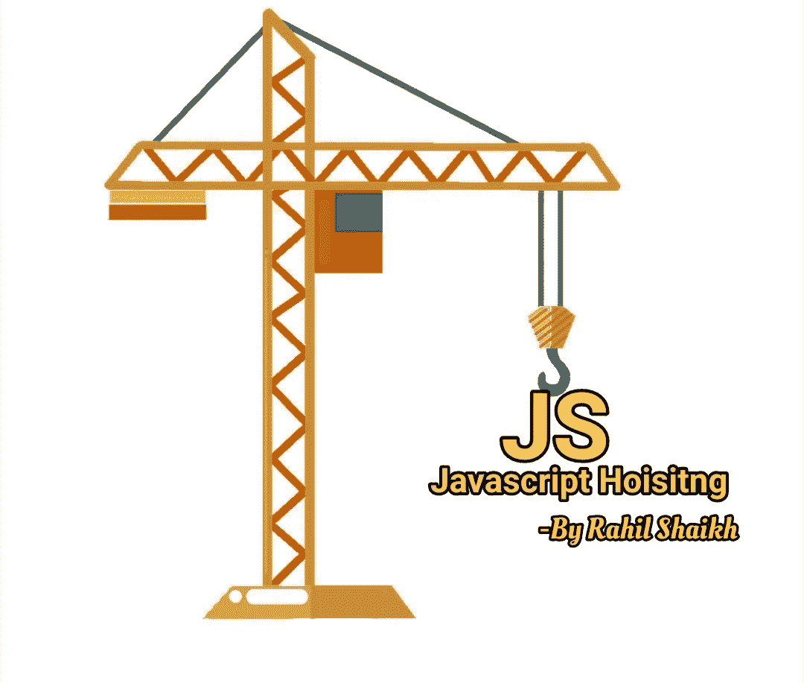
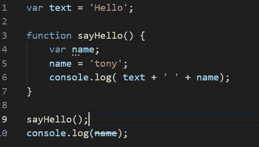
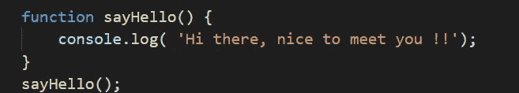

# 在 JavaScript 中提升

> 原文：<https://medium.com/nerd-for-tech/hoisting-in-javascript-7d17d28b4abb?source=collection_archive---------4----------------------->

**了解 JavaScript 的提升行为。**



JavaScript 的独特行为之一是变量和函数提升，提升使我们能够在变量或函数被声明之前使用它。

***无论我们在哪里声明变量和函数，JavaScript 都会在编译阶段将其移动到作用域的顶部。这里需要注意的一点是 JavaScript 只提升声明而不是初始化。用 var 关键字声明的变量也被提升，而不是用 let 和 const 关键字*声明的变量**

我们将在下面看到各种例子，帮助我们更好地理解 JavaScript 的变量和函数提升行为。

## 举例理解:

下面我们将看到各种场景，并理解什么时候起重工作，什么时候不工作。

## 可变提升📌

考虑下面这段代码，看看输出会是什么？

```
name = ‘tony’console.log(name);var name;
```

**输出**:托尼

尽管我们在声明变量之前已经初始化了变量 **name** ，但是当 JavaScript 将声明移动到作用域的顶部时，我们的程序将输出显示为 **tony** ，所以这就是程序的实际行为。

```
var name;name = ‘tony’console.log(name);
```

**注意📝** : ***虽然看起来在提升中声明在程序中上移了，但这里实际发生的是函数和变量声明在编译阶段被添加到内存中。***

让我们看看，如果我们在 console 之后声明并初始化变量，会发生什么。

```
console.log(name);var name = ‘tony’
```

**输出:**未定义

这里我们得到的输出是未定义的，因为只提升声明，而不是初始化，所以我们的程序实际上如下所示。

```
var name;console.log(name);name = ‘tony’
```

变量声明被移动到顶部，但初始化仍保留在控制台语句之后，因此名称变量被声明但尚未初始化，我们得到的输出为**未定义**。

当变量在函数中声明时，它将被悬挂在函数的顶部，见下面的例子。

```
var text = ‘Hello’;function sayHello() {
name = ‘tony’;
console.log( text + ‘ ‘ + name);
var name;}sayHello();console.log(name);
```

输出:你好，托尼

ReferenceError:未定义名称

当我们试图在函数之外访问控制台语句中的 name 变量时，我们得到了引用错误，因为现在变量 **name** 被提升到 greet 函数的顶部而不是程序的顶部，并且它变成了一个局部变量而不是全局变量，如下所示



## 功能选择📌：

与变量声明被提升并移动到顶部一样，被声明的函数也被提升，见下面的例子:

```
sayHello();function sayHello() {console.log( ‘Hi there, nice to meet you !!’);}
```

你好，很高兴见到你！！

我们在 sayHello()函数声明之前调用了它，并由于提升而获得了所需的输出，程序执行如下:



由于提升，函数声明被移到顶部！

然而，如果我们使用函数作为表达式，那么它不会被提升，因为无论是变量还是函数提升，它只对 var 关键字起作用，见下文。

```
sayHello();let sayHello = function() {console.log( ‘Hi there, nice to meet you !!’);}
```

**输出:**引用错误:初始化前无法访问“sayHello”

## **总结📝:**

**提升是 JavaScript 的默认行为，使我们能够在声明变量和函数之前访问它们**。**提升使用 var 关键字而不是** **let 和 const 关键字，只提升声明而不提升初始化**。**如果一个变量是在函数内部声明的，它将被提升到函数的顶部，而不是全局作用域级别。函数也被提升，但是作为表达式的函数不是**。

我希望这篇文章能帮助你理解 JavaScript 提升，如果你喜欢这篇文章，给它一些掌声👏分享知识。