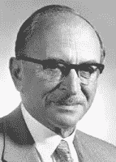
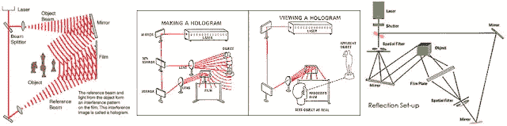
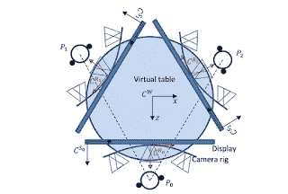

# 全息技术

> 原文：<https://medium.com/nerd-for-tech/hologram-technology-5055885de05f?source=collection_archive---------11----------------------->

# 全息术

## 介绍

*   全息图是一种将光衍射成图像的物理结构。
*   它包括使用激光、干涉、衍射、光强度记录和适当的记录照明。
*   来自对象的散射光然后与相同的参考光干涉，以在感光板全息图上形成干涉图案。

## 历史

丹尼斯·加博尔
(全息摄影之父)

*   英国科学家丹尼斯·加博尔在致力于提高电子显微镜的分辨率时发展了全息摄影理论。它发明于 1940 年。
*   希腊单词 holo 的意思是“整体”, grama 的意思是“信息”。

## 它是如何工作的..？

*   全息照相术基于干涉原理。
*   全息图捕捉两束或多束相干光之间的干涉图样。
*   会通过一些图像进行理解…

## 应用程序

*   医学领域
*   任何产品的广告
*   国防用途
*   空间技术

## 未来范围

*   教育应用
*   医疗应用
*   娱乐显示器
*   科学可视化的 3D 模拟显示
*   电视会议
*   空间和军事应用

## 结论

*   在未来，全息显示器将取代目前所有尺寸的显示器，从小型电话屏幕到大型投影仪。
*   这将导致技术更先进和更复杂的作战形势。

**-哈希尔·图马尔**

**推特:**https://twitter.com/HarshilThummar_