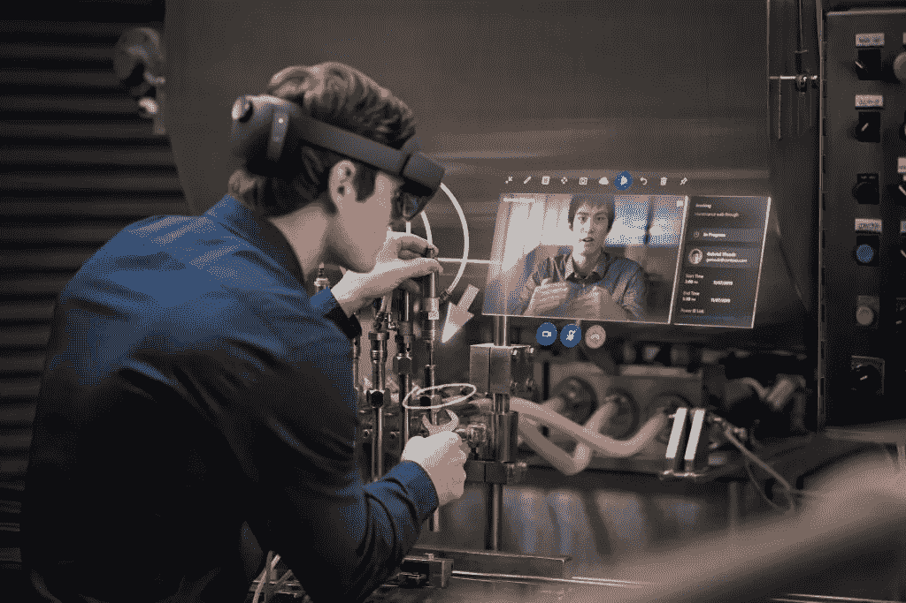

# HoloLens 与 Microsoft Dynamics 365 集成

> 原文：<https://medium.com/nerd-for-tech/hololens-integration-with-microsoft-dynamics-365-ca1afe21a9b5?source=collection_archive---------6----------------------->

# 微软全息透镜

微软 HoloLens 是一对多样化的现实智能眼镜。这些都是微软开发并量产的。在 Windows 10 电脑操作系统下，这些是第一批运行 Windows 混合现实平台的头戴式显示器。在与微软的团队合作中，三星和华硕延长了向微软提出的帮助创建他们自己的混合现实产品的提议，该产品基于 HoloLens 的概念和硬件。

# 应用程序

截至 2016 年，微软 HoloLens 宣布或展示了各种增强现实应用。购买微软 HoloLens 开发者版的开发者将免费获得一套应用。发布时可用的应用程序包括:

*   Cortana，微软的虚拟助手。
*   全息图，用户可以放置和缩放的 3D 对象分布目录
*   全息工作室，全尺寸三维建模应用。
*   CAE VimedixAR 可能是一个商业应用。
*   Skype 电信应用程序的实施
*   HoloTour，一个视听三维虚拟旅游应用
*   碎片，由微软和 Asobo 工作室开发的犯罪惊悚高科技冒险游戏。
*   微软和 Asobo 工作室合作开发的一款平台游戏，Young Conker。
*   微软的增强现实第一人称射击游戏 RoboRaid。
*   Actiongram 是一款用于表演和录制简单混合现实演示视频短片的应用程序。
*   微软在 2018 年 11 月宣布，它正在准备 HoloLens 的战斗。

HoloLens 宣布或展示的其他应用包括:

*   凯斯西储大学和克利夫兰诊所合作的数字人体解剖学和神经解剖学课程。
*   主要商用 HoloLens 应用程序、建筑工程软件设计工具、Trimble Navigation 的 SketchUp Viewer
*   《我的世界》墨江电脑游戏版。
*   Autodesk Maya 3D 创建应用程序的扩展功能。
*   OnSight 和 Sidekick 是由 NASA 和微软合作开发的软件项目，旨在探索混合现实应用。
*   FreeForm 是 Autodesk 和微软之间的项目，将 HoloLens 与 Autodesk Fusion 360 基于云的 3D 开发应用程序集成在一起。
*   微软工作室开发的一个关于银河系的学术应用程序。
*   NASA 反应推进实验室(JPL)正在开发的航天器可视化应用。
*   沃尔沃和微软在 2015 年 11 月展出了 HoloLens 的原型版本。
*   CAE VimedixAR，集成了 HoloLens 的初级超声训练模拟器。它允许医疗保健学习者与人体内部结构的 3D 全息图进行互动，并获得解剖学方面的熟练程度。
*   Holoportation，3D 捕获技术替代，允许重建高质量的个人 3D 模型。
*   HoloSurg，一种混合现实工具，通过使用耳机在手术期间查看 MRI 和放射摄影信息，对患有恶性肌肉肿瘤的患者进行治疗。
*   Microsoft Dynamics 365 Remote Assist 与微软团队合作，在附近的房间向显示屏发送安全的实时视频。

# 微软动态 365

Microsoft Dynamics 365 是企业资源规划(ERP)和客户关系管理(CRM)等应用程序的路线。这是微软在 2016 年 7 月宣布的。商业版包括一个由代号为“Madeira”的项目支持的财务应用程序。企业版包含一些 CRM 应用程序。由于重新打包，ERP 应用程序现在被称为用于财务和运营的 Microsoft Dynamics 365。

# 特色应用

Microsoft Dynamics 365 包含 12 个应用程序:

1.  销售人员——销售主管、销售运营
2.  对于客户服务—客户服务领导、客户服务运营
3.  对于现场服务—现场服务负责人、现场服务运营
4.  对于人力资源——吸引、加入、核心人力资源
5.  对于财务和运营—财务负责人、运营负责人
6.  针对供应链管理—简化规划、生产、库存、仓储和运输。
7.  为了商业
8.  对于项目服务自动化—运营主管、项目主管
9.  营销— Adobe 营销云、Dynamics 365 营销
10.  人工智能——销售人工智能，[客户服务人工智能，市场洞察人工智能](https://www.technologiesinindustry4.com/)
11.  对于混合现实—远程协助、布局
12.  适用于商务中心—适用于中小型企业的 ERP

微软自己使用客户服务模块来管理将 Windows 操作系统更新到最新版本的方法。

# 将 HoloLens 与 Dynamics 365 现场服务集成的优势

使用 HoloLens 的技术人员可以从 Dynamics 365 远程协助查看 Dynamics 365 现场服务预订。如果我们的组织使用 Dynamics 365 现场服务来管理工作订单，他可以在现场服务预订的情况下进行免提呼叫。例如，技术人员可以:

*   景点预订详情
*   快速呼叫分配的协作者
*   保护预订的快照
*   将通话记录保存到与预订相关联的工作单中。

我在这篇文章中分享了下面的视频链接。

https://www.youtube.com/watch?v=2h86OJT9OPolist = plbj 9 jygxruzdi 9 amlprtz 20 py 7 zet 1 isz&index = 2

该视频展示了工业维护系统与全息透镜集成技术的先进发展。通过这种集成，维护变得更加容易&工时得到优化。此外，通过改善团队合作，可以对机械问题进行精确诊断。惊人的技术！！！

更多详情请访问:[https://www . technologiesinindustry 4 . com/2020/12/holo lens-integration-with-Microsoft-dynamics-365 . html](https://www.technologiesinindustry4.com/2020/12/hololens-integration-with-microsoft-dynamics-365.html)