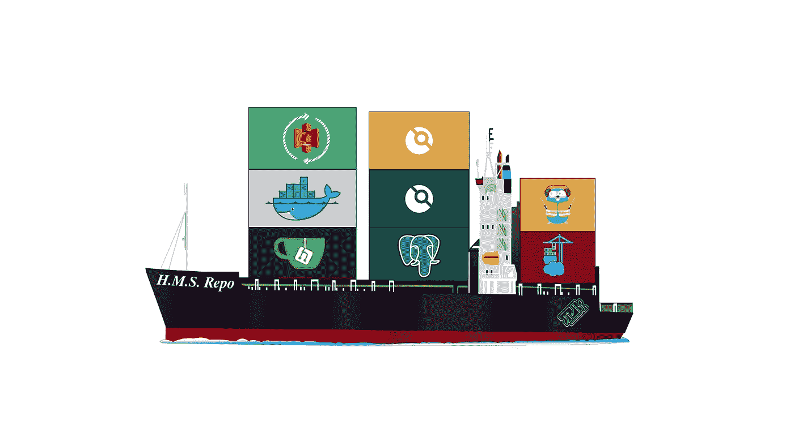

# 家庭开发管道:初级工程师的故事(1/4)

> 原文：<https://medium.com/nerd-for-tech/home-devops-pipeline-a-junior-engineers-tale-1-4-336ed07a6ec0?source=collection_archive---------1----------------------->

*内容:(* [*1*](/@t3chflicks/home-devops-pipeline-a-junior-engineers-tale-1-4-336ed07a6ec0) *)，* [*2*](/@t3chflicks/home-devops-pipeline-a-junior-engineers-tale-2-4-7be3e3c292c) *，* [*3*](/@t3chflicks/home-devops-pipeline-a-junior-engineers-tale-3-4-5f61c5245934) *，* [*4*](/@t3chflicks/home-devops-pipeline-a-junior-engineers-tale-4-4-5db7c1610e3e)



我已经做了一年多的软件工程师，同时也在做自己的很多兼职项目，比如 T3chFlicks(一个教育娱乐频道)。在此期间，我学会了许多不同的技术&技能，然而，直到过去几个月，我设法避开的一个角色是 DevOps。

在这一系列文章中，我将解释如何通过使用几个 Raspberry Pis 构建我自己的家庭开发环境来应用这些新发现的知识。

这种环境允许我做这样的事情:

*   托管我自己的可靠的 Git 回购协议
*   使用 git ( [LFS](https://git-lfs.github.com) )轻松处理大型媒体文件
*   使用 SSL ( [Traefik](https://git-lfs.github.com) )远程访问我的 Git Repo
*   与[码头工人](https://www.docker.com)集装箱一起工作
*   使用 git push ( [无人机](https://drone.io))进行构建、测试和部署
*   监控系统的所有部分([入口](https://www.portainer.io))
*   将构建部署到本地和互联网上的设备组中

我对这项技术仍然缺乏经验，更多的是伟大的想法而不是技能，但自从我第一次开始以来，我已经走了很长的路，我想分享我的旅程和过程。**我这样做是为了学习**。

> [🔗在 Github 上获取 Home DevOps 管道代码📔](https://github.com/sk-t3ch/home-repo)

# 房屋回购

要阅读这些博客文章的其余部分，您必须对 Docker 和 Git 有基本的了解，所以让我们绕一小段路…

## 码头工人

我对 DevOps 的介绍是在我构建了一个将要部署在 AWS ECS ( [弹性容器服务](https://aws.amazon.com/ecs/))集群上的服务之后。这项服务需要“备案”。这意味着它需要在一个可靠的可重新创建的环境(称为容器)中创建。

Docker 是一个集装箱化软件，它使我们能够通过使用一个叫做`Dockerfile`的 YAML 模板来构建环境，从而完成上述工作。我们可以在 Ubuntu 等基础映像的基础上构建我们的环境

```
**FROM** ubuntu:18.04
**RUN** apk update
```

你可以这样运行它:

```
docker build -t myFirstDockerContainer . && docker run myFirstDockerContainer
```

Docker CLI 使您能够控制容器，并从诸如 [DockerHub](https://hub.docker.com) 这样的注册中心推送和拉取图像。然而，您可以使用它来控制更多的东西，包括网络、卷，甚至作为群的一部分一起工作的容器集合。

在我看来，Docker 很棒。主要原因是我花在调试上的时间少了…我讨厌调试。对我来说，软件工程就是创造，我不应该把时间花在软件机械师身上。

继续探索 [DockerHub](https://hub.docker.com) 。如果你最喜欢的软件没有图像，为什么不制作并发布它(最好使用 alpine——最小的基础图像)。

## docker-撰写

在您探索了 Docker 之后，您很快就会想要连接您的独立服务。例如，如果您想运行一个带有数据库的 web 应用程序。为了在单个文件中进行设置，存在 [docker-compose](https://docs.docker.com/compose/) 。

```
version: "3"networks:
  someNetwork:volumes:
  someVolume:services:
  webapp:
    image: someWebAppImagedatabase:
    image: someDatabaseImage
```

Docker-compose 优雅、简单，是我开发实践的一大升级。


照片由 [chuttersnap](https://unsplash.com/@chuttersnap?utm_source=medium&utm_medium=referral) 在 [Unsplash](https://unsplash.com?utm_source=medium&utm_medium=referral) 上拍摄

## 饭桶

对我来说，git 是必须的，即使你在家里做自己的项目。它实在是太有用了。我无法告诉你我已经浏览了多少次 git log 来寻找那段神奇的实际有效的代码。锤子！锤子！锤子！(总有一天我会在 TDD 取得足够好的成绩)。


照片由 [Sean Stratton](https://unsplash.com/@seanstratton?utm_source=medium&utm_medium=referral) 在 [Unsplash](https://unsplash.com?utm_source=medium&utm_medium=referral) 上拍摄

你爱上 git 的方式可能是把你的代码放到一个网站上，比如 Github，然后在上面和其他人合作。你可能接着会想，你做的东西太棒了，以至于别人可能会过来偷走它，而你永远不会成为下一个脸书。所以你决定把它变成私人仓库。

Gitlab 是 Github 的开源替代品。它也很棒，并免费提供了许多令人敬畏的功能。托管服务的一种替代方法是托管您自己的 git 存储库服务器，例如 Gitlab 提供的服务器(该软件需要 4GB 内存用于 1000 个并发用户)，Raspberry Pi 4 包含该服务器，但我宁愿运行较小的独立服务。相反，我选择了 [Gitea](http://gitea.io) 。

没错。稍微绕了一下，现在进入正题——看看这个系列的第二篇文章[这里](/@t3chflicks/home-devops-pipeline-a-junior-engineers-tale-2-4-7be3e3c292c)。

*内容:(* [*1*](/@t3chflicks/home-devops-pipeline-a-junior-engineers-tale-1-4-336ed07a6ec0) *)，* [*2*](/@t3chflicks/home-devops-pipeline-a-junior-engineers-tale-2-4-7be3e3c292c) *，* [*3*](/@t3chflicks/home-devops-pipeline-a-junior-engineers-tale-3-4-5f61c5245934) *，* [*4*](/@t3chflicks/home-devops-pipeline-a-junior-engineers-tale-4-4-5db7c1610e3e)

> [🔗在 Github 上获取 Home DevOps 管道代码📔](https://github.com/sk-t3ch/home-repo)

# 感谢阅读

我希望你喜欢这篇文章。如果你喜欢这种风格，可以去看看[T3chFlicks.org](https://t3chflicks.org/Projects/home-devops-pipeline)了解更多以科技为中心的教育内容( [YouTube](https://www.youtube.com/channel/UC0eSD-tdiJMI5GQTkMmZ-6w) ， [Instagram](https://www.instagram.com/t3chflicks/) ，[脸书](https://www.facebook.com/t3chflicks)， [Twitter](https://twitter.com/t3chflicks) )。