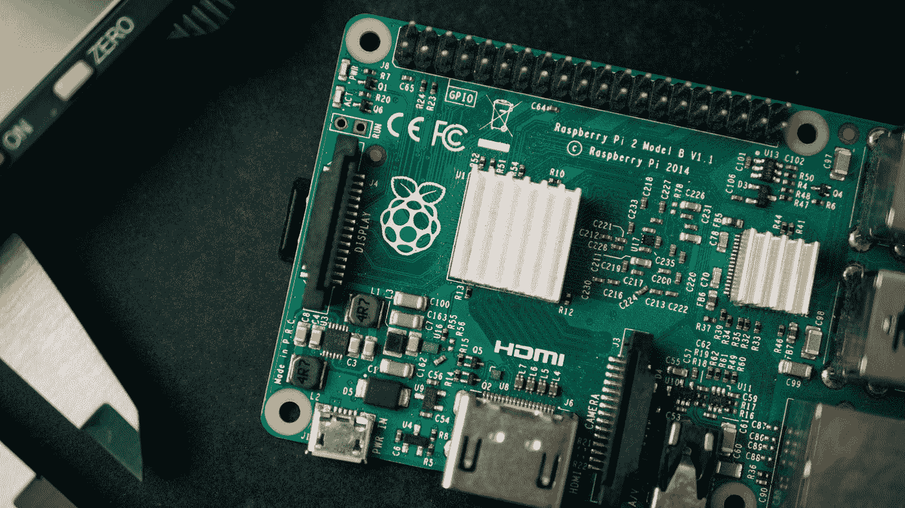
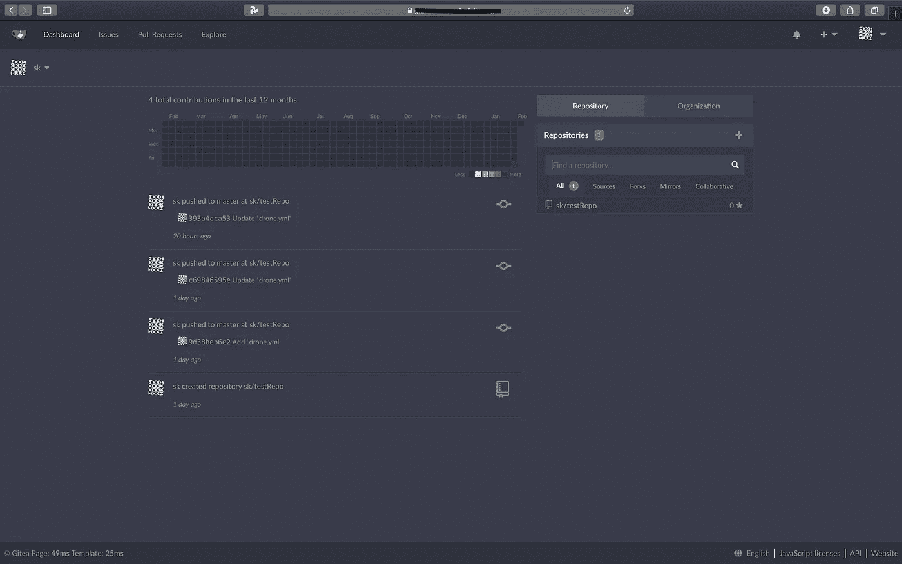
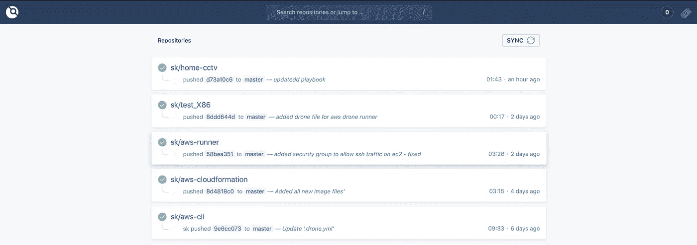

# 家庭开发管道:一个初级工程师的故事(2/4)

> 原文：<https://medium.com/nerd-for-tech/home-devops-pipeline-a-junior-engineers-tale-2-4-7be3e3c292c?source=collection_archive---------0----------------------->

*内容:* [*1*](/@t3chflicks/home-devops-pipeline-a-junior-engineers-tale-1-4-336ed07a6ec0) *，(* [*2*](/@t3chflicks/home-devops-pipeline-a-junior-engineers-tale-2-4-7be3e3c292c) *)，* [*3*](/@t3chflicks/home-devops-pipeline-a-junior-engineers-tale-3-4-5f61c5245934) *，* [*4*](/@t3chflicks/home-devops-pipeline-a-junior-engineers-tale-4-4-5db7c1610e3e)

在这一系列文章中，我将解释我是如何使用几个 Raspberry Pis 和许多软件构建自己的家庭开发环境的。在本文中，我将介绍管道的开发/ CI 部分，从 Git 存储库开始。

> [🔗在 Github 上获取 Home DevOps 管道代码📔](https://github.com/sk-t3ch/home-repo)

# 吉特亚


Gitea 是一个可以安装在机器上的 git 存储库应用程序。这意味着作为标准，存储库的存储是在机器本身上完成的。然而，随着错误的发生，我已经将它升级到一个外置硬盘，并定期备份到 AWS S3。

在家托管自己的回购有很多好处。如果像我一样，你经常编辑视频或大量的大图片，那么用廉价的 WiFi 从互联网上下载东西很慢(10mb/s)，上传简直是愚蠢的(500kb/s)。然而，本地网络存储允许更高的传输速度(有待测量)。

你可能认为大文件和 git 没有任何意义。你完全正确。任何涉及大型二进制文件的编辑都会导致 git repo 的大小爆炸。进入 stage left 解决所有 git/大文件问题: [Git LFS](https://git-lfs.github.com) (大文件存储)——一个以合理的方式存储指定文件的 Git 插件。

*“Git 大文件存储(LFS)将音频样本、视频、数据集和图形等大文件替换为 Git 内部的文本指针，同时将文件内容存储在 GitHub.com 或 GitHub Enterprise 等远程服务器上。”*

Git LFS 意味着我拥有使用心爱的 Git 处理必要的大文件的所有好处，并享受本地网络的高速传输！万岁！


由[亚历山大·辛恩](https://unsplash.com/@swimstaralex?utm_source=medium&utm_medium=referral)在 [Unsplash](https://unsplash.com?utm_source=medium&utm_medium=referral) 上拍摄的照片

我已经介绍了 Gitea 的用例，但没有对它是什么和提供了什么进行过多的解释。为此，你应该看看 Gitea 和其他 Git 库提供者之间的比较。

要创建您自己的 gitea 应用程序，使用`docker-compose`运行这个包含 gitea 和 postgres 映像(生产就绪数据库)的模板:

```
version: “2”networks:
  appnet:
    external: falsevolumes:
  gitea-app:
  gitea-db:services:gitea-app:
    image: webhippie/gitea
    env_file:
      - gitea.env
    container_name: gitea-app
    restart: always
    networks
      - appnet
    volumes:
      - ./volumes/gitea_data:/data
      - ./custom:/data/gitea
    ports:
      - "222:22"
      - "3000:3000"
     depends_on:
      - gitea-dbgitea-db:
    image: postgres:alpine
    container_name: gitea-db
    ports:
      - 5432:5432
    restart: always
    volumes:
      - ./volumes/gitea_db:/var/lib/postgresql/data
    environment:
      - POSTGRES_USER=gitea
      - POSTGRES_PASSWORD=gitea
      - POSTGRES_DB=gite
    networks:
      - appnet
```

在这个文件中，gitea 服务引用了一个文件`gitea.env`。这是 gitea 的配置文件，它允许我们以一种不需要在应用程序内部进行任何设置的方式来设置这个 home repo 这意味着我们可以直接从备份中运行。

运行完`docker-compose up`后，你应该可以在本地网络的`raspberrypi.local:3000`下访问并使用它。快乐的日子。



照片由[哈里森·布罗德本特](https://unsplash.com/@hbtography?utm_source=medium&utm_medium=referral)在 [Unsplash](https://unsplash.com?utm_source=medium&utm_medium=referral) 上拍摄

## 外置硬盘

gitea 启动并运行后，我想添加一个比 Micro SD 卡更大的存储设备。为此，我们只需像这样安装一个硬盘驱动器:

```
sudo mount /dev/sda1 /media/hdd
```

一旦挂载，你可以引用位置`/media/hdd`，就像你引用其他文件夹一样。现在，我们希望能够定期备份该驱动器的内容。很容易地，有人制作了一个码头工人的形象，它就是 https://github.com/istepanov/docker-backup-to-s3。然而，正如预期的那样，这个映像不适合 ARM 架构，所以我使用基于 Pi 的 Raspbian 重新构建了这个映像。

将此添加到我们当前的`docker-compose.yml`中，例如:

```
services:
  backup:
    image: t3chflicks/backuper
    environment:
      - ACCESS_KEY=
      - SECRET_KEY=
      - S3_PATH=
      - CRON_SCHEDULE=0 12 * * *
    volumes:
      - /media/hd:/data:ro
    container_name: backup
    restart: alwaysgitea-app:
    image: webhippie/gitea
    env_file:
      - gitea.env
    container_name: gitea-app
    restart: always
    networks
      - appnet
    volumes:
      - /media/hd/gitea_data:/data
    ports:
      - "222:22"
      - "3000:3000"
    depends_on:
      - gitea-db
```

在 Gitea 配置中启用 Git LFS 后，我们也可以在 repo 上安装 Git 插件，就像`git lfs install`一样简单，然后像这样标记文件:`git lfs track "*.mp4"`。

现在，您可以使用 git repo 来处理大型媒体文件，这太棒了。

## 特拉菲克

拥有一个主存储库是很棒的。但是，因为我不是一个完全的隐士，并且希望与其他人合作，所以我继续向我的回购协议添加外部访问。我使用了 [Traefik](https://traefik.io/) ，反向代理使用来自[的证书进行自动 SSL 加密](http://letsencrypt.org)，并且我使用了来自 [duckdns](https://www.duckdns.org/) 的自由域。

我发现 Traefik 文档有点令人困惑，但事实证明它非常容易添加到当前的 docker-compose 中。

```
version: “2”
networks:
  appnet:
    external: false
  homereponet:
    external: truevolumes:
  gitea-app:
  gitea-db:
  traefik:services:
  gitea-app:
    image: webhippie/gitea
    env_file:
      - gitea.env
    container_name: gitea-app
    restart: always
    networks
      - appnet
    volumes:
      - /media/hdd/gitea_data:/data
    ports:
      - "222:22"
      - "3000:3000"
    depends_on:
      - gitea-db
  depends_on:
    - gitea-db
    - traefik
  labels:
    - "traefik.enable=true"
    - traefik.backend=gitea-app
    - traefik.git.frontend.rule=Host:git.<your_domain>
    - traefik.docker.network=homereponet
    - traefik.git.port=3000gitea-db:
    image: postgres:alpine
    container_name: gitea-db
    ports:
      - 5432:5432
    restart: always
    volumes:
      - /media/hdd/gitea_db:/var/lib/postgresql/data
    environment:
      - POSTGRES_USER=gitea
      - POSTGRES_PASSWORD=gitea
      - POSTGRES_DB=gitea
    networks:
     - appnet

  traefik:
    image: traefik:1.7-alpine
    container_name: “traefik”
    ports:
      - “80:80”
      - “443:443”
    networks:
      - homereponet
    volumes:
      - /var/run/docker.sock:/var/run/docker.sock
      - ./traefik/traefik.toml:/traefik.toml 
      - ./traefik/acme:/etc/traefik/acme
    restart: always
```

这需要一些额外的步骤来创建 acme 文件夹和编辑权限，以及添加这个 traefik.toml 文件

```
debug = false
logLevel = “ERROR”
defaultEntryPoints = [“https”,”http”][entryPoints][entryPoints.http]
address = “:80”
[entryPoints.http.redirect]
entryPoint = “https”
[entryPoints.https]
address = “:443”
[entryPoints.https.tls][retry][docker]
endpoint = “unix:///var/run/docker.sock”
domain = “<your domain>”
watch = true
exposedByDefault = false[acme]
email = “<your email>”
caServer = “https://acme-v02.api.letsencrypt.org/directory"
storage = “acme.json”
entryPoint = “https”
onHostRule = true[acme.httpChallenge]
entryPoint = “http”
```

但是现在，只要您暴露了端口 443 并将流量转发到您的 Pi，您应该能够通过您的 duckdns 地址访问您的主存储库，并且它将在 *https* 上加密。太棒了！



替代茶主题(黑暗模式)

## 雄蜂

我们现在在 Docker 环境中拥有自己的私有 Git 回购设置，包括 Postgres、Git LFS、外部硬盘存储和外部 SSL 加密访问。这很好:我们可以愉快地工作在我们的项目上，知道我们可以轻松地处理大文件，并在任何地方使用 git。

然而，这并不完全是 DevOps。使用 git 可以通过拉请求等方式为您提供代码的持续集成。，但不提供连续交付。为此，我们期待一款名为[无人机](https://drone.io/)的软件。


在 [Unsplash](https://unsplash.com?utm_source=medium&utm_medium=referral) 上由 [Iewek Gnos](https://unsplash.com/@imkirk?utm_source=medium&utm_medium=referral) 拍摄的照片

我们将使用无人机来管理我们构建 Docker 容器、测试和部署到机器的管道。

像目前为止讨论的所有其他服务一样，Drone 在 DockerHub 上有一个[图像](https://hub.docker.com/r/drone/drone)。要将它添加到我们当前的设置中，我们需要将以下内容添加到我们的 *docker-compose* 文件中:

```
services:
  drone:
    image: drone/drone:1-linux-arm
    container_name: drone
    volumes:
      - /media/hdd/drone:/var/lib/drone/
    restart: always
    depends_on:
      - gitea-app
    environment:
      - DRONE_OPEN=true
      - DRONE_GITEA_CLIENT_ID=<gitea_auth_id>
      - DRONE_GITEA_CLIENT_SECRET=<gitea_auth_secret>
      - DRONE_GITEA_SERVER=http://git.<your_domain>
      - DRONE_SERVER_HOST=drone.<your_domain>
      - DRONE_SERVER_PROTO=https
      - DRONE_TLS_AUTOCERT=false
      - DRONE_RPC_SECRET=<drone_runner_secret>
      - DRONE_AGENTS_ENABLED=true
    networks:
      - homereponet
      - appnet
    labels:
      - “traefik.enable=true”
      - traefik.backend=drone
      - traefik.drone.frontend.rule=Host:drone.<your_domain>
      - traefik.drone.port=80
      - traefik.docker.network=homereponetrunner:
    container_name: runner
    image: drone/drone-runner-docker:1
    volumes:
      - /var/run/docker.sock:/var/run/docker.sock
    depends_on:
      - drone
    environment:
      - DRONE_RPC_HOST=drone.<your_domain>
      - DRONE_RPC_PROTO=https
      - DRONE_RPC_SECRET=<drone_runner_secret>
    restart: always
    ports:
      - “3000:3000”
    networks:
      - appnet
      - homereponet
```

现在，当您启动系统并访问`https://drone.<domain>` 时，您会在尝试登录时得到一个错误。这是因为您需要运行 Gitea，首先创建 OAuth 应用程序，然后重新构建您的容器，将`DRONE_GITEA_CLIENT_SECRET`设置为新值——这里的[描述的是](https://docs.drone.io/installation/providers/gitea/)。

您现在可以使用您的 Gitea 凭据登录 Drone。接下来，您应该通过点击大按钮来同步 Gitea 的存储库。下一件你想尝试的事情是做一个构建，为此你应该添加一个`.drone.yml`文件到你的 repo 中，在推的时候，它应该触发一个构建。



每一步都是在隔离的环境中构建，并在无人机上执行。无人机运行程序为一种架构构建，因此我们将只在 Pi 运行程序上构建 Raspberry Pi (arm v7)映像，但对于 x86 构建，我们需要在 AWS 上部署 EC2(稍后将详细介绍)。我的示例无人机文件如下所示:

```
kind: pipeline
name: commitPipelinetrigger:
  event:
    - pushplatform:
  os: linux
  arch: armsteps:
  - name: buildsomething
    image: python:alpine
    commands:
      - echo ‘hello world’
```

瞧，你现在是一个家庭回购骄傲的主人！我们会忽略一个事实，那就是它很可能仍然做不到 Gitlab 开箱即用那么多，但它是你的(呜，资本主义！).

## 登记处

DockerHub 很棒，就像 Github 很棒一样。这是因为他们为人们提供了一个分享工作的地方。然而，正如私人回购的论点是不想共享和快速的本地速度，这同样适用于 Docker 注册中心。

我们将创建自己的空间来存储我们使用 Docker 自己的注册表映像制作的映像。要将它添加到我们现有的 Docker-compose 文件中，我们只需要添加这个额外的服务:

```
registry:
  image: registry:2
  container_name: registry
  restart: always
  networks:
    - homerepone
  volumes:
    - ./volumes/registry:/var/lib/registr
    - ./auth:/auth
  labels:
    - “traefik.enable=true”
    - traefik.registry.frontend.rule=Host:registry.<your_domain>
    - traefik.backend=registry
    - traefik.docker.network=homereponet
    - traefik.registry.port=5000
  environment:
    - REGISTRY_STORAGE_FILESYSTEM_ROOTDIRECTORY=/data
    - REGISTRY_AUTH=htpasswd
    - REGISTRY_AUTH_HTPASSWD_REALM=Registry
    - REGISTRY_AUTH_HTPASSWD_PATH=/auth/registry.password
```

这引用了一个我们使用 apache2-utils bcrypt 散列密码创建的`auth/registry.password`文件，就像这里描述的[一样](https://www.digitalocean.com/community/tutorials/how-to-set-up-a-private-docker-registry-on-ubuntu-18-04)。

运行我们新的`docker-compose.yml`意味着您可以使用`docker login [https://registry.<](https://registry.homerepo4.duckdns.org)your_domain>`通过 docker cli 登录来访问注册表。

我们已经讨论了管道的开发部分，在本系列的下一篇文章中，我们将讨论部署方法。点击查看[。](/@t3chflicks/home-devops-pipeline-a-junior-engineers-tale-3-4-5f61c5245934)

*内容:* [*1*](/@t3chflicks/home-devops-pipeline-a-junior-engineers-tale-1-4-336ed07a6ec0) *，(* [*2*](/@t3chflicks/home-devops-pipeline-a-junior-engineers-tale-2-4-7be3e3c292c) *)，* [*3*](/@t3chflicks/home-devops-pipeline-a-junior-engineers-tale-3-4-5f61c5245934) *，* [*4*](/@t3chflicks/home-devops-pipeline-a-junior-engineers-tale-4-4-5db7c1610e3e)

> [🔗在 Github 上获取 Home DevOps 管道代码📔](https://github.com/sk-t3ch/home-repo)

# 感谢阅读

我希望你喜欢这篇文章。如果你喜欢这种风格，可以去 T3chFlicks.org 的看看更多以科技为中心的教育内容( [YouTube](https://www.youtube.com/channel/UC0eSD-tdiJMI5GQTkMmZ-6w) 、 [Instagram](https://www.instagram.com/t3chflicks/) 、[脸书](https://www.facebook.com/t3chflicks)、 [Twitter](https://twitter.com/t3chflicks) )。