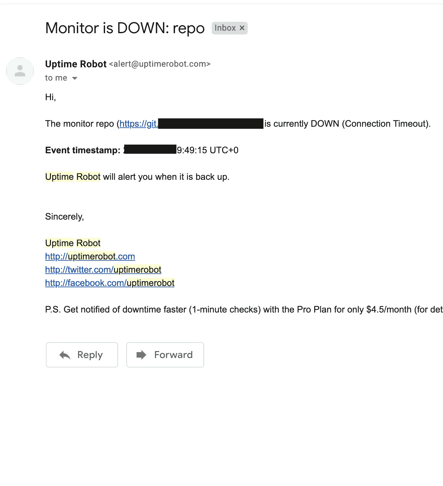
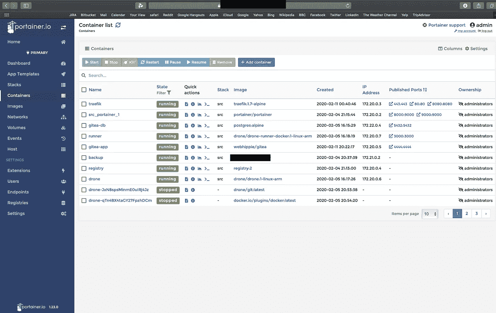

# 家庭开发管道:一个初级工程师的故事(4/4)

> 原文：<https://medium.com/nerd-for-tech/home-devops-pipeline-a-junior-engineers-tale-4-4-5db7c1610e3e?source=collection_archive---------3----------------------->

*内容:* [*1*](/@t3chflicks/home-devops-pipeline-a-junior-engineers-tale-1-4-336ed07a6ec0) *，* [*2*](/@t3chflicks/home-devops-pipeline-a-junior-engineers-tale-2-4-7be3e3c292c) *，* [*3*](/@t3chflicks/home-devops-pipeline-a-junior-engineers-tale-3-4-5f61c5245934) *，(*[*4*](/@t3chflicks/home-devops-pipeline-a-junior-engineers-tale-4-4-5db7c1610e3e)*)*

在这一系列文章中，我将解释我是如何使用几个 Raspberry Pis 和许多软件构建自己的家庭开发环境的。这些文章中引用的代码可以在这里找到[。在本文中，我将介绍我的管道监控，并讨论几个问题。](https://github.com/sk-t3ch/home-repo)

> [🔗在 Github 上获取 Home DevOps 管道代码📔](https://github.com/sk-t3ch/home-repo)

# 监视

我最初想监控我的开发管道的正常运行时间是[upimerobot](https://uptimerobot.com)，这是一个免费的服务，它会定期发出 pings，如果失败，会通过电子邮件发出警报。



示例电子邮件

然而，能够在一个网络应用中监控和修复你的开发管道是非常棒的，portainer 在这一点上做得非常好。

这个应用程序是伟大的，比我想解释的更多的功能。但是它允许检查容器日志、容器中的 ssh，甚至部署新的映像——控制和监视多个主机。



运行中的 Portainer

为了运行 portainer，我将它添加到我的代码 docker-compose 模板中:

```
portainer:
  image: portainer/portainer
  command: -H unix:///var/run/docker.sock
  restart: always
  networks:
  - homereponet
  ports:
  - 9000:9000
  - 8000:9000
  volumes:
  - /var/run/docker.sock:/var/run/docker.sock
  - /mnt/hdd/portainer:/data
  labels:
  - "traefik.enable=true"
  - traefik.backend=portainer
  - traefik.portainer.frontend.rule=Host:portainer.<domain>
  - traefik.docker.network=homereponet
  - traefik.portainer.port=9000
```

## 结束了

这个故事到此为止。我认为这是一个很好的开端，任何人都希望有一个行业风格的开发管道。概括一下，最后的设置是:

[Gitea](https://gitea.io/) 仓库用于存储代码，使用 [git LFS](https://git-lfs.github.com) 用于大型媒体文件。[无人机 CI](https://docs.drone.io/) 构建容器，将它们存储在 [Docker 注册表](https://docs.docker.com/registry/deploying/)，并使用 [Ansible](http://plugins.drone.io/drone-plugins/drone-ansible/) 插件部署到一组本地机器，以及 [cloudformation 插件](https://hub.docker.com/r/t3chflicks/aws-cfn)用于 AWS 部署。 [Portainer](https://www.portainer.io/) 用于监视和控制 UI 中的容器。 [Traefik](https://docs.traefik.io/) 对于带有[的反向代理，让我们在一个自由的](https://letsencrypt.org/docs/) [duckdns](https://www.duckdns.org/) 域上加密自由 https 证书。所有的存储都在硬盘上完成，并且会定期备份到 AWS s3 。


我希望您喜欢这一系列文章。我还在 [T3chFlicks](https://www.youtube.com/channel/UC0eSD-tdiJMI5GQTkMmZ-6w?view_as=subscriber) 上制作了更多的项目，包括其他硬件、3D 打印、智能家居应用和视频形式的机器学习——请查看我们的网站。

## 附录

代号:[https://gitlab.com/t3chflicks/home-repo](https://github.com/sk-t3ch/home-repo)

我一路上学到的一些随机的事情:

*   Docker-compose 必须在启动时所在的目录中进行控制
*   需要为 aws s3 创建策略，因为您只希望 pi 和根 aws 用户能够访问 bucket 并添加加密
*   需要更多地研究备份技术
*   s3 在 10 天后备份到 glacier，这意味着存储成本保持较低
*   树莓 Pi 4 有两个 usb 3.0 接口和两个 2.0 接口。
*   使用 EXFAT 驱动器而不是 HFS+会导致 Postgres 容器失败
*   Gitea 上的 ssh 无法使用端口 22，因为我还没有解决权限问题。为了解决这个问题，我更改了路由器的转发端口，允许 ssh 端口在可接受的范围内(1065+)

*内容:* [*1*](/@t3chflicks/home-devops-pipeline-a-junior-engineers-tale-1-4-336ed07a6ec0) *，* [*2*](/@t3chflicks/home-devops-pipeline-a-junior-engineers-tale-2-4-7be3e3c292c) *，* [*3*](/@t3chflicks/home-devops-pipeline-a-junior-engineers-tale-3-4-5f61c5245934) *，(*[*4*](/@t3chflicks/home-devops-pipeline-a-junior-engineers-tale-4-4-5db7c1610e3e)*)*

> [🔗在 Github 上获取 Home DevOps 管道代码📔](https://github.com/sk-t3ch/home-repo)

# 感谢阅读

我希望你喜欢这篇文章。如果你喜欢这种风格，可以去看看[T3chFlicks.org](https://t3chflicks.org/Projects/home-devops-pipeline)了解更多以科技为中心的教育内容( [YouTube](https://www.youtube.com/channel/UC0eSD-tdiJMI5GQTkMmZ-6w) ， [Instagram](https://www.instagram.com/t3chflicks/) ，[脸书](https://www.facebook.com/t3chflicks)， [Twitter](https://twitter.com/t3chflicks) )。