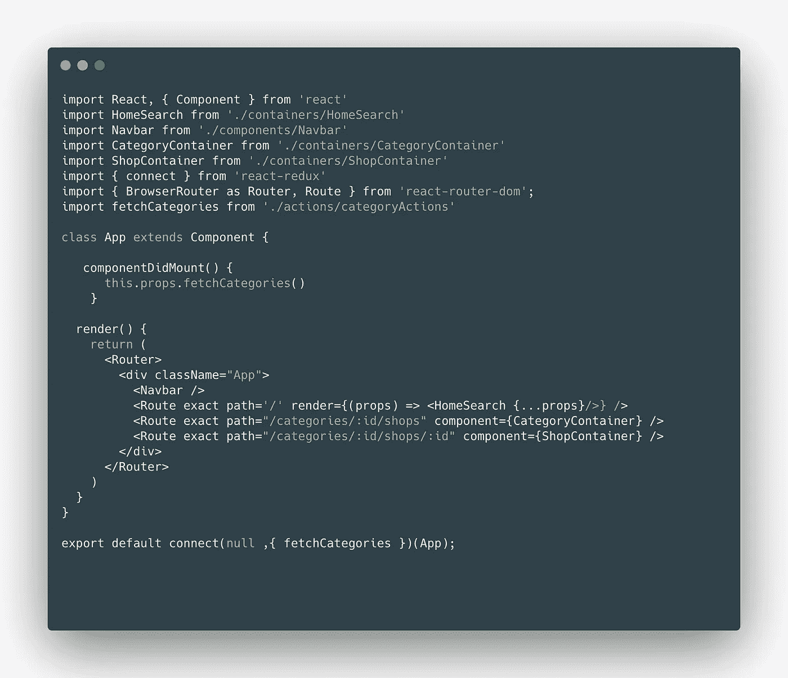
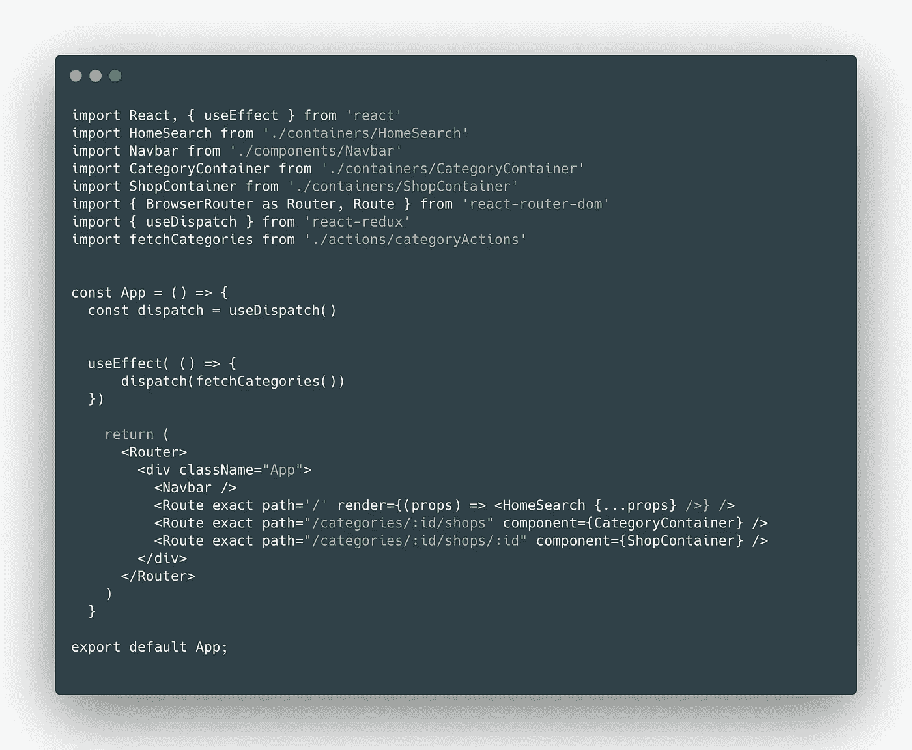
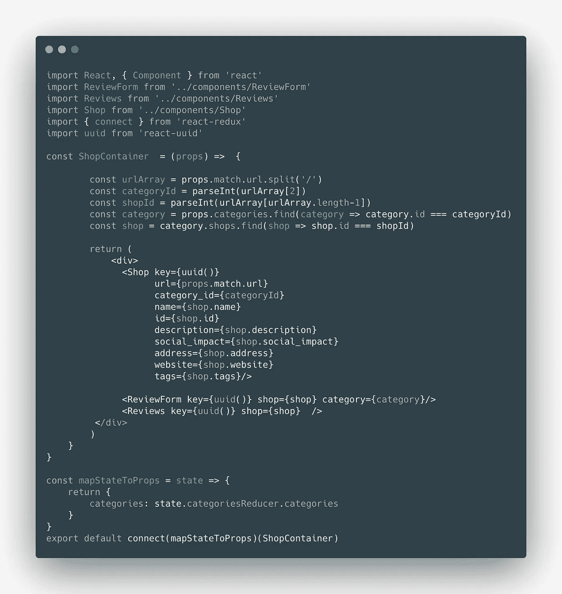
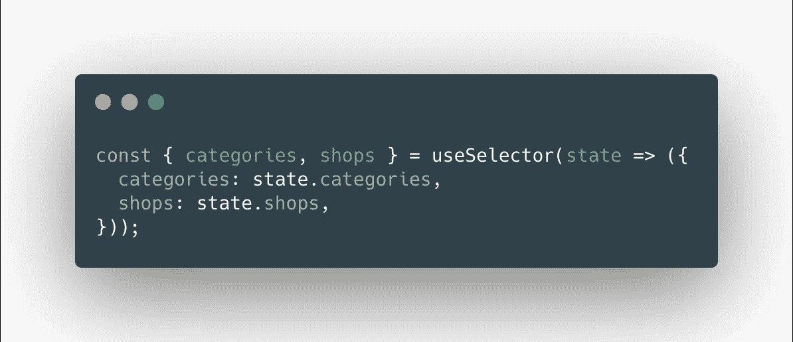
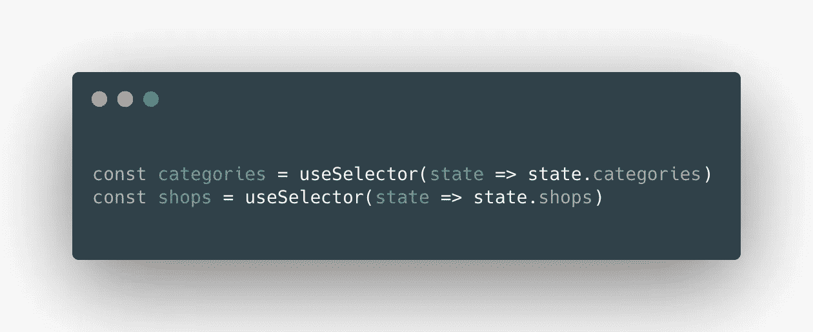

# 挂在 React-Redux 挂钩上

> 原文：<https://medium.com/nerd-for-tech/hooked-on-react-redux-hooks-ba5c90803938?source=collection_archive---------9----------------------->

在用钩子将最近的 React 应用程序的类组件转换为功能组件时，我开始寻找一种方法，不仅可以使用钩子管理本地状态，还可以允许我的组件从 Redux 存储中访问全局状态。

我发现 2019 年发布的 React Redux 版本包括两个新的挂钩`useDispatch`和`useSelector`，允许我们放弃更高阶的`connect`组件，而是使用挂钩将我们的组件连接到 Redux 商店。

`useDispatch`钩子从 Redux 存储中返回对我们的`dispatch`函数的引用。我们可以使用它直接访问我们的调度操作，而不必在组件中使用`mapDispatchToProps`。让我们来看一个前后:

在没有挂钩的情况下将组件的派单连接到我们的 Redux store:

该文件从 React 应用程序中的另一个文件导入调度动作`fetchCategories`，并且还从“react-redux”导入`connect`。为了能够将这个`App`组件连接到 Redux store，我们必须在 connect 中包装我们的`App`组件，将调度动作`fetchCategories`作为第二个参数传递给它。我们将第一个参数设置为`null`,因为我们在这个组件中没有使用`mapStateToProps`。如果是的话，这将是我们的连接包装器中的第一个参数。

下面是这个组件作为一个带钩子的功能组件的样子:

如你所见，它的重量轻了一点，我们去掉了组件底部杂乱的连接包装。我们将在这一个中使用完全挂钩，并用`useEffect`挂钩替换我们的组件生命周期方法。`useEffect`钩子取代了像`componentDidMount`或`componentDidUpdate`这样的组件生命周期方法。这对于开发人员来说非常有用，因为后一种方法已知会给人们带来问题，因为它只有在组件初始呈现后进行更新时才会被触发。

我们没有导入`connect`,而是从‘react-redux’导入`useDispatch`,并将挂钩设置为等于`const dispatch`。这一步是必不可少的，因为`useDispatch`不能在回调中被调用，将它设置为一个变量允许我们在`useEffect`钩子中访问它。导入我们的`fetchCategories`动作仍然是必要的，但是我们不再需要将它导入到组件的 props 中，只要组件被加载到页面上，我们就可以直接调用它。

如果`useDispatch`取代了`mapDispatchToProps`，你可能已经猜到了`useSelector`取代了`mapStateToProps`。让我们仔细看看:

这里我们再次导入`connect`并使用它来包装我们的`ShopContainer`组件，以连接到 Redux 存储并将全局状态映射到组件的道具。我们来看看`useSelector`是什么样子的。

我们没有导入`connect`,而是从‘react-redux’导入`useSelector`,然后实现它，让我们的功能组件直接访问商店。我们可以完全去掉我们的`mapStateToProps`函数，绕过将组件连接到 Redux 存储的需要。如果你问我，我会觉得很酷！

对于`useSelector`有一个警告:`useSelector`使用严格的对象比较(`===`)来确定组件是否应该重新呈现。这与`connect()`不同，后者对`mapState`调用的结果使用浅层相等检查来确定是否需要重新渲染。对于我们上面的例子，这并不重要，但是假设我们从 Redux 存储中返回两个对象。例如:

这里我们的`useSelector`钩子每次被调用时都返回一个不同的对象文字。默认情况下，每次返回一个新对象都会强制重新呈现组件。

解决这个问题的方法是对我们想要检索的每个状态值调用一次`useSelector`:

或者，我们可以告诉`useSelector`使用浅层等式比较:

钩子很棒。一旦你掌握了它们，它们就很容易使用，React-developer 社区显然正在远离类组件，并使用钩子给功能组件提供管理状态和连接 Redux 存储的能力。

React Redux 增加了 Redux 特有的挂钩，这是一种有效的方法，可以简化组件，在概念上更容易理解。

关于 React hooks 的更多信息，请查看我的朋友兼工程师同事 Brock Byrd 的博客，这里是[https://medium . com/geek culture/React-hooks-and-why-you-should-use-them-ab 92 ee 033 e 43](/geekculture/react-hooks-and-why-you-should-use-them-ab92ee033e43)。

和往常一样，查看 React-Redux hooks 文档以获得关于这个主题的更多信息:【https://react-redux.js.org/api/hooks