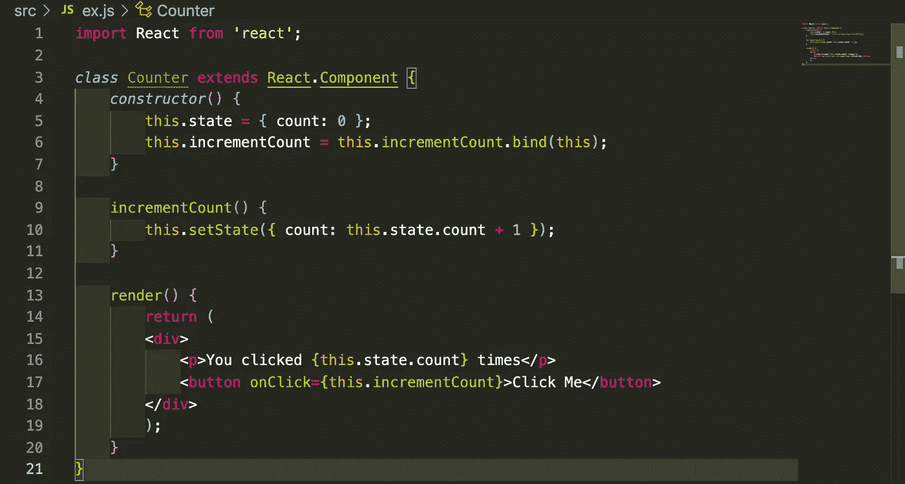
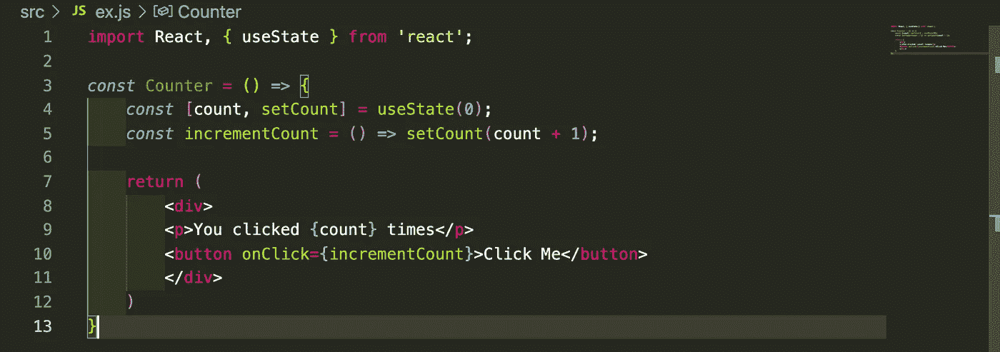

# 钩子和梯子

> 原文：<https://medium.com/nerd-for-tech/hooks-and-ladders-8d4f708b054d?source=collection_archive---------15----------------------->

*React 中使用 useState 钩子的基础知识，以及它如何成为你提高编程技能的阶梯*

作为年轻的开发人员，我们大多数人可能都学会了用基于类的组件的生活方式方法来使用 React。这是牢固掌握如何使用 React 及其组件结构的最简单方法。然而，有一种更好的方法来利用 React 的能力，它的名字叫 Hooks。尽管很复杂，而且可能不得不放弃一些东西，但是使用 hooks 是一个游戏规则的改变者，可以提升任何程序员的编程技能。

# 钩住

这篇特别的博客将关注 useState 钩子，但是总共有 10 个钩子可以作为状态管理和生命周期方法的替代方法。钩子对开发人员非常有益，它们更好地改变了我们编写组件的方式。

它们可以帮助我们编写更清晰、更简洁的代码，这或多或少就是游戏的名字。能够更简单、更容易地向另一个开发人员传达您的代码正在做什么是非常宝贵的。

随着可读性的提高，可测试性也会随着钩子的使用而提高。

# 使用状态

我可以用一个简单的计数器函数演示使用基于类的组件和钩子之间的区别。基本上，它只是一个按钮，通过简单的鼠标点击就可以增加计数。第一个例子需要一个 ***构造函数*** 来建立状态，然后 ***incrementCount*** 函数使用 ***setState*** 来更新按钮被点击后的状态计数。

基于类的组件

注意必须调用 ***的多个实例。*** 任何引用函数或状态前的关键字。这可能会导致代码显得笨拙，并且肯定会增加一些额外的行。

**现在让我们看一下同样的代码示例，只是使用了 useState 钩子……**

首先，我们从 react 顶部导入 ***useState*** 组件。我们不必使用*类*语法或*构造函数*，只需分配一些常量来设置默认计数和 ***setCount*** 来修改它。***increment count***组件更容易阅读，并直接引用 ***setCount*** 。

那不是对眼睛好多了吗！

在你的代码中使用钩子绝对可以作为一个梯子，帮助你作为一个程序员更上一层楼。要理解 React 中这种另类的编码风格，只需要一点重新学习和练习。我希望你喜欢这个钩子世界的小介绍，如果你喜欢我的内容，一定要看看我的其他博客。编码快乐！

 [## Jamon Dixon -全栈开发者-熨斗学校| LinkedIn

### 全栈式 web 开发人员，对事物的工作原理充满好奇，并具有解决问题的能力。拥有强大的…

www.linkedin.com](https://www.linkedin.com/in/jamondixon/)  [## Jamondixon -概述

### 最近毕业于 Flatiron 软件工程专业，拥有 Ruby on Rails、JavaScript、React 和 React Native 等方面的经验

github.com](https://github.com/Jamondixon)