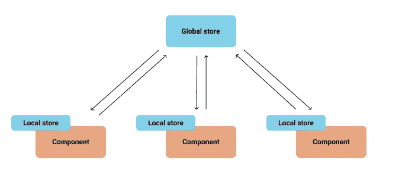
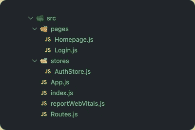

# hook state . js——最简单的 React 状态管理。

> 原文：<https://medium.com/nerd-for-tech/hookstate-js-the-most-straightforward-react-state-management-4bc6e76fa2fe?source=collection_archive---------3----------------------->

这些天来，许多软件包都有其特殊性和独特性。

作为成熟的版本，Redux 太先进了，很难跟上，即使对于新手开发者也是如此。

在本文中，我想介绍 react **Hookstate** 中最简单、最容易的状态管理之一；有了 Hookstate，我们不需要做很多仪式，比如创建 **reducer** 和 **action** ，但是我们可以实现同样好的东西，比如**不可变和单一真理来源**。

啊？另一个州管理层？

**我知道，我知道。但是现在不要介意和忍受它。**

# Hookstate.js

[**Hookstate.js**](https://hookstate.js.org/) 是百州管理图书馆之一。

他们在网站上说:

> 基于 React 状态钩子的快速而简单灵活的状态管理

Hookstate 使用 React hook 来进行状态管理，这样开发人员就可以熟悉它了。

**注意:** Hookstate 使用相同的钩子名来管理状态，可能会让你混淆。`useState`及其从`@hookstate/core`的导入，如果您想与`React.useState`混合，您可以用`import { useHookstate } from @hookstate/core`更改 hookstate 导入。

## 地方政府与全球政府

在 Hookstate 中，你可以用它来做全局状态和局部状态。

**全局状态初始化**

使用全局状态，我们的状态被放在全局空间中，所以所有的组件都可以通过`useState`(从 HookState)访问它。

**本地状态初始化**

这是你如何使用它作为一个地方政府。

# 我们开始吧

在本教程中，为了简单起见，我们将不使用 Typescript 和任何 CSS。我们将创建一个简单的登录系统。

好了，让我们进入代码。

## 图表



存储和图表

## 创建 React 应用

让我们用以下内容创建一个新项目:

```
npx create-react-app hookstate-simple-login
```

您可以将项目的名称更改为您想要的任何名称。

并安装项目所需的其他依赖项。

```
npm install --save @hookstate/core react-router-dom
```

## 文件夹管理



项目目录

我们将使用这个文件夹约定，但是您可以自由地使用任何。

## App.js

App.js 文件中没有什么特别的。我们用`react-route-dom`做导航。

## Route.js

我们将在 routing 中创建两个功能组件:PublicRoute 和 PrivateRoute，这个组件将检查全局授权存储。

## Login.js

Login.js 文件是不言自明的。我们使用`useEffect`来做重定向，通常，你可以在`handleLogin`函数上这样做，但是对于本教程，我想向你展示状态是如何改变的，并通知我们的页面有东西在改变。

## Homepage.js

## 授权商店. js

存储文件夹将保存我们的状态。我们将创建一个`AuthStore`文件，它将实现一个全局状态，并将作为 MVC 模式中的一个模型

我们的存储将公开 react hook: useAuthState()，稍后可以在我们的页面上使用它。

## 运行代码

要调整代码，只需输入`npm run start`

# 结论

React 给你做状态管理的自由，你可以使用任何你想要的库，但是有时候它让 React 感觉很复杂。

使用什么库由你来判断，你必须明智地选择它。

您可以从 Github 克隆这个项目。[https://github . com/psudocode/hookstate-simple-log in-system . git](https://github.com/psudocode/hookstate-simple-login-system.git)

如果这篇文章中有什么遗漏，请在评论区告诉我。

快乐的编码。