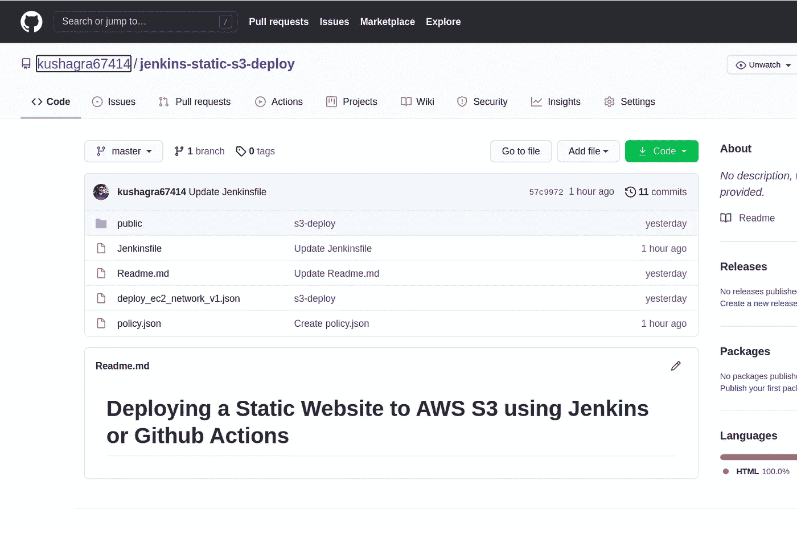
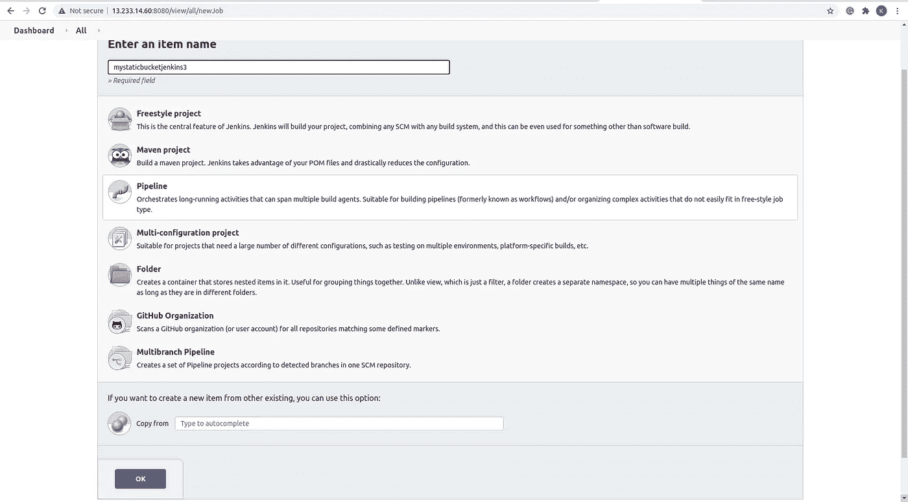
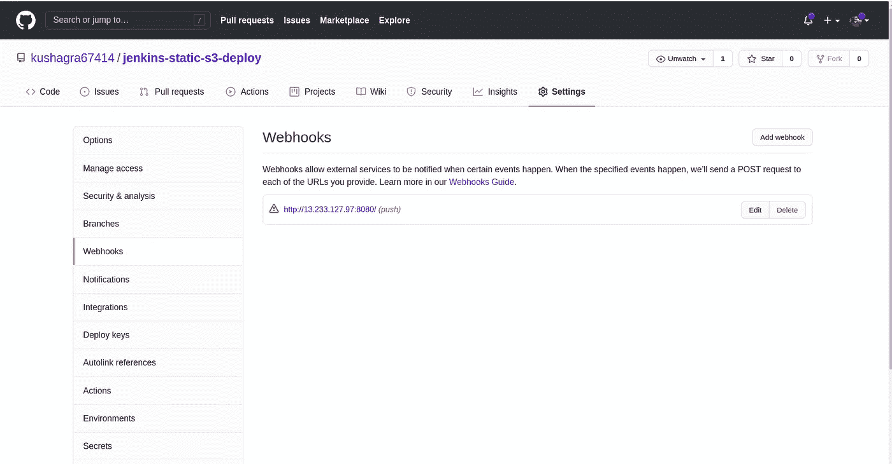
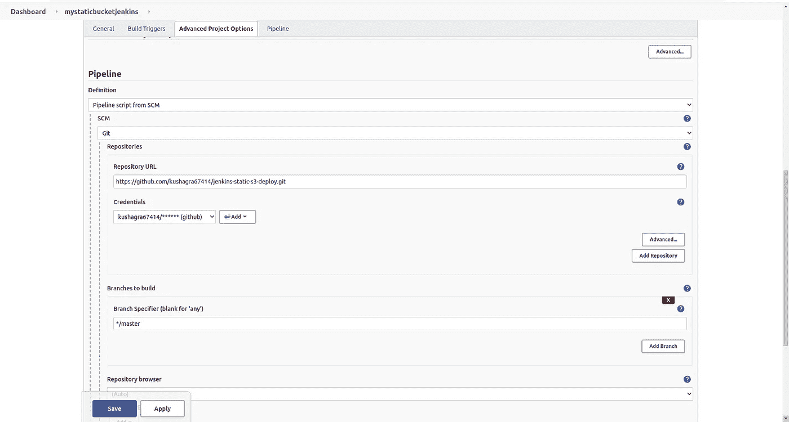
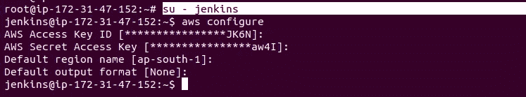
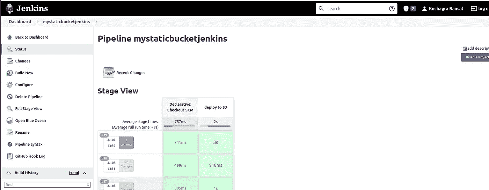
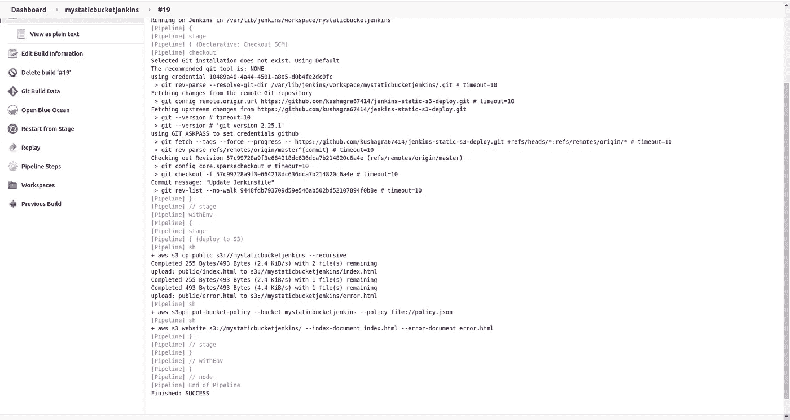
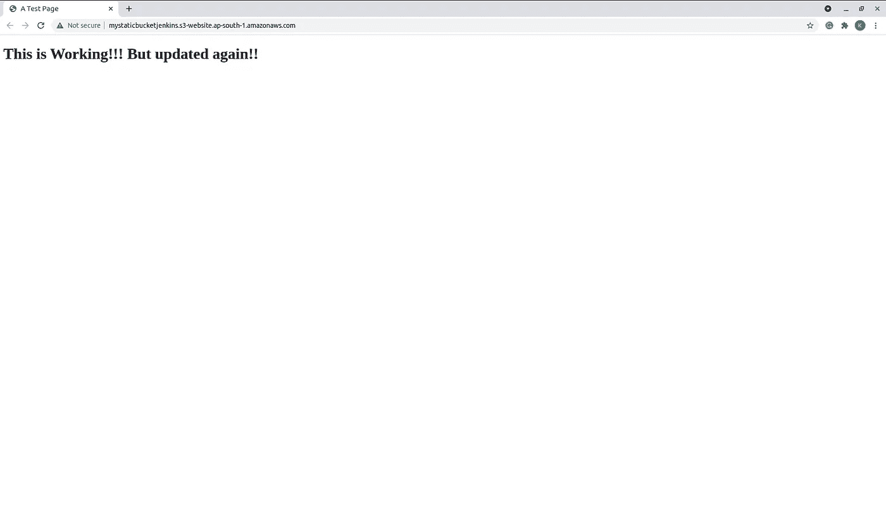

# 使用 webhook jenkins 在 s3 上托管一个静态网站

> 原文：<https://medium.com/nerd-for-tech/host-a-static-website-on-s3-using-webhook-jenkins-beb6328d6a5f?source=collection_archive---------16----------------------->

**提示:阅读 jenkins 的 web hook**

**注意:这是一个管道方法**

**安:**

步骤 1:设置简单的 S3 铲斗

步骤 2:这里我们使用自动化管道方法

[https://github.com/kushagra67414/jenkins-static-s3-deploy](https://github.com/kushagra67414/jenkins-static-s3-deploy)

它包括 Jenkins 管道和 s3 存储桶允许公众访问 index.html 和 error.html 文件所需的策略

步骤 3:管道设置

在 Jenkins 创建一个新的管道项目。

管道= >

在 git 存储库中添加一个 webhook。

如果此 repo 中的推送提交将创建一个版本，则需要 webhook 配置。

步骤 4:运行管道来测试它是否工作。它应该上传文件到 S3 桶。

首先，配置作业。

步骤 5:配置作业后，构建项目，它必须将数据存储在 s3 存储桶中，但它可能会显示错误，因为我们没有在 jenkins 用户中配置 aws cli。

我们正在配置 aws cli，因为管道由 aws cli 命令组成，当管道执行时，它会检查 awi cli 环境

转到 jenkins 用户，配置 aws cli 以执行管道中的命令。

首先转到用户:

>苏—詹金斯

> aws 配置 root 用户的 add secret key 和 access key，或者使用 s3 bucket 的策略创建一个 iam 用户来访问它并提供 iam 用户的凭证。

最佳实践是创建一个 iam 用户。

步骤 6:重启 jenkins 并构建项目

命令:systemctl 重新启动 jenkins

控制台输出:

