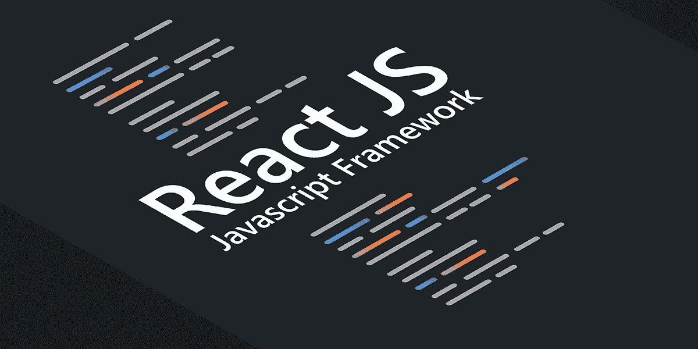
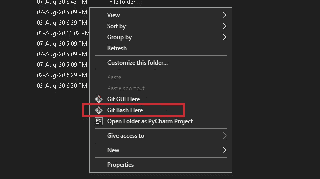
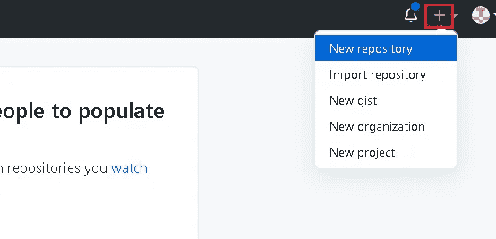
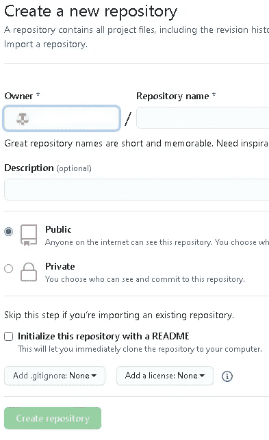

# 主机将应用程序反应到 Github 页面

> 原文：<https://medium.com/nerd-for-tech/host-react-app-to-github-pages-d561ff7579a9?source=collection_archive---------2----------------------->



来源:谷歌

在本教程中，我将展示如何通过几个步骤将 React Js 应用程序托管到 GitHub 页面。

在开始本教程之前，我们将假设您已经拥有一个 GitHub 帐户，并且已经在系统中安装了 git，并且已经在 React 中创建了一个项目。

首先转到您创建项目的位置，然后单击鼠标右键。



在你的系统中安装了 git 之后，你会看到 ***Git Bash 这里*** 和 ***Git GUI 这里*** 选项，你只需要点击 **Git Bash 这里**选项，你就会看到一个终端。

在终端中，你只需要按顺序输入下面的命令。

*   git 初始化
*   git 添加。
*   git commit -m '任何消息'

执行上述命令后，在浏览器中打开你的 Github 帐户。在右上角，您将看到一个“+”图标，单击该图标，然后单击“新建存储库”。



点击 New repository 后，您将看到一个屏幕，其中您会看到一个文本框，在**所有者**后命名为**存储库名称**，只需添加任何名称，就像如果您创建一个购物应用程序，只需在**存储库名称**中添加 shopping app。



之后，在 git bash 终端中输入以下命令。

*   git 远程添加原点[https://github.com/yourusername/projectname.git](https://github.com/yourusername/projectname.git)
*   git push -u 原始主机

那时你的项目存储在 GitHub 中，然后打开你的项目中的 package.json 文件，在你的项目名后粘贴下面一行。

```
"homepage": "https://myusername.github.io/my-app",
```

通过以下方式将 GitHub 页面安装到项目中

```
npm install --save gh-pages
```

将以下几行添加到 package.json 中

```
"scripts": 
{+   "predeploy": "npm run build",
+   "deploy": "gh-pages -d build",    
"start": "react-scripts start",    
"build": "react-scripts build",
```

最后一步是部署站点

```
npm run deploy
```

然后进入你在 GitHub 中的项目，你会看到设置选项，点击这个选项你会看到标题 GitHub 页面，在这个下面你会看到你的项目 URL，这个 URL 在几分钟后是活跃的。

如果你有任何疑问，请在下面评论，如果你需要关于某些主题的教程，也请在下面评论。