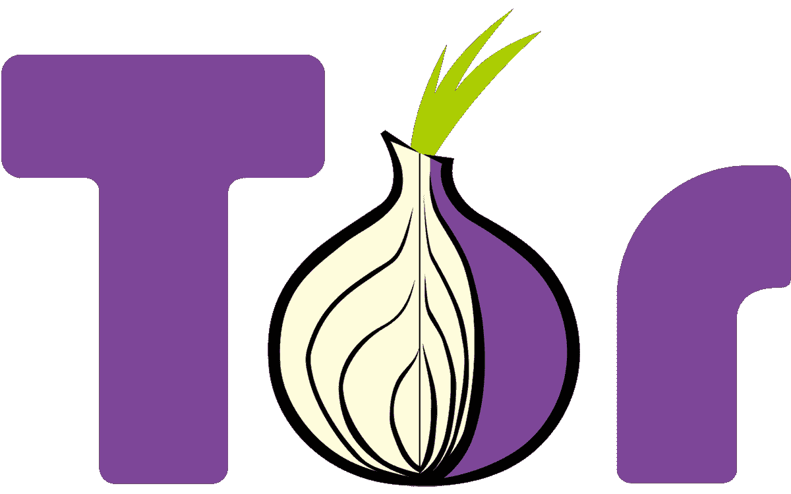

# 托管你自己的“黑暗网络”网站

> 原文：<https://medium.com/nerd-for-tech/host-your-own-dark-web-website-11353b70a7f2?source=collection_archive---------1----------------------->

在这篇文章中，我将向你展示如何免费托管你的“黑暗网络”又名 Tor 网站。

# Tor 是什么？

tor——洋葱路由项目的缩写——是一个开源的隐私网络，支持匿名网页浏览。全球 Tor 计算机网络使用安全的加密协议来确保用户的在线隐私得到保护。Tor 用户的数字数据和…