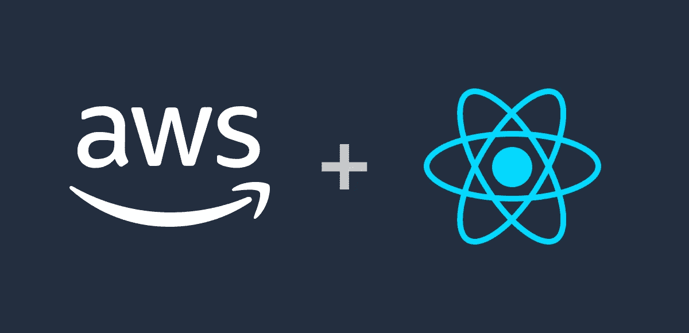
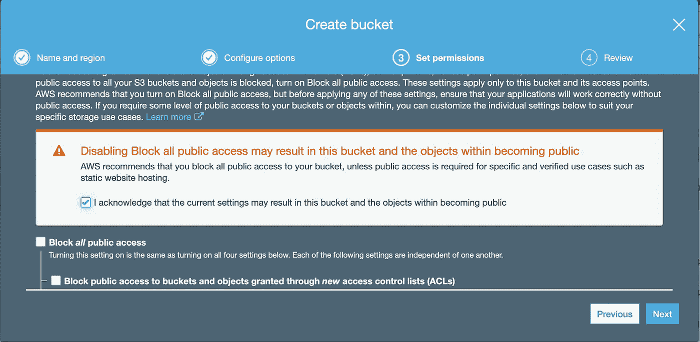
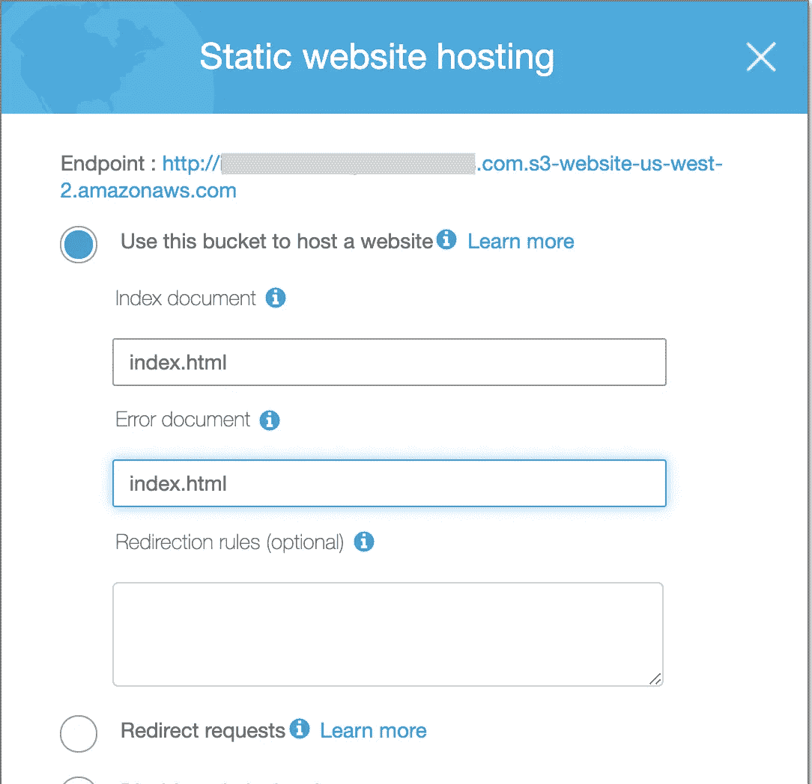
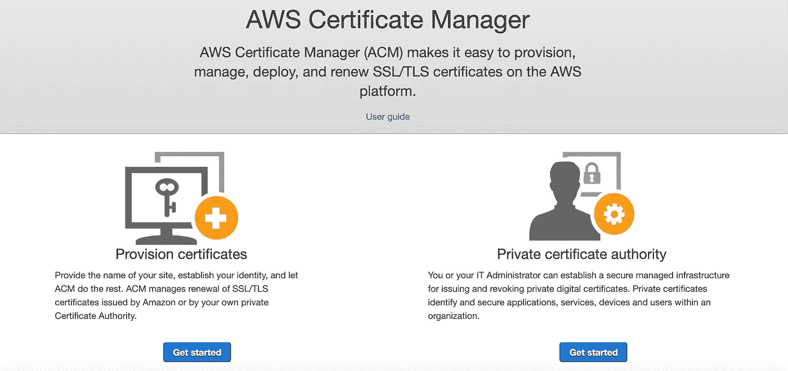
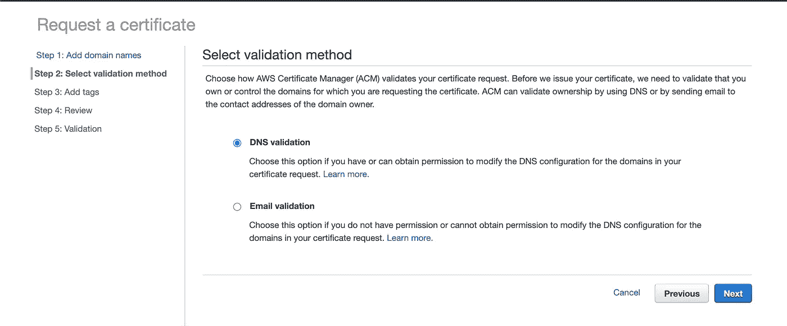
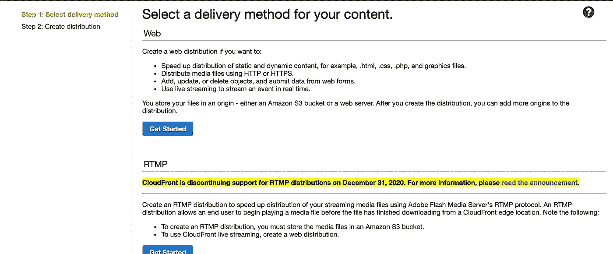
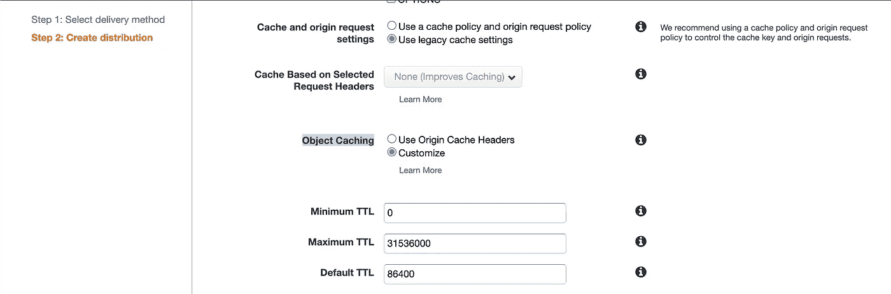

# (AWS)使用 SSL 在 AWS S3 上托管 React 应用程序

> 原文：<https://medium.com/nerd-for-tech/host-your-react-app-on-aws-s3-with-ssl-2b58d62fd377?source=collection_archive---------0----------------------->

使用 SSL 在 AWS S3 上托管 React 应用程序可能有点棘手。在本文中，我将向您展示如何配置一切。



# 先决条件

*   您已经安装了`aws-cli`
*   您有一个 AWS 帐户
    注意:如果您不在免费层，您可能会被收费

# 我的环境

*   `aws-cli`版本 1.17.9
*   macOS Catalina 版本 10.15.6
*   `create-react-app`版本 3.4.1

# 1.创建 S3 存储桶

首先，在 AWS 上创建一个 S3 桶。除了权限之外，大多数选项都可以使用默认设置。取消选中“阻止*所有公共*访问”选项，允许任何人访问您的网站。



创建一个桶来托管您的 react 应用程序

# **2。配置 bucket 来托管一个 React 应用程序**

接下来，单击您新创建的 bucket，导航到***Permissions>Bucket Policy***并添加以下策略。用您的 S3 时段名称替换***{您的时段名称}*** 。

```
**{
    "Version": "2008-10-17",
    "Id": "PublicRead",
    "Statement": [
        {
            "Sid": "1",
            "Effect": "Allow",
            "Principal": "*",
            "Action": "s3:GetObject",
            "Resource": "arn:aws:s3:::{your_bucket_name}/*"
        }
    ]
}**
```

然后，还将以下配置添加到*桶策略*选项卡旁边的 ***CORS 配置*** 。您可以根据需要删除不需要的***allowed method***。

```
**<?xml version="1.0" encoding="UTF-8"?>
<CORSConfiguration ae ml" href="http://s3.amazonaws.com/doc/2006-03-01/" rel="noopener ugc nofollow" target="_blank">**http://s3.amazonaws.com/doc/2006-03-01/****">
<CORSRule>
    <AllowedOrigin>*</AllowedOrigin>
    <AllowedMethod>HEAD</AllowedMethod>
    <AllowedMethod>GET</AllowedMethod>
    <AllowedMethod>PUT</AllowedMethod>
    <AllowedMethod>POST</AllowedMethod>
    <AllowedMethod>DELETE</AllowedMethod>
    <MaxAgeSeconds>3000</MaxAgeSeconds>
    <AllowedHeader>*</AllowedHeader>
</CORSRule>
</CORSConfiguration>****
```

现在，转到 ***权限>静态网站托管*** 并通过选中 ***使用此桶托管网站*** 选项来启用它。在 ***索引文档的*** 部分下，放置你的 app 的条目文件名。您还需要在 ***错误文档*** 部分下放置一些东西，以便不显示难看的默认错误页面。如果你还没有一个错误页面，你现在可以输入你的条目文件名。



启用静态网站托管

# 3.为 SSL 创建 AWS 证书

在这一点上，你应该能够在这个 S3 桶上托管一个静态网站。接下来，让我们继续讨论 SSL 部分。为了能够通过 https 访问网站，您需要一个与您的域绑定的证书。在 AWS 控制台上，转到 ***证书管理器*** 并点击 ***供应证书*** 部分下的“开始”按钮。

**注意:在创建证书之前，请确保您当前位于“*美国西部(北加利福尼亚)美国西部-1* ”地区。否则，以后就不能用它来配置您的 CloudFront 发行版了。**



证书管理员

在下一页，将询问您正在请求哪种证书。在那里选择 ***请求公共证书*** 选项，并添加您的域名，包括您希望拥有的子域。


将域添加到证书

然后，将要求您选择一种验证方法。我建议您选择 DNS 验证。



选择验证方法

如果不想添加任何标签，可以跳过 ***步骤 3:添加标签*** 。完成这里的所有步骤后，您需要按照页面上的说明在 DNS 管理器上创建一个 CNAME 记录。 ***Name*** 将是主机名， ***Value*** 将是它应该指向的位置。


向 DNS 管理器添加 CNAME 记录的说明

**注意:如果您的 DNS 管理器不允许值以下划线开头，您可以删除下划线。**

# 4.创建一个 CloudFront 发行版

现在，您将创建一个 CloudFront 发行版，通过 https 为您的 React 应用程序提供服务。导航到 CloudFront 页面并点击“创建发行版”按钮。然后，选择 Web 作为传送方式。



选择 Web 作为交付方式

在下一个屏幕上，您将配置以下内容。

## 原始域名

把你的 S3 桶的网址。你可以在 ***权限下找到>静态网站托管>端点*** 你的 S3 斗。如果您只是在这里选择您的 S3 存储桶名称，它将无法处理页面刷新。

## 原始自定义标题:

这需要进行配置，以确保请求来自这个特定的 CloudFront 发行版。你可以把任何东西作为*头名称*和*值*。我总是在下面放些类似的东西。

**来源自定义头:**
头名=引用者
值=任意值-标识-分布

## 默认缓存行为设置

在这一部分，您可以配置您的发行版的缓存行为。

*   **查看器协议策略**
    为了确保应用程序始终使用 https，建议使用“ ***将 HTTP 重定向到 HTTPS*** ”或“ ***仅 HTTPS***”选项。
*   **允许的 HTTP 方法**
    你可以选择你想要允许缓存的 HTTP 方法列表。
*   **缓存和原始请求设置**
    您可以选择您需要的缓存策略，也可以使用传统缓存设置来手动设置值。如果您想对缓存时间有更多的控制，请选择“ ***使用传统缓存设置*** ”用于“ ***缓存和来源请求设置”*** 和“**自定义* ”用于“ ***对象缓存*** ”。这样，您可以手动定义 ***最小 TTL、最大 TTL 和默认 TTL*** 的值。*



缓存行为设置

## 分发设置

在这个部分中，配置以下内容。

*   **备用域名(CNAMEs)** 输入你的应用要使用的域名。
*   **SSL 证书**
    选择您在本文上一步中创建的证书。您的证书必须已在“ ***美国西部(北加利福尼亚)美国西部-1*** ”地区创建，才能在此处列为选项。

# 5.在您的 DNS 管理器上添加一个指向 CloudFront 发行版的 CNAME 记录

现在，您有了一个与您的 S3 桶相关联的 CloudFront 发行版，其中存在实际的网站数据。为了让您的域名知道它应该指向哪里，在您的 DNS 管理器上添加一个 CNAME 记录。记录应该如下所示。

**CNAME 战绩:**
姓名:example.com
身价:assignedcfdomain.cloudfront.net

# 6.部署您的 React 应用

最后，构建 React 应用程序，并将其部署到 S3 木桶中。如果您有多个环境要用不同的 env 文件构建，如 staging 和 production，您可能会发现下面的脚本很有用。确保您已经安装了`aws-cli`并正确配置了您的配置文件。为了让下面的脚本正常工作，您需要将您的 env 文件命名为`.env.environment-name`。

```
"build": "sh -ac '. .env.${REACT_APP_ENV}; react-scripts build'",
"build:staging": "REACT_APP_ENV=staging npm run build",
"build:production": "REACT_APP_ENV=production npm run build",
"deploy:staging": "aws s3 sync build/ s3://staging.your-bucket-name --acl public-read --profile your-profile-name",
"deploy:production": "aws s3 sync build/ s3://your-bucket-name --acl public-read --profile your-profile-name"
```

现在，如果你在浏览器上输入你的域名，你的网络应用应该可以通过 https 协议正常运行。

这就是本文的全部内容。如果我错过了什么，请不要犹豫让我知道。

## 参考资料:

*   **通过添加备用域名(CNAMEs)为文件使用自定义 URL:**
    [https://docs . AWS . Amazon . com/Amazon cloud front/latest/developer guide/CNAMEs . html](https://docs.aws.amazon.com/AmazonCloudFront/latest/DeveloperGuide/CNAMEs.html)
*   如何使用 CloudFront 为亚马逊 S3 托管的静态网站提供服务？:
    [https://AWS . Amazon . com/premium support/knowledge-center/cloudfront-serve-static-website/](https://aws.amazon.com/premiumsupport/knowledge-center/cloudfront-serve-static-website/)
*   **创建或更新发行版时指定的值:**
    [https://docs . AWS . Amazon . com/Amazon cloud front/latest/developer guide/Distribution-we B- Values-Specify . html # downloaddistvaluesorigicustomheaders](https://docs.aws.amazon.com/AmazonCloudFront/latest/DeveloperGuide/distribution-web-values-specify.html#DownloadDistValuesOriginCustomHeaders)
*   **向来源请求添加自定义头:**
    [https://docs . AWS . Amazon . com/Amazon cloud front/latest/developer guide/add-Origin-Custom-Headers . html](https://docs.aws.amazon.com/AmazonCloudFront/latest/DeveloperGuide/add-origin-custom-headers.html)
*   **DNS 验证问题疑难解答:**
    [https://docs . AWS . Amazon . com/ACM/latest/user guide/trouble shooting-DNS-Validation . html](https://docs.aws.amazon.com/acm/latest/userguide/troubleshooting-DNS-validation.html)
*   **Create-react-app 环境:** [https://medium . com/@ tacomanator/environments-with-Create-react-app-7b 645312 c09d](/@tacomanator/environments-with-create-react-app-7b645312c09d)