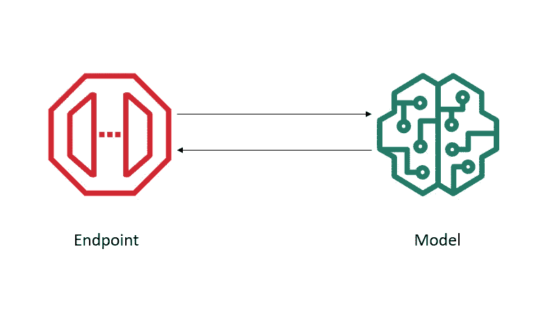
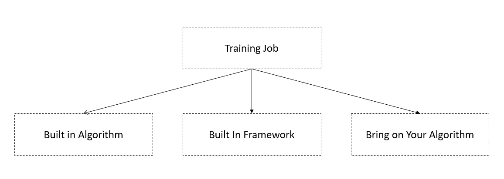
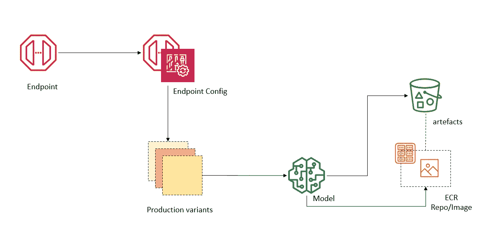
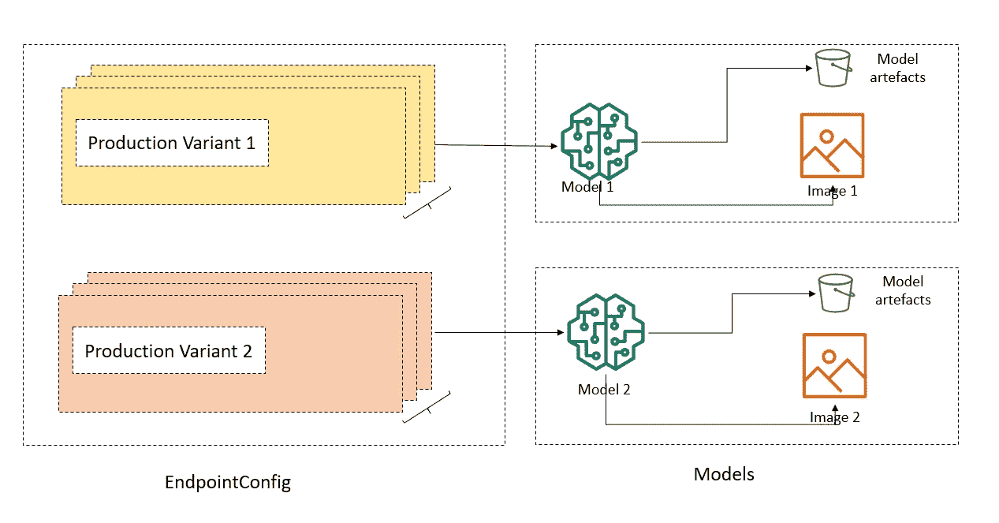
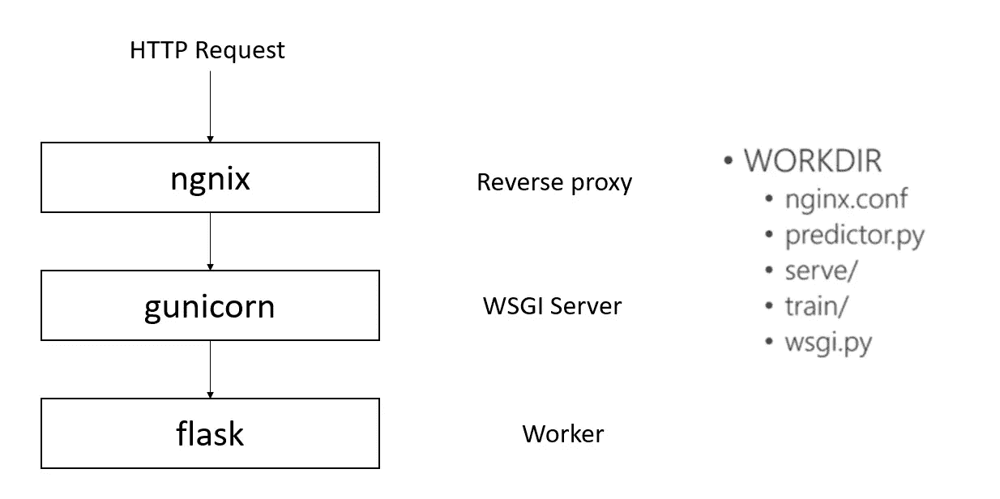
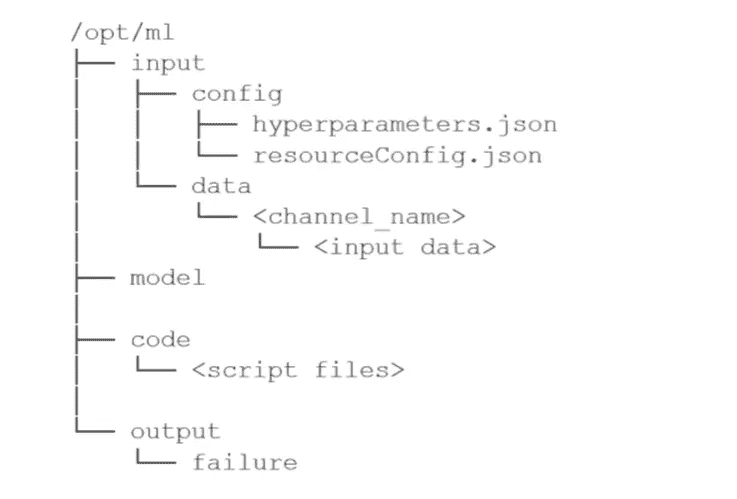
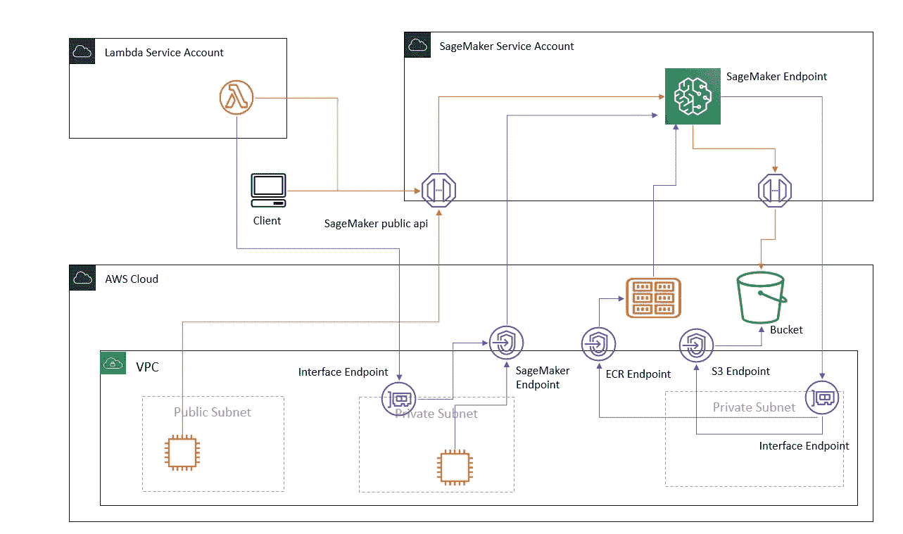

# 使用 SageMaker 进行模型托管

> 原文：<https://medium.com/nerd-for-tech/hosting-models-with-sagemaker-4f13fd7798fa?source=collection_archive---------0----------------------->

在创建端点之前，我们需要一个经过训练的模型。我们可以对 Sagemaker 做同样的事情。在 Sagemaker 中，我们有三个选项用于[培训工作](https://docs.aws.amazon.com/sagemaker/latest/APIReference/API_CreateTrainingJob.html)。见下文。

我们可以在任何地方训练我们的模型，并将训练好的模型带到 S3，或者将其嵌入到容器图像本身中。稍后将详细介绍。

让我们看看 Sagemaker 中模型托管的基本逻辑结构。

这里我们有一个端点，它引用一个端点配置。这类似于自动缩放中的 launchConfig。此配置引用了一个模型。它将充当运行时。这里需要注意的一点是，我们在端点配置中有多个变量。这些变体指的是不同的版本或完全不同的算法。为了解释变型和模型的联系，我们可以参考下图。

我们可以自带算法。为此，我们需要构建一个如下结构的容器。这里我们用 Flask 和 Nginx 创建了一个 web 服务。这以 rest 格式呈现了我们的推理。

客户容器的文件夹结构。

如果我们在 AWS 中有自定义网络，我们可能会面临问题。因此，让我们来探索托管模型的网络流程/交互。

快乐学习！！