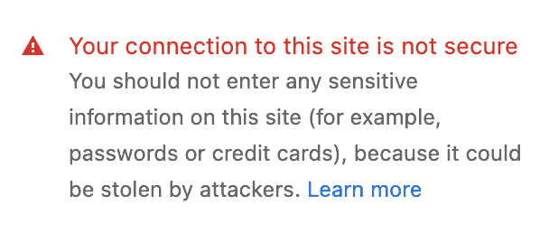

# 使用 AWS S3 和 GoDaddy 托管静态网站

> 原文：<https://medium.com/nerd-for-tech/hosting-static-website-using-aws-s3-and-godaddy-f8a88bdbd155?source=collection_archive---------1----------------------->

在本文中，您将学习使用 GoDaddy 域在 AWS S3 上托管一个静态网站。此外，本文将介绍如何在网站上支持 HTTPS，以及如何从网站路径中删除文件扩展名。

***注:*** *虽然在 S3 上托管静态网站的所有资源都可以在互联网上找到，但本文旨在将所有资源整合在一起，并在一个地方提供常见问题的解决方案。*

# 托管静态网站

*<参考:*[*https://docs . AWS . Amazon . com/Amazon S3/latest/user guide/enable website hosting . html*](https://docs.aws.amazon.com/AmazonS3/latest/userguide/EnableWebsiteHosting.html)*>*

*   登录 AWS 控制台[https://console.aws.amazon.com/](https://console.aws.amazon.com/)。如果您没有 AWS 帐户，请使用相同的链接注册。
*   在搜索栏中搜索*“S3”*，打开 S3 控制台。
*   单击位于右上角的“创建存储桶”按钮。
*   在“常规配置”下
*   输入“Bucket Name”，最好是域名。例如，如果您想要创建[www.example.com](http://www.example.com)，那么就将这个桶命名为“example”
*   选择“AWS 区域”，这是最接近您的网站的用户的位置。
*   在“阻止此桶的公共访问设置”下，取消选中“阻止所有公共访问”复选框，以允许用户访问桶文件。
*   将其他所有内容保留为默认值，并单击页面底部的“创建存储桶”。
*   使用 AWS CLI 或新创建的 bucket 的“Objects”选项卡下的“Upload”选项上传静态网站的文件。
*   在新创建的存储桶的“属性”选项卡下，滚动到底部，在“静态网站托管”部分下，使用“编辑”按钮启用静态网站托管。在“索引”文本字段下提供所有必需的信息，包括访问您的网站时要打开的默认文件。
*   在“属性”标签下，你会在页面底部的“静态网站托管”部分找到访问你的网站的 URL。它将类似于*" http://<bucket-name>. S3-website。<AWS-region-of-the-bucket>. Amazon AWS . com/"*

# 启用自定义域和 HTTPS

为什么是 HTTPS？有了 HTTPS，数据在双向传输中都是加密的:去往和来自源服务器。该协议保持通信安全，因此恶意方无法观察到正在发送的数据。此外，您的网站用户将看到一个不安全的 HTTPS 连接警告。

浏览器上的不安全消息

HTTPS 连接通过 SSL(安全套接字层)证书启用。SSL 证书是鉴定网站身份并启用加密连接的数字证书。

**在 AWS 中创建 SSL 证书**

*   通过在搜索栏中搜索“证书”打开 AWS 证书管理器(ACM)控制台。
*   单击“请求”按钮，并确保在单击“下一步”按钮之前选择“请求公共证书”单选按钮。
*   在“域名”下，为“完全限定的域名”字段输入两个值
*   www。<your-domain-name>。com</your-domain-name>
*   <your-domain-name>。com</your-domain-name>
*   在“验证方法”部分，选择“DNS 验证”，除非您可以访问电子邮件来使用电子邮件执行验证。
*   打开新创建的证书，复制两个域名的“CName name”和“CName value”值。
*   现在，请访问您的域名提供商网站并登录您的帐户。本文分享了通过 [GoDaddy](https://www.godaddy.com/en-in) 注册域名的步骤。
*   打开您想要使用的域的设置。**<域名>/设置**
*   *在“附加设置”部分，打开“管理 DNS”链接。*
*   *在“DNS 记录”部分，单击“添加”按钮并输入以下内容。对于 ACM 提供的两个值，重复此步骤两次。*
*   *“类型”->“CNAME”*
*   *“名称”->“CName 名称”复制自 ACM 认证屏幕。*
*   *“值”->“CName 值”复制自 ACM 认证屏幕。*
*   *“TTL”->“默认”*
*   *经过验证的状态通常需要 5-10 分钟才能反映在 ACM 证书上。这是休息的绝佳时机:)*

***创建 CloudFront 发行版***

*   *通过在 AWS 控制台的搜索栏中搜索“CloudFront”来打开 CloudFront 控制台。*
*   *点击“创建分销”按钮。*(注意:确保证书是在 us-east-1 区域创建的，而不考虑您的存储桶区域)**
*   *在“原域名”下输入 S3 提供的网址*注意:不要选择自动完成提供的 S3 链接。**
*   *在“默认缓存行为”部分选择“将 HTTP 重定向到 HTTPS”作为“查看器协议策略”。*
*   *在“设置”部分，在“自定义 SSL 证书-可选”字段中选择创建的 SSL 证书。*
*   *在“设置”部分，为“备用域名(CNAME) —可选”字段输入两个值*
*   *www。<your-domain-name>。com</your-domain-name>*
*   *<your-domain-name>。com</your-domain-name>*
*   *保留默认值，点击页面底部的“创建发行版”。*

*您的自定义域名 URL 激活需要 5-10 分钟:)*

# *从网站的 URL 中移除文件扩展名*

*现在，您的网站是活的，并受到 HTTPS 的保护，重要的是不要在网站的 URL 中显示文件扩展名。虽然这不是一个交易破坏者，但它看起来不专业！来修复它*

1.  *在 S3 桶下找到你的 HTML(假设你正在为静态网站使用 HTML 文件)文件，在“动作”下拉菜单下，选择“编辑元数据”*
2.  *确保内容类型为“文本/html”；如果不是，就改成“text/html”*
3.  *现在返回并再次选择 HTML 文件，使用“操作”->“重命名对象”按钮重命名该文件。移除。html 扩展名，然后单击“保存”*

*注意:HTML 文件中的所有锚(链接)标签都必须删除。html "从" href。"*

# *参考*

*   *[https://docs . AWS . Amazon . com/Amazon S3/latest/user guide/enable website hosting . html](https://docs.aws.amazon.com/AmazonS3/latest/userguide/EnableWebsiteHosting.html)*
*   *[https://medium . com/tensult/AWS-hosting-static-website-on-S3-using-a-custom-domain-CD 2782758 B2C](/tensult/aws-hosting-static-website-on-s3-using-a-custom-domain-cd2782758b2c)*
*   *[https://stack overflow . com/questions/23463679/S3-static-pages-without-html-extension](https://stackoverflow.com/questions/23463679/s3-static-pages-without-html-extension)*