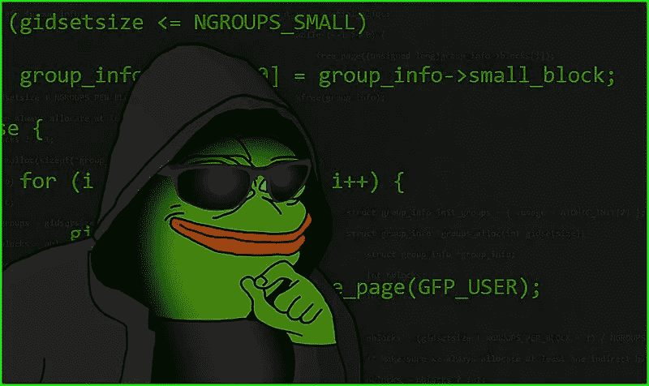

# SwiftUI 和 UIKit 的热重装

> 原文：<https://medium.com/nerd-for-tech/hot-reload-for-swiftui-and-uikit-347ff6c47282?source=collection_archive---------0----------------------->

你好。

今天我想向大家介绍一个非常热门的话题，我认为这是我见过的最好的 iOS 第三方库！

我要呈现的第三方库是[***注入***](https://github.com/krzysztofzablocki/Inject) 。

这是一个由 Krzysztof zab ocki 制作的 [*工具*](https://merowing.info/2022/04/hot-reloading-in-swift/) ，多亏了他，我们可以在 UI 上看到关于视觉格式的变化，而无需重新编译，所有这些都在运行的应用程序中完成。

其他平台才有的东西终于来找我们了！

让我们用两种方式来施展魔法:SwiftUI 和 UIKit。

除了 [***注射***](https://github.com/krzysztofzablocki/Inject)*我们还需要用到 [***注射***](https://github.com/johnno1962/InjectionIII)*

*对于 SwiftUI 和 UIKit，您需要进行相同的配置，即:*

*致 SPM:*

*   *[https://github.com/krzysztofzablocki/Inject.git](https://github.com/krzysztofzablocki/Inject.git)*
*   *[https://github.com/johnno1962/HotReloading.git](https://github.com/johnno1962/HotReloading.git)*

*接下来转到构建设置，搜索其他链接器标志并添加:*

*   *-Xlinker*
*   *-可插值*

## *SwiftUI:*

*现在，在目标视图文件中进行类似的更改，如下所示:*

1.  *导入注入*
2.  *添加在发生更改时侦听通知的属性*
3.  *根据我们运行代码的平台，调用该方法将在 InjectionIII 中加载适当的包。*

## *仅供参考:在对代码进行更改后，请记住保存文件(cmd + s ),或者等到 IDE 自动保存它。*

*现在，开始项目，你应该看到像这样的魔术:*

## *UIKit:*

*在 UIKit 中，我们可以添加对从 UIViewController 或 UIView 继承的对象的跟踪。*

*与 SwiftUI 配置相比，这两种情况下的设置都很简单:*

***UIViewController:***

*结果:*

*ViewController.swift 文件*

## *UIView:*

*结果:*

*SomeView.swift 文件*

*感谢 [*注入*](https://github.com/krzysztofzablocki/Inject) *，*我们代码中的变化可以即时可见！当我们只想对单个文件中的几行代码进行小的修改时，考虑到有时需要花费多少时间来重新构建整个项目，这确实很方便。*

*感谢您花时间阅读到目前为止。*

*祝你好运！*

***全码**:[https://github.com/Rafal-Prazynski/Inject_medium](https://github.com/Rafal-Prazynski/Inject_medium)*

# *附言:*

*如果您遇到未定义的`FSEventStream*`符号，这是由于在模拟器中使用了 macOS api，如果添加以下附加“其他链接器标志”，您会发现这种情况会消失:*

*   *-Xlinker*
*   *-未定义*
*   *-Xlinker*
*   *动态查找*