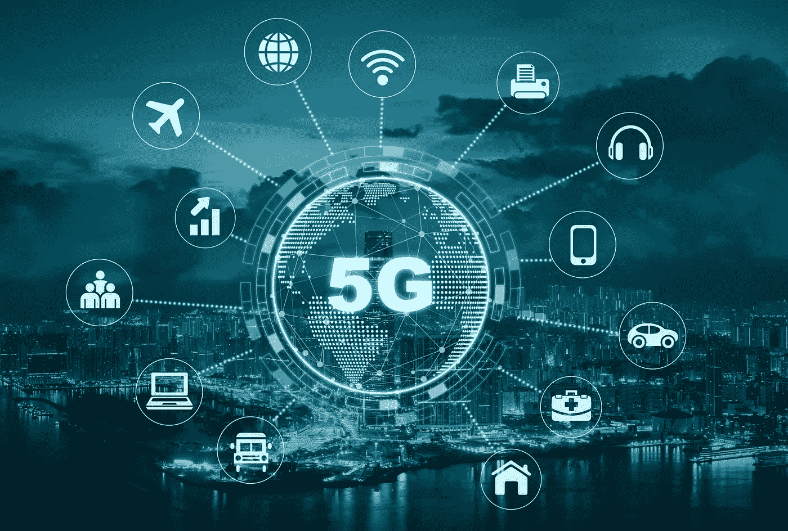
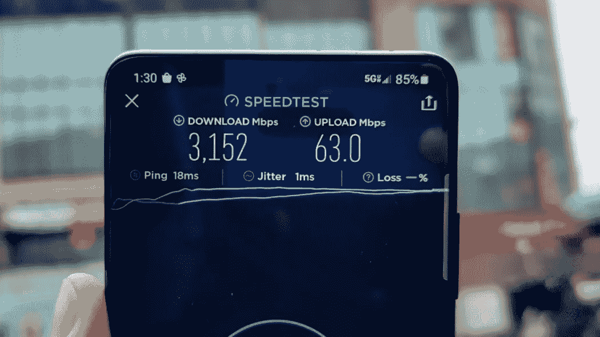
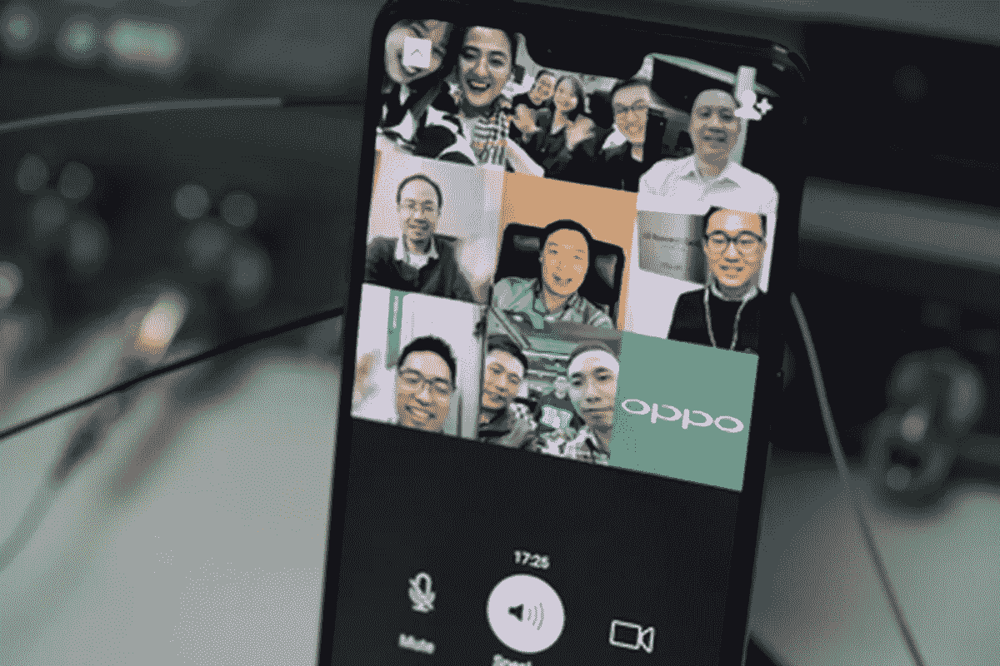
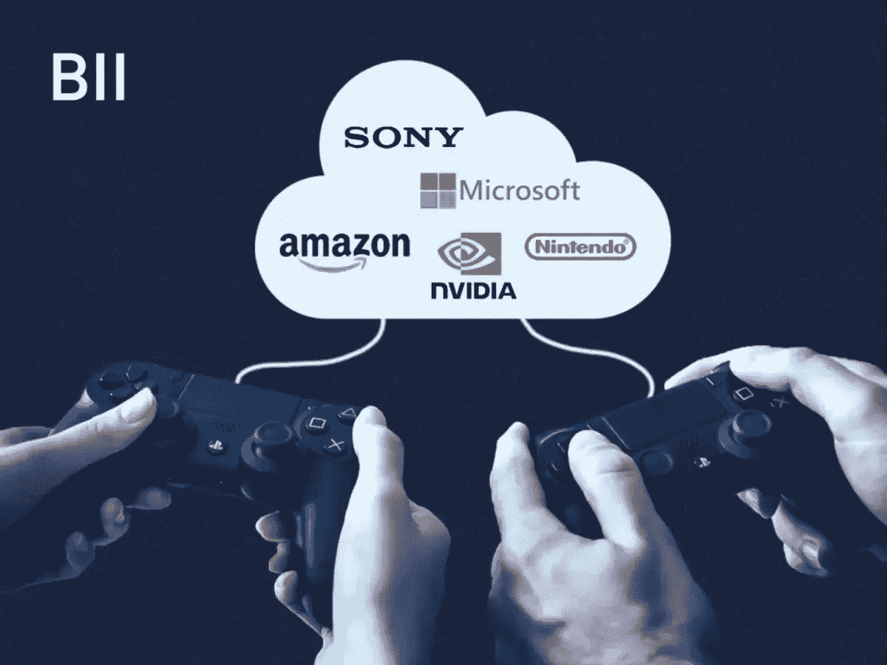
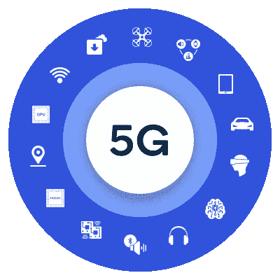

# 5G 如何改变我们的活动。？—不仅仅是速度

> 原文：<https://medium.com/nerd-for-tech/how-5g-can-transform-our-activities-more-than-just-speed-8e6ec6db7707?source=collection_archive---------11----------------------->

> “科技行业唯一不变的是变化”——马克·贝尼奥夫

伟大的 5G — [Samajho 学习](https://www.google.com/url?sa=i&url=https%3A%2F%2Fsamajho.com%2Fupsc%2Fthe-5g-great-game%2F&psig=AOvVaw0VC-6wuiU4sW2djQGs9_jP&ust=1626925483365000&source=images&cd=vfe&ved=0CAsQjRxqFwoTCODFm--f8_ECFQAAAAAdAAAAABAJ)

我建议你自己做研究，以更好地了解 5G，因为我的观点可能是有限的。我不是网络行业的专业人士能够把技术上的东西解释清楚，所以这个对于需要 5G 概述的人来说会更具体一些。

技术起义的时机已经成熟，5G 已经成为当前市场上一个极其流行的流行语。为了全面了解 5G 将如何改变我们的生活，让我们先来了解什么是 5G！

## 什么是 5G。？

5G 代表移动网络中的第五代技术，这是无线网络的一场革命，涉及互联网速度、跨设备连接、虚拟化改进[高响应性]和无缝多设备功能，而不会导致带宽问题，即使在教育、交通、汽车和所有其他物联网设备中也是如此。

以下是我在上面强调的一些关键因素，这些因素将从 5G 在全国范围内的全面启动中受益匪浅。

## 1.互联网速度

5G 网速测试— [PCMag](https://i.pcmag.com/imagery/articles/01BGW1evAIWa3DvjJdSWRaJ-30.fit_lim.size_1050x.jpg)

我仍然记得浏览 2G 网络观看 Cricbuzz 上的板球比分更新，并下载电影持续一整天，因为它的速度有限，约为 100-200 kbps。随着时间的推移，3G 开始显示 1 至 2Mbps 的互联网速度，而 4G(LTE)能够实现 2-22 Mbps 的速度，具体取决于位置和运营商。虽然 5G 的测试速度超过 1 Gbps[而不是大约 20gbps 的峰值速度]，但让我们拭目以待，看看我们会在售后市场进行多少测试。随着我们日常使用量的增加，我们可以预计 50-100 Mbps。这将确保更快的下载/上传时间，无缓冲的高清流媒体内容，以及无缝通信。

## 2.对虚拟交流的需求

5G 视频通话— [ZDNet](https://www.google.com/url?sa=i&url=https%3A%2F%2Fwww.zdnet.com%2Farticle%2Foppo-makes-5g-group-video-call%2F&psig=AOvVaw0U9VHsNGX3VUlvuv3_my1m&ust=1627207964981000&source=images&cd=vfe&ved=0CAsQjRxqFwoTCKC_j6-8-_ECFQAAAAAdAAAAABAV)

自从面对一个不可想象的 covid 情况，我们与人的日常互动发生了变化。视频电话数量增加，人们在家参加会议，学生参加在线课程，因此 zoom、duo、teams、skype 等应用程序的下载量也增加了。增加，用于与家人和朋友联系或促进商务会议。这意味着我们需要处理大量的数据，我们还需要高速处理，这就是 5G 所提供的。商务会议将会有更吸引人的方式，从而提高公司的业绩。随着 5G 的到来，也许工人们将能够在不同的地方工作，而不必亲自去办公室。虚拟会议正变得越来越自然，无论是对企业还是普通人。

## 3.云游戏的演变

云游戏— [商业内幕](https://www.businessinsider.in/thumb/msid-74009089,width-600,resizemode-4,imgsize-120226/THE-RISE-OF-CLOUD-GAMING-Cloud-based-streaming-is-the-next-frontier-in-the-video-gaming-ecosystem-heres-why-cloud-service-providers-and-telecoms-are-vying-to-tap-the-multibillion-dollar-opportunity.jpg)

在我看来，这将是 5G 启用后最令人兴奋的事情，更短的延迟，更快的处理和响应速度，游戏将更加真实，使游戏世界更加紧密。要体验强大的图形游戏，你不需要高端电脑或小工具。显然，我们需要一个好的屏幕。云游戏只需要很高的网速，会给全世界的游戏玩家带来很多欢乐。增加游戏公司和开发者的机会和伙伴关系。目前，有许多公司提供云游戏服务，包括 Blade 的 Shadow、Nvidia 的 GeForce Now、Vortex cloud gaming、微软的 Project xCloud、索尼的 PlayStation Now、亚马逊 Luna 和谷歌 Stadia。玩 5G 以上的游戏就像在网飞或亚马逊 Prime 上看流媒体电影一样。当你准备释放游戏模式的时候，确保你的触发器已经准备好发射、撞击和出拳。

## 4.人工智能/增强现实/虚拟现实的繁荣

使用虚拟现实的协议— [无线遥控](https://www.google.com/url?sa=i&url=https%3A%2F%2Fwww.rcrwireless.com%2F20200409%2F5g%2Fkorea-kt-inks-5g-agreement-taiwanese-carrier-fet&psig=AOvVaw1wpRy5XMYURR58ImRWGK-h&ust=1627207455072000&source=images&cd=vfe&ved=0CAsQjRxqFwoTCMCt8Ki6-_ECFQAAAAAdAAAAABAD)

5G 通过人工智能，机器学习，增强和虚拟现实等将自动化提升到了一个全新的水平。它将大大改善无人驾驶汽车的响应时间，自动交通信号与物体检测没有延迟问题，一种使用沉浸式内容的迷人教育方法；通过引人入胜的虚拟会议提高员工生产力；监控事故和交通灯；并持续传送人的心率。借助 5G，AR/VR 将在游戏、流媒体和通信方面为我们带来更接近的感官体验。也许用例会以更动态的方式提前进化。

## 5.将物联网推向新的高度

5G 生态系统— [高通](https://www.qualcomm.com/sites/ember/files/styles/optimize/public/components/two-column-hdi/side/what-is-5g-side-image.png?itok=_2YXwYOn)

我认为 5G 将对物联网行业产生巨大影响，产生一些主要功能，如资产跟踪、可穿戴设备、智能建筑、家用设备、具有更高智能的农业设备，这些设备有助于提高作物产量，无人机具有低延迟远程控制访问以改善板球体育场体验，应急响应包括救护车和消防部门、物流、运输、跟踪、智能城市、资源监控、在不使用时减少浪费的智能灯泡，以及更多智能充电站，观看电影时增强影院体验的小工具。5G 保证了每个部门的无缝连接和更高效的工作流程。将会有大量的传感器设备进入市场。或许我们也能体验触摸。随时随地准备体验这一明智之举。

## 6.医学进步

先进的医疗保健— [中国日报](https://img2.chinadaily.com.cn/images/201906/25/5d117908a3103dbf57a606ef.jpeg)

对每个人来说，医疗保健都是重中之重。随着医疗系统的数字化，患者可以接受更好的治疗，而不受地理位置的限制。与电子汽车类似，电子医疗保健也将在不久的将来得到发展。使用可穿戴设备监控患者的血压、心率、血氧水平等健康状况，有助于通过 5G 传输全天候定期监控患者。如果由于紧急情况需要智能或远程手术，这种需求可能会增加。在疫情，越来越多的治疗在网上进行，人们只需点击一下鼠标就能获得药物治疗。很可能在未来，我们将继续看到更多的人利用 AR/VR 通过电子医院系统与医生交谈。5G 革命预计将促进几个领域的显著增长，特别是医疗保健。医疗保健的长期变化带来的很大一部分好处是，它们将有助于提供更好的病人护理，减轻医疗保健专业人员的负担，并确保每个人都有更广泛的医疗保健。

总之，5G 将带来很多变化，从文化到农业，从港口到交通，从吃饭到睡觉，从玩耍到旅行，从骑自行车到回收，从技术到生态。让我们站起来，兴致勃勃地拥抱变化吧！

> 感谢我所有亲爱的读者，请随时留下反馈或建议&虚拟鼓掌不会让你筋疲力尽😇纳伦德拉·贾纳帕提