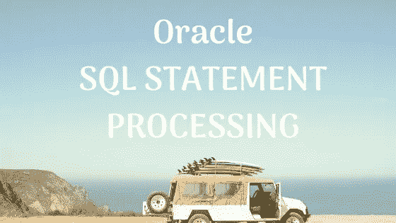
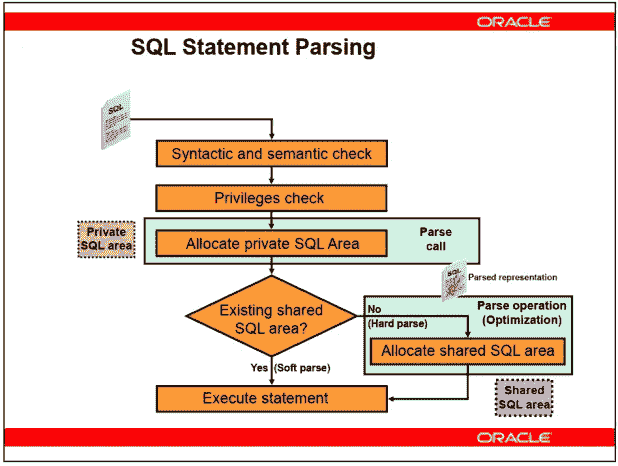

# Oracle 中如何处理 SQL 语句？|采访问答

> 原文：<https://medium.com/nerd-for-tech/how-a-sql-statement-is-processed-in-oracle-ede6a831d83?source=collection_archive---------1----------------------->

这里我们将了解 oracle 中的 SQL 语句处理步骤

**语法检查:**

Oracle 服务器在执行语句之前会遵循一些步骤

语法检查:

**语义检查:**

一旦语法检查通过，服务器接下来要做的就是应用语义检查。

这意味着，我们的表在数据库中，哪些列会在那里，select * from table name，这是存储在数据字典缓存中的。

所以它从那里获取信息。

**权限检查:**

下一步是检查特权。在这里，它将决定运行查询的用户是否有适当的权限来运行它。

这也存储在数据字典缓存中。

如果用户没有该权限，它将返回一个类似上述步骤的错误，并结束执行。

其余步骤不执行。如果所有这些步骤都成功了，那么是时候继续前进了。

**私有 SQL 区:**

因为我们将处理一个查询并将它存储在内存中以便用游标处理，所以它创建了一个私有的

用户 PGA 中的 SQL 区域。该查询的结果将暂时存储在这里。一旦用户断开连接，分配的内存将返回给 SGA。

**查询执行:**

查询执行的下一步将是找到一个执行计划。我们知道，如果一个

查询之前执行，它的执行计划存储在共享池中的共享 SQL 区域，因此服务器检查任何现有的执行计划。

如果是，我们现在将通过一个非常昂贵的过程，直接执行我们的查询。现在我需要解释一下。

**软解析/库缓存命中-** 我们的查询在共享池中找到。

**硬解析/库缓存缺失-** 共享池中未找到我们的查询

在 Hardparse 中，我们还有三个阶段

**1)分配的共享 SQL:**

硬解析的第一步是为此在共享 SQL 区域中分配一些内存。因为新的执行计划会写在这里。

这种分配可能需要一点时间，因为如果共享 SQL 区域已满，它将删除一个旧的区域，为新的区域腾出空间，等等。

**2)优化:**

那么接下来就是“优化”了。优化是性能调优过程中最重要的事情。我们将主要调整我们的查询以获得更好的优化。

优化器只不过是一个软件，它将我们的查询作为输入，并返回最佳执行计划。我们知道一个查询可以用许多不同的方式执行。

优化器是用来在这么多方法中选择最佳执行计划的。

通常，一个优化器需要计算几个执行计划，并在一秒钟内选择其中一个。

但是，您可以更改优化级别并增加这个时间间隔。所以优化器可以多计算一些时间，也许它可以返回一个更好的执行计划。

**3)行来源生成过程:**

一旦创建了执行计划，就开始行来源生成过程。

它获取执行计划并生成执行步骤。

例如，首先从客户的表中获取数据，然后对其进行排序，然后在获取的同时从 products 表中获取数据，连接这些，对其进行排序等。

但基本上，它会找出如何从表中获取数据以及如何操作数据等。

一旦生成了行源，就使用这些步骤执行语句，并将结果返回给用户。

因此，SQL 查询的执行就是这样。

如果您再次运行相同的查询，而不是再次解析它或在共享 SQL 区域中搜索

它直接转到该执行计划在库缓存中的确切位置。

一旦我们运行一个查询，它的执行计划就存储在库缓存中。

此外，该执行计划的 rowid 也存储在私有 SQL 区域中。

因此，一旦您运行相同的语句，它会直接使用它所拥有的 rowid 访问库缓存，并快速找到执行计划。

无需再次在库缓存中搜索该散列。

它并不保留我们执行的每个查询的所有地址。

默认情况下，它只保留其中的 50 个。但这是可以改变的。解析是一项非常昂贵的操作。

很多时候，比执行力还贵。

所以我们将特别避免查询的解析过程。即使是软解析也是一个昂贵的过程。为了避免这种情况，我们可以使用结果缓存。

这意味着如果你的 SQL 语法是正确的。如果没有，它将立即返回一个错误。

语义检查:

一旦语法检查通过，服务器接下来要做的就是应用语义检查。

这意味着，我们的表在数据库中，哪些列会在那里，select * from table name，这是存储在数据字典缓存中的。

所以它从那里获取信息。

权限检查:

下一步是检查特权。在这里，它将决定运行查询的用户是否有适当的权限来运行它。

这也存储在数据字典缓存中。

如果用户没有该权限，它将返回一个类似上述步骤的错误，并结束执行。

其余步骤不执行。如果所有这些步骤都成功了，那么是时候继续前进了。

私有 SQL 区域:

因为我们将处理一个查询并将它存储在内存中以便用游标处理，所以它创建了一个私有的

用户 PGA 中的 SQL 区域。该查询的结果将暂时存储在这里。一旦用户断开连接，分配的内存将返回给 SGA。

查询执行:

查询执行的下一步将是找到一个执行计划。我们知道，如果一个

查询被执行之前，其执行计划被存储在共享池中的共享 SQL 区域。

因此服务器检查任何现有的执行计划。

如果是，我们现在将通过一个非常昂贵的过程，直接执行我们的查询。现在我需要解释一下。

软解析/库缓存命中—我们的查询在共享池中找到。

硬解析/库高速缓存缺失—在共享池中找不到我们的查询

1)分配的共享 SQL

硬解析的第一步是为此在共享 SQL 区域中分配一些内存。因为

新的执行计划将写在这里。

这种分配可能需要一点时间，因为如果共享 SQL 区域已满，它将删除一个旧的区域

为新房子腾出一个房间，等等。

2)优化

那么接下来就是“优化”了。性能中最重要的是优化

调谐过程。我们将主要调整我们的查询以获得更好的优化。

优化器只不过是一个软件，它将我们的查询作为输入，并返回最佳执行结果

计划。我们知道一个查询可以用许多不同的方式执行。

优化器是用来在这么多方法中选择最佳执行计划的。

通常，一个优化器需要计算几个执行计划，并在一秒钟内选择其中一个。

但是，您可以更改优化级别并增加这个时间间隔。所以优化器可以计算

也许它能返回一个更好的执行计划。

3)行来源生成过程:

一旦创建了执行计划

然后，行来源生成过程开始。

它获取执行计划并生成执行步骤。

例如，首先，从客户的表中获取数据，然后对其进行排序，再从产品中获取数据

桌子

在得到它的同时，加入这些，排序等等。

你会在接下来的讲座中看到细节。

但基本上，它会找出如何从表中获取数据以及如何操作数据等。

一旦生成了行源，使用这些步骤，语句被执行，结果

被返回给用户。

因此，SQL 查询的执行就是这样。

如果您再次运行相同的查询，而不是再次解析它或在共享 SQL 区域中搜索

它直接转到该执行计划在库缓存中的确切位置。

一旦我们运行一个查询，它的执行计划就存储在库缓存中。

此外，该执行计划的 rowid 也存储在私有 SQL 区域中。

因此，一旦您运行相同的语句，它将直接使用它所拥有的 rowid 访问库缓存并找到

迅速执行计划。

无需再次在库缓存中搜索该散列。

它并不保留我们执行的每个查询的所有地址。

默认情况下，它只保留其中的 50 个。但这是可以改变的。解析是一项非常昂贵的操作。

很多时候，比执行力还贵。

所以我们将特别避免查询的解析过程。甚至柔软