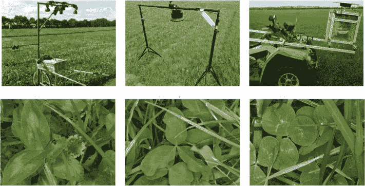
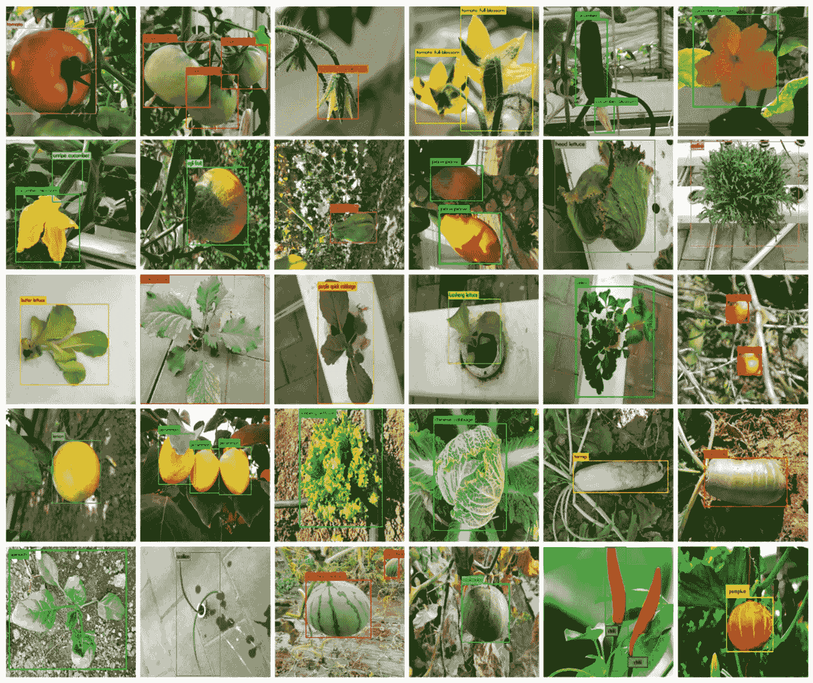

# 农业和耕作如何与数据标注相联系？

> 原文：<https://medium.com/nerd-for-tech/how-agriculture-and-farming-is-connected-to-data-annotation-738c39b41aea?source=collection_archive---------4----------------------->

农业和耕作

计算机视觉模型正在以多种方式帮助农民，从**作物和农产品监测**到牲畜和水产养殖。另一方面，开发这样的应用程序需要在非结构化的、不可预测的、极其动态的环境中工作，在这种环境中，地形和目标对象是不断变化的。

农业作为最重要的领域之一，需要人工智能等创新技术来提高农业产量和生产率，同时减少浪费。GIS 和地理数据与先进的农业设备、精确的注释工具和数据丰富专家相结合，有助于发展农业活动，使其更加高效和成功。

> 有趣的是，**“到 2026 年，农业业务的总人工智能支出预计将从 10 亿美元增加到 40 亿美元”。无人机、人工智能机器人和自动化设备都在帮助提高农业产量。但是你知道人工智能技术如何帮助精确耕作和农业吗？**

事实上，这些智能人工智能机器人采用计算机视觉技术来训练人工智能模型，这些模型被输入带注释的数据，并通过机器学习算法进行处理。

# 机器学习的注释

突出显示和概述图像上的对象和实体，以及提供不同的关键字以机器可读的格式对其进行分类，称为图像注释。它属于数据注释。

在过去的几年中，图像注释已经在农业工业中得到有效和高效的利用。图像注释是一项关键活动，因为它有助于生成允许计算机视觉模型在现实世界设置中操作的数据集。为了便于分类，我们用匹配的标签和关键词对照片进行注释和标记。

## 农业部门的标签

在农业领域，图像标注有助于识别农作物和其他物体，这样我们就可以在不需要人的情况下做出适当的选择。

因此，让我们来看看数据标签可以为农业地区实现什么，以及它如何用于机器学习和人工智能。

> **农作物和蔬菜的检测**
> 
> 对于各种各样的活动，机器人利用农业和耕作来识别水果和蔬菜等作物。作物被标注是为了让机器人或无人机等机器学习模型识别它们。

**农作物和蔬菜**

**2。研究领域的持续监督**

在广阔的农业区定期观察作物和地块是一项费时的活动。不充分的实地监测会给农民带来各种损失。火灾、异物和车辆侵入、动物入侵和其他因素都会损害农产品。我们可以使用无人机或传感器系统拍摄的高清图像来创建广阔空间的野外地图。人工智能(AI)技术可以检测出需要立即关注的区域。农民可以通过更有效地分配资源来省钱，并从更高的作物产量中获益。

**3。成熟度监测**

水果的大小和颜色表明它的成熟度。因为每种作物的成熟过程都是不同的且相对独特的，所以成熟检测训练数据必须为 ML 模型定制。Cogito 是农业数据注释领域的领先专家，专门研究带有图像和视频注释的农业人工智能解决方案。

**4。动物观察**

当一切都是手动完成时，管理畜牧业或乳制品生产中的大量动物变得至关重要且耗时。另一方面，当加入基于人工智能的自动化系统时，牲畜管理系统变得更容易和更有效率。

**5。预测和预报**

预测分析和预测代表了可以帮助农业业务的两种人工智能应用。正在使用图像注释服务构建机器学习模型，以评估、跟踪、预测和预报不同环境对农业产量的影响。它通过提醒农民天气变化以及它们如何反映在特定年份的作物和土地上来帮助农民。图像标注使用计算机视觉技术来提供数据，如作物分析、经济因素以及是否帮助农民最大限度地提高给定年份的产量。

**尾注教程**

人工智能将帮助农民在未来成长为农业技术专家，使他们能够使用数据来最大限度地提高产量，直到单株行。农业人工智能不仅帮助农民实现操作自动化，还改变了精确耕作，提高了作物产量和质量，同时使用了更少的资源。

当谈到农业中的人工智能计划时，你的模型就像它训练的数据一样好。虽然在生成和验证培训数据时有一个人在循环中是必不可少的，但工作流中的自动化操作提高了生产率，同时确保了高质量。

像 **Cogito Tech LLC** 这样有意义地改善基于机器学习或人工智能的产品或服务的公司，如农业、无人机和自动化机器制造的培训数据，将在未来取得技术进步，为这一领域带来更多有用的应用，并帮助世界处理日益增长的人口的粮食生产问题。原文由“ [**发表，我心博客**](https://www.cogitotech.com/blog/what-role-does-data-annotation-play-in-agriculture-in-terms-of-ai)