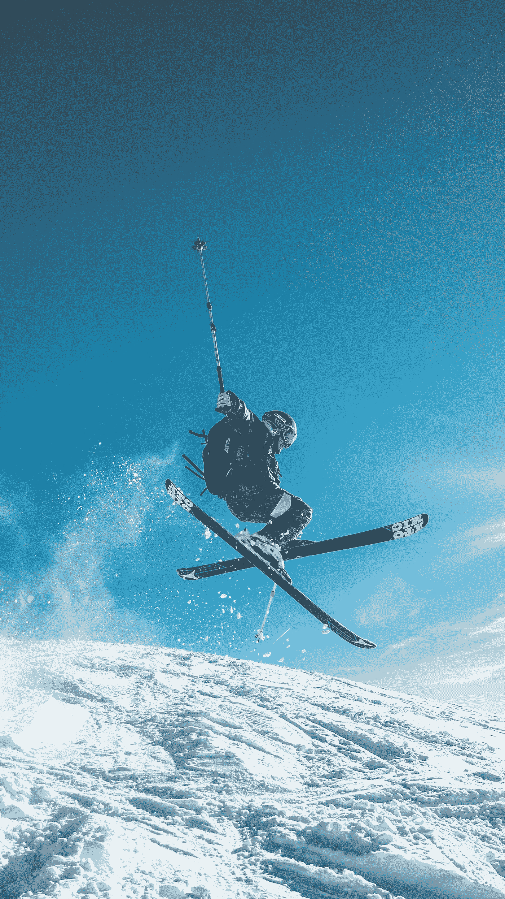

# AI 如何赋能体育游戏？—第一部分

> 原文：<https://medium.com/nerd-for-tech/how-ai-empowers-sports-games-part1-39734eb26430?source=collection_archive---------12----------------------->

## 数据标签服务推动人工智能运动

你还记得十年前的电影《金钱球》吗？在影片中，职业棒球经理比利利用数据模型和数据分析，激励球员发挥最大潜力，创造了 20 连胜的纪录。现在，当年的真实故事有了真实版本。

如今，人工智能技术已经越来越多地应用于体育领域，如帮助运动员科学训练、分析和预测赛事、改善球迷互动、提供定制化周边产品等。**体育产业正在进入一个全新的智能时代**。

数据和量化分析在比赛中使用已久，**但只有一个完整的 AI 框架才能将体育产业的方方面面提升到一个新的水平**。

# 人工智能运动覆盖了比赛的全过程，科学地提高了成绩

普华永道的一份报告指出，人工智能可以应用于体育的许多领域，从人才挖掘、赛前准备、比赛活动、赛后分析，到改善媒体和球迷的体验，以及增强管理和运营。AI 技术应用潜力无限。

以自由式滑雪空中视觉评分系统为例。自由式滑雪是滑雪和体操的结合。整个过程可以分为四个步骤，即辅助滑雪、起跳、空中翻筋斗、落地。每个阶段都有自己的技术特点。受多种因素影响，很难高质量的完成整套动作。但是，仅靠指导是不太可能快速发现运动员的弱点的。

根据这一特点，通过先进的计算机视觉和深度学习算法，滑雪分析模型可以识别运动员的动作和姿势，不仅可以记录基本动作，还可以对海量视频进行建模、组织和分析，生成更有洞察力的指标，从而**帮助教练实时调整训练方法，提高训练效率**。

人工智能还可以突破人类感知的限制，并与物联网和可穿戴设备相结合，观察可能被忽略的细节。

利用这些特性，AI 可以借助史料在 **体育人才选拔中发挥重要作用**。在去年的 NBA 选秀中，奇才的“00 后一代”德尼·阿夫迪亚引起了热议，其成功的背后是 AI 技术。****

# 人工智能行业的数据

正如三角形需要三条边来稳定其形状一样，人工智能也需要所有三个要素来完善自己:算法、无偏见的数据样本和训练过程。

我们需要明确的是，对于 AI 公司和整个行业来说，**数据标注是实现人工智能的重要一环。**标注数据的准确性和效率影响人工智能算法模型的最终结果。

在深入的产业落地过程中，人工智能技术与企业需求仍有差距。企业用户的核心目标是利用人工智能技术实现业务增长。实际上，人工智能技术本身并不能直接解决所有的业务需求。**需要根据具体的业务场景和目标，形成可以大规模实施的产品和服务。**

企业要想进一步提高模型的落地能力，就必须逐步脱离原来通用的、开放的数据集，积极参与定制化的数据采集，打造核心壁垒。

## 智能运动中常见的标签类型

*   目标检测
*   体育运动员的标记和跟踪
*   手势识别

**更多信息:** [**八种常用数据标注工具**](https://tinyurl.com/u7u4me)

# 结束

将你的数据标注任务外包给 [ByteBridge](https://tinyurl.com/yf933d88) ，你可以更便宜更快的获得高质量的 ML 训练数据集！

*   无需信用卡的免费试用:您可以快速获得样品结果，检查输出，并直接向我们的项目经理反馈。
*   100%人工验证
*   透明和标准定价:[有明确的定价](https://www.bytebridge.io/#/?module=price)(含人工成本)

为什么不试一试呢？

资料来源:IFENG.com